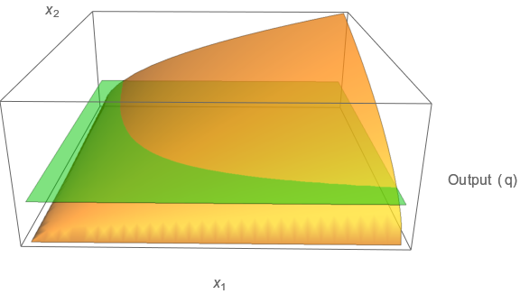

***


__*An Interactive Text for Food and Agricultural Marketing*__ by [Michael R. Thomsen](https://agribusiness.uark.edu/directory/index/uid/mthomsen/name/Michael+R.+Thomsen/) is licensed under a [Creative Commons Attribution-ShareAlike 4.0 International License](https://creativecommons.org/licenses/by-sa/4.0/).  Source files are available on [GitHub](https://github.com/thomsen-m/FAM-OER).

***
#<span style="color:SaddleBrown">Overview and Objectives</span>

Supply arises from the business decisions of producing firms.  The term "firm" is used broadly to refer to any producing enterprise and includes farms. The law of supply states that the quantity supplied to the market increases as a a product's market price increases.  After a brief overview of the law of supply and the market supply schedule, this chapter examines two types of decisions at the level of the producing enterprise that give rise to the law of supply.  

1. The first revolves around the decision to participate in the market.  The primary goal here is to establish that: (a) a higher output price induces additional firms to enter the market, and (b) when the output price is low, some firms will find it in their interest to exit the market.  The decision to participate in the market is one reason for the law of supply.  In examining the entry and exit decision, you will see that the price that induces new firms to  enter the market will often be higher than the price at which existing firms will exit.  This observation is not essential to the law of supply but does have implications for marketing arrangements that will be considered later in the course.  

2. The second type of decision pertains to the output choices of existing firms.  In many situations, the firm has some flexibility to alter the volume it produces once it has entered the market.  You will see that a firm's profit maximizing output choice is positively related to the market price.  This is a second reason for the the law of supply.  Existing firms will supply more to the market at higher prices and less to the market at lower prices.

Having analyzed these two decisions, you will be in a position to characterize the market supply schedule as an aggregate reflecting choices of many individual firms.  As is the case with the demand schedules you studied in Chapter 1, There are a number of shift variables that shift the market supply schedule and which are described in this chapter.

The next portion of the chapter examines demand for inputs used in production. Many agricultural products are demanded as inputs in downstream production activities. For example, corn is an input used in the production of livestock, ethanol, vegetable oil, high fructose corn syrup and a number of other downstream products.  Demands for inputs arise out of the supply decisions of profit maximizing firms. Thus, even though the chapter has "supply" in its title, it is also very much about input demand. The firm's problem will be characterized by choosing inputs to produce the output that maximizes profit.  The solution to this problem provides input demand equations that depend on the own-price of the input, the prices of other inputs, and the price of the output. 

Finally, this chapter introduces the concept of producer surplus.  The market supply schedule is used to compute producer surplus at a prevailing market price.  This represents an aggregate of economic profits in excess of production costs accruing to the producing industry and is used as a measure of producer welfare in the analysis of market outcomes.

The learning objectives for this chapter are as follows:

* Describe the firm's production decision, specifically the conditions under which the firm will enter the market and the conditions under which the firm will exit the market.

* Express the firm's profit maximization problem in terms of revenue and cost.  

* Describe and explain the logic of the firm’s profit maximization condition (MR = MC).

* Explain the idea of opportunity cost.

* Identify variables that shift the supply schedule.  Be able to predict the direction of the shift.

* Distinguish between competing products in production and joint products in production.  Provide examples of each.

* Explain the derivation of input demands from profit maximizing input choices, and describe variables that shift demand schedules for inputs.

* Explain producer surplus and compute producer surplus given a linear supply schedule.

***

#<span style="color:SaddleBrown">The Supply Schedule</span>

The previous chapter emphasized the market demand schedule. The demand schedule shows the relationship between the amount of a product or service demanded and its own-price.  The supply schedule is analogous in that it shows the relationship between the amount of a product supplied to the market and the product's own-price.  Again, the convention will be to plot the supply schedule in inverse form (with price on the vertical axis and quantity on the horizontal axis).

Like the demand schedule, the supply schedule is affected by other variables – supply shifters – that characterize the economics of the production environment.  Because market supply results from the actions of individual agents (firms or producers) who seek to maximize profit, anything that affects cost of production or the potential for profit in alternative production endeavors will impact the relationship between the price and the quantity supplied.  Variables that shift the supply schedule will be covered in some depth below.  An example of a supply schedule is presented in Figure 1.  Aside from the fact that the supply schedule has a positive slope, it is analogous to the demand schedule in that it plots out the schedule of quantity supplied to the market at corresponding own-price levels holding all other variables constant. 

***

```{r, echo=FALSE}
      par(bg="beige")
      plot(seq(0:200),14+0.25*(seq(0:200)),col="blue",
           type="l",
           xlab="Own-quantity",
           ylab="Own-price",xaxs="i",yaxs="i",bty="n",
           xlim = c(0, 200), ylim = c(0, 55),xaxt='n',yaxt='n',
           main=expression("Inverse Supply: P"[1]*" = 14 + 0.25Q"[1]))
      lines(c(0,84),c(35,35),col="green")
      lines(c(84,84),c(0,35),col="green")
      points(84,35,pch=21,col="red",bg="red")
      axis(1, at=c(0,84,200), labels=c("",expression("Q"[1]*" = 84"),""),lwd.ticks=1)
      axis(2, at=c(0,14,35,55), labels=c("","",expression("P"[1]*" = 35"),""),lwd.ticks=1)
```

####Figure 1. The supply schedule shows the relationship between own-price and own-quantity supplied to the market.

***

The __*law of supply*__ states that as price increases, quantity supplied increases and *vice versa*.  Consequently, the supply schedule shows a positive relationship between the market price and amount supplied.  The law of supply is the result of two key features of the production environment: 

1. The entry of new firms to the marketplace and the exit of existing firms is determined, in part, by price levels. In the standard economic model, the firm takes inputs such as labor, physical capital, raw materials, and know-how and converts them into a good or service that is sold on the market.   All of these inputs come at a cost.  A firm will not engage in a production activity unless it is economically feasible.  That is, the production activity must generate enough revenue to cover its cost.  All else equal, as the price of the good or service rises, it is more likely that new firms will find it feasible to enter the market and produce the good or service at a profit.  These new firms will cause the quantity placed on the market to increase.   Conversely, as the price of a good or service falls, firms that are presently in the market will find it more difficult to generate a profit and some will go out of business.  As these firms leave, the total quantity that is placed on the market declines.  

2. Production processes are generally characterized by the law of diminishing marginal productivity.  This means that in order to induce existing producers to put more on the market, the price will need to be high enough to justify bringing less productive and/or more costly resources into production. Most human activities reflect the law of diminishing marginal productivity.  In fact, you confront this law as a student.  Suppose you spend four hours studying the night before a difficult exam.  If you are like most people, the first hour of solid study will be quite a bit more productive than the fourth.  By the fourth hour, your are mentally tired, apt to confuse ideas and associations, and are just plain sick of the subject.  The same thing holds true in the production of goods and services.  The additional inputs that are needed to expand production may be available only in lower quality or accessible only at higher cost.  The law of diminishing marginal productivity suggests that cost per unit of output will rise as more output is produced.  Consequently, firms will place more output on the market only if a higher price justifies the higher cost of production.  This is another reason for the law of supply.

***

#<span style="color:SaddleBrown">Profit Maximization for a Price Taking Firm</span>
Supply reflects profit maximizing behavior of firms in the market. The assumption is that firms are in business to make a profit. Profit is composed of two terms. The first is revenue (total sales), and the second is cost (the total cost of doing business).  The basic equation for profit is as follows:

$$Profit = Total\ Revenue - Total\ Cost$$

###The Price-Taking Assumption
To keep things simple, assume that the market consists of price-taking firms.  The price-taking assumption means that any given firm can produce and sell all that it wants at the going market price.  This assumption is reasonable if the following two conditions are met.  

1. **The firm is small relative to the size of the market.**  The firm must be sufficiently small that its output decisions have a negligible impact on market price.  For example, the wheat market is large relative to the size of a given wheat farmer.  Even a large farm, with several thousand acres, will have an immeasurable impact on the overall market price.  On the other hand, producers of pectin (a food ingredient) are large relative to the size of their market.  If one of the major pectin producers opens a new plant or closes an existing plant, there would probably be an affect on the market price.  The assumption of price taking behavior is probably reasonable for a wheat farm but is unreasonable for a major producer of pectin.

2. **The firm's product or service is indistinguishable from that of other firms.** If the assumption of price-taking behavior is valid, then the firm's output cannot be unique in a manner that enables it to command a premium in the marketplace relative to the products of other firms.  This does not entirely rule out quality differences among firms and associated price premiums or discounts for quality attributes.  However, quality attributes must be objective and readily identifiable so that products can be sorted into lots of uniform quality.  For example, many agricultural commodities are graded by quality and market prices reflect the quality grade.  In these cases, it is the presence of the quality attribute that matters, not the firm that is producing the product.  When subjective quality attributes are important to consumers and are conveyed through a brand name or by the reputation of the firm, then the firm is not a price taker.

Why the price-taking assumption?  Clearly, the price-taking assumption does not hold in many cases that are interesting and important to understanding the food marketing system.  Later in the course, you will consider cases where this assumption does not hold.  For now, the assumption enables us to more easily motivate and explore some important economic considerations that relate to the supply side of the market.

###Revenue for a Price-Taking Firm
Let $q$ represent the quantity the firm places on the market.  A lower-case $q$ is used to indicate that this is the firm's quantity and not the total market quantity ($Q$). Total revenue ($R$) for the firm is its quantity multiplied by the market price ($P$).  The price-taking assumption means that the firm can place more on the market without affecting the market price. Its quantity is so small relative to the market quantity that one can assert that $P$ is not a function of the firm's quantity ($q$), even though $P$ is a function of the market quantity ($Q$).  With this in mind, the total revenue for the firm is  
$$R = q \times P.$$
Because of the price-taking assumption, an output choice only affects revenue through the volume sold.  This simplifies the computation of marginal revenue ($MR$) and average revenue ($AR$) for the firm.  Marginal revenue is the change in revenue given a small change in output produced by the firm:

$$MR = \frac{\Delta R}{\Delta q} = P,$$

where $\Delta$ (capital Greek letter delta) is the change operator.  To give you some intuition about $MR$, note that the total revenue function is a line.  The intercept is zero and the slope term (what you learned in algebra as the rise, $\Delta R$, over the run $\Delta q$) is $P$.

Average revenue is total revenue divided by the firm's quantity.  In the case of a price-taking firm, 

$$AR = \frac{R}{q} = \frac{q \times P}{q}= P.$$

Two points are worth mentioning here.  First, given an industry comprised of price-taking firms, both marginal revenue and average revenue for the firm are equal to the market price ($MR = AR = P$).  Second, because all firms face the market price, all firms have the same marginal revenue and average revenue even if there are differences in technology or ability among the firms.

###The Cost Side of Profit
Let us start with some general facts about production cost.  

1.  __Total cost is an increasing function of $q$.__ As the volume produced and sold increases, total cost will increase.  This reflects the fact that something cannot be produced out of thin air.  Production requires inputs (raw materials, labor, capital, etc.). These inputs cost money. As more output is produced, more inputs are required, and production cost will rise accordingly.  Sometimes it is said that large firms have lower costs than small firms.  It is possible that a large firm could have a lower cost per unit than a small firm, but in this case, the statement is about average cost (cost per unit) and not total cost.  Assuming that firms are operating efficiently for their size, then total cost for firms at a larger scale of production will be higher than total cost for firms at a smaller scale.  

2. __Total cost is an increasing function in input prices.__ Because production requires inputs, total cost will depend on the prices of inputs.  For example, if fertilizer, petroleum, or wage rates increase (decrease), then the cost of producing a given crop will increase (decrease) even if the number of units produced or acres in production remains the same.  

3. __Total cost reflects effecient use of the prevailing production technology.__  The firm cannot be maximizing its profit unless it is simultaneously minimizing the cost of producing the profit maximizing output level.  Minimizing cost requires that there be no waste in inputs, and the firm is converting inputs into outputs in the best way possible given the technology that is has available. Improvements in technology affect this conversion and impact the production cost.  In agriculture, improvements in machinery, genetics, or pest control methods could all be classified as improvements in technology.  Such technological improvements usually mean that more output can be produced for a given set of inputs. Stated another way, a technological improvement means that any fixed level of output can be produced with fewer inputs.  

4. __Cost is an "economic" as opposed to an "accounting" construct.__  What this means is that the returns that could have been received in alternative production activities are included as an opportunity cost of engaging in the current activity.  For example, a farmer who plants corn forgoes the returns that could have been made if an alternative crop, say beans, were planted instead.  The degree of risk inherent in a production activity is also important to the idea of opportunity cost.  As a general rule, more-risky activities require higher returns to attract investment of inputs and effort.  As risk increases, other, less-risky activities become more attractive.  This increases the opportunity cost of staying in the now-more-risky activity.

For simplicity cost will often be expressed only as a function of $q$ or 
$$Total\ Cost = c(q).$$  
Total cost depends on all of items 1 - 4 above, so it is a bit of a simplification to only include $q$ as an argument to the function. In making this simplification, the function shows the relationship between cost and quantity for a fixed technology, a fixed vector of input prices, and constant opportunity cost. Should one or more of these things change, our cost function would shift to reflect the new input prices, new technology, or different opportunity cost.  Of course, when necessary, input prices and other items will be included in the cost function.  This will be the case later in the chapter.

$~$

####Marginal and Average Costs
As in the case of revenue, marginal and average concepts on the cost side are of interest as well. Marginal cost ($MC$) is the change in cost resulting from a small change in quantity produced:  
$$MC = \frac{\Delta c(q)}{\Delta q}=\frac{\Delta c(q+\Delta q)-c(q) }{\Delta q}>0.$$
Marginal cost is strictly positive reflecting the fact that something cannot be produced from nothing.  Moreover, an assumption that marginal cost is an increasing function of quantity will often be appropriate. An increasing marginal cost reflects the law of diminishing marginal productivity.  Again, this law states that as the producer adds more of any given input, that input's contribution to output (while positive) diminishes. Average total cost ($AC$) is defined as the total cost per unit of output:  

$$AC = \frac{c(q)}{q}.$$

$~$

####Fixed and Variable Costs in the Short Run
In the short run, some cost items may be unavoidable and independent of production.  That is, the firm would incur some cost whether or not it actually produces anything and regardless of whether it produces a little or a lot.  In these cases, total cost can be expressed as 
$$c(q) = f + v(q),$$  
where $f$ is the fixed cost, that portion of total cost which is independent of quantity in the short-run, and $v(q)$ is the variable cost, that portion of total cost which increases (decreases) as short-run quantity increases (decreases).  With this in mind, average total cost can be decomposed into average fixed cost and average variable cost as follows:

$$AC = \frac{f}{q}+\frac{v(q)}{{q}}=AFC+AVC.$$
Earlier it was mentioned that total cost was an increasing function of $q$, and that this is due to the fact that one cannot produce something from nothing. However, the equation above suggests that average cost could actually decrease as $q$ increases.  You can see this from the two terms that comprise the equation above.  The first term, $AFC = \frac{f}{q}$, declines as $q$ increases.  This is because $q$ is in the denominator.  The second term, $AVC = \frac{v(q)}{q}$ may increase or decrease as $q$ increases.  It is always true that $v(q)$ increases as $q$ increases because more inputs are needed to produce more output.  However, $q$ is also in the denominator of $AVC$ making the overall sign of the change with respect to $q$ ambiguous.  Thus, there could be a case where $AC$ falls as more output is produced.  When this is true, there are __*economies of scale*__.  Conversely, when $AC$ increases as $q$ increases, there are __*diseconomies of scale*__.  Figure 2 presents a cost function that exhibits both economies and diseconomies of scale over different ranges of output.  

In the Figure 2, the firm is operating under economies of scale at output levels below $q=10$ and under diseconomies of scale at output levels greater than $q=10$.  Notice from Panel A of Figure 2 that cost always increases as output increases.  Panel B, however, shows that average cost declines until the firm reaches an output of 10 units and then increases afterwards.  Note that the firm faces fixed cost of $f=100$ and variable cost of $v(q) = q^2$.  The corresponding $AFC$ and $AVC$ are $AFC=100/q$ and $AVC = q$, respectively.  The reason for the economies of scale scale is that at output levels below $q=10$, $AFC$ is declining at a faster rate than $AVC$ is increasing.  At output levels greater than $q=10$, $AFC$ continues to decline but at a lower rate than $AVC$ increases.


***
__Panel A: Total cost.__

```{r, echo=FALSE}
      par(bg="beige")
      plot(5:15,100+(5:15)^2,col="blue",
           type="l",lwd=3,
           xlab="quantity produced (q)",
           ylab="total cost",xaxs="i",yaxs="i",bty="n",
           xlim = c(5, 15), ylim = c(125, 325),xaxt='n',yaxt='n',
           main=expression("c = "*100 + q^2))
      text(7,175,"Economies of scale")
      text(12,175,"Diseconomies of scale")
      lines(c(5,10),c(200,200),col="gray")
      lines(c(10,10),c(0,325),col="gray")
      points(10,200,pch=21,col="red",bg="red")
      axis(1, at=c(5,10,15), labels=c("",expression("q = 10"),""),lwd.ticks=1)
      axis(2, at=c(125,200,325), labels=c("",expression("c = 200"),""),lwd.ticks=1)
```      

__Panel B: Average cost.__

```{r, echo=FALSE}
      par(bg="beige")
      plot(seq(5,15,.25),100/seq(5,15,.25)+seq(5,15,.25),col="blue",
           type="l",lwd=3,
           xlab="quantity produced (q)",
           ylab="average total cost (AC)",xaxs="i",yaxs="i",bty="n",
           xlim = c(5, 15), ylim = c(17, 25),xaxt='n',yaxt='n',
           main=expression("AC = "*frac(100,q)+q))
      text(7,19,"Economies of scale")
      text(12,19,"Diseconomies of scale")
      lines(c(5,10),c(20,20),col="gray")
      lines(c(10,10),c(0,25),col="gray")
      points(10,20,pch=21,col="red",bg="red")
      axis(1, at=c(5,10,15), labels=c("",expression("q = 10"),""),lwd.ticks=1)
      axis(2, at=c(17,20,25), labels=c("",expression("AC = 20"),""),lwd.ticks=1)
```

####Figure 2. Illustration of total cost and average cost with ranges of output showing economies and diseconomies of scale.

***

Later in the course, you will see that economies of scale are important to coordination as products move through different stages of the vertical chain.  Specifically, the decision of whether to source a supply or service through the market or internally through vertical integration depends to large extent on whether the firm's demand for the input is large enough to justify operation at an efficient scale.  For now, though, the goal is to emphasize the difference between total and average cost and their relevance to the law of supply.  Let us now turn our attention to this topic.

###The Producer's Decision to Enter, Remain, or Exit the Market
One reason for the law of supply lies in decisions by producers to enter or exit the market.  The supply side of the market will attract entrants whenever a producer sees that $P \ge AC$.  Remember that $AC$ includes opportunity cost, so $P > AC$ means that the producer's profit margin in this market is better than alternative production activities available to him or her.  As the market price rises, more producers will see that $P > AC$ and will enter the market.  Additional entry into the market at higher prices means that more output will be placed on the market at higher prices.  Exactly, what the law of supply says will happen.

The converse is also true, as the market price falls, some producers will exit the market.  However, the price at which producers will exit the market will often be lower than average total cost.  In fact, it could be much lower as you will see in the vineyard example below.  The reason for this lies in the fact that over some planning horizons, average total cost includes a portion that is fixed.  The producer incurs the fixed cost in the short run regardless of whether he or she produces anything.  If the producer exits the market, the short-run loss will be equal to the fixed cost.  If the producer remains in the market, loss could be reduced provided the market price is high enough to cover the variable cost.  There are three price points that are important to the entry and exit decision.

1. The __break-even price point__ is $P = AC$.  When the market price exceeds the break-even point, the market will attract new entrants.

2. The __shutdown price point__ is $P = AVC$.  At a price below the shut-down point, the firm will lose less by exiting the market.  The short-run loss will be equal to the firm's fixed cost.

3. A firm will remain in the market and continue to operate when the market price is between the break-even and shutdown points ($AVC \lt P \lt AC$).

The difference between the break-even and shutdown points results from differences in the length of run.  In the long run, all cost items are variable: $f=0$ in the equation for average total cost above and so $AC = AVC$.  In other words, there is no difference between the break-even and shutdown points in the long run.  In the short run, however, some cost items cannot be avoided and must be incurred regardless of whether the firm operates.  For example, suppose the firm has a long-term lease on a production facility. In the short run, this firm must pay the lease regardless of whether it operates.  The cost of the lease is fixed.  In this case, the short run is the length of time it would take the firm extricate itself from the lease obligation.  

***

###Vineyard Economics: A Case Example
Production of grapes involves a large fixed cost in terms of a trellis system to support the grape vines, a drip irrigation system to deliver water and nutrients to the vineyard, and expenses incurred to establish a productive vineyard, a process that takes several years.  Consider some wine-grape production budgets published for the Finger Lakes region of New York (White 2011).  Here is a direct link: [link to ageconsearch.umn.edu](http://ageconsearch.umn.edu/bitstream/121629/2/Cornell-Dyson-eb1103.pdf).  Although it would be a good idea to review other parts of the publication for background, the focus will be specifically on Table 11 of the publication.  White's (2011) budgets are chosen since they are quite detailed, provide a good overview of what it takes to establish a vineyard, and are representative of Eastern viticulture regions.  With the exception of Pinot Noir, the varieties that White (2011) considers can be raised in regions of Arkansas suitable for the production of bunch grapes (see Noguera et al. 2005).  As you peruse White's (2011) budget publication, consider the following:

1.	How has the author handled the issue of "economic" versus "accounting" cost?  Can you provide some examples of cost items included in the budget that would indicate that the author is attempting to measure economic costs?  If so, what?

2.	Why did the author classify some costs as fixed and others as variable?  Is there any feature that all fixed costs have in common?  What do all variable costs have in common?

3.	How did the author compute the break-even price?  You should take a moment to compute the average fixed cost (\$/ton) and average variable cost (\$/ton) assuming the yield targets reported in the top row of Table 11.

4.	Given the values reported in Table 11, would you expect to see new vineyards being established?  Why or why not?

5.	Assuming that variable costs and yield targets reported in Table 11 are typical for vineyards that have already been established, do you expect existing vineyards to shut down in the short run?  Why or why not?

6. What is the potential length of the short run in a vineyard operation?  How long does the author assume the vineyard will be productive once it has been established?

Demonstration 1 is calibrated to match the last column of Table 11 in White (2011).  This is the column for Riesling grapes. In the demonstration, quantity is 3.4 tons/acre if the vineyard continues operations.  Otherwise, quantity is zero.  One thing to notice is the high fixed cost of the Riesling vineyard.  Total fixed cost is \$2,445 per acre.  Dividing this by tons produced indicates an average fixed cost of \$719 per ton. In the demonstration, this $719 is the difference between the break-even threshold (solid blue line) and the shutdown threshold (solid red line).  When the Demonstration 1 first loads, it matches the assumptions of White (2011) and shows a market price of \$1,300 per ton, average variable cost of \$817 per ton, and an \$803 loss per acre on the Riesling vineyard. If it does not match, you can reload the page so that it will.

The first thing to point out is that at the price of \$1,300, the vineyard is not profitable. It cannot cover its total cost comprised of both its fixed and variable cost.  Nevertheless, you would expect a vineyard in this situation to continue operations since \$1,300 is well above the shutdown point of \$817.  The table in the demonstration shows two scenarios.  If the vineyard continues to operate at a price of \$1,300 per ton it loses \$803 per acre.  If it shuts down at this price, it loses \$2,445 per acre.  Clearly, its best choice is to continue operations at a price of \$1,300 per ton.  However, this price will not attract any new vineyards into the market.

In the demonstration, you can control two things: the market price and the magnitude of average variable costs.  Whenever the market price is above the blue, break-even threshold, you would expect entrants into Riesling vineyards.  Whenever, price falls below the red, shutdown threshold, you would expect existing Riesling vineyards to exit. Notice that the market price affects the entry/exit decision as does the magnitude of average variable cost.  

***

####Demonstration 1. The decision to enter, exit or remain.
```{r, echo=F}
shinyApp(
  ui = fluidPage(
    sidebarPanel(
      sliderInput("pp","Market Price",min = 581,max = 1800,value = 1300,ticks = F),
      sliderInput("avc","Average Variable Cost",min = 581,max = 1081,value = 817,ticks = F),
      tableOutput("decTab")),
    mainPanel(plotOutput("firmPlot"))
  ),
  server = function(input,output) {
    tfc<-round(3.4*719,0)
    rnames<-c("Tons","Price","Rev.","TFC","TVC","Prof.")
    dMat<-reactive({
      d<-data.frame(
        matrix(c(3.4,input$pp,round(3.4*input$pp,0),tfc,round(3.4*input$avc,0),round(3.4*(input$pp-input$avc)-tfc,0),
               0,input$pp,0,tfc,0,-tfc),6,2),
      row.names=rnames)
      colnames(d)<-c("Remain","Exit")
      d
      })
    bEven<-reactive(input$avc+719)
    dynCol<-reactive(rgb(as.numeric(input$pp<=bEven()),
                         0,
                         as.numeric(input$pp>=input$avc)))
    output$decTab<-renderTable(dMat(),spacing="xs",rownames=T)
    output$firmPlot<-renderPlot({
      par(bg="beige")
      plot(581:1081,719+581:1081,type="l",col="blue",ylim=(c(570,2000)),
           xlab="Average Variable Cost (AVC)",
           ylab="Price Points",
           xaxs="i",yaxs="i",bty="n",
           xaxt='n',yaxt='n'
      )
      lines(581:1081,581:1081,type="l",col="red")
      lines(c(0,input$avc),c(bEven(),bEven()),lty=2,col="blue")
      lines(c(0,input$avc),c(input$avc,input$avc),lty=2,col="red")
      lines(c(0,input$avc),c(input$pp,input$pp),lty=2,col=dynCol())
      lines(c(input$avc,input$avc),c(0,max(bEven(),input$pp)),lty=2,col=dynCol())
      points(input$avc,input$pp,pch=21,col=dynCol(),bg=dynCol())
      axis(1, at=c(570,input$avc,1900), labels=c("",input$avc,""),lwd.ticks=1)
      axis(2, at=c(570,input$avc,input$pp,bEven(),2000), labels=c("",input$avc,input$pp,bEven(),""),lwd.ticks=1)
      legend(590,2000,c("Breakeven","Shutdown"),lty=c(1,1), lwd=c(2.5,2.5),col=c("blue","red")) 
      text(875,1800,"New firms enter.",col="blue")
      text(900,1200,"No entry. Existing firms 
      remain in the short run.",col=rgb(1,0,1))
      text(900,700,"Existing firms shut down.",col="red")
    })
  },
  options = list(height = 475)
  )
```

***

There are three takeaways from the entry and exit decision as explained here.  The first is simply that producers enter the market if the price exceeds their break-even point, remain in the market when the price is between the break-even and shutdown points, and exit the market if price falls below the shutdown point.  This entry and exit decision is one reason for the law of supply.  

The second takeaway is that supply can be fixed in the short run, and, as the vineyard example demonstrates, the short run could be a long time.  Thus, in some markets, there can be stickiness in supply because it will take a large increase or decrease in prices to trigger the entry or exit decision. As you will learn later in the course, this can give rise to cyclical patterns in agricultural prices.

The third takeaway is a bit more subtle but is important for the organization of agricultural markets.  Imagine that you are the owner of a Riesling vineyard similar to the one in the example above. Now suppose that you have a limited number of buyers for your grapes.  From a marketing standpoint, the overarching concern is that once your vineyard is established, a buyer may be able to extract substantial price concessions from you.  This is possible because of the large difference between the break-even and shutdown price.  There is less of a concern if you have many alternative buyers, but when the number of buyers is small, the potential for opportunistic behavior may prevent an open market from functioning.  Coordination of supply with demand could still take place but would involve formal or implicit contracts.  In some cases, buyers will need to backward integrate in order to secure the supplies they need.  Many wineries are, in fact, backward integrated into vineyard operations.

###Profit Maximization ($P = MR = MC$)
In our vineyard example, the firm's quantity choice was binary in that the vineyard either continued or it shutdown.  If the vineyard continued to produce, its output was 3.4 tons/acre, give or take a bit.  This is because yield is related to quality of the grapes (and their value to wineries).  Moreover, a vineyard has a more or less fixed capacity once it has been established.  The quantity choice is much less binary in many other production settings.  For instance, I worked in the box cooler of a beef packing plant when I was younger.  The packing plant could increase the volume of cattle it processed if it was profitable for it do so.  In these situations, I worked longer hours and/or weekend shifts.  The plant paid overtime in these situations, which was time and a half.  Thus, the plant could increase its output but only at a higher cost.  Labor was the plant's second highest cost item after cattle.    

The firm's profit is maximized when marginal revenue equals marginal cost.  This condition is $P = MR = MC$ in the case of a price taking firm.  The logic supporting this condition is as follows: 

1. Suppose that $P > MC$ at some output level $q=\tilde{q}$.  In this situation, the firm could increase its output by $\Delta q$, a small amount.  Its revenue would go up by $P$, but its cost would only go up by $MC < P$.  For this reason, its profit will go up if it produces $\Delta q$ more units.  Hence, $q=\tilde{q}$ could not be a profit maximizing level of quantity if $P>MC$ because there is another value of $q$, namely $q=\tilde{q}+\Delta q$, that provides a higher level of profit than $q=\tilde{q}$.  

2. Suppose instead that $P < MC$ at some output level $q=\tilde{q}$.  In this situation, the firm could decrease its output by $\Delta q$, a small amount.  Its revenue would go down by $P$, but its cost would go down by $MC > P$.  Its cost savings from reducing its output by $\Delta q$ would more than offset its revenue loss.  Overall profit would go up.  Hence, $q=\tilde{q}$ could not be a profit maximizing level of quantity if $P<MC$ because there is another value of $q$, namely $q=\tilde{q}-\Delta q$, that provides a higher level of profit than $q=\tilde{q}$.  

This logic suggests that the only way for $q=\tilde{q}$ to be a profit maximizing level of output is if marginal cost at $q=\tilde{q}$ is equal to the price. The beef packing plant I worked for understood this concept.  When boxed beef prices justified the overtime costs, it meant that $P$ was greater than $MC$, and the company had me work longer hours and/or weekend shifts.  Conversely, when $P$ was less than $MC$, my overtime hours were cut back.   

For a price-taking firm, the condition $P = MC$ defines the individual firm's supply schedule.  As the output price increases, producers will find it profitable to produce more units (albeit at higher marginal cost).  This relationship holds in the short run so long as the market price is above the shutdown point ($P > AVC$).  Use Demonstration 2 below to gain some intuition about this.  In the demonstration, the shaded rectangular area represents the size of the firm's profit (if blue) or loss (if red).  Notice in the demonstration that when you choose the quantity that equates the firm's marginal cost with the market price, you cause this rectangular area to be maximized, if blue, or minimized if it is red.  Change the price in the demonstration.  Then adjust the quantity to maximize profit.  You will see that the firm should expand or reduce its output to maximize its profit if price increases or decreases.  

***

####Demonstration 2. The firm's problem when $C(q)=100 + 2q^2$.
```{r, echo=F}
shinyApp(
  ui = fluidPage(
    sidebarPanel(
      sliderInput("qq","Quantity produced",min = 2,max = 23,value = 10,ticks = F),
      radioButtons("pp", label = "Market Price (P)",
                   choices = list("$20"=20,"$40" = 40, "$60" = 60),
                   selected = 40,inline=T),
      p("Profit is equal to the area of the shaded rectangle and is blue (red) if positive (negative)")
    ),
    mainPanel(plotOutput("firmPlot"),
              textOutput("mes1"),
              textOutput("mes2"),
              textOutput("mes3"))
    
    ),
  server = function(input,output) {
    ac<-reactive(round(100/input$qq+2*input$qq,2))
    mc<-reactive(4*input$qq)
    prof<-reactive(round((as.numeric(input$pp)-ac())*input$qq,2))
    output$mes1<-renderText(paste("Marginal Cost (MC) = $",format(mc(),nsmall=2),sep=""))
    output$mes2<-renderText(paste("Average Total Cost (AC) = $",format(ac(),nsmall=2),sep=""))
    output$mes3<-renderText(paste("Profit = (AR - AC)q =$",format(prof(),nsmall=2),sep=""))
    output$firmPlot<- renderPlot({
      par(bg="beige")
      plot(1:25,100/(1:25)+2*(1:25),type="l",lwd=3,col="green",
         xlim=c(0,25),ylim=c(0,100),
         xlab="Quantity produced (q)",
         ylab="Value ($)",xaxs="i",yaxs="i",bty="n",
         xaxt='n',yaxt='n'
      )
     lines(0:25,4*(0:25),col="purple",lwd=3)
     #lines(c(0,input$qq),c(mc(),mc()),col="purple",lty=2)
     #lines(c(0,input$qq),c(ac(),ac()),col="green",lty=2)
     lines(c(0,25),c(input$pp,input$pp),col="black",lty=2)
     lines(c(input$qq,input$qq),c(0,max(ac(),mc())),lwd=2,col="gray")
     points(input$qq,mc(),pch=21,col="purple",bg="purple")
     rect(0,ac(),input$qq,input$pp, border=NA, col=rgb(ifelse(prof()>0,0,1), 0, ifelse(prof()>0,1,0),0.5))
     axis(1, at=c(0,input$qq,25), labels=c("",input$qq,""),lwd.ticks=1)
     axis(2, at=c(0,ac(),mc(),input$pp,100), labels=c("",ac(),mc(),input$pp,""),lwd.ticks=1)
     legend(6,100,c(expression("AC = "*frac(100,q)+"2q"),"MC = 4q","P = AR = MR"),lty=c(1,1,2), lwd=c(2.5,2.5),col=c("green","purple","black")) 
     })
    },
  options = list(height = 475)
  )
```

***
#<span style="color:SaddleBrown">Variables that Shift the Supply Schedule</span>
To recap, market supply reflects the actions of individual firms seeking to maximize their profit.  These actions include entry into the market, exit from the market, and profit maximizing quantity choices once firms are in the market. With this in mind, anything that affects profitability aside from the product's own market price will shift the supply schedule.  Let us summarize some of these factors here.  

First, anything that affects production cost will affect supply.

* __Input prices.__  Other things equal, an increase in the price of an input will shift the supply schedule inwards (decrease in supply).  Conversely, a decrease in the price of an input will shift the supply curve outwards (increase supply)

* __Available production technology.__ Other things equal, as production technology improves, the cost of converting inputs into outputs declines and this will shift the supply schedule outwards (increase in supply).

Second, anything that affects the opportunity cost of factors of production will affect supply.  These include:

* __Prices of competing products.__ In most cases, inputs that are being employed to produce one product might be used alternatively to produce other products. For example, inputs such as land, machinery, labor, and management of a farm operator could conceivably be used to grow corn or beans. By producing a corn crop, the producer gives up the opportunity of using the inputs for a soybean crop. If the price of soybeans were to increase, the value of the alternative opportunity (a soybean crop as opposed to a corn crop) would increase. In this example, the returns that could be obtained by growing soybeans is the opportunity cost of raising corn. If returns from growing soybeans rise relative to corn, the market supply for corn will shift inwards (to the left). This is because producers devote more of their factors of production to the (now more profitable) alternative opportunity. In this example, corn and soybeans can be termed competing products in that they compete for the same inputs.

* __Prices of joint products.__ In some cases, production involves joint outputs. This occurs when two distinct products are produced simultaneously, as is the case when production of one commodity generates a marketable byproduct. More generally, joint products result from situations where two or more different outputs can be more cheaply produced within a diversified firm because of complementarity in the production process. For example, a wheat producer might also bale and market straw; a cotton producer is simultaneously growing fiber and cotton seed; and most broiler growers run cow-calf operations. In these kinds of situations, the price of a joint output could shift supply of the other. For example, low cotton prices would result in producers transferring land and productive resources out of cotton production and into other activities. This would reduce the supply of cottonseed. 

* __Production risk.__ The risk of an activity also affects its opportunity cost. As the risk inherent in an activity declines, the returns required to attract producers to that activity will decline as well. Advances in production technology often impact the risk of production as well as the efficiency by which inputs are converted into an output. Hence, technological changes can affect supply through their impact on the cost function and by their impact on the opportunity cost of production.

Finally, the supply schedule may shift due to shocks and random factors that disrupt or augment supply.  Weather conditions during key parts of the growing season are important to markets because these affect the supply of crops.  An outbreak of an epizootic disease or resolution thereof would similarly affect supply of animal products.  In many markets, political upheaval, regulatory changes, labor disruptions or similar social events affect access to supplies and production risk.  

***

####Demonstration 3. Inverse supply and supply shift variables.
```{r, echo=FALSE}
shinyApp(
  ui = fluidPage(
    sidebarPanel(
      sliderInput("pprice","Own-price of good 1",min = 0,max = 50,value = 35,ticks = F),
      radioButtons("risk", label = "Production or market risk:",
                   choices = list("Initial"=0,"Falls" = 2, "Rises" = -2),
                   selected = 0,inline=T),
      radioButtons("w", label = "Input prices:",
                   choices = list("Initial" = 0, "Fall" = 5, "Rise" = -5),
                   selected = 0,inline=T),
      radioButtons("p2", label = "Price of competing product:",
                   choices = list("Initial" = 0, "Falls" = 4, "Rises" = -4),
                   selected = 0,inline=T),
      radioButtons("p3", label = "Price of joint product:",
                   choices = list("Initial" = 0, "Falls" = -3, "Rises" = 3),
                   selected = 0,inline=T)
    ),
    mainPanel(plotOutput("supplyPlot"))
  ),
  server = function(input,output) {
    #Reactive terms to be used for the dynamic plot
    yinter<-reactive({14-as.numeric(input$risk)-as.numeric(input$w)-as.numeric(input$p2)-as.numeric(input$p3)})
    xinter<-reactive({-56+4*as.numeric(input$risk)+4*as.numeric(input$w)+4*as.numeric(input$p2)+4*as.numeric(input$p3)})
    qquant<-reactive(xinter()+4*input$pprice)
    DynTickY<-reactive(eval(substitute(expression("P"[1]*" = "*pp),list(pp=input$pprice))))
    DynTickX<-reactive(eval(substitute(expression("Q"[1]*" = "*qq),list(qq=max(qquant(),0)))))
    DynMain<-reactive(eval(substitute(expression("Inverse Supply: P"[1]*" = "*yyint*" + 0.25Q"[1]),list(yyint=yinter()))))
    
    #Start the plot, plot title DynMain() is driven by the UI of the app
    output$supplyPlot <- renderPlot({
      par(bg="beige")
      plot(seq(0:200),14+0.25*(seq(0:200)),col="gray",
           type="l",
           xlab="Own-quantity",
           ylab="Own-price",xaxs="i",yaxs="i",bty="n",
           xlim = c(0, 200), ylim = c(0, 55),xaxt='n',yaxt='n',
           main=DynMain())
      lines(c(0,84),c(35,35),col="gray")
      lines(c(84,84),c(0,35),col="gray")
      points(84,35,pch=21,col="gray",bg="gray")
      #Other dynamic plot elements driven by the UI of the shiny app
      axis(1, at=c(0,max(qquant(),0),84,200,xinter()), labels=c("",DynTickX(),"","",""),lwd.ticks=1)
      axis(2, at=c(0,input$pprice,35,55,yinter()), labels=c("",DynTickY(),"","",""),lwd.ticks=1)
      lines(seq(0:200),yinter()+0.25*seq(0:200),col="blue")
      lines(c(0,qquant()),c(input$pprice,input$pprice),col="green")
      lines(c(xinter()+4*input$pprice,qquant()),c(0,input$pprice),col="green")
      points(max(qquant(),0),input$pprice,pch=21,col="red",bg="red")
    })
  },
  options = list(height = 475)
)
```

***

#<span style="color:SaddleBrown">Demand for Inputs</span>

Up to this point, our emphasis has been on the output decisions of firms.  A primary goal has been to establish that firms' output decisions respond to market price as predicted by the law of supply.  However, when firms choose output, they must choose inputs.  Input choices are also important to profit maximization.  Let us briefly consider the problem of simultaneously choosing an output level and the necessary inputs to achieve it.  To do so, it will first be necessary to introduce the idea of a production function.  A production function is a mathematical representation of the production technology by which inputs are converted into an output.  To keep things simple, consider a production technology with two inputs, $x_1$ and $x_2$ that can be converted into an output, $q$.  

$$q = f(x_1,x_2)$$
Figure 3 presents a three-dimensional rendering of a production function.  Output increases as either of the inputs increases.  However, it is common in economics to assume that production functions are concave.  This is a mathematical way of saying that production functions exhibit the law of diminishing marginal productivity that was described earlier in the chapter.  The example production function in Figure 3 is concave in that output increases at higher levels of inputs $x_1$ and/or $x_2$ but at a decreasing rate.  The production surface shown in Figure 3 always slopes upward (moving away from the origin) but becomes less steep as increasing amounts of either of the inputs are employed.  

***



####Figure 3. Three-dimensional rendering of a production function.  The production function is shown in yellow/orange tones.  The green, horizontal plane intersects the production function at a fixed level of output. The origin is at the bottom left of the diagram.

***

Because three dimensions is often hard to work with, a production function is typically rendered in two dimensions using an isoquant map similar to that shown below in Figure 4.  To help you visualize the connection between the three-dimensional rendering in Figure 3 and the two dimensional rendering in Figure 4, consider the green plane that intersects the production function in Figure 3 above.  The points where this plane intersects the function represent different combinations of $x_1$ and $x_2$ that could be used to obtain a fixed level of output equal to the elevation of the plane.  If you were to look at this intersection directly from above, you would see an isoquant similar to one of the grey curves in Figure 4 below.  In Figure 4, any point on the same isoquant represents a feasible way to produce a fixed level of output from the two inputs. Different isoquants could be obtained from Figure 3 by raising or lowering the horizontal plane to correspond to a different levels of output.  The word, isoquant, is a combination of the prefix "iso", meaning equal, and the word "quantity".  Thus, you can think of isoquants as "equal quantity curves".  For example, Points D and E in Figure 4 would each produce the same output level.  Point D uses more of the $x_2$ input and less of the $x_1$ input than does point E.  Nevertheless, each point represents a production plan that will achieve the same level of output.  Using a conventional geographic orientation to Figure 4, it can be seen that isoquants in a northeasterly direction indicate higher levels of output.    

***

```{r, echo=FALSE}
par(bg="beige")
par(pty="s") #makes plot square
plot(seq(1,60,1),(7.11^3)/seq(1,60,1), type="l", lwd=2, col="blue", ylim=c(0,60), xlim=c(0,70),
           xlab=expression("x"[1]), ylab=expression("x"[2]), xaxs="i",yaxs="i",bty="n",xaxt='n',yaxt='n'
           )
lines(seq(1,60,1),(13^3)/seq(1,60,1), lwd=2, col="grey")
lines(seq(1,60,1),(11^3)/seq(1,60,1), lwd=2, col="grey")
lines(seq(1,60,1),(9^3)/seq(1,60,1), lwd=2, col="grey")
#lines(seq(1,60,1),(7.11^3)/seq(1,60,1), lwd=2, col="blue")
lines(seq(1,60,1),(5^3)/seq(1,60,1), lwd=2, col="grey")
lines(seq(0,60,5),18.96*2-(10/10)*seq(0,60,5),lwd=3,col="red")
lines(seq(0,60,5),18.96*3-(10/10)*seq(0,60,5),lwd=3,col="red")
lines(c(0,18.96),c(18.96,18.96),col="purple",lty=2,lwd=3)
lines(c(18.96,18.96),c(0,18.96),col="purple",lty=2,lwd=3)
points(18.96,18.96,pch=21,col="purple",bg="purple")
text(18.96,18.96,"B",pos=3)
points(7.24,49.64,pch=21,col="black",bg="black")
text(7.24,49.64,"A",pos=4)
points(55,(9^3)/55,pch=21,col="black",bg="black")
text(55,(9^3)/55,"E",pos=3)
points(19.505,37.375,pch=21,col="black",bg="black")
text(19.505,37.375,"D",pos=4)
text(60,(5^3)/60,expression("q"^0),pos=4,cex=0.7)
text(60,(7^3)/60,expression("q*>q"^0),pos=4,cex=0.7)
text(60,(9^3)/60,expression("q"^1*">q*"),pos=4,cex=0.7)
text(60,(11^3)/60,expression("q"^2*">q"^1),pos=4,cex=0.7)
text(60,(13^3)/60,expression("q"^3*">q"^2),pos=4,cex=0.7)
text(39,6,"c=c*",col="red",cex=1)
text(55,10,expression("c="*tilde(c)*">c*"),col="red",cex=1)
axis(1, at=c(0,18.96,70), labels=c("",expression("x*"[1]),""),lwd.ticks=1)
axis(2, at=c(0,18.96,60), labels=c("",expression("x*"[2]),""),lwd.ticks=1)
        legend(15,55,c("Isoquants","Profit max output level","Isocost lines"),lty=c(1,1,1), lwd=c(2.5,2.5,2.5),col=c("grey","blue","red"),cex=0.8) 
```

####Figure 4: Two dimensional rendering of the production function with the profit maximizing production plan depicted by point B. Superscripts are used to indicate different levels of output and are not exponents.

***


Figure 4 also shows isocost lines.  Again as the name implies, an isocost line plots out production plans that cost the same.  Production cost can be expressed in terms of inputs as follows:

$$c = W_1 x_1 + W_2  x_2 $$ 
where $W_1$ and $W_2$ are the prices of inputs 1 and 2, respectively.  Solving this expression algebraically for $x_2$ provides the isocost lines depicted in Figure 4.  These are of the form

$$ x_2 = \frac{c}{W_2}-\frac{W_1}{W_2} x_1.$$

Two isocost lines are depicted in Figure 4.  One maps out all plans that provide a cost level of $c=c^*$.   To the northeast of this is another isocost line that maps out all plans providing a higher cost level of $c = \tilde{c})$. In Figure 4, the production plans represented by points A and D both cost $c = \tilde{c})$  because they are each on the isocost line even though more output is produced at D than at A (D lies on an isoquant that is northeast of A).  

With these preliminaries, Figure 4 can be used to visualize the firm's profit maximization problem.  Suppose that at the prevailing output and input prices, the firm's profit maximizing choice is to set its output at $q=q^*$. This is represented by the blue isoquant in Figure 4.  The firm must choose a production plan that produces $q^*$ at the lowest cost possible.  The profit maximizing production plan is represented by point B in Figure 4.  To see why point B is the profit maximizing production plan, consider an alternative production plan like point A.  This plan would also result in an output of $q*$, but the plan itself would not be profit maximizing because the cost at point A is higher ($\tilde{c}$ as opposed to $c^*$).  At point A the firm could obtain a lower cost by using less of the $x_2$ input and more of the $x_1$ input.  You can know that the production plan at point B meets the cost minimization criterion because it is tangent to the isoquant of the profit maximizing output.  At point B, it is not possible to find another production plan that still produces the profit maximizing output level of $q^*$ but at lower (southwesterly) isocost line.  

The fact that the profit maximizing production plan occurs where the isocost line is tangent to the isoquant for the profit maximizing output provides some important economic intuition.  Look again at the mathematical expression for the isocost line and notice that it has a slope that is equal to $-\frac{W_1}{W_2}$.  This is simply the negative of the ratio of the market-determined input prices and is the rate at which the economy is willing to trade input $x_2$ for input $x_1$.  The slope of the isoquant shows the rate at which the firm can replace $x_2$ with $x_1$ while keeping output constant.  Thus, a profit maximizing production plan occurs where the rate of trade-off between the two inputs within the firm is equated to the rate the economy will trade between the two inputs.  The slope of the isoquant varies from being steep at low levels of $x_1$ to being quite flat at high levels of $x_1$.  The slope of the isoquant is given by $-\frac{MP_1}{MP_2}$, where $MP_1$ and $MP_2$ are the marginal products of $x_1$ and $x_2$, respectively.  At a point like A in Figure 4, there is a lot of $x_2$ being used but not very much $x_1$.  Because of the law of diminishing marginal productivity, the marginal product of $x_1$ will be large relative to the marginal product of $x_2$, thereby causing the slope of the isoquant at point A to be steep (large in absolute value). 

We are now ready to discuss the demand for inputs.  The demand equation for an input will depend on its own-price, the price of other inputs, and the price of the product being produced.  Given the production technology in the figures above, the firm's demand for $x_1$ could be expressed generally as
$$x_1 = f(W_1,W_2,P).$$
In the parlance of Chapter 1, the firm's demand schedule for the first input would be the relationship between $x_1$ and $W_1$.  This schedule would shift if the output price, $P$, or the price of the other input, $W_2$, were to change.  

Demonstration 4 will be used to help you understand input demand.  The top panel of the demonstration presents an isoquant map very similar to that shown in above in Figure 4, the bottom panel shows this firm's demand curve for the input $x_1$.  As you use this demonstration, note that the profit maximizing production plan always occurs at a point where the isoquant is tangent to the isocost line.  This reflects the fact that the firm is simultaneously choosing its inputs to minimize the cost of obtaining the desired output. Step through this demonstration by doing each of the following:

1. Focus first on the top panel of the demonstration.  Increase only the output price from "baseline" to "high". You will notice that the profit maximizing quantity shifts in a northeasterly direction to a higher isoquant when you do this.  Now, decrease the output price back to the baseline and then to low.  You see the isoquant shift in a southwesterly direction to lower levels of output.  What you are seeing in the top panel is simply the law of supply.  The firm's profit maximizing production plan involves more output at a higher output price than at a lower output price.    

2. Set the output price and the price and the price of input 2 to "baseline".  Set the price of input 1 to "high".  Now, gradually drop the price of input 1 through each price level until you reach "low".  As you do, pay attention to the relationship between the top panel and the input demand curve in the bottom panel.  The input demand curve in the bottom panel simply reflects the profit maximizing production plans from the top panel.  Thus, you see that the demand for the input is derived from the profit maximizing behavior of the firm.  Note that this input demand satisfies the law of demand as presented in Chapter 1. At lower input prices more is demanded and _vice versa_.  

3. Return all values to their baseline level.  Now shift the output price from high to low.  What happens to the demand schedule for $x_1$?  You should see it shift.  Similarly, increase and decrease the price of input 2.  You will similarly see a shift in the demand schedule for $x_1$.  The takeaway here is that changes in the output price or the price of other inputs will shift the demand for an input.  An increase in output price will always increase the demand for an input, all else equal.  In this particular example, an increase (decrease) in the price of input 2, shifts the demand for input 1 inwards (outwards).    

4. Finally, return all values in the demonstration to their baseline levels.  Now set the price of input 1 to "low" and the price of input 2 to "moderately high".  Compare the resulting production plan to the baseline plan, denoted by point B in the top panel of the demonstration.  Notice that the new production plan involves a large increase in $x_1$ relative to the baseline.  The point to be made here is that the optimal production plan will favor lower-priced inputs.  You should have noticed that the slope of the isocost line became flatter, which shifted points of tangency to the right in favor of $x_1$.  

***

####Demonstration 4. Deriving the inverse demand schedule for an input from a firm's profit maximizing behavior.
```{r, echo=FALSE}
## Factor demands 
## technology (x1^(1/3))*(x2^(1/3))
## Isoquant x2=(ybar^3)/x1
## 

shinyApp(
  ui = fluidPage(
    sidebarPanel(
      radioButtons("p", label = "Output Price",
                   choices = list("High" = 85, 
                                  "Baseline" = 80, 
                                  "Low" = 75),
                   selected = 80,inline=F),
      radioButtons("w1", label = "Price of Input 1 (W1)",
                   choices = list("High" = 14,
                                  "Moderately High" = 12,
                                  "Baseline" = 10, 
                                  "Moderately Low" = 8, 
                                  "Low" = 6),
                   selected = 10,inline=F),
      radioButtons("w2", label = "Price of Input 2 (W2)",
                   choices = list("Moderately High" = 12,
                                  "Baseline" = 10, 
                                  "Moderately Low" = 8),
                   selected = 10,inline=F)
    ),
    mainPanel(plotOutput("isoquantPlot"),
              plotOutput("demandPlot")
              )
  ),
  server = function(input,output) {
    #Reactive terms to be used for the dynamic plot
    ww1<-reactive(as.numeric(input$w1))
    ww2<-reactive(as.numeric(input$w2))
    pp<-reactive(as.numeric(input$p))
    xx1<-reactive((pp()^3)/(27*ww1()^2*ww2()))
    xx2<-reactive((pp()^3)/(27*ww1()*ww2()^2))
    qq<-reactive(xx1()^(1/3)*xx2()^(1/3))
    int<-reactive(xx2()+(ww1()/ww2())*xx1())
    output$isoquantPlot <- renderPlot({
      par(bg="beige")
      par(pty="s") #makes plot square
      plot(seq(1,80,1),(7.11^3)/seq(1,80,1), type="l", lwd=2, col="grey", ylim=c(0,80), xlim=c(0,80),
           xlab=expression("x"[1]), ylab=expression("x"[2]), xaxs="i",yaxs="i",bty="n",xaxt='n',yaxt='n',
           main=expression("Isoquant map")
           )
      lines(seq(1,80,1),(13^3)/seq(1,80,1), lwd=2, col="grey")
      lines(seq(1,80,1),(11^3)/seq(1,80,1), lwd=2, col="grey")
      lines(seq(1,80,1),(9^3)/seq(1,80,1), lwd=2, col="grey")
      lines(seq(1,80,1),(5^3)/seq(1,80,1), lwd=2, col="grey")
      lines(seq(1,80,1),(qq()^3)/seq(1,80,1), lwd=2, col="blue")
      lines(seq(0,80,5),18.96*2-seq(0,80,5),lwd=2,col="grey")
      lines(seq(0,80,5),int()-(ww1()/ww2())*seq(0,80,5),lwd=3,col="red")
      lines(c(0,xx1()),c(xx2(),xx2()),col="purple",lty=2,lwd=3)
      lines(c(xx1(),xx1()),c(0,xx2()),col="purple",lty=2,lwd=3)
      points(18.96,18.96,pch=21,col="gray",bg="gray")
      points(xx1(),xx2(),pch=21,col="purple",bg="purple")
      text(18.96,18.96,"B",pos=4)
      axis(1, at=c(0,80), labels=c("",""),lwd.ticks=1)
      axis(2, at=c(0,80), labels=c("",""),lwd.ticks=1)
        legend(40,80,c("Profit max. quantity","Cost at profit max.","Profit max. prod. plan"),lty=c(1,1,NA), lwd=c(2.5,2.5,NA),pch=c(NA,NA,19),col=c("blue","red","purple"),cex=0.7) 
      })
    output$demandPlot <- renderPlot({
      par(bg="beige")
      par(pty="s") #makes plot square
      plot((80^3)/(27*(seq(4,14,.1)^2)*10),seq(4,14,.1), type="l", lty=2, lwd=2, col="grey", ylim=c(0,16), xlim=c(0,80),
           xlab=expression("x"[1]), ylab=expression("W"[1]), xaxs="i",yaxs="i",bty="n",xaxt='n',yaxt='n',
           main=expression("Inverse Demand Schedule for x"[1])
           )
      points(18.96,10,pch=21,col="grey",bg="grey")
      lines((pp()^3)/(27*(seq(4,14,.1)^2)*ww2()),seq(4,14,.1), lwd=3, col="purple")
      lines(c(0,xx1()),c(ww1(),ww1()),col="purple",lty=2,lwd=3)
      lines(c(xx1(),xx1()),c(0,16),col="purple",lty=2,lwd=3)
      points(xx1(),ww1(),pch=21,col="purple",bg="purple")
      axis(1, at=c(0,80), labels=c("",""),lwd.ticks=1)
      axis(2, at=c(0,16), labels=c("",""),lwd.ticks=1)
      })
    },
  options = list(height = 800)
)
```

***

###Capital and Labor Intensity in Agriculture: A Case Example

Figure 5 shows two methods of harvesting rice.  The photo on the left is from Bhutan the photo on the right is from the United States.  The method being used in Bhutan is labor intensive. The method being used in California is capital intensive.  Which method is the best?  


***

 (NRCS_Photo_Gallery).jpg)

####Figure 5.  Labor and capital intensive methods of harvesting rice.  
Photo on the left by Steve Evans from Citizen of the World (Bhutan) [CC BY 2.0](http://creativecommons.org/licenses/by/2.0), via [Wikimedia Commons](https://commons.wikimedia.org/wiki/File%3ABhutan_-_Flickr_-_babasteve_(63).jpg). Photo on the right by Gary Kramer courtesy of USDA Natural Resources Conservation Service., via [Wikimedia Commons](https://commons.wikimedia.org/wiki/File%3ANRCSCA02107_-_California_(911)(NRCS_Photo_Gallery).tif).

***

Given the concepts above, a case can be made that each method is probably best given the prices of the two inputs (labor and capital) in Bhutan and the United States.  In Bhutan, labor is inexpensive relative to capital.  In the United States, the reverse is true.  This can be represented on the isoquant/isocost map in Figure 6.  The optimal production plan in Bhutan would occur at a point like B, where the slope of the isoquant is relatively flat to match the small labor to capital price ratio.  The isocost line in the United States is much steeper.  Consequently, an optimal production plan for US rice harvest would occur at a point where the isoquant is equally steep, such as point A in Figure 6.

***

```{r, echo=FALSE}
par(bg="beige")
par(pty="s") #makes plot square
plot(seq(1,60,1),(7.11^3)/seq(1,60,1), type="l", lwd=2, col="black", ylim=c(0,60), xlim=c(0,60),
           xlab=expression("labor (L)"), ylab=expression("capital (K)"), xaxs="i",yaxs="i",bty="n",xaxt='n',yaxt='n'
           )
lines(seq(1,60,1),(13^3)/seq(1,60,1), lwd=2, col="black")
lines(seq(1,60,1),(11^3)/seq(1,60,1), lwd=2, col="black")
lines(seq(1,60,1),(9^3)/seq(1,60,1), lwd=2, col="black")
lines(seq(1,60,1),(5^3)/seq(1,60,1), lwd=2, col="black")
lines(seq(0,60,5),(7.24*6.857+49.64)-(6.857/1)*seq(0,60,5),lwd=2,col="red")
lines(seq(0,60,5),(14.4)-(1/6.857)*seq(0,60,5),lwd=2,col="red")
lines(c(7.24,7.24),c(0,49.64),col="purple",lty=2,lwd=2)
lines(c(0,7.24),c(49.64,49.64),col="purple",lty=2,lwd=2)
lines(c(0,49.64),c(7.24,7.24),col="purple",lty=2,lwd=2)
lines(c(49.64,49.64),c(0,7.24),col="purple",lty=2,lwd=2)
points(49.64,7.24,pch=21,col="purple",bg="purple")
text(49.64,7.24,"B",pos=3)
points(7.24,49.64,pch=21,col="purple",bg="purple")
text(7.24,49.64,"A",pos=4)
axis(1, at=c(0,7.24,49.64,70), labels=c("",expression("x"[L]^A),expression("x"[L]^B),""),lwd.ticks=1)
axis(2, at=c(0,7.24,49.64,60), labels=c("",expression("x"[K]^B),expression("x"[K]^A),""),lwd.ticks=1)
        legend(15,55,c("Isoquants","Isocost lines"),lty=c(1,1), lwd=c(2.5,2.5),col=c("black","red"),cex=0.8) 
```

####Figure 6. Labor and capital intensive production plans.

***

#<span style="color:SaddleBrown">Producer Surplus</span>
Chapter 1 introduced the idea of consumer surplus.  If you knew the market demand schedule, you could use it to obtain a monetary value of the benefits in excess of the market price that consumer's received from participating in a market.  Producer surplus is the analogous measure on the supply side of the market. The difference is that producer surplus is calculated from the supply schedule and is the aggregate value of economic profits that producers gain from participating in the market.  Graphically, the value of producer surplus in a market can be computed as the area above the inverse supply schedule but below the prevailing market price.  In Figure 7, producer surplus is the triangular area that is shaded in blue.  If the supply schedule is linear (as in the supply schedule presented in Figure 7), you can use the formula for the area of a triangle to compute producer surplus.  When given a value of $P$, say $\bar{P}$, you can compute producer surplus as

$$PS = \frac{1}{2}\times Q(\bar{P})\times(\bar{P} - Intercept\ of \ Inverse\ Supply\ Schedule)$$
In Figure 7, $\bar{P_1} = \$35$, the quantity supplied is $Q(\bar{P}) = 84$, and the intercept of the inverse supply schedule is \$14.  Given this, producer surplus can be computed as $\frac{1}{2} \times 84 \times 21  = \$882$.

***

```{r, echo=FALSE}
par(bg="beige")
plot(seq(0:200),14+0.25*(seq(0:200)),col="blue",
           type="l",
           xlab="Own-quantity",
           ylab="Own-price",xaxs="i",yaxs="i",bty="n",
           xlim = c(0, 200), ylim = c(0, 55),xaxt='n',yaxt='n',
           main=bquote(atop("Inverse Supply: P"[1]*" = 14 + 0.25Q"[1]*" (Direct Supply: Q"[1]*" = -56 + 4P"[1]*")",
                     "Producer Surplus = "*frac(1,2)%*%84%*%(35-14)*" = $882")),
         cex.lab=0.75,
         cex.main=0.75,
         cex.axis=0.75
         )
polygon(c(0, 0, 84), c(14,35,35), border=NA, col="lightblue")
lines(c(0,84),c(35,35),col="green")
lines(c(84,84),c(0,35),col="green")
points(84,35,pch=21,col="red",bg="red")
axis(1, at=c(0,84,200), labels=c("",84,""),lwd.ticks=1)
axis(2, at=c(0,14,35,55), labels=c("",14,35,""),lwd.ticks=1)

```

####Figure 7: Calculating producer surplus (shaded in light blue) from a supply schedule.

***

In Chapter 1, you learned that consumer surplus is value that the consumer receives over and beyond the price he or she pays for the product.  This value is typically not recorded or reported and is often known only to the consumer.  Thus, the concept of consumer surplus is a neat way to obtain a measure of consumer welfare.  Producer surplus has a similar interpretation.  Producer surplus is the value that producers receive from a transaction over and beyond the costs of production.  Strictly speaking, producer surplus measures economic profits to the selling side of the market.  You might question why there is a need to measure producer surplus because firms generally calculate their profit and report it on financial statements, use it compute taxable income and so forth. The primary value of the producer surplus measure is that it reflects economic profits as opposed to accounting profits.  The supply schedule incorporates the opportunity costs of production whereas income statements do not. Later in the course, you will use both consumer and producer surplus to examine the economic performance of markets.

***

#<span style="color:SaddleBrown">Concluding Comments</span>
This chapter has introduced concepts essential to understanding the supply side of the market.  You learned about the law of supply and that this law reflects profit maximizing decisions related to market entry, market exit, and the quantity of output.  You learned about the supply schedule and variables that shift this schedule.  In the process the chapter covered the assumption of a price-taking firm and introduced total, average, and marginal cost and revenue concepts.  You also learned that profit maximization involves producing with a cost-minimizing combination of inputs.  This provided an opportunity to introduce the idea of a production function and cover derived demands for inputs.  Finally, you were introduced to the idea of producer surplus as a measure of the economic welfare of participants on the supply side of the market.  

At the end of Chapter 1, it was mentioned that any economic system needs to address resource allocation problems (see Kohls and Uhl 1998).  Again, relevant questions include:

1. What to produce? 

2. How much to produce?

3. How to produce? 

4. How to distribute production?  

Chapter 1 presented an argument that the principles you learned about the demand side of the market related directly to the fourth question.  The principles you just covered above about the supply side of the market directly address questions 1 to 3.  The entry and exit decision is relevant to the first question.  You learned that markets for products with high prices will attract entry by new firms.  You also learned that at some point, existing firms will exit markets for products with low prices.  In short prices answer the first question by directing firms into markets where output is valued highly and out of markets where it is not.  As to the second question, the profit maximizing condition ($P = MC$) for a price-taking firm indicates that firms will place more on the market at higher prices and less on the market at lower prices.  Finally, the prices of inputs help to answer the third question.  Firms will adopt production methods that favor lower-priced inputs in order to minimize their costs of production.  

There will be an opportunity to revisit these questions in Chapter 4, when the demand and supply sides of the market come together. However, before examining markets in equilibrium, it is necessary to introduce or review demand and supply elasticities.  This is the topic of Chapter 3.  

***

#<span style="color:SaddleBrown">References</span>

Kohls, R. L. and J. N. Uhl. 1998. *Marketing of Agricultural Products, 8th Ed.* Pearson.

Noguera, E. J. Morris, K. Striegler, and M. Thomsen.  2005. *Production Budgets for Arkansas Wine and Juice Grapes.*  Arkansas Agricultural Experiment Station, Research Report 976. Available at [http://arkansas-ag-news.uark.edu/pdf/976.pdf](http://arkansas-ag-news.uark.edu/pdf/976.pdf).

White, G. B. 2011. *Cost of Establishment and Production of Vinifera Grapes in the Finger Lakes Region of New York-2010.* Charles H. Dyson School of Applied Economics and Management, E.B. 11-3. Available at [http://ageconsearch.umn.edu/bitstream/121629/2/Cornell-Dyson-eb1103.pdf](http://ageconsearch.umn.edu/bitstream/121629/2/Cornell-Dyson-eb1103.pdf).

***

#<span style="color:SaddleBrown">Problem Sets</span>

####Problem Set 1: Fill the Missing Blanks.
```{r, echo=FALSE}
shinyApp(
  ui = fluidPage(
    sidebarPanel(
      selectInput(
        "prob",
        label = "Problem Number",
        choices = as.character(c(1:10)),
        selected = "3", 
        selectize=F),
      checkboxInput("show", label = "Show Answer?", F),
      h4("What goes in each blank?"),
      uiOutput("Answer1"),
      uiOutput("Answer2"),
      uiOutput("Answer3"),
      uiOutput("Answer4"),
      uiOutput("Answer5"),
      uiOutput("Answer6"),
      uiOutput("Answer8"),
      uiOutput("Answer7"),
      width=5
    )
    ),
  server = function(input,output) {
    #Enter data for TC, VC, and Q
    data<-matrix(c(
      3400,	2000,	500,
      3700,	2200,	1000,
      3800,	2400,	2000,
      3900,	2600,	500,
      4000,	2800,	1000,
      4100,	3000,	2000,
      4200,	3200,	500,
      4300,	3400,	1000,
      4400,	3600,	2000,
      4500,	3800,	500),nrow=10,ncol=3,byrow=T)
    #Reactive terms
    pprob<-reactive({as.numeric(input$prob)}) #problem number from UI
    q<-reactive(data[pprob(),3])
    tc<-reactive(data[pprob(),1])
    vc<-reactive(data[pprob(),2])
    fc<-reactive(tc()-vc())
    atc<-reactive(format(tc()/q(),nsmall=2))
    avc<-reactive(format(vc()/q(),nsmall=2))
    afc<-reactive(format(fc()/q(),nsmall=2))
    output$Answer1<-renderUI(
      paste("The firm's quantity is",format(q(),big.mark=","),"units"))
    output$Answer2<-renderUI(
      paste("Total fixed cost is $",format(fc(),big.mark=","),sep=""))
    output$Answer3<-renderUI(
      paste("Total cost is $",format(tc(),big.mark=","),sep=""))
    output$Answer4<-renderUI(
      paste("Total variable cost is $",
            ifelse(input$show,format(vc(),big.mark=","),"____"),sep="")
      )
    output$Answer5<-renderUI(
      paste("The break-even price point is $",ifelse(input$show,atc(),"____"),sep=""))
    output$Answer6<-renderUI(
      paste("The short-run shutdown price point is $",ifelse(input$show,avc(),"____"),sep=""))
    output$Answer7<-renderUI(
      paste("Entry ceases when price falls below $",ifelse(input$show,atc(),"____"),sep=""))
    output$Answer8<-renderUI(
      paste("Average variable cost is $",ifelse(input$show,avc(),"____"),sep=""))
  }
)
```

####Problem Set 2: Fill the Missing Blanks.
```{r, echo=FALSE}
shinyApp(
  ui = fluidPage(
    sidebarPanel(
      selectInput(
        "prob",
        label = "Problem Number",
        choices = as.character(c(1:10)),
        selected = "6", 
        selectize=F),
      checkboxInput("show", label = "Show Answer?", F),
      h4("What goes in each blank?"),
      uiOutput("Answer1"),
      uiOutput("Answer2"),
      uiOutput("Answer3"),
      uiOutput("Answer4"),
      uiOutput("Answer5"),
      uiOutput("Answer6"),
      uiOutput("Answer8"),
      uiOutput("Answer7"),
      width=5
    )
    ),
  server = function(input,output) {
    #Enter data for TC, VC, and Q
    data<-matrix(c(
      3400,	2000,	500,
      3700,	2200,	1000,
      3800,	2400,	2000,
      3900,	2600,	500,
      4000,	2800,	1000,
      4100,	3000,	2000,
      4200,	3200,	500,
      4300,	3400,	1000,
      4400,	3600,	2000,
      4500,	3800,	500),nrow=10,ncol=3,byrow=T)
    #Reactive terms
    pprob<-reactive({as.numeric(input$prob)}) #problem number from UI
    q<-reactive(data[pprob(),3])
    tc<-reactive(data[pprob(),1])
    vc<-reactive(data[pprob(),2])
    fc<-reactive(tc()-vc())
    atc<-reactive(format(tc()/q(),nsmall=2))
    avc<-reactive(format(vc()/q(),nsmall=2))
    afc<-reactive(format(fc()/q(),nsmall=2))
    output$Answer1<-renderUI(
      paste("The firm's quantity is",ifelse(input$show,format(q(),big.mark=","),"____"),"units"))
    output$Answer2<-renderUI(
      paste("Total fixed cost is $",ifelse(input$show,format(fc(),big.mark=","),"____"),sep=""))
    output$Answer3<-renderUI(
      paste("Total cost is $",format(tc(),big.mark=","),sep=""))
    output$Answer4<-renderUI(
      paste("Total variable cost is $",ifelse(input$show,format(vc(),big.mark=","),"____"),sep=""))
    output$Answer5<-renderUI(
      paste("The break-even price point is $",atc(),sep=""))
    output$Answer6<-renderUI(
      paste("The short-run shutdown price point is $",ifelse(input$show,avc(),"____"),sep=""))
    output$Answer7<-renderUI(
      paste("Average fixed cost is $",afc(),sep=""))
    output$Answer8<-renderUI(
      paste("Average variable cost is $",ifelse(input$show,avc(),"____"),sep=""))
  }
)
```

####Problem Set 3: Multiple Choice.
```{r, echo=FALSE}
###############################################################################
# ResponseMC(correct,nchoices=4)
# A shinyApp function to accept and check a multiple choice response.  The only
# argument to the function is the letter of the correct response.  
#
# Example:
# ResponseMC("a",5) is used if "a" is the correct choice and a-e options.
###############################################################################

ResponseMC<- function(correct,nchoices=4){
  shinyApp(
    ui = fluidPage(
      fluidRow(
        column(2,
               selectInput(
                 "answer",
                 label = NULL,
                 choices = c("No selection",letters[1:nchoices]),
                 selected = "No selection", 
                 selectize=F)),
        column(4,htmlOutput("resp"))
        )
      ),
    server= function(input,output) {
      output$resp<-renderText(
        ifelse(input$answer=="No selection",
               "Choose a letter from the menu.",
               ifelse(input$answer==correct, 
                      paste("You are correct! The answer is ", correct,".",sep=""),
                      paste("Sorry. The correct answer is ", correct,".",sep=""))
               )
        )
      },
    options = list(height = 50)
  )
  }
```

1.	__Accounting cost differs from economic cost in that:__
a.	Accounting cost does not include fixed cost.
b.	Accounting cost does not include opportunity cost.
c.	Accounting cost is based on supply, but economic cost is based on both supply and demand.
d.	Accounting cost is always larger than economic cost.

```{r, echo=FALSE}
ResponseMC("b")
```

2.	__Which is true of a profit maximizing and price taking firm that faces a price above its shutdown point?__
a.	Marginal cost (MC) = average fixed cost.
b.	It will lower its asking price in order to increase its profits.
c.	MC < Marginal revenue (MR).
d.	Price = MR = MC.

```{r, echo=FALSE}
ResponseMC("d")
```

3.	__In supply, if the price of good A decreases and the quantity for good B increases then__
a.	Good A is a competing product to good B.
b.	Good B is a joint product with good A.
c.	Good A is a necessary luxury good.
d.	Good B is normal necessity good.

```{r, echo=FALSE}
ResponseMC("a")
```

4.	__Which is true of a price taking firm?__
a.	It can sell all that it wants at the going price.
b.	Its actions have a negligible impact on the market price.
c.	It will maximize profits by producing where price is equal to marginal cost.
d.	All of the above.

```{r, echo=FALSE}
ResponseMC("d")
```

5.	__Which is true of a price taking firm?__
a.	It is large and has power to take surplus from consumers in the form of a higher price.
b.	The price it receives is not affected by its output choice.
c.	It can set the market price in order to maximize its profits.
d.	All of the above.

```{r, echo=FALSE}
ResponseMC("b")
```

6.	__What is true of a price taking firm that faces a price above average variable cost?__
a.	It will set its quantity so that its marginal cost will equal the market price.
b.	It has no control over the market price.
c.	The firm’s marginal cost curve is the firm’s supply schedule.
d.	All of the above.

```{r, echo=FALSE}
ResponseMC("d")
```

7.	__Which causes the inverse supply schedule to decrease or shift inwards (to the left)?__
a.	An increase in the price of a joint product.
b.	A decrease in input prices.
c.	An improvement in production technology.
d.	A reduction in production risk.
e.	An increase in the price of a competing product.

```{r, echo=FALSE}
ResponseMC("e",5)
```

8.	__Which best describes fixed cost?__
a.	Those expenses that vary with output.
b.	Those expenses that result from market power.  For example, a single buyer of an agricultural commodity might be able to fix the price and this imposes a large cost on farmers.
c.	Cost that does not vary with output.
d.	Cost that is crucial to identifying the shut-down point.

```{r, echo=FALSE}
ResponseMC("c")
```

9.	__Which of the following would cause the inverse supply schedule to decrease (shift inwards to the left)?__
a.	An increase in the price of a competing product.
b.	An increase in production risk.
c.	An increase in input prices.
d.	All of the above.

```{r, echo=FALSE}
ResponseMC("d")
```

10.	__Which of the following would cause the supply schedule to increase (shift outwards to the right)?__
a.	An increase in consumer incomes.
b.	An increase in the price of a joint product.
c.	An increase in input prices.
d.	All of the above.

```{r, echo=FALSE}
ResponseMC("b")
```

11.	__In the short run, the firm will continue operating so long as:__
a.	Price is above average variable cost (AVC).
b.	Price is above average fixed cost (AFC).
c.	Price is above average total cost (AC).
d.	Price is above the break-even point.
e.	Choices (c) and (d) only.

```{r, echo=FALSE}
ResponseMC("a",5)
```


Use the diagram below to answer the remaining problems in this problem set
```{r, echo=FALSE}
par(bg="beige")
par(pty="s") #makes plot square
plot(seq(1,60,1),(7.11^3)/seq(1,60,1), type="l", lwd=2, col="black", ylim=c(0,60), xlim=c(0,60),
           xlab=expression("x"[1]), ylab=expression("x"[2]), xaxs="i",yaxs="i",bty="n",xaxt='n',yaxt='n'
           )
lines(seq(1,60,1),(13^3)/seq(1,60,1), lwd=2, col="black")
lines(seq(1,60,1),(11^3)/seq(1,60,1), lwd=2, col="black")
lines(seq(1,60,1),(9^3)/seq(1,60,1), lwd=2, col="black")
lines(seq(1,60,1),(5^3)/seq(1,60,1), lwd=2, col="black")
lines(seq(0,60,5),18.96*2-(10/10)*seq(0,60,5),lwd=3,col="red")
lines(seq(0,60,5),18.96*3-(10/10)*seq(0,60,5),lwd=3,col="red")
points(18.96,18.96,pch=21,col="black",bg="black")
text(18.96,18.96,"Z",pos=3)
points(7.24,49.64,pch=21,col="black",bg="black")
text(7.24,49.64,"T",pos=4)
points(55,(9^3)/55,pch=21,col="black",bg="black")
text(55,(9^3)/55,"Y",pos=3)
points(19.505,37.375,pch=21,col="black",bg="black")
text(19.505,37.375,"U",pos=4)
points(37.375,18.98*3-37.375,pch=21,col="black",bg="black")
text(37.375,18.96*3-37.375,"V",pos=4)
points(24,(11^3)/24,pch=21,col="black",bg="black")
text(24,(11^3)/24,"S",pos=4)
axis(1, at=c(0,70), labels=c("",""),lwd.ticks=1)
axis(2, at=c(0,60), labels=c("",""),lwd.ticks=1)
        legend(30,40,c("Isoquants","Isocost lines"),lty=c(1,1), lwd=c(2.5,2.5),col=c("black","red"),cex=0.8) 
```

12.	__Which production plans produce less than point S__
a.	Points T, U, and V.
b.	Points U, V, and Y.
c.	Points T and Z.
d.	All of the above.
e.	None of the above.

```{r, echo=FALSE}
ResponseMC("d",5)
```

13.	__Which production plans cost less than point T__
a.	Points Y and S.
b.	Points U, V, and Y.
c.	Point Z.
d.	Points U and V.

```{r, echo=FALSE}
ResponseMC("c",4)
```

14.	__Which production plans do you know cost than same__
a.	Points T, U, and V.
b.	Points U, V, and Y.
c.	Points T and Z
d.	Both choices (a) and (c).

```{r, echo=FALSE}
ResponseMC("a",4)
```

15.	__Which production plans produce more output than Z__
a.	Point S only.
b.	Points S, T, U, V, and Y.
c.	Points S, U, V, and Y.
d.	None of the above.

```{r, echo=FALSE}
ResponseMC("c",4)
```

16.	__Which production plans do you know produce the same amount__
a.	Points T, U, and V.
b.	Points U, V, and Y.
c.	Points T and Z
d.	Both choices (b) and (c).

```{r, echo=FALSE}
ResponseMC("d",4)
```


17.	__Which production plan could be a profit maximum?__
a.	Point Z.
b.	Points U or V.
c.	Point S.
d.	Points T or Y.

```{r, echo=FALSE}
ResponseMC("a",4)
```


18.	__T produces the same amount as Z__
a.	True.
b.	False.

```{r, echo=FALSE}
ResponseMC("a",2)
```

19.	__T and Z cost the same__
a.	True.
b.	False.

```{r, echo=FALSE}
ResponseMC("b",2)
```

20.	__U produces the same amount as V__
a.	True.
b.	False.

```{r, echo=FALSE}
ResponseMC("a",2)
```

21.	__U and V cost the same__
a.	True.
b.	False.

```{r, echo=FALSE}
ResponseMC("a",2)
```

22.	__U produces the same amount as Y__
a.	True.
b.	False.

```{r, echo=FALSE}
ResponseMC("a",2)
```

23.	__U and Y cost the same__
a.	True.
b.	False.

```{r, echo=FALSE}
ResponseMC("b",2)
```


***


__*An Interactive Text for Food and Agricultural Marketing*__ by [Michael R. Thomsen](https://agribusiness.uark.edu/directory/index/uid/mthomsen/name/Michael+R.+Thomsen/) is licensed under a [Creative Commons Attribution-ShareAlike 4.0 International License](https://creativecommons.org/licenses/by-sa/4.0/).  Source files are available on [GitHub](https://github.com/thomsen-m/FAM-OER).

***