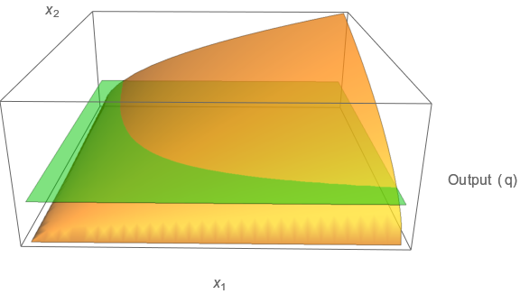
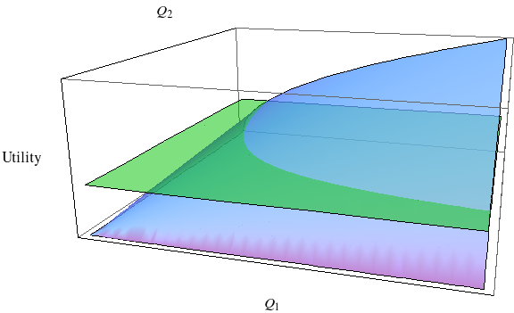
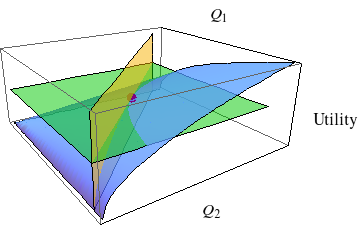

__*An Interactive Text for Food and Agricultural Marketing*__ by Michael R. Thomsen is licensed under a [Creative Commons Attribution-ShareAlike 4.0 International License](https://creativecommons.org/licenses/by-sa/4.0/).  Source files are available on [GitHub](https://github.com/thomsen-m/FAM-OER).

# Chapters {.tabset}

***

## <span style="color:SaddleBrown">Preface</span>

*An Interactive Text for Food and Agricultural Marketing* was intended to be the primary textbook for a University of Arkansas course on this subject that I taught from 1999 through 2021.  The course was at a junior level but was foundational in that it was a required course for all majors in Agricultural Business at the University.  Many other students in the [Dale Bumpers College of Agricultural, Food and Life Sciences](https://bumperscollege.uark.edu/) took the course and it was open to students across campus.  The course assumed an understanding of college algebra and microeconomic principles that would be covered in a typical college-level introductory economic principles course.

Upon successful completion of the course, students should have a broad understanding of the economics of food and agricultural markets.  Students who complete the course should also be able to apply this understanding to problems in production agriculture, agribusiness, and food policy.  To meet these broad learning outcomes, each chapter begins with student learning objectives.  Students are encouraged to pay attention to these objectives as they work through the content of the chapters.  

*An Interactive Text for Food and Agricultural Marketing* differs from a traditional text in that it contains a number of demonstrations that are designed to reinforce concepts presented in the course.  Some demonstrations are more involved than others, but students should spend enough time with each to understand what is happening in the demonstration and why.  Each chapter also has a number of problem sets that students can use to self-assess their understanding of the content.  Upon finishing a chapter, students should complete all of the multiple-choice questions.  With the exception of Chapter V, there are also one or more short-answer problem applications.  Each application presents a number of examples. Check figures are provided within the applications themselves.  Students are not expected to work through every example in each application, just enough of them to be confident in their ability to reach the right solution.  

I am grateful to the University of Arkansas Libraries’ Open Educational Resources Program, which has been helpful in developing *An Interactive Text for Food and Agricultural Marketing*.  While the primary aim of the present work was to meet the needs of a specific University of Arkansas course, it is my hope that others will be able to adopt it for use in similar courses elsewhere and/or improve upon it.  For this reason, *An Interactive Text for Food and Agricultural Marketing* is released with the [copyleft](https://www.copyleft.org/) compatible [CC BY-SA](https://creativecommons.org/licenses/by-sa/4.0/) license.  

*An Interactive Text for Food and Agricultural Marketing* is written in [R Markdown](http://rmarkdown.rstudio.com/) and was developed in [R](https://cran.r-project.org/) with [RStudio](https://www.rstudio.com/).   The demonstrations and problem sets are [R Shiny](https://shiny.rstudio.com/) applications, the code for which is embedded within the markdown files.  I am grateful to RStudio for providing a teaching license to their [Shiny Server](https://www.rstudio.com/products/shiny/shiny-server/) software to use with my University of Arkansas class.

In addition to the source files for the text itself, the [GitHub](https://github.com/thomsen-m/FAM-OER) repository provides R Markdown files that render to html slide sets.  These can be used or modified to support lectures based on this text.

Sincerely,

Michael R. Thomsen

December 2021

***
## <span style="color:SaddleBrown"> I </span>

### <span style="color:Purple"> MARKET DEMAND </span>

This chapter addresses the demand side of the market. This is also the buyer or customer side of the market.  The overall aim of the chapter is to provide the background you need to use demand constructs to understand marketing strategies and models of market equilibrium that you will encounter later in the course.   The chapter is organized into three sections.  The first covers the states of effective, latent, and negative demand.  Most of the course will deal with marketing problems for products or services in a state of effective demand.  However, latent and negative demand states are important in product development and many social-marketing contexts.  The second section introduces the basic mechanics of demand for a product or service under an effective demand state with a particular focus on the law of demand, the demand schedule, and variables that shift the demand schedule.  Some of this will be a review of material you encountered in your introductory microeconomics course, but some will likely be new and/or will be presented in a way you have not yet encountered.  The third section of the chapter introduces the idea of consumer surplus.  Consumer surplus is presented in a way that should deepen your understanding of the law of demand.  The concept will come up later in the course as a measure of economic welfare and will be used to understand pricing strategies used by sellers, many of which can characterized as attempts to convert consumer surplus into profits.  

The learning objectives for this chapter are as follows.

* Distinguish between different states of demand and explain contexts wherein each state may be relevant.

* Describe the demand relationship and explain the law of demand.

* Identify and describe variables that shift demand. You should be able to say something about the direction of the demand shift.

* Explain the difference between substitutes and complements.  Provide examples of each.

* Explain the difference between normal and inferior goods.

* Graph the inverse demand schedule given a demand equation and values of shift variables.

* Describe the concept of consumer surplus.  Compute consumer surplus from the demand schedule.

***

### <span style="color:SaddleBrown">Demand States</span>

It is useful to think about different demand conditions or states.  Specifically, there are three:  effective demand, latent demand, and negative demand.  Much of the class will emphasize effective demand because markets exist for products in a state of effective demand.  For products in an effective demand state, you can see equilibrium prices and quantities.  It is also possible estimate demand and understand how demand responds to changes in prices, consumer income, or other factors that affect the desirability of the product.  In the other two demand states, markets do not yet exist, but there could or would be a market provided technological barriers can be addressed or consumer preferences can be changed.  In fact, many product development efforts are aimed at overcoming some hurdle or limitation that would allow a product or service to move from a latent or negative demand state to an effective demand state.


#### Effective Demand

Normally, the word "demand" refers to a product in a state of effective demand.   Effective demand refers to the demand for products that are commercially feasible.  These products satisfy consumer wants and needs, and  consumers (or some segments thereof) are willing to buy them at prices that justify their production.  Automobiles, apples, vacation trips, restaurant meals, or any other good or service readily available in the economy is in a state of effective demand. Since market transactions are observed for products in a state of effective demand, it is possible to measure variables that influence demand.  These measurements can be used to estimate and forecast demand to gain insight into business or policy decisions.


#### Latent Demand

A state of latent demand is said to exist in cases where a need or want exists but a product does not.  For example, if there was a cure for cancer, there would be a demand for it.  Because of this latent demand, biotechnology companies spend large amounts of money on research and development efforts to create new drugs to more effectively combat cancer.  A latent demand state exists when the following conditions are present:

1. the product in question is not technically feasible given the current state of science and engineering (as in the case of a complete cure to cancer) or has yet to be conceived by an inventor or entrepreneur, or

2. the product is technically feasible but not commercially feasible given current technology, existing infrastructure, or the existing regulatory environment.   

With latent demand, one does not actually see market transactions.  For this reason, estimating the potential value of products in a latent demand state is often more difficult.  Economists often use experimental methods to assess willingness to pay for products in a state of latent demand.     

A change in technology, such as the introduction of the microwave oven, can unleash a number of new products that address latent demands and thereby bring them into a state of effective demand.  The first link below points to an early television commercial for the microwave.  This commercial speaks directly to how the microwave meets the latent demands of those who prepare meals over the eons of human history.  Today, much of what is in the frozen section of a supermarket is tailored to the microwave oven. Here is a link to an early microwave oven advertisement emphasizing how the microwave addresses latent demand (<a href="https://www.youtube.com/watch?v=IKQzieCJqBA" target="_blank">visit youtube.com</a>).

#### Negative Demand

Negative demand refers to cases where there is a potential product that could meet a consumer want or need, but consumers are reluctant to purchase the product for one reason or another.  For example, many insect species are edible and could be produced at a cost that compares favorably to other food sources.  However, insects are not commonly being sold in attractive displays at the local supermarket.  The reason for this is that cultural norms in the USA frown upon consumption of insects.  This example is a bit “creepy,” and I hope it does not “bug” you too much, but the same general idea can apply to many actual or potential products that are viewed skeptically by consumers.  When confronted with negative demand, it may be possible to change the image of the product so that consumers view it as desirable.

* National Geographic segment on edible insects (<a href="https://www.youtube.com/watch?v=oQBVW9APQik" target="_blank">visit youtube.com</a>).

* Fact sheet on entomophagy from the UN Food and Agriculture Organization (FAO) (<a href="http://www.fao.org/3/i3264e/i3264e00.pdf" target="_blank">visit fao.org</a>).


#### Food Irradiation:  A Case Example

Food irradiation is a process that many thought could potentially address latent demands for safer food.  For example, irradiation could destroy Trichina parasites allowing pork to be cooked and served rare.  In the late 1990's, irradiation was approved by US regulatory agencies for use on raw meat and poultry.  There were some predictions that this would become a standard process, akin to pasteurization.  This turned out not to be the case.  One reason is that irradiated foods also faced a negative demand problem.  Consumers have been hesitant to embrace irradiated foods.  Review the fact sheet and short video clip from the links below. Both are from reputable organizations: a land-grant university and the United Nations.    

* Fact sheet from NC State on food irradiation (<a href="https://fbns.ncsu.edu//extension_program/documents/foodsafety_irradiation.pdf" target="_blank">visit ncsu.edu</a>).

* Short video from International Atomic Energy Agency and FAO (<a href="https://www.youtube.com/watch?v=pe6AKh_tLys&t=1s" target="_blank">visit youtube.com</a>).

Now consider the following questions:

1. What fundamental problem (or problems) can food irradiation address?

2. Is food irradiation safe?

3. Are there labeling requirements that would allow you tell if a food item in a retail store was irradiated?  

4. Why might consumers be reluctant to accept irradiated foods?  

5. Why is microwaveable food so widely accepted but irradiated food not?

***

### <span style="color:SaddleBrown">The Demand Schedule</span>

The demand schedule is the relationship between own-quantity demanded and corresponding own-price levels.  Several variables could affect the demand for a product, including the prices or quantities of related goods.  The adjective "own-quantity" is used to mean the quantity of the product being analyzed. For example, the own-quantity of beef could be represented as $Q_{BEEF}$ and the own-price of beef as $P_{BEEF}$.  The price of pork, $P_{PORK}$, could conceivably affect demand for beef, but this is not the own-price of beef.  The point to be made is that the demand schedule is the relationship between the product's own-quantity and its own-price holding all other variables that could affect demand constant at some fixed value.  The normal convention in this course will be to use subscripts to denote the product in question.  For example, $Q_1$ refers to the demand for good 1, $P_2$ refers to the price of good 2, etc.  

The demand schedule can be expressed mathematically as $Q_1 = f(P_1)$ or $P_1 = f^{-1}(Q_1)$. The term "direct demand" is used when $Q_1$ is on the left-hand side of the equation and the term "inverse demand" when $P_1$ is on the left-hand side.  When showing a demand relationship as an equation, the normal practice is to express the relationship in terms of direct demand.  However, it will generally be graphed in inverse form with the price of the product on the vertical axis and the quantity on the horizontal axis.  This convention is consistent with most microeconomics text books and can be useful when you want to simultaneously show production (supply side) relationships on the same plot.  Many textbooks, however, do not distinguish between direct and inverse demand.  The distinction is being made here because you learned back in middle-school algebra that if $y = f(x)$, then $y$ goes on the vertical axis and $x$ goes on the horizontal. The term "inverse demand," permits adherence to both algebraic and economic conventions.  

***
##### Demonstration 1: An inverse market demand schedule.
```{r, echo=FALSE}
shinyApp(
ui = fluidPage(sidebarPanel(sliderInput("pprice",
                                        "Own-price of good 1",
                                        min = 0,
                                        max = 100,
                                        value = 50,
                                        ticks = F)
                            ),
               mainPanel(plotOutput("demandPlot"))
  ),
server = function(input,output) {
  #Reactive terms to be used for the dynamic plot
  yinter<-reactive({100})
  xinter<-reactive({200})
  qquant<-reactive(xinter()-2*input$pprice)
  DynTickY<-reactive(eval(substitute(expression("P"[1]*" = "*pp),
                                     list(pp=input$pprice)
                                     )))
  DynTickX<-reactive(eval(substitute(expression("Q"[1]*" = "*qq),
                                     list(qq=max(qquant(),0))
                                     )))
  #Start the plot
  output$demandPlot <- renderPlot({
    par(bg="beige")
    plot(seq(0:200),100-0.5*(seq(0:200)),col="gray",
         type="l",
         xlab=expression("Own-quantity (Q"[1]*")"),
         ylab=expression("Own-price (P"[1]*")"),
         xaxs="i",yaxs="i",bty="n",
         xlim = c(0, 220), ylim = c(0, 110),
         xaxt='n',yaxt='n',
         main=expression(
           "Inverse Demand: P"[1]*" = 100 - 0.5Q"[1]*" (Direct Demand: Q"[1]*" = 200 - 2P"[1]*")"
           )
         )
    lines(c(0,100),c(50,50),col="gray")
    lines(c(100,100),c(0,50),col="gray")
    points(100,50,pch=21,col="gray",bg="gray")
    
    #Dynamic plot elements driven by the UI of the shiny app
    axis(1, at=c(0,100,max(qquant(),0),xinter(),220),labels=c("","",DynTickX(),"",""),lwd.ticks=1)
    axis(2, at=c(0,50,input$pprice,yinter(),100,110),labels=c("","",DynTickY(),"","",""),lwd.ticks=1)
    lines(seq(0:xinter()),yinter()-0.5*seq(0,xinter()),col="blue")
    lines(c(0,xinter()-2*input$pprice),c(input$pprice,input$pprice),col="green")
    lines(c(xinter()-2*input$pprice,xinter()-2*input$pprice),c(0,input$pprice),col="green")
    points(max(xinter()-2*input$pprice,0),input$pprice,pch=21,col="red",bg="red")
  })
},
options = list(height = 425)
)
```


***

#### The Law of Demand

The law of demand states that quantity and price are negatively related.  In other words, if the price of the product increases, then the quantity demanded will decrease and *vice versa*.  The law of demand reflects two phenomena.  First, consumer preferences generally exhibit diminishing marginal utility. Diminishing marginal utility is a technical way of saying that consumers receive lower amounts of additional satisfaction from each additional unit of a product they consume. Because of diminishing marginal utility, the price will need to fall to induce consumers to buy more units of products that they already consume.  This contributes to the negative relationship between quantity demanded and price.  Second, in most cases, different consumers place different valuations on the same product.  For example, suppose that Jane and John Doe would both enjoy tickets to a St. Louis Cardinals baseball game.  Jane loves baseball and is a huge Cardinals fan.  John mildly enjoys baseball and prefers the Minnesota Twins.  It would stand to reason that Jane would probably place a higher value on the tickets than John would.   The point here is that it is often the case that some consumers are very enthusiastic about a product and are willing to participate in the market even when the price is high.  Other, less enthusiastic, consumers stay out of the market at high prices but are willing to participate once the price comes down a bit.  For this reason, the number of consumers willing to participate in the market increases as the price falls and decreases as the price rises.  This also contributes to the negative relationship between quantity demanded and price.  

Because of diminishing marginal utility and differences in valuation across consumers, an increase (decrease) in price has two potential effects, each of which contributes to the negative relationship between quantity and price.

1. Each consumer buys less (more) of the product due to diminishing marginal utility.

2. The total number of consumers decreases (increases) as consumers with valuations close to the prevailing price exit (enter) the marketplace.

#### Demand Shifters

The demand schedule characterizes the relationship between quantity demanded and that product's own-price.  For instance, the demand schedule for beef would show the relationship between quantity of beef demanded and the price of beef holding everything else constant.  What happens if something else changes?  There are other prices that could affect the demand for beef.  For many consumers, pork or poultry serve as reasonable substitutes for beef.  Consequently, if pork or poultry prices decline (rise) relative to beef prices, one would expect reduced (increased) quantities of beef to be demanded.  This suggests that other factors, aside from a product's own-price, need to be considered.  These other factors are called demand-shift variables.  If the value of a shift variable changes, you will need to plot a new demand schedule that reflects the updated relationship between quantity demanded and the product's own-price.  The following are some common demand shift variables.

##### Prices of related goods (substitutes or complements)

Related goods in demand are classified as substitutes in consumption or complements in consumption. A substitute in consumption is a good that the consumer can use instead of the good in question to meet his or her underlying want or need.  For example, if you are analyzing the demand schedule for beef, then chicken, pork, or fish are all reasonable substitute products.  After all, one could order a chicken, pork, or seafood entree from the menu in lieu of beef; or the supermarket shopper may decide to cook chicken breasts, pork chops, or fish fillets for dinner instead of beef.  Formally, product 2 is considered to be a substitute for product 1 if an increase (decrease) in the price of product 2 causes an increase (decrease) in the demand schedule for product 1.  In other words, there is a positive relationship between the price of product 2 and the quantity of product 1 that consumers demand.  

A complement in consumption is a good that the consumer uses along with the good in question.  For example, if you are analyzing the demand for sport utility vehicles (SUVs), then gasoline is reasonable complementary product.  After all, an SUV is a large automobile and uses a lot of gas.  In recent years, gasoline prices appear to have had an effect on the demand schedule for SUVs.  During periods of high gasoline prices, sales of SUVs suffer.  Formally, product 2 is considered to be a complement for product 1 if an increase (decrease) in the price of product 2 causes a decrease (increase) in the demand schedule for product 1.  In other words, there is a negative relationship between the price of product 2 and the quantity of product 1 that consumers demand.

##### Consumer income

Consumer incomes can also shift the demand schedule, but the direction and magnitude of the shift depend on the characteristics of the good in question.  Some goods are classified as normal goods.  Consumption of a normal good increases as income increases.  Formally, good 1 is said to be a normal good if an increase (decrease) in income causes an increase (decrease) in the demand schedule for good 1.  In other words, there is a positive relationship between consumption of good 1 and the amount of income available to consumers.  Other goods are classified as inferior goods.  Consumption of an inferior good decreases as income increases.  Formally, good 1 is said to be an inferior good if an increase (decrease) in income causes an decrease (increase) in the demand schedule for good 1.  In other words, there is a negative relationship between consumption of good 1 and the amount of income available to consumers. It is important to emphasize that the adjective "inferior" only refers to the income relationship and does not imply that the consumer dislikes the good in question.

##### Tastes and preferences

Demand is subject to trends, fashions, health concerns, and a variety of other considerations.  For example, in 2012, media coverage of lean finely textured beef (LFTB), characterized as "pink slime", had an impact on demand for ground beef.  This would classify as information that led to an unfavorable change in preferences (meaning the product in question is less favored by consumers than before).  Conversely, a growing number of studies linking blueberries to improved health has impacted demand for blueberries in a positive way.  This would classify as a favorable change in preferences.   

* Link to a 2012 magazine article on the LFTB controversy by economists J. Ross Pruitt and David P. Anderson (<a href="http://www.choicesmagazine.org/UserFiles/file/cmsarticle_268.pdf" target="_blank">visit choicesmagazine.org</a>).

* Link to the 2012 ABC News Segment on LFTB mentioned in the magazine article (<a href="https://www.youtube.com/watch?v=87uBMXdIyjo" target="_blank">visit youtube.com</a>).

* Link to LSU AgCenter publication *Blueberries and Your Health* (<a href="http://www.lsuagcenter.com/~/media/system/b/d/9/1/bd91d79e86236b7d4b9253a28d832d41/pub3267blueberriesandyourhealth.pdf" target="_blank">visit lsuagcenter.com</a>).


##### Population

Market demand reflects the sum of all consumers in the marketplace.  All else equal, as the number of consumers increases (decreases), the demand schedule will increase (decrease).    

***

##### Demonstration 2: Demand shift variables change the demand schedule.
```{r, echo=FALSE}
shinyApp(
ui = fluidPage(
  sidebarPanel(
    sliderInput("pprice","Own-price of good 1",min = 0,max = 100,value = 50,ticks = F),
    radioButtons("type", label = "Type of good:",
                 choices = list("Normal" = 1, "Inferior" = -1),
                 selected = 1,inline=T),
    radioButtons("m", label = "Consumer income:",
                 choices = list("Initial" = 0, "Falls" = -6, "Rises" = 6),
                 selected = 0,inline=T),
    radioButtons("p2", label = "Price of a substitute (good 2):",
                 choices = list("Initial" = 0, "Falls" = -10, "Rises" = 10),
                 selected = 0,inline=T),
    radioButtons("p3", label = "Price of a complement (good 3):",
                 choices = list("Initial" = 0, "Falls" = 8, "Rises" = -8),
                 selected = 0,inline=T)
  ),
  mainPanel(plotOutput("demandPlot"))
  ),
server = function(input,output) {
  #Reactive terms to be used for the dynamic plot
  yinter<-reactive({100+as.numeric(input$m)*as.numeric(input$type)+as.numeric(input$p2)+as.numeric(input$p3)})
  xinter<-reactive({200+2*as.numeric(input$m)*as.numeric(input$type)+2*as.numeric(input$p2)+2*as.numeric(input$p3)})
  qquant<-reactive(xinter()-2*input$pprice)
  DynTickY<-reactive(eval(substitute(expression("P"[1]*" = "*pp),list(pp=input$pprice))))
  DynTickX<-reactive(eval(substitute(expression("Q"[1]*" = "*qq),list(qq=max(qquant(),0)))))
  DynMain<-reactive(eval(substitute(expression("Inverse Demand: P"[1]*" = "*yyint*" - 0.5Q"[1]),list(yyint=yinter()))))
  
  #Start the plot, plot title DynMain() is driven by the UI of the app
  output$demandPlot <- renderPlot({
    par(bg="beige")
    plot(seq(0:200),100-0.5*(seq(0:200)),col="gray",
         type="l",
         xlab="Own-quantity",
         ylab="Own-price",xaxs="i",yaxs="i",bty="n",
         xlim = c(0, 260), ylim = c(0, 120),xaxt='n',yaxt='n',
         main=DynMain())
    lines(c(0,100),c(50,50),col="gray")
    lines(c(100,100),c(0,50),col="gray")
    points(100,50,pch=21,col="gray",bg="gray")
    #Other dynamic plot elements driven by the UI of the shiny app
    axis(1, at=c(0,max(qquant(),0),100,200,xinter()), labels=c("",DynTickX(),"","",""),lwd.ticks=1)
    axis(2, at=c(0,input$pprice,50,yinter(),100,120), labels=c("",DynTickY(),"","","",""),lwd.ticks=1)
    lines(seq(0:xinter()),yinter()-0.5*seq(0,xinter()),col="blue")
    lines(c(0,xinter()-2*input$pprice),c(input$pprice,input$pprice),col="green")
    lines(c(xinter()-2*input$pprice,xinter()-2*input$pprice),c(0,input$pprice),col="green")
    points(max(xinter()-2*input$pprice,0),input$pprice,pch=21,col="red",bg="red")
  })
},
options = list(height = 475)
)
```

***

#### Demand Schedules from a Linear Demand Relationship

A general demand relationship would need to include all the demand shifters that could affect demand in addition to own-price.  With this in mind, consider the following demand equation for good A:
$$Q_A = 20Pop + 0.01M +2P_B - 4P_A$$

In this equation, $Q_A$ is the quantity of good A in thousands of units, $Pop$ is population in millions of persons, $M$ is disposable income in dollars, $P_B$ is the price of good B in dollars, and $P_A$ is the price of good A in dollars.  Given this equation, you are able to answer some general questions about the demand for good A.

* *__Is good A a normal good or an inferior good?  How can you tell?__* Good A is a normal good.  You can tell because the coefficient associated with the income variable (0.01) is a positive number.  If this were a negative number, you would have an inferior good.

* *__Is good B a substitute or a complement to good A?  How can you tell?__*  Good B is a substitute for good A.  You can tell because the coefficient associated with the price of good B is a positive number.  If this were a  negative number, you would instead conclude that good B is a complement to good A.  

* *__Does the demand for good A conform to the law of demand?  How can you tell?__* Yes.  The coefficient associated with the price of good A is a negative number showing an inverse relationship between the quantity of good A and the price of good A.

*  *__What variables shift the demand schedule?__* In this case, there are three variables:  population ($Pop$), income ($M$), and the price of the substitute good ($P_B$). Remember that the demand schedule is the relationship between own-price and own-quantity.  In the equation above, $P_A$ represents the own-price and $Q_A$ represents the own-quantity.  Thus, every right-hand-side variable other than $P_A$ is a demand shifter.

The demand schedule shows the relationship between own-price and own-quantity demanded holding all else constant.  In this case, "all else" consists of the three demand shifters.  Thus, to get an equation for the demand schedule you need to fix these shift variables at some value.  Let us use a value of 3 million for $Pop$, \$30,000 for $M$, and \$20 for $P_2$.  Using these values, you get the direct demand schedule:
$$Q_A = 20(3) + 0.01(30000) +2(20) - 4P_A $$
or 
$$Q_A = 400 - 4P_A.$$
Remember that this is the direct demand schedule because $Q_A=f(P_A)$.  It is simple enough to get the inverse demand schedule.  Simply solve to get $P_A$ on the left side of the equation.  The inverse demand schedule is
$$P_A = 100 - \frac{1}{4} Q_A$$

***

### <span style="color:SaddleBrown">Consumer Surplus</span>
Consumer surplus is a measure of consumer welfare.  The concept is remarkably simple and can be conceptualized as the value that the consumers receive above the price paid for the product.  Consumer surplus is an important part of the value created by market transactions but is often overlooked as it does not formally get recorded on the seller's financial statements nor is it quantified on customer receipts. The notion of consumer surplus will be used at different points later in the course.  It is useful to introduce it now because it can be used to explain the law of demand in terms of consumers seeking to obtain surplus through market transactions.  

#### Explaining Consumer Surplus
To motivate the idea of consumer surplus, imagine that you have a difficult exam in your 1:30 PM class.  Because you are so worried about the exam you decide to forego lunch and use the time to study instead.  At 2:30, after having written the exam, you realize how very hungry you are.  You head to your favorite sandwich shop for lunch.  You are willing to pay up to \$12 for a sandwich and are pleased to see that sandwiches are priced at \$8 on the menu.  Does the purchase of a sandwich make you better off?  Absolutely. By paying \$8 you receive a good that provides you with satisfaction worth \$12.  Your consumer surplus is \$4 and can be computed as the value you place on the product (\$12) less the purchase price (\$8).  

Figure 1 shows that value from a market transaction such as this one is divided among the consumer (in the form of consumer surplus) and the firm (in the form of profits).   Suppose the sandwich shop can produce the sandwich for \$5 per unit.  The shop receives a profit margin of \$8 - \$5 = \$3.  The total value created by the transaction is \$7 (the \$12 value you place on the sandwich less the production cost of \$5) and is also equal to the \$3 profit margin going to the shop plus the \$4 consumer surplus going to you.  Thus, there is a simple identity for the value created from a transaction such as this:  
$$Value\ Created \equiv Consumer\ Valuation - Production\ Cost \equiv Consumer\ Surplus + Profit$$

****

```{r, echo=FALSE}
cstab<-as.table(cbind(c(0,0,0),c(5,3,4),c(0,0,0)))
colnames(cstab)<-c(" ", "  ","   ")
par(bg="beige")
barplot(cstab,
        cex.lab=0.75,
        cex.sub=0.75,
        sub="Value created is $7 and is the seller's profit plus the consumer's surplus",
        ylab="$ per unit",
        col=c("red","darkgreen","lightgreen"),
        space=c(0,0,0),
        legend=c("Cost = $5",
                 "Profit = Price - Cost = $3",
                 "Cons. Surplus = Cons. Value - Price = $4"),
        axes = F,
        args.legend=list(x=3, y=10, cex=0.65),
        bty = "n"
        )
axis(2, at=c(0,5,8,12), 
     labels=c("0","Cost = $5","Price = $8","Cons. Value = $12"),
     cex.axis=0.70)
lines(c(0,2),c(5,5),col="red")
lines(c(0,2),c(8,8),col="darkgreen")
lines(c(0,2),c(12,12),col="lightgreen")
```

##### Figure 1. Value from a market transaction is comprised of consumer surplus and profits.

***

Firms create value by producing goods and services that consumers value more highly than the costs of production.  Typically, as in our sandwich example, some of this value will be captured as a profit margin.  The rest of the value gets passed on to consumers in the form of surplus.  Thus, even though consumer surplus is not entered into a company's books or onto customer receipts, it is important to profitability.  Firms that create superior value can be said to have a competitive advantage in that they can gain market share by providing consumers with more-attractive surplus propositions and or can command higher profit margins while still offering consumers surplus on par with their competitors (Besanko et al. 2010).    

#### Consumer Surplus in the Context of Diminishing Marginal Utility
Recall from above that the law of demand reflects diminishing marginal utility from successive units of a product.  To see this, let us continue our sandwich example.  A very hungry person receives a great deal of satisfaction from the first sandwich, probably enjoys the second, might nibble a bit on a third, but is not much interested in the fourth.  What is happening here is that as the person eats more and more, he or she starts to become satiated.  The first sandwich was wonderful but the fourth sandwich creates indigestion.  This translates into the monetary value the consumer places on sandwiches.  The hungry consumer is willing to pay a relatively high price for the first sandwich, a moderate price for the second, and much less, if anything, for the third or fourth sandwich.  This leads to the negative relationship between price and quantity as stipulated by the law of demand.

Let us continue this example with Demonstration 3 below.  Suppose that your marginal valuation, the value you place on additional sandwiches, is as presented in Demonstration 3.  If sandwiches are priced at \$8, you buy one and receive consumer surplus of $4.  You are quite hungry and would enjoy another, but the first sandwich has taken the edge off your hunger and you only value the second sandwich at \$7 which is less than the $8 purchase price.  For this reason, you will only buy one sandwich if they are priced at \$8.  Notice from Demonstration 3 that as prices fall, you purchase additional sandwiches (again giving rise to a downward sloping demand schedule).  In addition to buying more sandwiches at lower prices, you obtain more surplus from each sandwich you purchase. 

With this in mind, let us consider a slightly different situation: suppose that when you showed up at the sandwich shop, you were pleasantly surprised to see that the shop owner was running a special and had sandwiches priced at \$6 instead of \$8.  Move the price down to $6 in Demonstration 3 to verify that in this case, you would gladly buy two sandwiches at \$6 apiece.  Now you would get a total \$8 in consumer surplus (\$7 from the first sandwich and \$1 from the second).  

Now let us think about this from the perspective of the shop owner.  It costs her \$5 to produce each sandwich, so she makes only \$2 in profit by selling you the two sandwiches at \$6 apiece.  If she would have kept her sandwiches priced at \$8 as normal, she would have only sold you one sandwich but would have made \$3 in profit from the transaction with you.  She faces a  dilemma.  She can profitably sell you a second sandwich since you value the second sandwich at $7 and it only costs her $5 to produce it.  However, if she sets price low enough to induce you to buy two sandwiches, she gives up the high margin she could have commanded on the first sandwich.  Moreover, there are probably less hungry customers that would have bought one sandwich at \$8 but would not want a second sandwich even at the low price of \$6.  By pricing at \$6, the shop owner sacrifices the higher margin on sandwiches sold to all these less-hungry customers as well. 

Is there a way the shop owner could resolve this dilemma?  One way would be to price sandwiches so that they are \$8 for one sandwich or \$14 for two sandwiches.  Now, a hungry customer like you would go for the two for \$14 option and the shop owner will make a profit of \$4 on the transactions with you and other similarly hungry customers.  Better yet, she will still get a profit of \$3 on transactions with the less-hungry customers who buy only one sandwich.  There are some potential problems here though.  What if lots of couples come to the sandwich shop?  Couples would qualify for the \$14 deal.  The shop owner could have made a profit of \$6 per couple by selling each couple two sandwiches at \$8 apiece as opposed to a profit of \$4 per couple under the two for \$14 deal.  Another way the plan could backfire would be if enterprising customers bought sandwiches on the two for \$14 deal and then resold them to less hungry customers outside the shop for something like \$7.50, which is lower than the \$8 asking price of the shop owner. 

An important point here is that consumers are only in the market when they can get positive surplus.  As you progress through the course, you will learn that many marketing strategies can be characterized as efforts to capture surplus and resolve dilemmas similar to that faced by the shop owner in this example.  In other words, many strategies are aimed at taking what would or could be consumer surplus and turning it into higher profits.  For now, however, the main goal is to use the idea of consumer surplus to strengthen your understanding of the law of demand, and the main takeaway from Demonstration 3 is that each customer will be inclined to purchase more units at lower prices and fewer units at higher prices.

***

##### Demonstration 3: Surplus with diminishing marginal utility.
```{r, echo=FALSE}
shinyApp(ui =fluidPage(
  sidebarPanel(
    sliderInput("pprice","Asking Price",min = 0,max = 14,value = 8,ticks = F),
    tableOutput("mvTable")
    ),
  mainPanel(plotOutput("mvPlot"))
)
,
server = function(input,output) {
  TabDat<-data.frame(as.character(1:4),c(12,7,3,1))
  colnames(TabDat)<-c("Units","Value")
  Surplus<-reactive({sapply(TabDat$Value-input$pprice,function(x) {max(x,0)})})
  Buy<-reactive(ifelse(Surplus()>0,"Yes","No"))
  OutTab<-reactive({
    d<-data.frame(TabDat,Surplus(),Buy())
    colnames(d)<-c("Units","Value","Surplus","Buy")
    d
    })
  output$mvTable<-renderTable(OutTab(),digits=0,spacing="xs")
  output$mvPlot <- renderPlot({
    par(bg="beige")
    plot(1:4,c(12,7,3,1),
         xlab="Number of Units",
         ylab="Marginal Valuation/Price ($)",
         ylim=c(0,14),
         xlim=c(1,4),
         axes=F)
    #Dynamic chart elements driven by the UI
    axis(1, at=0:4, labels=c(" ","1","2","3","4"),lwd.ticks=1)
    axis(2, at=c(1,3,7,12,14), labels=c("1","3","7","12","14"),lwd.ticks=1)
    lines(c(0,6),c(input$pprice,input$pprice),col="red")
    lines(c(1,1),c(min(input$pprice,12),12),col="green")
    lines(c(2,2),c(min(input$pprice,7),7),col="green")
    lines(c(3,3),c(min(input$pprice,3),3),col="green")
    lines(c(4,4),c(min(input$pprice,1),1),col="green")
  },height=350)
},
options = list(height = 400))
```

***

#### Consumer Surplus in the Context of Different Valuations Across Consumers
Another reason for the law of demand is that different consumers place different valuations on the same product. This means more consumers will participate in the market at lower prices and fewer consumers will participate at higher prices. Suppose that potential consumers of the latest electronic gadget can be divided into five segments, as shown by the points in Demonstration 4 below.  Consumers in segment 1 are very enthusiastic about the gadget and value it at \$800.  Consumers in segment 5 are least enthusiastic and value it at \$200.  Segments 2, 3, and 4 fall somewhere in-between in terms of their willingness to pay for the new gadget.  If the price of the device is set at \$550 dollars, then only segments 1 and 2 are willing to participate in the market.  These are the only two segments that could derive positive consumer surplus from buying the device.  Positive surplus is denoted in the table of the demonstration as well as by the height of the green bars in the chart.  If the price was lowered to below $500, consumers in segment 3 would enter the market and there would be more demanded. If the price increased to above $700, consumers in segment 2 would exit the market and fewer units would be demanded.  Notice that consumers in all five segments value the gadget, but only those who can derive positive surplus participate in the market.  Adjust the price-control slider in Demonstration 4.  Make sure you understand the surplus calculation for consumers in each segment and are predict the price points at which different segments enter or exit the market.

***

##### Demonstration 4: Valuations by consumer segment.
```{r, echo=FALSE}
shinyApp(ui =fluidPage(
  sidebarPanel(
    sliderInput("pprice","Asking Price",min = 100,max = 850,value = 550,ticks = F,step=50),
    tableOutput("segmentTable")
    ),
  mainPanel(plotOutput("segmentPlot"))
)
,
server = function(input,output) {
  TabDat<-data.frame(as.character(1:5),c(800,700,500,300,200))
  colnames(TabDat)<-c("Seg.","Value")
  Surplus<-reactive({sapply(TabDat$Value-input$pprice,function(x) {max(x,0)})})
  Buy<-reactive(ifelse(Surplus()>0,"Yes","No"))
  OutTab<-reactive({
    d<-data.frame(TabDat,Surplus(),Buy())
    colnames(d)<-c("Seg.","Value","Surplus","Buy")
    d
    })
  output$segmentTable<-renderTable(OutTab(),digits=0,spacing="xs")
  output$segmentPlot <- renderPlot({
    par(bg="beige")
    plot(1:5,c(800,700,500,300,200),
         xlab="Consumer segment",
         ylab="Valuation/Price ($)",
         ylim=c(0,900),
         xlim=c(1,5))
    #Dynamic chart elements driven by the UI
    lines(c(0,6),c(input$pprice,input$pprice),col="red")
    lines(c(1,1),c(min(input$pprice,800),800),col="green")
    lines(c(2,2),c(min(input$pprice,700),700),col="green")
    lines(c(3,3),c(min(input$pprice,500),500),col="green")
    lines(c(4,4),c(min(input$pprice,300),300),col="green")
    lines(c(5,5),c(min(input$pprice,200),200),col="green")
  },height=350)
},
options = list(height = 400))
```

***

#### Calculating Total Consumer Surplus Using the Demand Schedule
It should be clear from Demonstrations 3 and 4 that there is a link between consumer surplus and the demand schedule.  Graphically, the consumer surplus in a market can be computed as the area below the demand schedule but above the prevailing price.  In Figure 2, the consumer surplus is the triangular area that is shaded in blue.  If the demand schedule is linear (as in the demand schedule presented in Figure 2), you can use the formula for the area of a triangle to compute consumer surplus.  You may recall that the area of a triangle is given by $\frac{1}{2}\times\frac{base}{height}$. With this in mind, when given a value of $P$, say $\bar{P}$, you can compute consumer surplus from a linear demand schedule:

$$CS = \frac{1}{2}\times Q(\bar{P})\times(Intercept\ of \ Inverse\ Demand\ Schedule - \bar{P})$$
In Figure 2, $\bar{P_1} = 40$.  Let us use the information in the figure to compute consumer surplus.  

1. Evaluate the direct demand schedule at $\bar{P_1} = 40$ to get $Q_1(\bar{P_1}) = 200 - 2(40) = 120$.  This is the base of the consumer surplus triangle.

2. Look at the equation for the inverse demand schedule provided in the figure and notice that it has an intercept of 100.  Compute the height of the consumer surplus triangle as the difference between this intercept and $\bar{P_1}$, which is $100 - 40 = 60$.

3. Use the formula for the area of a triangle to get consumer surplus as $\frac{1}{2} \times 120 \times (60)  = \$3,600$.

Provided the demand schedule is linear, you can use the formula for an area of triangle to get consumer surplus.  Pedagogically, linear demand schedules will be fine for most of what you will encounter in this course; however, in many empirical applications you may not want to assume that demand schedules are linear.  In general, if the demand schedule is not linear you can compute consumer surplus using the integral as $\int_{0}^{Q^*}P(Q)dQ - P(Q)Q^*$, where $P(Q)$ is the inverse demand curve and $Q^*\geq0$ is an arbitrary quantity value.   

***

```{r, echo=FALSE}
par(bg="beige")
    plot(seq(0:200),100-0.5*(seq(0:200)),col="blue",
         type="l",
         xlab=expression("Own-quantity (Q"[1]*")"),
         ylab=expression("Own-price (P"[1]*")"),
         xaxs="i",yaxs="i",bty="n",
         xlim = c(0, 220), ylim = c(0, 110),
         xaxt='n',yaxt='n',
         main=bquote(atop("Inverse Demand: P"[1]*" = 100 - 0.5Q"[1]*" (Direct Demand: Q"[1]*" = 200 - 2P"[1]*")",
                     "Consumer Surplus = "*frac(1,2)%*%120%*%(100-40)*" = $3,600")),
         cex.lab=0.75,
         cex.main=0.75,
         cex.axis=0.75
         )
    polygon(c(0, 0, 120), c(100,40,40), border=NA, col="lightblue")
    lines(c(0,120),c(40,40),col="green")
    lines(c(120,120),c(0,40),col="green")
    points(120,40,pch=21,col="gray",bg="red")
    axis(1, at=c(0,120,200,220),labels=c("0","120","200",""),lwd.ticks=1)
    axis(2, at=c(0,40,100,110),labels=c("0","40","100",""),lwd.ticks=1)
    
```

##### Figure 2: Calculating consumer surplus (shaded in light blue) from a demand schedule.

***

### <span style="color:SaddleBrown">Concluding Comments</span>

To recap, this chapter has introduced concepts essential to understanding the demand side of the market.  First, you learned about different demand states.  As you move forward through the course, the focus will be primarily on products in an effective demand state.  You will, however, examine models appropriate for understanding products in other demand states in chapter V.  In chapter III, you will revisit the demand shift variables as you learn elasticities.  These shift variables will play a central role in chapter IV, as you model market equilibrium.  Consumer surplus will central to measuring welfare in chapters VII and VIII and will help motivate the ideas behind pricing schemes commonly used be sellers to extract consumer surplus and turn it into higher profit margins.  

A question central to this course relates to how markets address the economic allocation problem.  Any economic system needs to answer questions such as the following (see Kohls and Uhl 1998).  

1.	What to produce? 

2.	How much to produce? 

3.	How to produce? 

4.	How to distribute production?  

In many cases, market-determined prices provide the information needed for the economy to efficiently respond to these questions.  The content of this chapter relates directly to the fourth question.  A consumer with a dollar to spend will use it in the market that provides him or her with the most surplus, and you have already seen that surplus depends on the price.  Provided consumers know their valuation of a product, a set of market prices provides the information necessary for consumers to self-sort into markets where they obtain the most surplus.  This helps to ensure that products and services are allocated to those consumers who value them most and as you will see in the coming chapters, value them sufficiently to justify the production costs.  

***

### <span style="color:SaddleBrown">References</span>
Besanko, D., D. Dranove, M. Shanley, and M. Schafer. 2010. *Economics of Strategy, 5th ed.* John Wiley & Sons. 

Kohls, R. L. and J. N. Uhl. 1998. *Marketing of Agricultural Products, 8th Ed.* Pearson.


***

### <span style="color:SaddleBrown">Problem Sets</span>

#### Problem Set 1: Short Answer.
```{r, echo=FALSE}
shinyApp(
  ui = fluidPage(
    sidebarPanel(
      selectInput(
        "prob",
        label = "Problem Number",
        choices = as.character(c(1:10)),
        selected = "5", 
        selectize=F),
      radioButtons("show", label = "Show Answer?",
                  choices = list("Yes" = T, "No" = F),
                  selected = F,inline=T),
      p("Answers:"),
      textOutput("AnswerCross"),
      textOutput("AnswerIncome"),
      textOutput("AnswerDirDem"),
      textOutput("AnswerInvDem"),
      textOutput("AnswerConSurp"),
      textOutput("AnswerRest"),
      width=4
      ),
      mainPanel(plotOutput("demandPlot"),
                p("Given the following:"),
                textOutput("ProbEquation"),
                textOutput("ProbData"),
                p("--------"),
                p("Is good 2 a substitute or complement to good 1?"),
                p("Is good 1 a normal or inferior good?"),
                p("Write equations for the direct and inverse demand schedules."),
                p("Plot the inverse demand schedule. Label the vertical and
                   horizontal intercepts along with the own-price and quantity."),
                p("Calculate consumer surplus at this data point. Shade the
                   area that represents consumer surplus.")
                )
    ),
  server = function(input,output) {
    #Enter matices for demand coefficients and datapoints
    coef<-rbind(c(125,3,-6,-0.1),
                c(230,5,-5,-0.2),
                c(104,2,-6,0.1),
                c(382,-2,-4,-0.3),
                c(137,-3,-3,0.4),
                c(102,6,-4,0.3),
                c(400,-4,-3,-0.4),
                c(200,4,-5,0.2),
                c(260,-6,-2,-0.5),
                c(132,-5,-2,0.5)
    )
    dpoints<-rbind(c(25,20,500),
                   c(10,30,400),
                   c(30,20,1000),
                   c(30,40,300),
                   c(25,50,400),
                   c(5,40,600),
                   c(20,50,200),
                   c(20,30,800),
                   c(5,60,100),
                   c(10,60,300)
    )
    #Define intermediate terms to facilitate reactive terms below
    xints<-coef[,1]+coef[,2]*dpoints[,1]+coef[,4]*dpoints[,3] #direct demand schedule intercepts
    yints<- -xints/coef[,3] #inverse demand schedule intercepts
    aa<-coef[,1]            #original intercepts
    bb2<-coef[,2]           #cross-price slope terms
    bbm<-coef[,4]           #income slope terms
    bb1<-coef[,3]           #own-price slope terms
    pp2<-dpoints[,1]        #cross-price values
    pp1<-dpoints[,2]        #own-price values
    mm<-dpoints[,3]         #income values
    
    #Reactive terms to be used for the dynamic plot
    pprob<-reactive({as.numeric(input$prob)}) #problem number from UI
    yinter<-reactive({yints[pprob()]})
    xinter<-reactive({xints[pprob()]})
    qquant<-reactive(xinter()+bb1[pprob()]*pp1[pprob()])
    colbl1<-reactive(ifelse(input$show,"blue","beige"))
    colbl2<-reactive(ifelse(input$show,"lightblue","beige"))
    output$ProbEquation<-renderText(paste("Q1 = ",
                                          aa[pprob()],
                                          ifelse(bb2[pprob()]>0,"+",""),bb2[pprob()],"P2",
                                          ifelse(bbm[pprob()]>0,"+",""),bbm[pprob()],"M",
                                          bb1[pprob()],"P1"))
    output$ProbData<-renderText(paste("P2 = ",pp2[pprob()],"; M = ",mm[pprob()],"; P1 = ",pp1[pprob()],sep=""))
    output$AnswerCross<-renderText(ifelse(input$show,
                                          paste("Good 2 is a ",ifelse(coef[pprob(),2]>0,"substitute.","complement.")),
                                          " ")
                                   )
    output$AnswerIncome<-renderText(ifelse(input$show,
                                           paste("Good 1 is  ",ifelse(coef[pprob(),4]>0,"normal.","inferior.")),
                                           " ")
                                    )
    output$AnswerDirDem<-renderText(ifelse(input$show,
                                           paste("Direct: Q1 =",xinter(),bb1[pprob()],"P1"),
                                           " ")
                                    )
    output$AnswerInvDem<-renderText(ifelse(input$show,
                                           paste("Inverse: P1 =",yinter(),round(1/bb1[pprob()],2),"Q1"),
                                           " ")
                                    )
    output$AnswerConSurp<-renderText(ifelse(input$show,
                                            paste("Consumer Surplus = $",0.5*qquant()*(yinter()-pp1[pprob()])),
                                            " ")
                                     )
    
    #Start the plot
    output$demandPlot <- renderPlot({
      par(bg="beige")
      plot(seq(0:xinter()),yinter()+(1/coef[pprob(),3])*(seq(0:xinter())),col=colbl1(),
           type="l",
           xlab=ifelse(input$show,expression("Own-quantity (Q"[1]*")")," "),
           ylab=ifelse(input$show,expression("Own-price (P"[1]*")")," "),
           xaxs="i",yaxs="i",bty="n",
           xlim = c(0, xinter()), ylim = c(0, yinter()),
           xaxt='n',yaxt='n',
           main="Inverse Demand Schedule"
           #main=expression("Inverse Demand: P"[1]*" = 100 - 0.5Q"[1]*" (Direct Demand: Q"[1]*" = 200 - 2P"[1]*")")
      )
      polygon(c(0, 0, qquant()), c(yinter(),pp1[pprob()],pp1[pprob()]), border=colbl1(), col=colbl2())
      lines(c(0,qquant()),c(dpoints[pprob(),2],dpoints[pprob(),2]),col=colbl1())
      lines(c(qquant(),qquant()),c(0,dpoints[pprob(),2]),col=colbl1())
      points(qquant(),dpoints[pprob(),2],pch=21,col=colbl1(),bg=colbl1())
      ifelse(input$show,axis(1, at=c(0,qquant(),xinter()),lwd.ticks=1),"")
      ifelse(input$show,axis(2, at=c(0,pp1[pprob()],yinter()),lwd.ticks=1),"")
    })
  },
  options = list(height=700)
)
```

#### Problem Set 2: Multiple Choice.
```{r, echo=FALSE}
###############################################################################
# ResponseMC(correct)
# A shinyApp function to accept and check a multiple choice response.  The only
# arguments to the function is the letter of the correct response and number of
# resonses.  
#
# Example:
# ResponseMC("a",4) is used if "a" is the correct choice from 4 choices (a-d).
###############################################################################

ResponseMC<- function(correct,nchoices){
  shinyApp(
    ui = fluidPage(
      fluidRow(
        column(2,
               selectInput(
                 "answer",
                 label = NULL,
                 choices = c("No selection",letters[1:nchoices]),
                 selected = "No selection", 
                 selectize=F)),
        column(4,htmlOutput("resp"))
        )
      ),
    server= function(input,output) {
      output$resp<-renderText(
        ifelse(input$answer=="No selection",
               "Choose a letter from the menu.",
               ifelse(input$answer==correct, 
                      paste("You are correct! The answer is ", correct,".",sep=""),
                      paste("Sorry. The correct answer is ", correct,".",sep=""))
               )
        )
      },
    options = list(height = 50)
  )
  }
```


1.	__Which best describes consumer surplus?__
a.	Large surplus that result when consumers perceive the product in question to be undesirable (e.g., negative demand).
b.	Value that the consumer receives from a transaction above the price he or she is required to pay.
c.	Situations where the consumer only wants one unit of the product.  Additional units are considered to be surplus.
d.	Goods that consumers store for use at a later date. 

```{r, echo=FALSE}
ResponseMC("b",4)
```

2.	__Which of the following is most likely to shift the demand schedule out (to the right or northeast)?__
a.	An increase in population.
b.	An increase the own-price.
c.	A decrease in the price of a substitute product.
d.	All of the above.

```{r, echo=FALSE}
ResponseMC("a",4)
```

3.	__Suppose that a prestigious journal reports that the regular consumption of walnuts reduces risk of heart disease.  As a consequence, the demand for walnuts increases (walnut demand shifts to the right).__
a.	Walnuts would switch from becoming inferior goods to normal goods.
b.	This would be described as a change in the price of a substitute product because heart disease is something no one wants.
c.	This change in demand would best be characterized as a change in preferences.
d.	All of the above

```{r, echo=FALSE}
ResponseMC("c",4)
```

4.	__Which best describes a direct demand schedule?__
a.	Price is a function of quantity.
b.	Quantity is a function of price.
c.	Price is a function of income.
d.	Both a and c.

```{r, echo=FALSE}
ResponseMC("b",4)
```

5.	__Which condition is the best example of a product in a state of latent demand?__
a.	High-protein muffins filled with roasted caterpillars.
b.	Fresh salads in cold Midwestern and Northeastern cities during the winter months of the mid to late 1800s. 
c.	Demand for products that are outdated (e.g., unused tickets to last week’s ball game).
d.	Demand for apples.

```{r, echo=FALSE}
ResponseMC("b",4)
```

6.	__Suppose the economy goes into recession, many people lose their jobs, and nearly everyone has a lower income.  Which products will likely experience an increase in market demand?__
a.	Products classified as normal goods.
b.	Products that are classified as inferior goods.
c.	Products classified as necessities.
d.	Products classified as complements.
e.	Products classified as substitutes.

```{r, echo=FALSE}
ResponseMC("b",5)
```

7.	__Which best describes complements as described in class?__
a.	Goods that are consumed together, for example, gasoline and automobiles. 
b.	Luxury items purchased in the hope of eliciting complements from friends or acquaintances.
c.	Goods that can be used in lieu of one another, for example, beef and poultry.
d.	Goods for which demand increases given an increase in income.

```{r, echo=FALSE}
ResponseMC("a",4)
```

8.	__In demand, if the price of good A decreases and the demand for good B also decreases then which must be true?__
a.	Good A is a substitute for good B.
b.	Good A is a complement for good B.
c.	Good A is a normal good.
d.	Good B is an inferior good.

```{r, echo=FALSE}
ResponseMC("a",4)
```

9.	__When you write an equation for the inverse demand curve,__
a.	Price will be a function of quantity (price is on the left-hand side of the equation).
b.	Quantity will be a function of price (quantity is on the left-hand side of the equation).
c.	The demand schedule will slope upwards.
d.	Both b and c.

```{r, echo=FALSE}
ResponseMC("a",4)
```

10.	__The law of demand__
a.	States that as price increases, quantity decreases and *vice versa*.
b.	Reflects the fact that marginal utility usually declines as the number of units consumed increases. 
c.	Reflects the fact that different consumers will generally place different valuations on the product.  In other words, as price declines more consumers will find it attractive to participate in the market.
d.	All of the above.

```{r, echo=FALSE}
ResponseMC("d",4)
```

11.	__If consumer incomes increase,__
a.	demand will shift out (to the right).
b.	demand will shift in (to the left).
c.	demand will not shift but there will be a new quantity demanded from the same demand schedule.
d.	the shift in demand cannot be determined without additional information.

```{r, echo=FALSE}
ResponseMC("d",4)
```

12.	__Consumer surplus refers to__
a.	The triangular area below the linear inverse demand curve and above the horizontal axis.
b.	The sum of the value that consumers receive above the price they are required to pay.
c.	Situations where consumers do not like a product and so the result is an excess or surplus.
d.	A case where producers put too much on the market.
e.	Both a and b.

```{r, echo=FALSE}
ResponseMC("b",5)
```

13.	__Prepared breakfast cereal is best described as being in a state of:__
a.	Latent demand.
b.	Negative demand.
c.	Effective demand.
d.	Latent supply.

```{r, echo=FALSE}
ResponseMC("c",4)
```

14.	__By definition, an inferior good is:__
a.	A good that is in a state of negative demand.
b.	A good for which demand increases (shifts out) when consumer incomes decline.
c.	A good for which demand decreases (shifts in) when consumer incomes decline.
d.	A good that would be unappetizing to most consumers.

```{r, echo=FALSE}
ResponseMC("b",4)
```

15.	__The law of demand indicates:__
a.	Cross-price elasticities will be negative for substitute products.
b.	The demand schedule will be downward sloping.
c.	Income elasticities will be positive.
d.	Demand shifts when tastes and preferences change.

```{r, echo=FALSE}
ResponseMC("b",4)
```

16.	__Vacations to Mars are best described as being in a state of:__
a.	Latent demand.
b.	Negative demand.
c.	Effective demand.
d.	No demand state since consumers cannot buy these products.

```{r, echo=FALSE}
ResponseMC("a",4)
```

17.	__By definition a normal good is:__
a.	A good that is in a state of negative demand.
b.	A good for which demand increases (shifts out) when consumer incomes decline.
c.	A good for which demand decreases (shifts in) when consumer incomes decline.
d.	A good that consumers consider to be “normal” in the sense that there is nothing extraordinary about it.  Food insects, for example, would be abnormal goods for many US consumers.

```{r, echo=FALSE}
ResponseMC("c",4)
```

18.	__All else equal, if income increases and the demand schedule shifts out (to the right) then you can conclude that:__
a.	The demand schedule is for a normal good.
b.	The demand schedule is for an inferior good.
c.	The demand schedule is for a substitute product.
d.	The demand schedule is for a complementary product.

```{r, echo=FALSE}
ResponseMC("a",4)
```

***

## <span style="color:SaddleBrown"> II </span>


### <span style="color:Purple"> MARKET SUPPLY </span>

Supply arises from the business decisions of producing firms.  The term "firm" is used broadly to refer to any producing enterprise and includes farms. The law of supply states that the quantity supplied to the market increases as a a product's market price increases.  After a brief overview of the law of supply and the market supply schedule, this chapter examines two types of decisions at the level of the producing enterprise that give rise to the law of supply.  

1. The first revolves around the decision to participate in the market.  The primary goal here is to establish that: (a) a higher output price induces additional firms to enter the market, and (b) when the output price is low, some firms will find it in their interest to exit the market.  The decision to participate in the market is one reason for the law of supply.  In examining the entry and exit decision, you will see that the price that induces new firms to  enter the market will often be higher than the price at which existing firms will exit.  This observation is not essential to the law of supply but does have implications for marketing arrangements that will be considered later in the course.  

2. The second type of decision pertains to the output choices of existing firms.  In many situations, the firm has some flexibility to alter the volume it produces once it has entered the market.  You will see that a firm's profit maximizing output choice is positively related to the market price.  This is a second reason for the the law of supply.  Existing firms will supply more to the market at higher prices and less to the market at lower prices.

Having analyzed these two decisions, you will be in a position to characterize the market supply schedule as an aggregate reflecting choices of many individual firms.  As is the case with the demand schedules you studied in Chapter I, There are a number of variables that shift the market supply schedule and which are described in this chapter.

The next portion of the chapter examines demand for inputs used in production. Many agricultural products are demanded as inputs in downstream production activities. For example, corn is an input used in the production of livestock, ethanol, vegetable oil, high fructose corn syrup and a number of other downstream products.  Demands for inputs arise out of the supply decisions of profit maximizing firms. Thus, even though the chapter has "supply" in its title, it is also very much about input demand. The firm's problem will be characterized by choosing inputs to produce the output that maximizes profit.  The solution to this problem provides input demand equations that depend on the own-price of the input, the prices of other inputs, and the price of the output. 

Finally, this chapter introduces the concept of producer surplus.  The market supply schedule is used to compute producer surplus at a prevailing market price.  This represents total economic profits in excess of production costs accruing to the producing industry and is used as a measure of producer welfare in the analysis of market outcomes.

The learning objectives for this chapter are as follows:

* Describe the firm's production decision, specifically the conditions under which the firm will enter the market and the conditions under which the firm will exit the market.

* Express the firm's profit maximization problem in terms of revenue and cost.  

* Describe and explain the logic of the firm’s profit maximization condition (MR = MC).

* Explain the idea of opportunity cost.

* Identify variables that shift the supply schedule.  Be able to predict the direction of the shift.

* Distinguish between competing products in production and joint products in production.  Provide examples of each.

* Explain the derivation of input demands from profit maximizing input choices, and describe variables that shift demand schedules for inputs.

* Explain producer surplus and compute producer surplus given a linear supply schedule.

***

### <span style="color:SaddleBrown">The Supply Schedule</span>

The previous chapter emphasized the market demand schedule. The demand schedule shows the relationship between the amount of a product or service demanded and its own-price.  The supply schedule is analogous in that it shows the relationship between the amount of a product supplied to the market and the product's own-price.  Again, the convention will be to plot the supply schedule in inverse form (with price on the vertical axis and quantity on the horizontal axis).

Like the demand schedule, the supply schedule is affected by other variables – supply shifters – that characterize the economics of the production environment.  Because market supply arises from the actions of individual agents (firms or producers) who seek to maximize profit, anything that affects cost of production or the potential for profit in alternative production endeavors will impact the relationship between the price and the quantity supplied.  Variables that shift the supply schedule will be covered in some depth below.  An example of a supply schedule is presented in Figure 1.  Aside from the fact that the supply schedule has a positive slope, it is analogous to the demand schedule in that it plots out the schedule of quantity supplied to the market at corresponding own-price levels holding all other variables constant. 

***

```{r, echo=FALSE}
      par(bg="beige")
      plot(seq(0:200),14+0.25*(seq(0:200)),col="blue",
           type="l",
           xlab="Own-quantity",
           ylab="Own-price",xaxs="i",yaxs="i",bty="n",
           xlim = c(0, 200), ylim = c(0, 55),xaxt='n',yaxt='n',
           main=expression("Inverse Supply: P"[1]*" = 14 + 0.25Q"[1]))
      lines(c(0,84),c(35,35),col="green")
      lines(c(84,84),c(0,35),col="green")
      points(84,35,pch=21,col="red",bg="red")
      axis(1, at=c(0,84,200), labels=c("",expression("Q"[1]*" = 84"),""),lwd.ticks=1)
      axis(2, at=c(0,14,35,55), labels=c("","",expression("P"[1]*" = 35"),""),lwd.ticks=1)
```

##### Figure 1. The supply schedule shows the relationship between own-price and own-quantity supplied to the market.

***

The __*law of supply*__ states that as price increases, quantity supplied increases and *vice versa*.  Consequently, the supply schedule shows a positive relationship between the market price and amount supplied.  The law of supply is the result of two key features of the production environment: 

1. The entry of new firms to the marketplace and the exit of existing firms is determined, in part, by price levels. In the standard economic model, the firm takes inputs such as labor, physical capital, raw materials, and know-how and converts them into a good or service that is sold on the market.   All of these inputs come at a cost.  A firm will not engage in a production activity unless it is economically feasible.  That is, the production activity must generate enough revenue to cover its cost.  All else equal, as the price of the good or service rises, it is more likely that new firms will find it feasible to enter the market and produce the good or service at a profit.  These new firms will cause the quantity placed on the market to increase.   Conversely, as the price of a good or service falls, firms that are presently in the market will find it more difficult to generate a profit and some will go out of business.  As these firms leave, the total quantity that is placed on the market declines.  

2. Production processes are generally characterized by the law of diminishing marginal productivity.  This means that in order to induce existing producers to put more on the market, the price will need to be high enough to justify bringing less productive and/or more costly resources into production. Most human activities reflect the law of diminishing marginal productivity.  In fact, you confront this law as a student.  Suppose you spend four hours studying the night before a difficult exam.  If you are like most people, the first hour of solid study will be quite a bit more productive than the fourth.  By the fourth hour, your are mentally tired, apt to confuse ideas and associations, and are just plain sick of the subject.  The same thing holds true in the production of goods and services.  The additional inputs that are needed to expand production may be available only in lower quality or accessible only at higher cost.  The law of diminishing marginal productivity suggests that cost per unit of output will rise as more output is produced.  Consequently, firms will place more output on the market only if a higher price justifies the higher cost of production.  This is another reason for the law of supply.

***

### <span style="color:SaddleBrown">Profit Maximization for a Price Taking Firm</span>
Supply reflects profit maximizing behavior of firms in the market. The assumption is that firms are in business to make a profit. Profit is composed of two terms. The first is revenue (total sales), and the second is cost (the total cost of doing business).  The basic equation for profit is as follows:

$$Profit = Total\ Revenue - Total\ Cost$$

#### The Price-Taking Assumption
To keep things simple, assume that the market consists of price-taking firms.  The price-taking assumption means that any given firm can produce and sell all that it wants at the going market price.  This assumption is reasonable if the following two conditions are met.  

1. **The firm is small relative to the size of the market.**  The firm must be sufficiently small that its output decisions have a negligible impact on market price.  For example, the wheat market is large relative to the size of a given wheat farmer.  Even a large farm, with several thousand acres, will have an immeasurable impact on the overall market price.  On the other hand, producers of pectin (a food ingredient) are large relative to the size of their market.  If one of the major pectin producers opens a new plant or closes an existing plant, there would be an affect on the market price.  The assumption of price taking behavior is reasonable for a wheat farm but is unreasonable for a major producer of pectin.

2. **The firm's product or service is indistinguishable from that of other firms.** If the assumption of price-taking behavior is valid, then the firm's output cannot be unique in a manner that enables it to command a premium in the marketplace relative to the products of other firms.  This does not entirely rule out quality differences among firms and associated price premiums or discounts for quality attributes.  However, quality attributes must be objective and readily identifiable so that products can be sorted into lots of uniform quality.  For example, many agricultural commodities are graded by quality. Market prices reflect the quality grade.  In these cases, it is the presence of the quality attribute that matters, not the firm that is producing the product.  When subjective quality attributes are important to consumers and are conveyed through a brand name or by the reputation of the firm, then the firm is not a price taker.

Why the price-taking assumption?  Clearly, the price-taking assumption does not hold in many cases that are interesting and important to understanding the food marketing system.  Later in the course, you will consider cases where this assumption does not hold.  For now, the assumption enables us to more easily motivate and explore some important economic considerations that relate to the supply side of the market.

#### Revenue for a Price-Taking Firm
Let $q$ represent the quantity the firm places on the market.  A lower-case $q$ is used to indicate that this is the firm's quantity and not the total market quantity ($Q$). Total revenue ($R$) for the firm is its quantity multiplied by the market price ($P$).  The price-taking assumption means that the firm can place more on the market without affecting the market price. Its quantity is so small relative to the market quantity that one can assert that $P$ is not a function of the firm's quantity ($q$), even though $P$ is a function of the market quantity ($Q$).  With this in mind, the total revenue for the firm is  
$$R = q \times P.$$
Because of the price-taking assumption, an output choice only affects revenue through the volume sold.  This simplifies the computation of marginal revenue ($MR$) and average revenue ($AR$) for the firm.  Marginal revenue is the change in revenue given a small change in output produced by the firm:

$$MR = \frac{\Delta R}{\Delta q} = P,$$

where $\Delta$ (capital Greek letter delta) is the change operator.  To give you some intuition about $MR$, note that the total revenue function is a line.  The intercept is zero and the slope term (what you learned in algebra as the rise, $\Delta R$, over the run $\Delta q$) is $P$.

Average revenue is total revenue divided by the firm's quantity.  In the case of a price-taking firm, 

$$AR = \frac{R}{q} = \frac{q \times P}{q}= P.$$

Two points are worth mentioning here.  First, given an industry comprised of price-taking firms, both marginal revenue and average revenue for the firm are equal to the market price ($MR = AR = P$).  Second, because all firms face the market price, all firms have the same marginal revenue and average revenue even if there are differences in technology or ability among the firms.

#### The Cost Side of Profit
Let us start with some general facts about production cost.  

1.  __Total cost is an increasing function of $q$.__ As the volume produced and sold increases, total cost will increase.  This reflects the fact that something cannot be produced out of thin air.  Production requires inputs (raw materials, labor, capital, etc.). These inputs cost money. As more output is produced, more inputs are required, and production cost will rise accordingly.  Sometimes it is said that large firms have lower costs than small firms.  It is possible that a large firm could have a lower cost per unit than a small firm, but in this case, the statement is about average cost (cost per unit) and not total cost.  Assuming that firms are operating efficiently for their size, then total cost for firms at a larger scale of production will be higher than total cost for firms at a smaller scale.  

2. __Total cost is an increasing function in input prices.__ Because production requires inputs, total cost will depend on the prices of inputs.  For example, if fertilizer, petroleum, or wage rates increase (decrease), then the cost of producing a given crop will increase (decrease) even if the number of units produced or acres in production remains the same.  

3. __Total cost reflects efficient use of the prevailing production technology.__  The firm cannot be maximizing its profit unless it is simultaneously minimizing the cost of producing the profit maximizing output level.  Minimizing cost requires that there be no waste in inputs, and the firm is converting inputs into outputs in the best way possible given the technology that is has available. Improvements in technology affect this conversion and impact the production cost.  In agriculture, improvements in machinery, genetics, and pest control methods could all be classified as improvements in technology.  Such technological improvements usually mean that more output can be produced for a given set of inputs. Stated another way, a technological improvement means that any fixed level of output can be produced with fewer inputs.  

4. __Cost is an "economic" as opposed to an "accounting" construct.__  What this means is that the returns that could have been received in alternative production activities are included as an opportunity cost of engaging in the current activity.  For example, a farmer who plants corn forgoes the returns that could have been made if an alternative crop were planted instead.  The degree of risk inherent in a production activity is also important to the idea of opportunity cost.  As a general rule, more-risky activities require higher returns to attract investment of inputs and effort.  As risk increases, other, less-risky activities become more attractive.  This increases the opportunity cost of staying in the now-more-risky activity.

For simplicity cost will often be expressed only as a function of $q$ or 
$$Total\ Cost = c(q).$$  
Total cost depends on all of items 1 - 4 above, so it is a bit of a simplification to only include $q$ as an argument to the function. In making this simplification, the function shows the relationship between cost and quantity for a fixed technology, a fixed vector of input prices, and constant opportunity cost. Should one or more of these things change, our cost function would shift to reflect the new input prices, new technology, or different opportunity cost.  Of course, when necessary, input prices and other items will be included in the cost function.  This will be the case later in the chapter.

$~$

#### Marginal and Average Costs
As in the case of revenue, marginal and average concepts on the cost side are of interest as well. Marginal cost ($MC$) is the change in cost resulting from a small change in quantity produced:  
$$MC = \frac{\Delta c(q)}{\Delta q}=\frac{\Delta c(q+\Delta q)-c(q) }{\Delta q}>0.$$
Marginal cost is strictly positive reflecting the fact that something cannot be produced from nothing.  Moreover, an assumption that marginal cost is an increasing function of quantity will often be appropriate. An increasing marginal cost reflects the law of diminishing marginal productivity.  Again, this law states that as the producer adds more of any given input, that input's contribution to output (while positive) diminishes. Average total cost, $AC$, is defined as the total cost per unit of output:  

$$AC = \frac{c(q)}{q}.$$

$~$

#### Fixed and Variable Costs in the Short Run
In the short run, some cost items may be unavoidable and independent of production.  That is, the firm would incur some cost whether or not it actually produces anything and regardless of whether it produces a little or a lot.  In these cases, total cost can be expressed as 
$$c(q) = f + v(q),$$  
where $f$ is the fixed cost, that portion of total cost which is independent of quantity in the short-run, and $v(q)$ is the variable cost, that portion of total cost which increases (decreases) as short-run quantity increases (decreases).  With this in mind, average total cost can be decomposed into average fixed cost and average variable cost as follows:

$$AC = \frac{f}{q}+\frac{v(q)}{{q}}=AFC+AVC.$$
Earlier it was mentioned that total cost was an increasing function of $q$, and that this is due to the fact that one cannot produce something from nothing. However, the equation above suggests that average cost could actually decrease as $q$ increases.  You can see this from the two terms that comprise the equation above.  The first term, $AFC = \frac{f}{q}$, declines as $q$ increases.  This is because $q$ is in the denominator.  The second term, $AVC = \frac{v(q)}{q}$ may increase or decrease as $q$ increases.  It is always true that $v(q)$ increases as $q$ increases because more inputs are needed to produce more output.  However, $q$ is also in the denominator of $AVC$ making the overall sign of the change with respect to $q$ ambiguous.

At this point, it should be clear that there are situations where $AC$ falls as more output is produced.  When this is true, there are __*economies of scale*__.  Conversely, when $AC$ increases as $q$ increases, there are __*diseconomies of scale*__.  Figure 2 presents a cost function that exhibits both economies and diseconomies of scale over different ranges of output. In the figure, the firm is operating under economies of scale at output levels below $q=10$ and under diseconomies of scale at output levels greater than $q=10$.  Notice from Panel A of Figure 2 that cost always increases as output increases.  Panel B, however, shows that average cost declines until the firm reaches an output of 10 units and then increases afterwards.  Note that the firm faces fixed cost of $f=100$ and variable cost of $v(q) = q^2$.  The corresponding $AFC$ and $AVC$ are $AFC=100/q$ and $AVC = q$, respectively.  The reason for the economies of scale is that at output levels below $q=10$, $AFC$ is declining at a faster rate than $AVC$ is increasing.  At output levels greater than $q=10$, $AFC$ continues to decline but at a lower rate than $AVC$ increases.


***
__Panel A: Total cost.__

```{r, echo=FALSE}
      par(bg="beige")
      plot(5:15,100+(5:15)^2,col="blue",
           type="l",lwd=3,
           xlab="quantity produced (q)",
           ylab="total cost",xaxs="i",yaxs="i",bty="n",
           xlim = c(5, 15), ylim = c(125, 325),xaxt='n',yaxt='n',
           main=expression("c = "*100 + q^2))
      text(7,175,"Economies of scale")
      text(12,175,"Diseconomies of scale")
      lines(c(5,10),c(200,200),col="gray")
      lines(c(10,10),c(0,325),col="gray")
      points(10,200,pch=21,col="red",bg="red")
      axis(1, at=c(5,10,15), labels=c("",expression("q = 10"),""),lwd.ticks=1)
      axis(2, at=c(125,200,325), labels=c("",expression("c = 200"),""),lwd.ticks=1)
```      

__Panel B: Average cost.__

```{r, echo=FALSE}
      par(bg="beige")
      plot(seq(5,15,.25),100/seq(5,15,.25)+seq(5,15,.25),col="blue",
           type="l",lwd=3,
           xlab="quantity produced (q)",
           ylab="average total cost (AC)",xaxs="i",yaxs="i",bty="n",
           xlim = c(5, 15), ylim = c(17, 25),xaxt='n',yaxt='n',
           main=expression("AC = "*frac(100,q)+q))
      text(7,19,"Economies of scale")
      text(12,19,"Diseconomies of scale")
      lines(c(5,10),c(20,20),col="gray")
      lines(c(10,10),c(0,25),col="gray")
      points(10,20,pch=21,col="red",bg="red")
      axis(1, at=c(5,10,15), labels=c("",expression("q = 10"),""),lwd.ticks=1)
      axis(2, at=c(17,20,25), labels=c("",expression("AC = 20"),""),lwd.ticks=1)
```

##### Figure 2. Illustration of total cost and average cost with ranges of output showing economies and diseconomies of scale.

***

Later in the course, you will see that economies of scale are important to coordination as products move through different stages of the vertical chain.  Specifically, the decision of whether to source a supply or service through the market or internally through vertical integration depends to large extent on whether the firm's demand for the input is large enough to justify operation at an efficient scale.  For now, however, the goal is to emphasize the difference between total and average cost and their relevance to the law of supply.  Let us turn our attention to this topic.

#### The Producer's Decision to Enter, Remain, or Exit the Market
One reason for the law of supply lies in decisions by producers to enter or exit the market.  The supply side of the market will attract entrants whenever a producer sees that $P \ge AC$.  Remember that $AC$ includes opportunity cost, so $P > AC$ means that the producer's profit margin in this market is better than alternative production activities available to him or her.  As the market price rises, more producers will see that $P > AC$ and will enter the market.  Additional entry into the market at higher prices causes more output will be placed on the market.  Exactly what the law of supply says will happen.

The converse is also true, as the market price falls, some producers will exit the market.  However, the price at which producers exit the market will often be lower than average total cost.  In fact, it could be much lower as you will see in the vineyard example below.  The reason for this lies in the fact that over some planning horizons, average total cost includes a portion that is fixed.  The producer incurs the fixed cost in the short run regardless of whether he or she produces anything.  If the producer exits the market, the short-run loss will be equal to the fixed cost.  If the producer remains in the market, loss could be reduced provided the market price is high enough to cover the variable cost.  There are three price points that are important to the entry and exit decision.

1. The __break-even price point__ is $P = AC$.  When the market price exceeds the break-even point, the market will attract new entrants.

2. The __shutdown price point__ is $P = AVC$.  At a price below the shut-down point, the firm will lose less by exiting the market.  The short-run loss will be equal to the firm's fixed cost.

3. A firm will remain in the market and continue to operate when the market price is between the break-even and shutdown points, $AVC \lt P \lt AC$.

The difference between the break-even and shutdown points results from differences in the length of run.  In the long run, all cost items are variable.  In the equation for average total cost above,  $f = 0$ and so $AC = AVC$.  In other words, there is no difference between the break-even and shutdown points in the long run.  In the short run, however, some cost items cannot be avoided and must be incurred regardless of whether the firm operates.  For example, suppose the firm has a long-term lease on a production facility. In the short run, the lease must be paid regardless of whether the firm operates.  The cost of the lease is fixed.  The short run is the length of time it would take the firm extricate itself from the lease obligation.  

***


#### Vineyard Economics: A Case Example
Production of grapes involves a large fixed cost in terms of a trellis system to support the grape vines, a drip irrigation system to deliver water and nutrients to the vineyard, and expenses incurred to establish a productive vineyard, a process that takes several years.  Consider some wine-grape production budgets published for the Finger Lakes region of New York (White 2011).  Here is a direct link: <a href="http://ageconsearch.umn.edu/bitstream/121629/2/Cornell-Dyson-eb1103.pdf" target="_blank">download from ageconsearch.umn.edu</a>.  Although it would be a good idea to review other parts of the publication for background, the focus will be specifically on Table 11 of the publication.  White's (2011) budgets are chosen since they are quite detailed, provide a good overview of what it takes to establish a vineyard, and are representative of Eastern viticulture regions.  With the exception of Pinot Noir, the varieties that White (2011) considers can be raised in regions of Arkansas suitable for the production of bunch grapes (see Noguera et al. 2005).  As you peruse White's (2011) budget publication, consider the following:

1.	How has the author handled the issue of "economic" versus "accounting" cost?  Can you provide some examples of cost items included in the budget that would indicate that the author is attempting to measure economic costs?  If so, what?

2.	Why did the author classify some costs as fixed and others as variable?  Is there any feature that all fixed costs have in common?  What do all variable costs have in common?

3.	How did the author compute the break-even price?  You should take a moment to compute the average fixed cost (\$/ton) and average variable cost (\$/ton) assuming the yield targets reported in the top row of Table 11.

4.	Given the values reported in Table 11, would you expect to see new vineyards being established?  Why or why not?

5.	Assuming that variable costs and yield targets reported in Table 11 are typical for vineyards that have already been established, do you expect existing vineyards to shut down in the short run?  Why or why not?

6. What is the potential length of the short run in a vineyard operation?  How long does the author assume the vineyard will be productive once it has been established?

Demonstration 1 is calibrated to match the last column of Table 11 in White (2011).  This is the column for Riesling grapes. In the demonstration, quantity is 3.4 tons/acre if the vineyard continues operations.  Otherwise, quantity is zero.  One thing to notice is the high fixed cost of the Riesling vineyard.  Total fixed cost is \$2,445 per acre.  Dividing this by tons produced indicates an average fixed cost of \$719 per ton. In the demonstration, this $719 is the difference between the break-even threshold (solid blue line) and the shutdown threshold (solid red line).  When Demonstration 1 first loads, it matches the assumptions of White (2011) and shows a market price of \$1,300 per ton, average variable cost of \$817 per ton, and an \$803 loss per acre on the Riesling vineyard. If it does not match, you can reload the page so that it will.

The first thing to point out is that at the price of \$1,300, the vineyard is not profitable. It cannot cover its total cost comprised of both its fixed and variable cost.  Nevertheless, you would expect a vineyard in this situation to continue operations since \$1,300 is well above the shutdown point of \$817.  The table in the demonstration shows two scenarios.  If the vineyard continues to operate at a price of \$1,300 per ton it loses \$803 per acre.  If it shuts down at this price, it loses \$2,445 per acre.  Clearly, its best choice is to continue operations at a price of \$1,300 per ton.  However, this price will not attract any new vineyards into the market.

In the demonstration, you can control two things: the market price and the magnitude of average variable costs.  Whenever the market price is above the blue, break-even threshold, you would expect entrants into Riesling vineyards.  Whenever, price falls below the red, shutdown threshold, you would expect existing Riesling vineyards to exit. Notice that the market price affects the entry/exit decision as does the magnitude of average variable cost.  

***

##### Demonstration 1. The decision to enter, exit or remain.
```{r, echo=F}
shinyApp(
  ui = fluidPage(
    sidebarPanel(
      sliderInput("pp","Market Price",min = 581,max = 1800,value = 1300,ticks = F),
      sliderInput("avc","Average Variable Cost",min = 581,max = 1081,value = 817,ticks = F),
      tableOutput("decTab")),
    mainPanel(plotOutput("firmPlot"))
  ),
  server = function(input,output) {
    tfc<-round(3.4*719,0)
    rnames<-c("Tons","Price","Rev.","TFC","TVC","Prof.")
    dMat<-reactive({
      d<-data.frame(
        matrix(c(3.4,input$pp,round(3.4*input$pp,0),tfc,round(3.4*input$avc,0),round(3.4*(input$pp-input$avc)-tfc,0),
               0,input$pp,0,tfc,0,-tfc),6,2),
      row.names=rnames)
      colnames(d)<-c("Remain","Exit")
      d
      })
    bEven<-reactive(input$avc+719)
    dynCol<-reactive(rgb(as.numeric(input$pp<=bEven()),
                         0,
                         as.numeric(input$pp>=input$avc)))
    output$decTab<-renderTable(dMat(),spacing="xs",rownames=T)
    output$firmPlot<-renderPlot({
      par(bg="beige")
      plot(581:1081,719+581:1081,type="l",col="blue",ylim=(c(570,2000)),
           xlab="Average Variable Cost (AVC)",
           ylab="Price Points",
           xaxs="i",yaxs="i",bty="n",
           xaxt='n',yaxt='n'
      )
      lines(581:1081,581:1081,type="l",col="red")
      lines(c(0,input$avc),c(bEven(),bEven()),lty=2,col="blue")
      lines(c(0,input$avc),c(input$avc,input$avc),lty=2,col="red")
      lines(c(0,input$avc),c(input$pp,input$pp),lty=2,col=dynCol())
      lines(c(input$avc,input$avc),c(0,max(bEven(),input$pp)),lty=2,col=dynCol())
      points(input$avc,input$pp,pch=21,col=dynCol(),bg=dynCol())
      axis(1, at=c(570,input$avc,1900), labels=c("",input$avc,""),lwd.ticks=1)
      axis(2, at=c(570,input$avc,input$pp,bEven(),2000), labels=c("",input$avc,input$pp,bEven(),""),lwd.ticks=1)
      legend(590,2000,c("Break-even","Shutdown"),lty=c(1,1), lwd=c(2.5,2.5),col=c("blue","red")) 
      text(875,1800,"New firms enter.",col="blue")
      text(900,1200,"No entry. Existing firms 
      remain in the short run.",col=rgb(1,0,1))
      text(900,700,"Existing firms shut down.",col="red")
    })
  },
  options = list(height = 475)
  )
```

***

There are three takeaways from the entry and exit decision as explained here.  The first is simply that producers enter the market if the price exceeds their break-even point, remain in the market when the price is between the break-even and shutdown points, and exit the market if price falls below the shutdown point.  This entry and exit decision is one reason for the law of supply.  

The second takeaway is that supply can be fixed in the short run, and, as the vineyard example demonstrates, the short run could be a long time.  Thus, in some markets, there can be stickiness in supply because it will take a large increase or decrease in prices to trigger the entry or exit decision. As you will learn later in the course, this can give rise to cyclical patterns in agricultural prices.

The third takeaway is a bit more subtle but is important for the organization of agricultural markets.  Imagine that you are the owner of a Riesling vineyard similar to the one in the example above. Now suppose that you have a limited number of buyers for your grapes.  From a marketing standpoint, the overarching concern is that once your vineyard is established, a buyer may be able to extract substantial price concessions from you.  This is possible because of the large difference between the break-even and shutdown price.  There is little concern if you have many alternative buyers, but when the number of buyers is small, the potential for opportunistic behavior may prevent an open market from functioning.  Coordination of supply with demand could still take place but would involve formal or implicit contracts.  In some cases, independent suppliers may be so concerned about opportunistic behavior on the part of the buyer that they will not enter the market.  The buyer will need to backward integrate in order to secure the supplies.  Many wineries are, in fact, backward integrated into vineyard operations.

#### Profit Maximization
In the vineyard example, the firm's quantity choice was binary in that the vineyard either continued to operate or it shutdown.  If the vineyard continued to produce, its output was 3.4 tons/acre, give or take a bit.  This is because yield is related to quality of the grapes (and their value to wineries).  Moreover, a vineyard has a more or less fixed capacity once it has been established.  The quantity choice is much less binary in many other production settings.  For instance, I worked in the box cooler of a beef packing plant when I was younger.  The packing plant could increase the volume of cattle it processed if it was profitable for it do so.  In these situations, I worked longer hours and/or weekend shifts.  The plant paid overtime in these situations, which was time and a half.  Thus, the plant could increase its output but only at a higher cost.  Labor was the plant's second highest cost item after cattle.    

The firm's profit is maximized when marginal revenue equals marginal cost.  This condition is $P = MR = MC$ in the case of a price taking firm.  The logic supporting this condition is as follows: 

1. Suppose that $P > MC$ at some output level $q=\tilde{q}$.  In this situation, the firm could increase its output by $\Delta q$, a small amount.  Its revenue would go up by $P$, but its cost would only go up by $MC < P$.  For this reason, its profit will go up if it produces $\Delta q$ more units.  Hence, $q=\tilde{q}$ could not be a profit maximizing level of quantity if $P>MC$ because there is another value of $q$, namely $q=\tilde{q}+\Delta q$, that provides a higher level of profit than $q=\tilde{q}$.  

2. Suppose instead that $P < MC$ at some output level $q=\tilde{q}$.  In this situation, the firm could decrease its output by $\Delta q$, a small amount.  Its revenue would go down by $P$, but its cost would go down by $MC > P$.  Its cost savings from reducing its output by $\Delta q$ would more than offset its revenue loss.  Overall profit would go up.  Hence, $q=\tilde{q}$ could not be a profit maximizing level of quantity if $P<MC$ because there is another value of $q$, namely $q=\tilde{q}-\Delta q$, that provides a higher level of profit than $q=\tilde{q}$.  

This logic suggests that the only way for $q=\tilde{q}$ to be a profit maximizing level of output is if marginal cost at $q=\tilde{q}$ is equal to the price. The beef packing plant I worked for understood this concept.  When boxed beef prices justified the overtime costs, it meant that $P$ was greater than $MC$, and the company had me work longer hours and/or weekend shifts.  Conversely, when $P$ was less than $MC$, my overtime hours were cut back.   

For a price-taking firm, the condition $P = MC$ defines the individual firm's supply schedule.  As the output price increases, producers will find it profitable to produce more units (albeit at higher marginal cost).  This relationship holds in the short run so long as the market price is above the shutdown point ($P > AVC$).  Use Demonstration 2 below to gain some intuition about this.  In the demonstration, the shaded rectangular area represents the size of the firm's profit (if blue) or loss (if red).  Notice in the demonstration that when you choose the quantity that equates the firm's marginal cost with the market price, you cause this rectangular area to be maximized if blue or minimized if red.  Change the price in the demonstration.  Then adjust the quantity to maximize profit.  You will see that the firm should expand or reduce its output to maximize its profit if price increases or decreases.  

***

##### Demonstration 2. The firm's problem when $C(q)=100 + 2q^2$.
```{r, echo=F}
shinyApp(
  ui = fluidPage(
    sidebarPanel(
      sliderInput("qq","Quantity produced",min = 2,max = 23,value = 10,ticks = F),
      radioButtons("pp", label = "Market Price (P)",
                   choices = list("$20"=20,"$40" = 40, "$60" = 60),
                   selected = 40,inline=T),
      p("Profit is equal to the area of the shaded rectangle and is blue (red) if positive (negative)")
    ),
    mainPanel(plotOutput("firmPlot"),
              textOutput("mes1"),
              textOutput("mes2"),
              textOutput("mes3"))
    
    ),
  server = function(input,output) {
    ac<-reactive(round(100/input$qq+2*input$qq,2))
    mc<-reactive(4*input$qq)
    prof<-reactive(round((as.numeric(input$pp)-ac())*input$qq,2))
    output$mes1<-renderText(paste("Marginal Cost (MC) = $",format(mc(),nsmall=2),sep=""))
    output$mes2<-renderText(paste("Average Total Cost (AC) = $",format(ac(),nsmall=2),sep=""))
    output$mes3<-renderText(paste("Profit = (AR - AC)q =$",format(prof(),nsmall=2),sep=""))
    output$firmPlot<- renderPlot({
      par(bg="beige")
      plot(1:25,100/(1:25)+2*(1:25),type="l",lwd=3,col="green",
         xlim=c(0,25),ylim=c(0,100),
         xlab="Quantity produced (q)",
         ylab="Value ($)",xaxs="i",yaxs="i",bty="n",
         xaxt='n',yaxt='n'
      )
     lines(0:25,4*(0:25),col="purple",lwd=3)
     #lines(c(0,input$qq),c(mc(),mc()),col="purple",lty=2)
     #lines(c(0,input$qq),c(ac(),ac()),col="green",lty=2)
     lines(c(0,25),c(input$pp,input$pp),col="black",lty=2)
     lines(c(input$qq,input$qq),c(0,max(ac(),mc())),lwd=2,col="gray")
     points(input$qq,mc(),pch=21,col="purple",bg="purple")
     rect(0,ac(),input$qq,input$pp, border=NA, col=rgb(ifelse(prof()>0,0,1), 0, ifelse(prof()>0,1,0),0.5))
     axis(1, at=c(0,input$qq,25), labels=c("",input$qq,""),lwd.ticks=1)
     axis(2, at=c(0,ac(),mc(),input$pp,100), labels=c("",ac(),mc(),input$pp,""),lwd.ticks=1)
     legend(6,100,c(expression("AC = "*frac(100,q)+"2q"),"MC = 4q","P = AR = MR"),lty=c(1,1,2), lwd=c(2.5,2.5),col=c("green","purple","black")) 
     })
    },
  options = list(height = 475)
  )
```

***
### <span style="color:SaddleBrown">Variables that Shift the Supply Schedule</span>
To recap, market supply reflects the actions of individual firms seeking to maximize their profit.  These actions include entry into the market, exit from the market, and profit maximizing quantity choices once firms are in the market. With this in mind, anything that affects profitability aside from the product's own market price will shift the supply schedule.  Let us summarize some of these factors here.  

First, anything that affects production cost will affect supply.

* __Input prices.__  Other things equal, an increase in the price of an input will shift the supply schedule inwards (decrease in supply).  Conversely, a decrease in the price of an input will shift the supply curve outwards (increase supply)

* __Available production technology.__ Other things equal, as production technology improves, the cost of converting inputs into outputs declines and this will shift the supply schedule outwards (increase in supply).

Second, anything that affects the opportunity cost of factors of production will affect supply.  These include:

* __Prices of competing products.__ In most cases, inputs that are being employed to produce one product might be used alternatively to produce other products. For example, inputs such as land, machinery, labor, and management of a farm operator could conceivably be used to grow corn or beans. By producing a corn crop, the producer gives up the opportunity of using the inputs for a soybean crop. If the price of soybeans were to increase, the value of the alternative opportunity (a soybean crop as opposed to a corn crop) would increase. In this example, the returns that could be obtained by growing soybeans is the opportunity cost of raising corn. If returns from growing soybeans rise relative to corn, the market supply for corn will shift inwards (to the left). This is because producers devote more of their factors of production to the (now more profitable) alternative opportunity. In this example, corn and soybeans can be termed competing products in that they compete for the same inputs.

* __Prices of joint products.__ In some cases, production involves joint outputs. This occurs when two distinct products are produced simultaneously, as is the case when production of one commodity generates a marketable byproduct. More generally, joint products result from situations where two or more different outputs can be more cheaply produced within a diversified firm because of complementarity in the production process. For example, a wheat producer might also bale and market straw; a cotton producer is simultaneously growing fiber and cotton seed; and most broiler growers run cow-calf operations. In these kinds of situations, the price of a joint output could shift supply of the other. For example, low cotton prices would result in producers transferring land and productive resources out of cotton production and into other activities. This would reduce the supply of cottonseed. 

* __Production risk.__ The risk of an activity also affects its opportunity cost. As the risk inherent in an activity declines, the returns required to attract producers to that activity will decline as well. Advances in production technology often impact the risk of production as well as the efficiency by which inputs are converted into an output. Hence, technological changes can affect supply through their impact on the cost function and by their impact on the opportunity cost of production.

Finally, the supply schedule may shift due to shocks and random factors that disrupt or augment supply.  Weather conditions during key parts of the growing season are important to markets because these affect the supply of crops.  An outbreak of an epizootic disease or resolution thereof would similarly affect supply of animal products.  In many markets, political upheaval, regulatory changes, labor disruptions or similar social events affect access to supplies and production risk.  

***

##### Demonstration 3. Inverse supply and supply shift variables.
```{r, echo=FALSE}
shinyApp(
  ui = fluidPage(
    sidebarPanel(
      sliderInput("pprice","Own-price of good 1",min = 0,max = 50,value = 35,ticks = F),
      radioButtons("risk", label = "Production or market risk:",
                   choices = list("Initial"=0,"Falls" = 2, "Rises" = -2),
                   selected = 0,inline=T),
      radioButtons("w", label = "Input prices:",
                   choices = list("Initial" = 0, "Fall" = 5, "Rise" = -5),
                   selected = 0,inline=T),
      radioButtons("p2", label = "Price of competing product:",
                   choices = list("Initial" = 0, "Falls" = 4, "Rises" = -4),
                   selected = 0,inline=T),
      radioButtons("p3", label = "Price of joint product:",
                   choices = list("Initial" = 0, "Falls" = -3, "Rises" = 3),
                   selected = 0,inline=T)
    ),
    mainPanel(plotOutput("supplyPlot"))
  ),
  server = function(input,output) {
    #Reactive terms to be used for the dynamic plot
    yinter<-reactive({14-as.numeric(input$risk)-as.numeric(input$w)-as.numeric(input$p2)-as.numeric(input$p3)})
    xinter<-reactive({-56+4*as.numeric(input$risk)+4*as.numeric(input$w)+4*as.numeric(input$p2)+4*as.numeric(input$p3)})
    qquant<-reactive(xinter()+4*input$pprice)
    DynTickY<-reactive(eval(substitute(expression("P"[1]*" = "*pp),list(pp=input$pprice))))
    DynTickX<-reactive(eval(substitute(expression("Q"[1]*" = "*qq),list(qq=max(qquant(),0)))))
    DynMain<-reactive(eval(substitute(expression("Inverse Supply: P"[1]*" = "*yyint*" + 0.25Q"[1]),list(yyint=yinter()))))
    
    #Start the plot, plot title DynMain() is driven by the UI of the app
    output$supplyPlot <- renderPlot({
      par(bg="beige")
      plot(seq(0:200),14+0.25*(seq(0:200)),col="gray",
           type="l",
           xlab="Own-quantity",
           ylab="Own-price",xaxs="i",yaxs="i",bty="n",
           xlim = c(0, 200), ylim = c(0, 55),xaxt='n',yaxt='n',
           main=DynMain())
      lines(c(0,84),c(35,35),col="gray")
      lines(c(84,84),c(0,35),col="gray")
      points(84,35,pch=21,col="gray",bg="gray")
      #Other dynamic plot elements driven by the UI of the shiny app
      axis(1, at=c(0,max(qquant(),0),84,200,xinter()), labels=c("",DynTickX(),"","",""),lwd.ticks=1)
      axis(2, at=c(0,input$pprice,35,55,yinter()), labels=c("",DynTickY(),"","",""),lwd.ticks=1)
      lines(seq(0:200),yinter()+0.25*seq(0:200),col="blue")
      lines(c(0,qquant()),c(input$pprice,input$pprice),col="green")
      lines(c(xinter()+4*input$pprice,qquant()),c(0,input$pprice),col="green")
      points(max(qquant(),0),input$pprice,pch=21,col="red",bg="red")
    })
  },
  options = list(height = 475)
)
```

***

### <span style="color:SaddleBrown">Demand for Inputs</span>

Up to this point, our emphasis has been on the output decisions of firms.  A primary goal has been to establish that firms' output decisions respond to market price as predicted by the law of supply.  However, when firms choose output, they must choose inputs.  Input choices are also important to profit maximization.  Let us briefly consider the problem of simultaneously choosing an output level and the necessary inputs to achieve it.  To do so, it will first be necessary to introduce the idea of a production function.  A production function is a mathematical representation of the production technology by which inputs are converted into an output.  To keep things simple, consider a production technology with two inputs, $x_1$ and $x_2$ that can be converted into an output, $q$.  

$$q = f(x_1,x_2)$$
Figure 3 presents a three-dimensional rendering of a production function.  Output increases as either of the inputs increases.  However, it is common in economics to assume that production functions are concave.  This is a mathematical way of saying that production functions exhibit the law of diminishing marginal productivity that was described earlier in the chapter.  The example production function in Figure 3 is concave in that output increases at higher levels of inputs $x_1$ and/or $x_2$ but at a decreasing rate.  The production surface shown in Figure 3 always slopes upward (moving away from the origin) but becomes less steep as increasing amounts of either of the inputs are employed.  

***



##### Figure 3. Three-dimensional rendering of a production function.  The production function is shown in yellow/orange tones.  The green, horizontal plane intersects the production function at a fixed level of output. The origin is at the bottom left of the diagram.

***

Because three dimensions is often hard to work with, a production function is typically rendered in two dimensions using an isoquant map similar to that shown below in Figure 4.  To help you visualize the connection between the three-dimensional rendering in Figure 3 and the two dimensional rendering in Figure 4, consider the green plane that intersects the production function in Figure 3 above.  The points where this plane intersects the function represent different combinations of $x_1$ and $x_2$ that could be used to obtain a fixed level of output equal to the elevation of the plane.  If you were to look at this intersection directly from above, you would see an isoquant similar to one of the grey curves in Figure 4 below.  In Figure 4, any point on the same isoquant represents a feasible way to produce a fixed level of output from the two inputs. Different isoquants could be obtained from Figure 3 by raising or lowering the horizontal plane to correspond to a different levels of output.  The word, isoquant, is a combination of the prefix "iso", meaning equal, and the word "quantity".  Thus, you can think of isoquants as "equal quantity curves".  For example, Points D and E in Figure 4 would each produce the same output level.  Point D uses more of the $x_2$ input and less of the $x_1$ input than does point E.  Nevertheless, each point represents a production plan that will achieve the same level of output.  Using a conventional geographic orientation to Figure 4, it can be seen that isoquants in a northeasterly direction indicate higher levels of output.    

***

```{r, echo=FALSE}
par(bg="beige")
par(pty="s") #makes plot square
plot(seq(1,60,1),(7.11^3)/seq(1,60,1), type="l", lwd=2, col="blue", ylim=c(0,60), xlim=c(0,70),
           xlab=expression("x"[1]), ylab=expression("x"[2]), xaxs="i",yaxs="i",bty="n",xaxt='n',yaxt='n'
           )
lines(seq(1,60,1),(13^3)/seq(1,60,1), lwd=2, col="grey")
lines(seq(1,60,1),(11^3)/seq(1,60,1), lwd=2, col="grey")
lines(seq(1,60,1),(9^3)/seq(1,60,1), lwd=2, col="grey")
#lines(seq(1,60,1),(7.11^3)/seq(1,60,1), lwd=2, col="blue")
lines(seq(1,60,1),(5^3)/seq(1,60,1), lwd=2, col="grey")
lines(seq(0,60,5),18.96*2-(10/10)*seq(0,60,5),lwd=3,col="red")
lines(seq(0,60,5),18.96*3-(10/10)*seq(0,60,5),lwd=3,col="red")
lines(c(0,18.96),c(18.96,18.96),col="purple",lty=2,lwd=3)
lines(c(18.96,18.96),c(0,18.96),col="purple",lty=2,lwd=3)
points(18.96,18.96,pch=21,col="purple",bg="purple")
text(18.96,18.96,"B",pos=3)
points(7.24,49.64,pch=21,col="black",bg="black")
text(7.24,49.64,"A",pos=4)
points(55,(9^3)/55,pch=21,col="black",bg="black")
text(55,(9^3)/55,"E",pos=3)
points(19.505,37.375,pch=21,col="black",bg="black")
text(19.505,37.375,"D",pos=4)
text(60,(5^3)/60,expression("q"^0),pos=4,cex=0.7)
text(60,(7^3)/60,expression("q*>q"^0),pos=4,cex=0.7)
text(60,(9^3)/60,expression("q"^1*">q*"),pos=4,cex=0.7)
text(60,(11^3)/60,expression("q"^2*">q"^1),pos=4,cex=0.7)
text(60,(13^3)/60,expression("q"^3*">q"^2),pos=4,cex=0.7)
text(39,6,"c=c*",col="red",cex=1)
text(55,10,expression("c="*tilde(c)*">c*"),col="red",cex=1)
axis(1, at=c(0,18.96,70), labels=c("",expression("x*"[1]),""),lwd.ticks=1)
axis(2, at=c(0,18.96,60), labels=c("",expression("x*"[2]),""),lwd.ticks=1)
        legend(15,55,c("Isoquants","Profit max output level","Isocost lines"),lty=c(1,1,1), lwd=c(2.5,2.5,2.5),col=c("grey","blue","red"),cex=0.8) 
```

##### Figure 4: Two dimensional rendering of the production function with the profit maximizing production plan depicted by point B. Superscripts are used to indicate different levels of output and are not exponents.

***


Figure 4 also shows isocost lines.  Again as the name implies, an isocost line plots out production plans that cost the same.  Production cost can be expressed in terms of inputs as follows:

$$c = W_1 x_1 + W_2  x_2 $$ 
where $W_1$ and $W_2$ are the prices of inputs 1 and 2, respectively.  Solving this expression algebraically for $x_2$ provides the isocost lines depicted in Figure 4.  These are of the form

$$ x_2 = \frac{c}{W_2}-\frac{W_1}{W_2} x_1.$$

Two isocost lines are depicted in Figure 4.  One maps out all plans that provide a cost level of $c=c^*$.   To the northeast of this is another isocost line that maps out all plans providing a higher cost level of $c = \tilde{c})$. In Figure 4, the production plans represented by points A and D both cost $c = \tilde{c})$  because they are each on the isocost line even though more output is produced at D than at A (D lies on an isoquant that is northeast of A).  

With these preliminaries, Figure 4 can be used to visualize the firm's profit maximization problem.  Suppose that at the prevailing output and input prices, the firm's profit maximizing choice is to set its output at $q=q^*$. This is represented by the blue isoquant in Figure 4.  The firm must choose a production plan that produces $q^*$ at the lowest cost possible.  The profit maximizing production plan is represented by point B in Figure 4.  To see why point B is the profit maximizing production plan, consider an alternative production plan like point A.  This plan would also result in an output of $q*$, but the plan itself would not be profit maximizing because the cost at point A is higher ($\tilde{c}$ as opposed to $c^*$).  At point A, the firm could obtain a lower cost by using less of the $x_2$ input and more of the $x_1$ input.  You can know that the production plan at point B meets the cost minimization criterion because it is tangent to the isoquant of the profit maximizing output.  At point B, it is not possible to find another production plan that still produces the profit maximizing output level of $q^*$ but at a lower (southwesterly) isocost line.  

The fact that the profit maximizing production plan occurs where the isocost line is tangent to the isoquant for the profit maximizing output provides some important economic intuition.  Look again at the mathematical expression for the isocost line and notice that it has a slope that is equal to $-\frac{W_1}{W_2}$.  This is simply the negative of the ratio of the market-determined input prices and is the rate at which the economy is willing to trade input $x_2$ for input $x_1$.  The slope of the isoquant shows the rate at which the firm can replace $x_2$ with $x_1$ while keeping output constant.  Thus, a profit maximizing production plan occurs where the rate of trade-off between the two inputs within the firm is equated to the rate the economy will trade between the two inputs.  The slope of the isoquant varies from being steep at low levels of $x_1$ to being quite flat at high levels of $x_1$.  The slope of the isoquant is given by $-\frac{MP_1}{MP_2}$, where $MP_1$ and $MP_2$ are the marginal products of $x_1$ and $x_2$, respectively.  At a point like A in Figure 4, there is a lot of $x_2$ being used but not very much $x_1$.  Because of the law of diminishing marginal productivity, the marginal product of $x_1$ will be large relative to the marginal product of $x_2$, thereby causing the slope of the isoquant at point A to be steep (large in absolute value). 

We are now ready to discuss the demand for inputs.  The demand equation for an input will depend on its own-price, the price of other inputs, and the price of the product being produced.  Given the production technology in the figures above, the firm's demand for $x_1$ could be expressed generally as
$$x_1 = f(W_1,W_2,P).$$
In the parlance of Chapter I, the firm's demand schedule for the first input would be the relationship between $x_1$ and $W_1$.  This schedule would shift if the output price, $P$, or the price of the other input, $W_2$, were to change.  

Demonstration 4 will be used to help you understand input demand.  The top panel of the demonstration presents an isoquant map very similar to that shown in above in Figure 4, the bottom panel shows this firm's demand curve for the input $x_1$.  As you use this demonstration, note that the profit maximizing production plan always occurs at a point where the isoquant is tangent to the isocost line.  This reflects the fact that the firm is simultaneously choosing its inputs to minimize the cost of obtaining the desired output. Step through this demonstration by doing each of the following:

1. Focus first on the top panel of the demonstration.  Increase only the output price from "baseline" to "high". You will notice that the profit maximizing quantity shifts in a northeasterly direction to a higher isoquant when you do this.  Now, decrease the output price back to the baseline and then to low.  You see the isoquant shift in a southwesterly direction to lower levels of output.  What you are seeing in the top panel is simply the law of supply.  The firm's profit maximizing production plan involves more output at a higher output price than at a lower output price.    

2. Set the output price and the price and the price of input 2 to "baseline".  Set the price of input 1 to "high".  Now, gradually drop the price of input 1 through each price level until you reach "low".  As you do, pay attention to the relationship between the top panel and the input demand curve in the bottom panel.  The input demand curve in the bottom panel simply reflects the profit maximizing production plans from the top panel.  Thus, you see that the demand for the input is derived from the profit maximizing behavior of the firm.  Note that this input demand satisfies the law of demand as presented in Chapter I. At lower input prices more is demanded and _vice versa_.  

3. Return all values to their baseline level.  Now shift the output price from high to low.  What happens to the demand schedule for $x_1$?  You should see it shift.  Similarly, increase and decrease the price of input 2.  You will similarly see a shift in the demand schedule for $x_1$.  The takeaway here is that changes in the output price or the price of other inputs will shift the demand for an input.  An increase in output price will always increase the demand for an input, all else equal.  In this particular example, an increase (decrease) in the price of input 2, shifts the demand for input 1 inwards (outwards).    

4. Finally, return all values in the demonstration to their baseline levels.  Now set the price of input 1 to "low" and the price of input 2 to "moderately high".  Compare the resulting production plan to the baseline plan, denoted by point B in the top panel of the demonstration.  Notice that the new production plan involves a large increase in $x_1$ relative to the baseline.  The point to be made here is that the optimal production plan will favor lower-priced inputs.  You should have noticed that the slope of the isocost line became flatter, which shifted points of tangency to the right in favor of $x_1$.  

***

##### Demonstration 4. Deriving the inverse demand schedule for an input from a firm's profit maximizing behavior.
```{r, echo=FALSE}
## Factor demands 
## technology (x1^(1/3))*(x2^(1/3))
## Isoquant x2=(ybar^3)/x1
## 

shinyApp(
  ui = fluidPage(
    sidebarPanel(
      radioButtons("p", label = "Output Price",
                   choices = list("High" = 85, 
                                  "Baseline" = 80, 
                                  "Low" = 75),
                   selected = 80,inline=F),
      radioButtons("w1", label = "Price of Input 1 (W1)",
                   choices = list("High" = 14,
                                  "Moderately High" = 12,
                                  "Baseline" = 10, 
                                  "Moderately Low" = 8, 
                                  "Low" = 6),
                   selected = 10,inline=F),
      radioButtons("w2", label = "Price of Input 2 (W2)",
                   choices = list("Moderately High" = 12,
                                  "Baseline" = 10, 
                                  "Moderately Low" = 8),
                   selected = 10,inline=F)
    ),
    mainPanel(plotOutput("isoquantPlot"),
              plotOutput("demandPlot")
              )
  ),
  server = function(input,output) {
    #Reactive terms to be used for the dynamic plot
    ww1<-reactive(as.numeric(input$w1))
    ww2<-reactive(as.numeric(input$w2))
    pp<-reactive(as.numeric(input$p))
    xx1<-reactive((pp()^3)/(27*ww1()^2*ww2()))
    xx2<-reactive((pp()^3)/(27*ww1()*ww2()^2))
    qq<-reactive(xx1()^(1/3)*xx2()^(1/3))
    int<-reactive(xx2()+(ww1()/ww2())*xx1())
    output$isoquantPlot <- renderPlot({
      par(bg="beige")
      par(pty="s") #makes plot square
      plot(seq(1,80,1),(7.11^3)/seq(1,80,1), type="l", lwd=2, col="grey", ylim=c(0,80), xlim=c(0,80),
           xlab=expression("x"[1]), ylab=expression("x"[2]), xaxs="i",yaxs="i",bty="n",xaxt='n',yaxt='n',
           main=expression("Isoquant map")
           )
      lines(seq(1,80,1),(13^3)/seq(1,80,1), lwd=2, col="grey")
      lines(seq(1,80,1),(11^3)/seq(1,80,1), lwd=2, col="grey")
      lines(seq(1,80,1),(9^3)/seq(1,80,1), lwd=2, col="grey")
      lines(seq(1,80,1),(5^3)/seq(1,80,1), lwd=2, col="grey")
      lines(seq(1,80,1),(qq()^3)/seq(1,80,1), lwd=2, col="blue")
      lines(seq(0,80,5),18.96*2-seq(0,80,5),lwd=2,col="grey")
      lines(seq(0,80,5),int()-(ww1()/ww2())*seq(0,80,5),lwd=3,col="red")
      lines(c(0,xx1()),c(xx2(),xx2()),col="purple",lty=2,lwd=3)
      lines(c(xx1(),xx1()),c(0,xx2()),col="purple",lty=2,lwd=3)
      points(18.96,18.96,pch=21,col="gray",bg="gray")
      points(xx1(),xx2(),pch=21,col="purple",bg="purple")
      text(18.96,18.96,"B",pos=4)
      axis(1, at=c(0,80), labels=c("",""),lwd.ticks=1)
      axis(2, at=c(0,80), labels=c("",""),lwd.ticks=1)
        legend(40,80,c("Profit max. quantity","Cost at profit max.","Profit max. prod. plan"),lty=c(1,1,NA), lwd=c(2.5,2.5,NA),pch=c(NA,NA,19),col=c("blue","red","purple"),cex=0.7) 
      })
    output$demandPlot <- renderPlot({
      par(bg="beige")
      par(pty="s") #makes plot square
      plot((80^3)/(27*(seq(4,14,.1)^2)*10),seq(4,14,.1), type="l", lty=2, lwd=2, col="grey", ylim=c(0,16), xlim=c(0,80),
           xlab=expression("x"[1]), ylab=expression("W"[1]), xaxs="i",yaxs="i",bty="n",xaxt='n',yaxt='n',
           main=expression("Inverse Demand Schedule for x"[1])
           )
      points(18.96,10,pch=21,col="grey",bg="grey")
      lines((pp()^3)/(27*(seq(4,14,.1)^2)*ww2()),seq(4,14,.1), lwd=3, col="purple")
      lines(c(0,xx1()),c(ww1(),ww1()),col="purple",lty=2,lwd=3)
      lines(c(xx1(),xx1()),c(0,16),col="purple",lty=2,lwd=3)
      points(xx1(),ww1(),pch=21,col="purple",bg="purple")
      axis(1, at=c(0,80), labels=c("",""),lwd.ticks=1)
      axis(2, at=c(0,16), labels=c("",""),lwd.ticks=1)
      })
    },
  options = list(height = 800)
)
```

***

#### Capital and Labor Intensity in Agriculture: A Case Example

Figure 5 shows two methods of harvesting rice.  The photo on the left is from Bhutan the photo on the right is from the United States.  The method being used in Bhutan is labor intensive. The method being used in California is capital intensive.  Which method is the best?  


***

 (NRCS_Photo_Gallery).jpg)

##### Figure 5.  Labor and capital intensive methods of harvesting rice.  
Photo on the left by Steve Evans from Citizen of the World (Bhutan) <a href="http://creativecommons.org/licenses/by/2.0" target="_blank">CC BY 2.0</a>, via <a href="https://commons.wikimedia.org/wiki/File%3ABhutan_-_Flickr_-_babasteve_(63).jpg" target="_blank">Wikimedia Commons</a>. Photo on the right by Gary Kramer courtesy of USDA Natural Resources Conservation Service., via <a href="https://commons.wikimedia.org/wiki/File%3ANRCSCA02107_-_California_(911)(NRCS_Photo_Gallery).tif" target="_blank">Wikimedia Commons</a>.

***

Given the concepts above, a case can be made that each method is probably best given the prices of the two inputs (labor and capital) in Bhutan and the United States.  In Bhutan, labor is inexpensive relative to capital.  In the United States, the reverse is true.  This can be represented on the isoquant/isocost map in Figure 6.  The optimal production plan in Bhutan would occur at a point like B, where the slope of the isoquant is relatively flat to match the small labor to capital price ratio.  The isocost line in the United States is much steeper.  Consequently, an optimal production plan for US rice harvest would occur at a point where the isoquant is equally steep, such as point A in Figure 6.

***

```{r, echo=FALSE}
par(bg="beige")
par(pty="s") #makes plot square
plot(seq(1,60,1),(7.11^3)/seq(1,60,1), type="l", lwd=2, col="black", ylim=c(0,60), xlim=c(0,60),
           xlab=expression("labor (L)"), ylab=expression("capital (K)"), xaxs="i",yaxs="i",bty="n",xaxt='n',yaxt='n'
           )
lines(seq(1,60,1),(13^3)/seq(1,60,1), lwd=2, col="black")
lines(seq(1,60,1),(11^3)/seq(1,60,1), lwd=2, col="black")
lines(seq(1,60,1),(9^3)/seq(1,60,1), lwd=2, col="black")
lines(seq(1,60,1),(5^3)/seq(1,60,1), lwd=2, col="black")
lines(seq(0,60,5),(7.24*6.857+49.64)-(6.857/1)*seq(0,60,5),lwd=2,col="red")
lines(seq(0,60,5),(14.4)-(1/6.857)*seq(0,60,5),lwd=2,col="red")
lines(c(7.24,7.24),c(0,49.64),col="purple",lty=2,lwd=2)
lines(c(0,7.24),c(49.64,49.64),col="purple",lty=2,lwd=2)
lines(c(0,49.64),c(7.24,7.24),col="purple",lty=2,lwd=2)
lines(c(49.64,49.64),c(0,7.24),col="purple",lty=2,lwd=2)
points(49.64,7.24,pch=21,col="purple",bg="purple")
text(49.64,7.24,"B",pos=3)
points(7.24,49.64,pch=21,col="purple",bg="purple")
text(7.24,49.64,"A",pos=4)
axis(1, at=c(0,7.24,49.64,70), labels=c("",expression("x"[L]^A),expression("x"[L]^B),""),lwd.ticks=1)
axis(2, at=c(0,7.24,49.64,60), labels=c("",expression("x"[K]^B),expression("x"[K]^A),""),lwd.ticks=1)
        legend(15,55,c("Isoquants","Isocost lines"),lty=c(1,1), lwd=c(2.5,2.5),col=c("black","red"),cex=0.8) 
```

##### Figure 6. Labor and capital intensive production plans.

***

### <span style="color:SaddleBrown">Producer Surplus</span>
Chapter I introduced the idea of consumer surplus.  If you knew the market demand schedule, you could use it to obtain a monetary value of the benefits in excess of the market price that consumer's received from participating in a market.  Producer surplus is the analogous measure on the supply side of the market. The difference is that producer surplus is calculated from the supply schedule and is the aggregate value of economic profits that producers gain from participating in the market.  Graphically, the value of producer surplus in a market can be computed as the area above the inverse supply schedule but below the prevailing market price.  In Figure 7, producer surplus is the triangular area that is shaded in blue.  If the supply schedule is linear (as in the supply schedule presented in Figure 7), you can use the formula for the area of a triangle to compute producer surplus.  When given a value of $P$, say $\bar{P}$, you can compute producer surplus as

$$PS = \frac{1}{2}\times Q(\bar{P})\times(\bar{P} - Intercept\ of \ Inverse\ Supply\ Schedule)$$
In Figure 7, $\bar{P_1} = \$35$, the quantity supplied is $Q(\bar{P}) = 84$, and the intercept of the inverse supply schedule is \$14.  Given this, producer surplus can be computed as $\frac{1}{2} \times 84 \times 21  = \$882$.

***

```{r, echo=FALSE}
par(bg="beige")
plot(seq(0:200),14+0.25*(seq(0:200)),col="blue",
           type="l",
           xlab="Own-quantity",
           ylab="Own-price",xaxs="i",yaxs="i",bty="n",
           xlim = c(0, 200), ylim = c(0, 55),xaxt='n',yaxt='n',
           main=bquote(atop("Inverse Supply: P"[1]*" = 14 + 0.25Q"[1]*" (Direct Supply: Q"[1]*" = -56 + 4P"[1]*")",
                     "Producer Surplus = "*frac(1,2)%*%84%*%(35-14)*" = $882")),
         cex.lab=0.75,
         cex.main=0.75,
         cex.axis=0.75
         )
polygon(c(0, 0, 84), c(14,35,35), border=NA, col="lightblue")
lines(c(0,84),c(35,35),col="green")
lines(c(84,84),c(0,35),col="green")
points(84,35,pch=21,col="red",bg="red")
axis(1, at=c(0,84,200), labels=c("",84,""),lwd.ticks=1)
axis(2, at=c(0,14,35,55), labels=c("",14,35,""),lwd.ticks=1)

```

##### Figure 7: Calculating producer surplus (shaded in light blue) from a supply schedule.

***

In Chapter I, you learned that consumer surplus is value that the consumer receives over and beyond the price he or she pays for the product.  This value is typically not recorded or reported and is often known only to the consumer.  Thus, the concept of consumer surplus is a neat way to obtain a measure of consumer welfare.  Producer surplus has a similar interpretation.  Producer surplus is the value that producers receive from a transaction over and beyond the costs of production.  Strictly speaking, producer surplus measures economic profits to the selling side of the market.  You might question why there is a need to measure producer surplus because firms generally calculate their profit and report it on financial statements, use it compute taxable income and so forth. The primary value of the producer surplus measure is that it reflects economic profits as opposed to accounting profits.  The supply schedule incorporates the opportunity costs of production whereas income statements do not. Later in the course, you will use both consumer and producer surplus to examine the economic performance of markets.

***

### <span style="color:SaddleBrown">Concluding Comments</span>
This chapter has introduced concepts essential to understanding the supply side of the market.  You learned about the law of supply and that this law reflects profit maximizing decisions related to market entry, market exit, and the quantity of output.  You learned about the supply schedule and variables that shift this schedule.  In the process the chapter covered the assumption of a price-taking firm and introduced total, average, and marginal cost and revenue concepts.  You also learned that profit maximization involves producing with a cost-minimizing combination of inputs.  This provided an opportunity to introduce the idea of a production function and cover derived demands for inputs.  Finally, you were introduced to the idea of producer surplus as a measure of the economic welfare of participants on the supply side of the market.  

At the end of Chapter I, it was mentioned that any economic system needs to address resource allocation problems (see Kohls and Uhl 1998).  Again, relevant questions include:

1. What to produce? 

2. How much to produce?

3. How to produce? 

4. How to distribute production?  

Chapter I presented an argument that the principles you learned about the demand side of the market related directly to the fourth question.  The principles you just covered above about the supply side of the market directly address questions 1 to 3.  The entry and exit decision is relevant to the first question.  You learned that markets for products with high prices will attract entry by new firms.  You also learned that at some point, existing firms will exit markets for products with low prices.  In short prices answer the first question by directing firms into markets where output is valued highly and out of markets where it is not.  As to the second question, the profit maximizing condition ($P = MC$) for a price-taking firm indicates that firms will place more on the market at higher prices and less on the market at lower prices.  Finally, the prices of inputs help to answer the third question.  Firms will adopt production methods that favor lower-priced inputs in order to minimize their costs of production.  

There will be an opportunity to revisit these questions in Chapter IV, when the demand and supply sides of the market come together. However, before examining markets in equilibrium, it is necessary to introduce or review demand and supply elasticities.  This is the topic of Chapter III.  

***

### <span style="color:SaddleBrown">References</span>

Kohls, R. L. and J. N. Uhl. 1998. *Marketing of Agricultural Products, 8th Ed.* Pearson.

Noguera, E. J. Morris, K. Striegler, and M. Thomsen.  2005. *Production Budgets for Arkansas Wine and Juice Grapes.*  Arkansas Agricultural Experiment Station, Research Report 976. Available at <a href="https://arkansas-ag-news.uark.edu/pdf/976.pdf" target="_blank">https://arkansas-ag-news.uark.edu/pdf/976.pdf</a>.

White, G. B. 2011. *Cost of Establishment and Production of Vinifera Grapes in the Finger Lakes Region of New York-2010.* Charles H. Dyson School of Applied Economics and Management, E.B. 11-3. Available at <a href="https://ageconsearch.umn.edu/bitstream/121629/2/Cornell-Dyson-eb1103.pdf" target="_blank">https://ageconsearch.umn.edu/bitstream/121629/2/Cornell-Dyson-eb1103.pdf</a>.

***

### <span style="color:SaddleBrown">Problem Sets</span>

#### Problem Set 1: Fill the Missing Blanks.
```{r, echo=FALSE}
shinyApp(
  ui = fluidPage(
    sidebarPanel(
      selectInput(
        "prob",
        label = "Problem Number",
        choices = as.character(c(1:10)),
        selected = "3", 
        selectize=F),
      checkboxInput("show", label = "Show Answer?", F),
      h4("What goes in each blank?"),
      uiOutput("Answer1"),
      uiOutput("Answer2"),
      uiOutput("Answer3"),
      uiOutput("Answer4"),
      uiOutput("Answer5"),
      uiOutput("Answer6"),
      uiOutput("Answer8"),
      uiOutput("Answer7"),
      width=5
    )
    ),
  server = function(input,output) {
    #Enter data for TC, VC, and Q
    data<-matrix(c(
      3400,	2000,	500,
      3700,	2200,	1000,
      3800,	2400,	2000,
      3900,	2600,	500,
      4000,	2800,	1000,
      4100,	3000,	2000,
      4200,	3200,	500,
      4300,	3400,	1000,
      4400,	3600,	2000,
      4500,	3800,	500),nrow=10,ncol=3,byrow=T)
    #Reactive terms
    pprob<-reactive({as.numeric(input$prob)}) #problem number from UI
    q<-reactive(data[pprob(),3])
    tc<-reactive(data[pprob(),1])
    vc<-reactive(data[pprob(),2])
    fc<-reactive(tc()-vc())
    atc<-reactive(format(tc()/q(),nsmall=2))
    avc<-reactive(format(vc()/q(),nsmall=2))
    afc<-reactive(format(fc()/q(),nsmall=2))
    output$Answer1<-renderUI(
      paste("The firm's quantity is",format(q(),big.mark=","),"units"))
    output$Answer2<-renderUI(
      paste("Total fixed cost is $",format(fc(),big.mark=","),sep=""))
    output$Answer3<-renderUI(
      paste("Total cost is $",format(tc(),big.mark=","),sep=""))
    output$Answer4<-renderUI(
      paste("Total variable cost is $",
            ifelse(input$show,format(vc(),big.mark=","),"____"),sep="")
      )
    output$Answer5<-renderUI(
      paste("The break-even price point is $",ifelse(input$show,atc(),"____"),sep=""))
    output$Answer6<-renderUI(
      paste("The short-run shutdown price point is $",ifelse(input$show,avc(),"____"),sep=""))
    output$Answer7<-renderUI(
      paste("Entry ceases when price falls below $",ifelse(input$show,atc(),"____"),sep=""))
    output$Answer8<-renderUI(
      paste("Average variable cost is $",ifelse(input$show,avc(),"____"),sep=""))
  }
)
```

#### Problem Set 2: Fill the Missing Blanks.
```{r, echo=FALSE}
shinyApp(
  ui = fluidPage(
    sidebarPanel(
      selectInput(
        "prob",
        label = "Problem Number",
        choices = as.character(c(1:10)),
        selected = "6", 
        selectize=F),
      checkboxInput("show", label = "Show Answer?", F),
      h4("What goes in each blank?"),
      uiOutput("Answer1"),
      uiOutput("Answer2"),
      uiOutput("Answer3"),
      uiOutput("Answer4"),
      uiOutput("Answer5"),
      uiOutput("Answer6"),
      uiOutput("Answer8"),
      uiOutput("Answer7"),
      width=5
    )
    ),
  server = function(input,output) {
    #Enter data for TC, VC, and Q
    data<-matrix(c(
      3400,	2000,	500,
      3700,	2200,	1000,
      3800,	2400,	2000,
      3900,	2600,	500,
      4000,	2800,	1000,
      4100,	3000,	2000,
      4200,	3200,	500,
      4300,	3400,	1000,
      4400,	3600,	2000,
      4500,	3800,	500),nrow=10,ncol=3,byrow=T)
    #Reactive terms
    pprob<-reactive({as.numeric(input$prob)}) #problem number from UI
    q<-reactive(data[pprob(),3])
    tc<-reactive(data[pprob(),1])
    vc<-reactive(data[pprob(),2])
    fc<-reactive(tc()-vc())
    atc<-reactive(format(tc()/q(),nsmall=2))
    avc<-reactive(format(vc()/q(),nsmall=2))
    afc<-reactive(format(fc()/q(),nsmall=2))
    output$Answer1<-renderUI(
      paste("The firm's quantity is",ifelse(input$show,format(q(),big.mark=","),"____"),"units"))
    output$Answer2<-renderUI(
      paste("Total fixed cost is $",ifelse(input$show,format(fc(),big.mark=","),"____"),sep=""))
    output$Answer3<-renderUI(
      paste("Total cost is $",format(tc(),big.mark=","),sep=""))
    output$Answer4<-renderUI(
      paste("Total variable cost is $",ifelse(input$show,format(vc(),big.mark=","),"____"),sep=""))
    output$Answer5<-renderUI(
      paste("The break-even price point is $",atc(),sep=""))
    output$Answer6<-renderUI(
      paste("The short-run shutdown price point is $",ifelse(input$show,avc(),"____"),sep=""))
    output$Answer7<-renderUI(
      paste("Average fixed cost is $",afc(),sep=""))
    output$Answer8<-renderUI(
      paste("Average variable cost is $",ifelse(input$show,avc(),"____"),sep=""))
  }
)
```

#### Problem Set 3: Multiple Choice.
```{r, echo=FALSE}
###############################################################################
# ResponseMC(correct,nchoices=4)
# A shinyApp function to accept and check a multiple choice response.  The only
# argument to the function is the letter of the correct response.  
#
# Example:
# ResponseMC("a",5) is used if "a" is the correct choice and a-e options.
###############################################################################

ResponseMC<- function(correct,nchoices=4){
  shinyApp(
    ui = fluidPage(
      fluidRow(
        column(2,
               selectInput(
                 "answer",
                 label = NULL,
                 choices = c("No selection",letters[1:nchoices]),
                 selected = "No selection", 
                 selectize=F)),
        column(4,htmlOutput("resp"))
        )
      ),
    server= function(input,output) {
      output$resp<-renderText(
        ifelse(input$answer=="No selection",
               "Choose a letter from the menu.",
               ifelse(input$answer==correct, 
                      paste("You are correct! The answer is ", correct,".",sep=""),
                      paste("Sorry. The correct answer is ", correct,".",sep=""))
               )
        )
      },
    options = list(height = 50)
  )
  }
```

1.	__Accounting cost differs from economic cost in that:__
a.	Accounting cost does not include fixed cost.
b.	Accounting cost does not include opportunity cost.
c.	Accounting cost is based on supply, but economic cost is based on both supply and demand.
d.	Accounting cost is always larger than economic cost.

```{r, echo=FALSE}
ResponseMC("b")
```

2.	__Which is true of a profit maximizing and price taking firm that faces a price above its shutdown point?__
a.	Marginal cost (MC) = average fixed cost.
b.	It will lower its asking price in order to increase its profits.
c.	MC < Marginal revenue (MR).
d.	Price = MR = MC.

```{r, echo=FALSE}
ResponseMC("d")
```

3.	__In supply, if the price of good A decreases and the quantity for good B increases then__
a.	Good A is a competing product to good B.
b.	Good B is a joint product with good A.
c.	Good A is a necessary luxury good.
d.	Good B is normal necessity good.

```{r, echo=FALSE}
ResponseMC("a")
```

4.	__Which is true of a price taking firm?__
a.	It can sell all that it wants at the going price.
b.	Its actions have a negligible impact on the market price.
c.	It will maximize profits by producing where price is equal to marginal cost.
d.	All of the above.

```{r, echo=FALSE}
ResponseMC("d")
```

5.	__Which is true of a price taking firm?__
a.	It is large and has power to take surplus from consumers in the form of a higher price.
b.	The price it receives is not affected by its output choice.
c.	It can set the market price in order to maximize its profits.
d.	All of the above.

```{r, echo=FALSE}
ResponseMC("b")
```

6.	__What is true of a price taking firm that faces a price above average variable cost?__
a.	It will set its quantity so that its marginal cost will equal the market price.
b.	It has no control over the market price.
c.	The firm’s marginal cost curve is the firm’s supply schedule.
d.	All of the above.

```{r, echo=FALSE}
ResponseMC("d")
```

7.	__Which causes the inverse supply schedule to decrease or shift inwards (to the left)?__
a.	An increase in the price of a joint product.
b.	A decrease in input prices.
c.	An improvement in production technology.
d.	A reduction in production risk.
e.	An increase in the price of a competing product.

```{r, echo=FALSE}
ResponseMC("e",5)
```

8.	__Which best describes fixed cost?__
a.	Those expenses that vary with output.
b.	Those expenses that result from market power.  For example, a single buyer of an agricultural commodity might be able to fix the price and this imposes a large cost on farmers.
c.	Cost that does not vary with output.
d.	Cost that is crucial to identifying the shut-down point.

```{r, echo=FALSE}
ResponseMC("c")
```

9.	__Which of the following would cause the inverse supply schedule to decrease (shift inwards to the left)?__
a.	An increase in the price of a competing product.
b.	An increase in production risk.
c.	An increase in input prices.
d.	All of the above.

```{r, echo=FALSE}
ResponseMC("d")
```

10.	__Which of the following would cause the supply schedule to increase (shift outwards to the right)?__
a.	An increase in consumer incomes.
b.	An increase in the price of a joint product.
c.	An increase in input prices.
d.	All of the above.

```{r, echo=FALSE}
ResponseMC("b")
```

11.	__In the short run, the firm will continue operating so long as:__
a.	Price is above average variable cost (AVC).
b.	Price is above average fixed cost (AFC).
c.	Price is above average total cost (AC).
d.	Price is above the break-even point.
e.	Choices (c) and (d) only.

```{r, echo=FALSE}
ResponseMC("a",5)
```


Use the diagram below to answer the remaining problems in this problem set
```{r, echo=FALSE}
par(bg="beige")
par(pty="s") #makes plot square
plot(seq(1,60,1),(7.11^3)/seq(1,60,1), type="l", lwd=2, col="black", ylim=c(0,60), xlim=c(0,60),
           xlab=expression("x"[1]), ylab=expression("x"[2]), xaxs="i",yaxs="i",bty="n",xaxt='n',yaxt='n'
           )
lines(seq(1,60,1),(13^3)/seq(1,60,1), lwd=2, col="black")
lines(seq(1,60,1),(11^3)/seq(1,60,1), lwd=2, col="black")
lines(seq(1,60,1),(9^3)/seq(1,60,1), lwd=2, col="black")
lines(seq(1,60,1),(5^3)/seq(1,60,1), lwd=2, col="black")
lines(seq(0,60,5),18.96*2-(10/10)*seq(0,60,5),lwd=3,col="red")
lines(seq(0,60,5),18.96*3-(10/10)*seq(0,60,5),lwd=3,col="red")
points(18.96,18.96,pch=21,col="black",bg="black")
text(18.96,18.96,"Z",pos=3)
points(7.24,49.64,pch=21,col="black",bg="black")
text(7.24,49.64,"T",pos=4)
points(55,(9^3)/55,pch=21,col="black",bg="black")
text(55,(9^3)/55,"Y",pos=3)
points(19.505,37.375,pch=21,col="black",bg="black")
text(19.505,37.375,"U",pos=4)
points(37.375,18.98*3-37.375,pch=21,col="black",bg="black")
text(37.375,18.96*3-37.375,"V",pos=4)
points(24,(11^3)/24,pch=21,col="black",bg="black")
text(24,(11^3)/24,"S",pos=4)
axis(1, at=c(0,70), labels=c("",""),lwd.ticks=1)
axis(2, at=c(0,60), labels=c("",""),lwd.ticks=1)
        legend(30,40,c("Isoquants","Isocost lines"),lty=c(1,1), lwd=c(2.5,2.5),col=c("black","red"),cex=0.8) 
```

12.	__Which production plans produce less than point S__
a.	Points T, U, and V.
b.	Points U, V, and Y.
c.	Points T and Z.
d.	All of the above.
e.	None of the above.

```{r, echo=FALSE}
ResponseMC("d",5)
```

13.	__Which production plans cost less than point T__
a.	Points Y and S.
b.	Points U, V, and Y.
c.	Point Z.
d.	Points U and V.

```{r, echo=FALSE}
ResponseMC("c",4)
```

14.	__Which production plans do you know cost than same__
a.	Points T, U, and V.
b.	Points U, V, and Y.
c.	Points T and Z
d.	Both choices (a) and (c).

```{r, echo=FALSE}
ResponseMC("a",4)
```

15.	__Which production plans produce more output than Z__
a.	Point S only.
b.	Points S, T, U, V, and Y.
c.	Points S, U, V, and Y.
d.	None of the above.

```{r, echo=FALSE}
ResponseMC("c",4)
```

16.	__Which production plans do you know produce the same amount__
a.	Points T, U, and V.
b.	Points U, V, and Y.
c.	Points T and Z
d.	Both choices (b) and (c).

```{r, echo=FALSE}
ResponseMC("d",4)
```


17.	__Which production plan could be a profit maximum?__
a.	Point Z.
b.	Points U or V.
c.	Point S.
d.	Points T or Y.

```{r, echo=FALSE}
ResponseMC("a",4)
```


18.	__T produces the same amount as Z__
a.	True.
b.	False.

```{r, echo=FALSE}
ResponseMC("a",2)
```

19.	__T and Z cost the same__
a.	True.
b.	False.

```{r, echo=FALSE}
ResponseMC("b",2)
```

20.	__U produces the same amount as V__
a.	True.
b.	False.

```{r, echo=FALSE}
ResponseMC("a",2)
```

21.	__U and V cost the same__
a.	True.
b.	False.

```{r, echo=FALSE}
ResponseMC("a",2)
```

22.	__U produces the same amount as Y__
a.	True.
b.	False.

```{r, echo=FALSE}
ResponseMC("a",2)
```

23.	__U and Y cost the same__
a.	True.
b.	False.

```{r, echo=FALSE}
ResponseMC("b",2)
```

***

## <span style="color:SaddleBrown"> III </span>


### <span style="color:Purple"> ELASTICITIES OF DEMAND AND SUPPLY </span>

Imagine yourself in an internship this summer. It is your first day on the job and your supervisor asks you to develop answers for the following questions:

1. How does the demand for beef respond to changes in the price of beef?

2. How does the demand for beef respond to changes in the prices of related goods such as pork, poultry, lamb, or fish?

3. How does the demand for beef respond to a change in consumer income levels?

4. How does the demand for beef respond to changes in advertising expenditures by the National Cattlemen's Beef Association (NCBA)?

Having just completed a course on food and agricultural marketing, you notice immediately that each of these questions pertains to a variable that can influence market demand. Question 1 deals with the own-price relationship, question 2 with cross-price relationships, question 3 with an income relationship, and question 4 with the potential for advertising expenditures to exert a favorable influence on consumer preferences.  

You are pleased to have been given such a straightforward assignment and begin to draft a memo that provides sensible answers to each question. In response to question 1, you explain that as the price of beef increases, quantity demanded will fall.  After all, there is this little idea called "the law of demand" that your professor kept blabbering about.  Question 2 is also easy. You simply argue that pork, poultry, lamb, or fish are usually presented as alternative protein choices to beef.  Because of this, each can be classified as a substitute to beef.  You conclude that as the price of one or more of these products increases, beef demand would increase as well. You find the income question to be a little harder.  Nevertheless, being a resourceful person, you log into the University Libraries and locate a study showing that as incomes rise, consumers increase visits to higher-end restaurants.  Since these restaurants are more likely to serve expensive table cuts from the loin and rib, you reason that this study provides the evidence you need to make a case that beef is a normal good.  As such, you argue that beef demand will increase as consumer incomes rise.  Finally, on question 4, you state: "If the NCBA launches a new advertising campaign, it is reasonable to expect beef demand to increase.  Especially if the campaign is successful in convincing consumers that beef is a nutritious and convenient menu choice."  You proofread your memo and send it off to your supervisor in an email.  She acknowledges receipt with a short reply: "Wow. That was fast. I'll look at this tonight."  

The next morning you arrive at work and see a hard copy of the memo on your desk.  On it is a hand-written note that says: "Tell me something I don't already know." Ouch! So much for making a good first impression.  

The answers you developed were correct. The problem is that answers this simple are usually not specific enough to support policy or marketing decisions.  Your supervisor already had a good idea of the direction of the demand changes.  What she really wanted was a better idea about the magnitude of these changes. This is where elasticities can be useful.  The aim of this chapter is to help you understand how to compute and use demand and supply elasticities.  You will use elasticities to address some basic decision problems in the problem sets of this chapter but will put this knowledge to work in earnest in the next chapter.

The learning objectives for this chapter are as follows:

* Interpret elasticity numbers and compute elasticities using both the point and arc formulas.

* Use demand elasticities to identify normal necessities, normal luxuries, inferior goods, substitutes, and complements in consumption.

* Describe factors that impact the magnitude of own-price demand elasticities.

* Show how the revenue implications of a price change depend on the own-price elasticity of demand.

* Use supply elasticities to identify competing products and joint products in production.

***

### <span style="color:SaddleBrown">Demand Elasticities </span>

Elasticities will be important for much of what follows in this course.  More importantly, an understanding of elasticities will help you think through decision problems you will encounter in your career.  You were introduced to elasticities in your introductory microeconomics course, but let us take a moment to review them now.  

The term "elastic" implies flexibility.  An elastic material responds readily to force. An inelastic material is less responsive.  For example, a rubber band is quite elastic.  You can exert force by pulling on the rubber band and it responds easily and stretches according the force you apply.  For this reason, the term "elastic band" is sometimes used in lieu of the term "rubber band." In demand, the interest is in the responsiveness of a product's quantity to forces that affect demand.  The forces of interest were introduced in Chapter I and include the product's own-price, prices of related products, income, and other demand shift variables. 

Simply stated, an elasticity is the percentage change in one variable resulting from the percentage change in another.  In this course, the symbol $\epsilon$ (the Greek letter epsilon) will be used to refer to demand elasticities. Subscripts will indicate the product and demand variable in question.  The first subscript will always refer to the quantity of the product in question.  The second subscript will refer to a price or other variable that affects demand.  For example, $\epsilon_{ij}$ refers to the elasticity of demand for good i with respect to a change in the price of good j.  Similarly, $\epsilon_{iX}$ refers to the elasticity of good i with respect to some non-price demand shift variable $X$. 

There are several types of demand elasticities.  __*Own-price elasticities*__ measure the relationship between the quantity of a particular good, say good 1, and its own-price.  The own-price elasticity of demand for good 1 is defined as 

$$\epsilon_{11}=\frac{\%\Delta Q_1}{\%\Delta P_1}, $$


where $\Delta$ is the change operator.  The formula for the own-price elasticity of another good, say good 2, would be

$$\epsilon_{22}=\frac{\%\Delta Q_2}{\%\Delta P_2}. $$

*__Cross-price elasticities__* measure the relationship between the quantity of one good and the price of a related good.  The cross-price elasticity of demand for good $i$ with respect to the price of good $j$ would be


$$\epsilon_{ij}=\frac{\%\Delta Q_i}{\%\Delta P_j},\ for\ i\ne j. $$

As you learned in Chapter I, variables other than prices also affect demand.  One of these variables is income.  An *__income elasticity__* for good 1 would be calculated as

$$\epsilon_{1M}=\frac{\%\Delta Q_1}{\%\Delta M}, $$
where $M$ represents income.

#### Interpretation of Elasticity Numbers

Because elasticities are the ratio of two percentage changes, they are easy to interpret. If $\epsilon_{iX}=0.5$, then you can say that quantity demanded increases (decreases) by half a percent as $X$ increases (decreases) by one percent.  You can algebraically rearrange the terms in the elasticity definitions above to use an elasticity to predict the change in quantity that would result from a change in a demand variable of interest.  Specifically, the definition of an elasticity suggests the following:

$$\epsilon_{iX}=\frac{\%\Delta Q_i}{\%\Delta X} \implies \%\Delta Q = \epsilon_{iX}\times\%\Delta X.  $$

One nice thing about the fact that elasticities are expressed as a ratio of percentages is that they are independent of units of measurement. It does not matter whether prices or income are reflected in US dollars, Euros, Pesos, or Yen.  Similarly, it does not matter whether quantities are measured in bushels, pounds, kilograms, or tons.  The interpretation of the elasticity number will be unaffected. That said, one could use an elasticity to predict what would happen to physical units demanded when a demand variable changes.  Suppose you knew that $\epsilon_{11} = -2.5$. If you were interested in the effect of a three percent price increase, this elasticity can be used to tell you that  

$$\%\Delta Q_1=-2.5\times3 = -7.5\%.$$  

Now, suppose that you know that before the price increase demand is 1,000 units. You could easily predict what demand would be after the 3% price increase.  The new quantity demanded would be 

$$1000\ units\ \times (1 - 0.075) = 925\ units.$$
This elasticity could be used in a similar fashion to predict the quantity response given any magnitude of a price change, but there are some practical reasons why predictions will tend to be less accurate when using elasticities to predict large percentage price changes.  These limitations will become clear below as you learn more about elasticities.  

#### Ranges for Demand Elasticities

Because elasticities measure responsiveness, their magnitudes are of importance.  Table 1 presents some magnitude-based classifications of demand elasticities that will be important for you in this course.  Notice from the table that own-price elasticities are non-positive.  This is because of the law of demand.  It is common in introductory microeconomics textbooks and even in some more advanced MBA-level textbooks to take the absolute value of an own-price elasticity and report it as a positive number.  This will not be done here.  Elasticities will be used to predict quantity changes and to model market responses to demand or supply shocks.  It will be important to preserve the direction of the negative own-price effect on quantity demanded.  Another reason for not taking the absolute value of own-price demand elasticities is that such practice is uncommon in the empirical literature.

***

##### Table 1. Classifications based on magnitude of demand elasticities.

Type         | Range                      | Implication
-------------|----------------------------|---------------
Own-price    | $\epsilon_{ii} < -1$       | Demand for good $i$ is elastic
Own-price    | $\epsilon_{ii}= -1$        | Demand for good $i$ is unitary elastic
Own-price    | $-1<\epsilon_{ii} \le 0$   | Demand for good $i$ is inelastic
Cross-price  | $\epsilon_{ij}> 0,\ i\ne j$| Good $j$ is a substitute for $i$
Cross-price  | $\epsilon_{ij}< 0, i\ne j$ | Good $j$ is a complement to $i$
Income       | $\epsilon_{iM} < 0$        | Good $i$ is an inferior good
Income       | $0 \le \epsilon_{iM} \le 1$| Good $i$ is a normal necessity
Income       | $\epsilon_{iM} > 1$        | Good $i$ is a normal luxury

***

As shown in Table 1, own-price elasticities are divided into three ranges.  First, when demand is elastic, the numerator of the elasticity is large in absolute value relative to the denominator.  This means that demand is responsive in the sense that a change in price induces a more-than-proportional change in quantity.  With elastic demand, the quantity change will be large in comparison to the price change.  When demand is unitary elastic, the numerator of the elasticity is the negative of the denominator.  Unitary elastic demand means that the change in quantity is exactly proportional to the change in price.  Finally, when demand is inelastic, there is a less than proportional change in quantity in response to a change in price.  With inelastic demand, a large change in price may not change quantity very much.  

To give you some intuition about own-price elasticity, consider Demonstration 1. In this demonstration, the price is fixed at \$50 and the quantity at 100 units.  The only thing you can change is the slope of the inverse demand curve.  When the demonstration first loads, this slope will be -0.5 and the elasticity of demand will be -1 or unitary elastic.  If you see something different, set it to -1 or reload the page in your browser.  Make the slope steeper by sliding the control of the demonstration to the left.  As you do, you will see that demand becomes inelastic.  As the slope becomes steeper, price changes quite a bit, but quantity does not change very much.  This is what is meant by inelastic demand.  Now slowly slide the control of the demonstration to the right to flatten the slope of inverse demand.  You will see that demand switches from inelastic, to unitary elastic, to elastic as you do.  When the slope of inverse demand is 0, the elasticity of demand is negative infinity.  This means that any amount can be sold at the given price of \$50, but that no amount can be sold at a slightly higher price (e.g., \$50.01).  The term "perfectly elastic" is sometimes used in situations like this and means the same thing as infinitely elastic.

It is not likely that a market demand schedule will ever be infinitely elastic, but there are situations where the demand schedule facing an individual firm is infinitely elastic.  In fact, the price-taking firms you learned about in Chapter II face infinitely elastic demand.  If you remember, price taking firms can sell all they want at the going price. This is equivalent to saying that price taking firms face an infinite elasticity.  As the course progresses, it will be useful to pay attention to whether an elasticity refers to the market demand or the demand facing the firm.  The market demands for agricultural commodities are commonly inelastic but the demands facing the individual farms supplying these commodities may be infinitely elastic.     

****

##### Demonstration 1.  Own-price elasticities show the responsiveness of quantity to changes to price.
```{r, echo=FALSE}
shinyApp(
  ui = fluidPage(
    sidebarPanel(
      sliderInput("beta","Slope of inverse demand",min = -1.5,max = 0,step=0.1,value = -0.5,ticks = T)
    ),
    mainPanel(plotOutput("demandPlot"))
    ),
  server = function(input,output) {
    xint<-reactive(round(-(50-input$beta*100)/input$beta,3))
    yint<-reactive(round(50-input$beta*100,3))
    elast<-reactive(round((-1/-input$beta)*(50/100),3))
    range<-reactive(ifelse(round(elast(),4)==-1,"unitary elastic.",ifelse(elast()<(-1),"elastic.","inelastic.")))
    DynTextE<-reactive(eval(substitute(expression(epsilon[11]*"="*ee),
                                       list(ee=elast(),bb=input$beta)
    )))
    output$demandPlot<- renderPlot({
      par(bg="beige")
      plot(60:140,yint()+input$beta*(60:140),type="l",col="blue", lwd=3,
         xlim=c(50,140),ylim=c(0,100),
         xlab=expression("Own-Quantity (Q"[1]*")"),
         ylab=expression("Own-Price (P"[1]*")"),xaxs="i",yaxs="i",bty="n",
         xaxt='n',yaxt='n',
         main=expression("Elasticity of Demand at Q"[1]*"= 100 and P"[1]*" = 50")
      )
     lines(c(50,100),c(50,50),col="green",lty=1)
     lines(c(100,100),c(0,50),col="green",lty=1)     
     points(100,50,pch=21,col="red",bg="red")
     axis(1, at=c(50,100,150), labels=c("",expression("Q"[1]*" = 100"),""),lwd.ticks=1)
     axis(2, at=c(0,50,100), labels=c("",expression("P"[1]*" = 50"),""),lwd.ticks=1)
     text(50,35,DynTextE(),pos=4,cex=1.5)
     text(50,15,paste("Demand is",range()),pos=4,cex=1.5)
     })
    }
  )
```

****

As indicated above in Table 1, cross-price elasticities of demand are used to determine whether related products are substitutes or complements.  Consistent with the relationships presented in Chapter I, positive (negative) cross-price elasticities imply substitutes (complements).  The magnitude of the cross-price elasticities can be used to determine which products are strong substitutes or complements to the product in question.  For instance, Brand A yogurt might be a very close substitute for Brand B yogurt.  There might also be some substitutability between Brand A yogurt and cottage cheese. Nevertheless, cottage cheese is a much weaker substitute for Brand A yogurt than is Brand B yogurt.  In this case, one would see a large positive cross-price elasticity of demand for the Brand A yogurt with respect to the price of Brand B yogurt.  There would be a positive, albeit considerably smaller, cross-price elasticity of demand for Brand A yogurt with respect to the price of cottage cheese.    

Finally, income elasticities can be used to classify goods as normal or inferior based on a positive or negative sign, respectively.  As indicated in Table 1, normal goods can be further classified as a normal necessity or normal luxury goods.  A normal necessity has an income elasticity that is between zero and one.  For normal necessity goods, the change in quantity is less than proportionate to the change in income.  Many, if not most, food items have income elasticities in the range of normal necessities.  With a normal luxury, the change in quantity is more than proportionate to the change in income.  

#### Revenue Implications of Own-Price Elasticities
If you know the range of the own-price elasticity -- whether demand is elastic, unitary elastic, or inelastic -- you can predict what will happen to revenue if there is a change the product's own-price.  Higher prices are not always good for revenue.  When there is a price increase, two things happen: First, fewer units of the good or service are sold. This is a quantity effect. Second, a higher price is received for each of the remaining units that continue to be sold. This is a price effect.  If the price effect is larger than the quantity effect, revenue will increase as price increases.  If, on the other hand, the quantity effect is larger than the price effect, revenue will decrease as price increases.  Fortunately, you can easily tell from the own price elasticity of demand which of these effects is largest.

__In the elastic range, an increase (decrease) in price causes a decrease (increase) in revenue.__ Because demand is elastic, the quantity effect dominates the price effect.  The revenue lost from selling fewer units more than offsets the revenue gained from selling the remaining units at a higher price.  Thus, raising price causes revenue to fall.  On the other hand, when demand is elastic and price is lowered, the revenue gain from selling additional units more than offsets the revenue lost from selling each unit at a lower price. Lowering price when demand is elastic will cause revenue to rise.

__In the inelastic range, an increase (decrease) in price causes an increase (decrease) in revenue.__ When demand is inelastic, the price effect dominates the quantity effect.  The decline in quantity is proportionately smaller than the increase in price.  In this case, the revenue gained from the higher price more than offsets the revenue lost from selling fewer units.  Conversely, if price is lowered when demand is inelastic, the revenue gained from selling more units is not sufficient to offset the revenue lost from selling each unit at a lower price.  

__When demand is unitary elastic, revenue is maximized.__ When demand is unitary elastic, total revenue is maximized.  This is because the price effect and quantity effect are of the same magnitude.  The revenue gained (lost) from a price increase (decrease) is exactly offset by the revenue lost (gained) from the sale of fewer (more) units.

Use Demonstration 2 below to get some intuition about the revenue implications of price changes.  As you work through the demonstration, pay attention to the size of the red and blue rectangles that appear when you change the price.  The blue rectangle represents revenue gained from the price change.  The red rectangle represents revenue lost.  Note that whenever you change the price, there is always a blue and red rectangle.  This is because the quantity effect and price effect of the change are always in opposite directions (because of the law of demand).  Calculate the areas of the red and blue rectangles and notice that when you subtract the area of the red rectangle from the area of the blue rectangle you obtain the net revenue reported in the demonstration.  Use the demonstration to verify that the revenue implications of price changes under different elasticity conditions match those outlined above.

***

##### Demonstration 2.  The relationship between price changes, own-price elasticity, and revenue.
```{r, echo=FALSE}
require(shiny)

shinyApp(
  ui = fluidPage(
    sidebarPanel(
      radioButtons("direct", label = "Direction of price change:",
                   choices = list("Increase" = 3, "No change" = 2, "Decrease" = 1),
                   selected = 2,inline=F),
      radioButtons("elast", label = "Type of demand:",
                   choices = list("Inelastic" = 2, "Unitary Elastic" = 1, "Elastic" = 3),
                   selected = 1,inline=F)
    ),
    mainPanel(plotOutput("logPlot"))
    ),
  server = function(input,output) {
    A<-reactive(c(5000,1880.3,35355.3)[as.integer(input$elast)])
    b<-reactive(c(1,0.75,1.5)[as.integer(input$elast)])
    pp<-reactive(c(40,50,62.5)[as.integer(input$direct)])
    qtab<-reactive(rbind(c(125,118.2,139.8), c(100,100,100),c(80,84.6,71.5)))
    qq<-reactive(qtab()[as.integer(input$direct),as.integer(input$elast)])
    net<-reactive(pp()*qq()-5000)
    arc=reactive(((qq()-100)/(pp()-50))*((pp()+50)/(qq()+100)))
    output$logPlot<- renderPlot({
      par(bg="beige")
      plot(A()*(10:90)^(-b()),10:90,type="l",col="purple", lwd=3,
           xlim=c(0,160),ylim=c(0,100),
           xlab=expression("Own-Quantity (Q"[1]*")"),
           ylab=expression("Own-Price (P"[1]*")"),xaxs="i",yaxs="i",bty="n",
           xaxt='n',yaxt='n'
           )
      rect(100,0,qq(),min(pp(),50), border=NA, col=rgb(input$direct==3, 0, input$direct==1,0.5))
      rect(0,50,min(100,qq()),pp(), border=NA, col=rgb(input$direct==1, 0, input$direct==3,0.5))
      lines(c(0,100),c(50,50),col="black",lty=2)
      lines(c(100,100),c(0,50),col="black",lty=2)     
      points(100,50,pch=21,col="black",bg="black")
      lines(c(0,qq()),c(pp(),pp()),col="black",lty=2)
      lines(c(qq(),qq()),c(0,pp()),col="black",lty=2)     
      points(qq(),pp(),pch=21,col="black",bg="black")
      axis(1, at=c(0,100,qq(),160), labels=c("",100,qq(),""),lwd.ticks=1)
      axis(2, at=c(0,50,pp(),100), labels=c("",50,pp(),""),lwd.ticks=1)
      text(0,30,paste("Revenue before change =",5000),pos=4)
      text(0,20,paste("Revenue after change =",ifelse(input$direct==2,NA,pp()*qq())),pos=4)
      text(0,10,paste("Net change in revenue =",net()),pos=4,cex=1)
      text(100,50,expression("(Q"[1]^0*",P"[1]^0*")"),pos=4)
      text(qq(),pp(),ifelse(input$direct==2,"",expression("(Q"[1]^1*",P"[1]^1*")")),pos=4)
      legend(100,80,c("Revenue lost","Revenue gained"),pch=c(15,15), col=c(rgb(1,0,0,.5),rgb(0,0,1,.5))) 
    })
    }
  )
```

***

One word of caution is in order.  The normal assumption is that firms maximize profit (not revenue).  That said, the revenue implications of demand elasticities are important because revenue is a key part of the profit calculation you learned about in Chapter II.  Moreover, firms probably have a good idea about their production cost and so information about what happens to revenue in response to a price change may be all that is needed to make the right pricing decisions to increase profit. 

Based on what you have learned up to this point in the course, you should be able to prove that a firm that controls its price (this is not a price-taking firm) will never set its price so that demand is in the inelastic or unitary elastic ranges.  How could you prove this?  The most straightforward way would be to show that it cannot possibly be true that a firm has maximized its profits if its demand is not in the elastic range.  Start by asking the question: Could a firm have maximized its profit if its demand is inelastic or unitary elastic?  The answer is no.  To see why, suppose this firm raised its price by a small amount.  Two things would happen:

1. First, the firm's revenue would go up if demand is inelastic or its revenue would stay the same if demand is unitary elastic.  Spend some more time in Demonstration 2 and review the content above if this is not clear to you.  

2. Because the firm raised its price, it would sell less (because of law of demand) and its cost would go down as a result.  Remember from Chapter II that total cost is an increasing function of quantity.  Thus, a lower quantity sold means lower cost to the firm.

In sum, a small price increase in this situation either increases or does not affect revenue but unambiguously decreases cost.  This means that profit must unambiguously increase with a price increase. Thus, a firm facing demand in the inelastic or unitary elastic range cannot have possibly maximized its profit because it can raise its profit simply by raising its price.


### <span style="color:SaddleBrown">Computing Demand Elasticities</span>

There are occasions in this course where you will need to compute elasticities.  There are two formulas used to do this. One is the point formula.  The point formula will be most important for this course and is also most commonly in published studies on food demand.  The other formula is called the arc or average formula.  Let us spend some time on each.

#### The Point Formula for Demand Elasticities

The general formula for an elasticity can be rearranged algebraically to arrive at the point formula. To illustrate, rewrite the own-price elasticity formula shown above as follows:

$$\epsilon_{11}=\frac{\%\Delta Q_1}{\%\Delta P_1} =\frac{(\Delta Q_1/Q_1)\times100}{(\Delta P_1/P_1)\times100}=\frac{\Delta Q_1}{\Delta P_1} \times \frac{P_1}{Q_1}. $$
Point formulas for different kinds of demand elasticities are reported in Table 2. Note the similarity in the formula for each kind of elasticity. As a practical matter, you need three terms (numbers) to compute an elasticity using the point formula.  

1. Depending on the type of elasticity, the first number you need is $\frac{\Delta Q_i}{\Delta P_i}$,$\frac{\Delta Q_i}{\Delta P_j}$, $\frac{\Delta Q_i}{\Delta M}$, or $\frac{\Delta Q_i}{\Delta X}$. These numbers are slope terms from a direct demand relationship.  You might remember from algebra class that the slope is the rise over the run.  In this case the rise is $\Delta Q_i$ and the run is $\Delta P_i$, $\Delta P_j$, $\Delta M$, or $\Delta X$. 

2. The second number you need is the value of the demand variable in question $P_i$, $P_j$, $M$, or $X$.  

3. The third and final number you need is the value of $Q_i$.

***

##### Table 2.  Point formulas for demand elasticities.

Type                   | Formula 
-----------------------|-----------------------------
Own-price elasticity   | $\epsilon_{ii}=\frac{\Delta Q_i}{\Delta P_i} \times \frac{P_i}{Q_i}$
Cross-price elasticity | $\epsilon_{ij}=\frac{\Delta Q_i}{\Delta P_j} \times \frac{P_j}{Q_i},\ i\ne j$
Income elasticity      | $\epsilon_{iM}=\frac{\Delta Q_i}{\Delta M} \times \frac{M}{Q_i}$
Elasticity for other demand shift variable $X$ | $\epsilon_{iX}=\frac{\Delta Q_i}{\Delta X} \times \frac{X}{Q_i}$

***

To illustrate the implementation of the point formula, consider the following direct demand equation for good 1:

$$Q_1 = 1.5 A + 0.01M +2P_2 - 4P_1$$

In this equation, $Q_1$ is the quantity of good 1 in thousands of units, $A$ is advertising, $M$ is disposable income in dollars, $P_2$ is the price of good 2 in dollars, and $P_1$ is the price of good 1 in dollars.  Let us first compute the quantity demanded for the following data point: ($A^0=40$, $M^0=30000$, $P_2^0=20$, and $P_1^0=60$). Entering these values into the demand equation provides a quantity demanded of 
$$Q_1^0 = 1.5\times 40 + 0.01\times30000 +2\times20 - 4\times 60 = 160\ thousand\ units.$$
You can now use the point formula to obtain elasticity measures.  These elasticities are reported in Table 3 under the heading "Data Point 0". Take some time to look at the elasticity computations.  Make sure you see where each value used in the elasticity computation originates.  

Now, repeat the elasticity calculation at another, slightly different data point: ($A^1=40$, $M^1=30000$ ,$P_2^1=20$, and $P_1^1=50$).  At this new data point, let us call it "Data Point 1", we get a new quantity demanded of 
$$Q_1^1 = 1.5\times 40 + 0.01\times30000 +2\times20 - 4\times 50 = 200\ thousand\ units.$$
Elasticities for this new data point are also reported in Table 3.  Notice that all the point elasticities are different even though the data points themselves differ only in the value of $P_1$.  The takeaway here is that the point formula gives an elasticity number at a specific data point and elasticities can depend on point of location along the demand equation.  This is one of the reason why caution should be used when using an elasticity to forecast the effects of a large change in one of the demand variables.  The elasticity values could be very different at the new point and the old.  

***

##### Table 3. Computing elasticities with the point formula.

Type                   | Data Point 0 | Data Point 1
--------------------|-----------------------------------------------|--------
Own-price elasticity   | $\epsilon_{11}=-4\times\frac{60}{160}=-1.5$ |$\epsilon_{11}=-4\times\frac{50}{200}=-1.0$
Cross-price elasticity | $\epsilon_{12}=2\times\frac{20}{160}=0.25$ |$\epsilon_{12}=2\times\frac{20}{200}=0.20$
Income elasticity | $\epsilon_{1M}=0.01\times\frac{30000}{160}=1.875$ |$\epsilon_{1M}=0.01\times\frac{30000}{200}=1.5$
Advertising elasticity | $\epsilon_{1A}=1.5\times\frac{40}{160}=0.375$|$\epsilon_{1A}=1.5\times\frac{40}{200}=0.30$

***

In this course, you will primarily be using linear demand specifications, such as the one we used to get the elasticity numbers in Table 3. With linear demands, the elasticity will depend on the point of location along the demand schedule.  This is illustrated below in Panel A of Demonstration 3.  Panel A shows that demand is elastic at high prices and inelastic at low prices.  

The idea of demand being more elastic at higher prices makes intuitive sense and is probably true for most real-world cases.  For instance, consumers will be more responsive when the gasoline price increases from \$4.00 per gallon to \$4.40 per gallon than when the gasoline price increases from \$2.00 to \$2.20 per gallon.  In each case, there is a 10 percent increase in price, but the increase causes more pain at \$4.00 than at \$2.00.  Nevertheless, the fact that elasticities vary along a linear demand schedule, such as that presented in Panel A of Demonstration 3, is a consequence of using a linear specification for demand.  

Panel B of Demonstration 3, shows an alternative demand specification that provides a constant elasticity.  This is a log-log demand specification.  The term "log-log"" is used because this type of demand schedule is linear if we take its logarithmic transformation (it is linear in logarithms).  With the linear demand curve, the slope does not change.  In other words, $\frac{\Delta Q_1}{\Delta P_1}$ is always the same regardless of location on the demand schedule.  However, as shown in Panel A of Demonstration 3, the own-price elasticity is not constant and will vary between being elastic, unitary elastic, and inelastic as we move from high to low prices.  With log-log demand, the slope of the demand schedule changes as we move from high to low prices, but the elasticity is always constant.

***

##### Demonstration 3.  Own-price elasticity will vary along a linear demand curve

```{r, echo=FALSE}
shinyApp(
  ui = fluidPage(
    sidebarPanel(
      sliderInput("price","Own Price",min = 25,max = 80,step=5,value = 50,ticks = F)
    ),
    mainPanel(plotOutput("linearPlot"),plotOutput("logPlot"))
    ),
  server = function(input,output) {
    QA<-reactive(50-0.5*input$price)
    QB<-reactive(round(2000*(input$price^-1.25),3))
    elastA<-reactive(round(-0.5*(input$price/QA()),3))
    range<-reactive(ifelse(round(elastA(),4)==-1,"unitary elastic.",ifelse(elastA()<(-1),"elastic.","inelastic.")))
    slopeB<-reactive(round(-2500*input$price^(-2.25),3))
    DynTextEA<-reactive(eval(substitute(expression(epsilon[AA]*" = "*-0.5%*%frac(pp,qq)*" = "*ee),
                                       list(ee=elastA(),pp=input$price,qq=QA())
    )))
    DynTextSB<-reactive(eval(substitute(expression(frac(Delta*Q[B],Delta*P[B])*" = "*ssb),
                                        list(ssb=slopeB())
    )))
    DynTextEB<-reactive(eval(substitute(expression(epsilon[BB]*" = "*ssb%*%frac(pp,qq)*" = -1.25"),
                                       list(pp=input$price,qq=QB(),ssb=slopeB())
    )))
    DynTickYA<-reactive(eval(substitute(expression("P"[A]*" = "*pp),
                                       list(pp=input$price)
    )))
    DynTickYB<-reactive(eval(substitute(expression("P"[B]*" = "*pp),
                                       list(pp=input$price)
    )))
    DynTickXA<-reactive(eval(substitute(expression("Q"[A]*" = "*qq),
                                       list(qq=QA())
    )))
    DynTickXB<-reactive(eval(substitute(expression("Q"[B]*" = "*qq),
                                       list(qq=QB())
    )))
    output$linearPlot<- renderPlot({
      par(bg="beige")
      plot(50-0.5*(20:90),20:90,type="l",col="blue", lwd=3,
         xlim=c(0,50),ylim=c(0,100),
         xlab=expression("Own-Quantity (Q"[A]*")"),
         ylab=expression("Own-Price (P"[A]*")"),xaxs="i",yaxs="i",bty="n",
         xaxt='n',yaxt='n',
         main=expression("Panel A. Linear Demand: Q"[A]*" = 50 -0.5P"[A])
      )
     lines(c(0,25),c(50,50),col="gray",lty=1)
     lines(c(25,25),c(0,50),col="gray",lty=1)     
     points(25,50,pch=21,col="gray",bg="gray")
     lines(c(0,QA()),c(input$price,input$price),col="green",lty=1)
     lines(c(QA(),QA()),c(0,input$price),col="green",lty=1)     
     points(QA(),input$price,pch=21,col="red",bg="red")
     axis(1, at=c(0,QA(),50), labels=c("",DynTickXA(),""),lwd.ticks=1)
     axis(2, at=c(0,input$price,100), labels=c("",DynTickYA(),""),lwd.ticks=1)
     text(25,80,expression(frac(Delta*Q[A],Delta*P[A])*"= 0.5"),pos=4,cex=1.5)
     text(25,60,DynTextEA(),pos=4,cex=1.5)
     text(0,15,paste("Range:",range()),pos=4,cex=1.5)
     })
    output$logPlot<- renderPlot({
      par(bg="antiquewhite")
      plot(2000*(20:90)^(-1.25),20:90,type="l",col="blue", lwd=3,
           xlim=c(0,50),ylim=c(0,100),
           xlab=expression("Own-Quantity (Q"[B]*")"),
           ylab=expression("Own-Price (P"[B]*")"),xaxs="i",yaxs="i",bty="n",
           xaxt='n',yaxt='n',
           main=expression("Panel B. Log-Log Demand: Q"[B]*" = "*frac(2000,P[B]^1.25))
      )
      lines(c(0,QB()),c(input$price,input$price),col="green",lty=1)
      lines(c(QB(),QB()),c(0,input$price),col="green",lty=1)     
      points(QB(),input$price,pch=21,col="red",bg="red")
      axis(1, at=c(0,QB(),50), labels=c("",DynTickXB(),""),lwd.ticks=1)
      axis(2, at=c(0,input$price,100), labels=c("",DynTickYB(),""),lwd.ticks=1)
      text(15,80,DynTextSB(),pos=4,cex=1.5)
      text(15,60,DynTextEB(),pos=4,cex=1.5)
      text(0,15,"Range: elastic.",pos=4,cex=1.5)
    })
  },
  options = list(height = 825)
  )
```

***

#### The Arc Formula for Elasticities
An alternative formula to compute elasticities is the the arc formula.  The arc formula returns the elasticity at the average of two points on the demand equation. Table 4 provides arc elasticity formulas for different demand elasticities.

***

##### Table 4.  Arc formulas for demand elasticities.

Type                   | Formula 
-----------------------------|-----------------------------
Own-price elasticity   | $\epsilon_{ii}=\frac{Q_i^1-Q_i^0}{P_i^1-P_i^0} \times \frac{P_i^1+P_i^0}{Q_i^1+Q_i^0}$
Cross-price elasticity | $\epsilon_{ij}=\frac{Q_i^1-Q_i^0}{P_j^1-P_j^0} \times \frac{P_j^1+P_j^0}{Q_i^1+Q_i^0},\ i\ne j$
Income elasticity      | $\epsilon_{iM}=\frac{Q_i^1-Q_i^0}{M^1-M^0} \times \frac{M^1+M^0}{Q_i^1+Q_i^0}$
Elasticity for other demand shift variable $X$ | $\epsilon_{iX}=\frac{Q_i^1-Q_i^0}{X^1-X^0} \times \frac{X^1+X^0}{Q_i^1+Q_i^0}$

***

Let us compute the own-price arc elasticity over the two data points we have already considered from the demand equation above.  For the own price elasticity, the two price quantity pairs are (60,160) and (50,200), respectively.  Using these, the arc elasticity formula provides an elasticity at the average of these two points on the demand schedule  

$$\epsilon_{11}=\frac{200-160}{50-60} \times \frac{50+60}{200+160} = -1.22.$$
Notice that it does not matter which point is designated with a superscript 1 or superscript 0, but one must keep the points straight in the first term of the arc formula.  Reverse the ordering of the points so that (60,160) is assigned the superscript 0 and (50,200) is assigned the superscript 1, you get

$$\epsilon_{11}=\frac{160-200}{60-50} \times \frac{60+50}{160+200} = -1.22.$$

Using the point formula, you found the own-price elasticity at ($P_1 = 60$, $Q_1 = 160$) to be $\epsilon_{11}=-1.5$. At ($P_1 = 50$, $Q_1 = 200$), it was $\epsilon_{11}=-1$.  The average of these two points is ($P_1 = 55$, $Q_1 = 180$).  Using the point formula to measure elasticity at this average point provides $\epsilon_{11} = -1.22$, which is what was obtained from the arc formula.  This should help you get some intuition about the arc formula.  The arc formula provides an elasticity at the average of the two points used in its computation.  

A compelling feature of the arc formula is that you only need to know two points to compute an elasticity. However, it is important to emphasize the "all else held constant" provision.  In the example above, this provision was met because income, the price of good 2, and advertising were held constant.  The only difference in the two data points was the price of good 1.  Application of the arc formula requires you to assume that the entire change from $Q_1^0$ to $Q_1^1$ is attributable only to an observed change in $P_1$. In the real world, it may be hard to defend this assumption. 

As an exercise, use the arc formula to replicate the elasticity ranges reported above in Demonstration 2 after you increase or decrease the price. In this case you know that all else has remained constant because you are comparing two points on the same demand schedule.  There may be a small bit of rounding error in the demonstration, but the arc formula should give you something very close to the same number when you compute it from a price increase or decrease.

### <span style="color:SaddleBrown">Factors that Affect the Magnitude of Own Price Elasticities</span>
Several factors affect the magnitude of the own price elasticity.  Knowing these factors can help you make a determination about the likely range of an elasticity in cases where you lack the data needed to estimate it precisely.  

#### Share of Income Devoted to the Product
As a general rule, demand will be more elastic the larger the share of the consumer's budget required to purchase the item.  The rationale here is that the consumer will be more likely to shop around, wait for discounts, or delay making making large purchases until necessary.  Demand tends to be more elastic because the consumer stands to capture a large dollar value of additional surplus if he or she can find a better price.  

#### Availability of Substitutes
When substitute products are readily available, demand will be more elastic.  Remember from Chapter I that two phenomena underpin the law of demand.  First, when the price increases, consumers who continue to purchase the product will purchase less.  This is a result of the law of diminishing marginal utility.  Second, some consumers drop out of the market altogether because participation in this market will no longer provide them with an opportunity for positive consumer surplus at the higher price.  When substitute products are readily available, the defection of consumers to lower priced alternatives becomes the driving factor and makes demand very responsive to price changes.  


#### Length of Run
Demand will be more elastic in the long run.  The rationale here is that as time passes, consumers have more opportunities to adjust their consumption behavior. One way to model demand over time is to specify quantity demanded in the current time period (period t) as a function of quantity demanded the period before (period t-1).  In this case, demand in the short run can be expressed as

$$Q_1^t = \alpha + \beta P_1 + \gamma Q_1^{t-1},$$
where $\alpha > 0$, $\beta < 0$, and $0 \le \gamma \lt 1$.  In this equation, $\gamma$, the Greek letter gamma, is a habit parameter. As $\gamma$ approaches one, habit formation is very strong and consumption in prior periods has a large impact on consumption today.  Moreover, when $\gamma$ is close to one, it will take many periods to converge to the new long-run demand.  Demonstration 4 is designed to help you see this.  In the demonstration, you can vary the habit parameter to see the time it takes to adjust from one long-run quantity to another.  When the habit parameter is small, adjustment takes place rapidly.  When it is large, complete adjustment takes much longer.

***

##### Demonstration 4.  The habit parameter affects the time to converge to a new point on the long-run demand schedule.
```{r, echo=FALSE}
require(shiny)

shinyApp(
  ui = fluidPage(
    sidebarPanel(
      sliderInput("g","Habit parameter (gamma):",min = 0.1,max = 0.9,value = 0.7,step=0.1,ticks = F),
      radioButtons("newP", label = "Direction of long-run price change:",
                   choices = list("Increase" = 3.25, "Decrease" = 2.25),
                   selected = 3.25,inline=F)
    ),
    mainPanel(plotOutput("convergePlot"))
  ),
  server = function(input,output) {
    oldQ<-reactive(1000/(1-input$g)-(200/(1-input$g))*2.75)
    newQ<-reactive(1000/(1-input$g)-(200/(1-input$g))*as.numeric(input$newP))
    Q <-function(t,g,a,b,p,q0) {(1-g^t)/(1-g)*(a+b*p)+(g^t)*q0}
    DynMain<-reactive(eval(substitute(expression("Convergence pattern over time when "*gamma*" = "*gg),
                                        list(gg=input$g)
    )))
    output$convergePlot<- renderPlot({
      par(bg="beige")
      plot(0:30,Q(0:30,input$g,1000,-200,as.numeric(input$newP),oldQ()),
           pch=21,col="purple",bg="purple",
           xlim=c(0,30),
           ylim=c(min(oldQ(),newQ()),max(oldQ(),newQ())),
           xlab=expression("time (t)"),
           ylab=expression("Long-run quantity (Q"[LR]*")") ,xaxs="i",yaxs="i",bty="n",yaxt='n',
           main=DynMain()
      )
      lines(c(0,30),c(oldQ(),oldQ()),col="red",lty=2,lwd=3)
      lines(c(0,30),c(newQ(),newQ()),col="blue",lty=2,lwd=3)
      axis(2, at=c(oldQ(),newQ()), labels=c(expression("Q"[LR]^OLD),expression("Q"[LR]^NEW)),lwd.ticks=2)
    })
  }
)
```

***

In the long-run, demand at time $t$ will converge to demand at time ($t-1$).  With this in mind, one can set $Q_1^{LR} = Q_1^t = Q_1^{t-1}$ in the short run demand equation and solve for $Q_1^{LR}$ to get long-run demand as

$$Q_1^{LR} = \frac{\alpha}{1-\gamma} + \frac{\beta}{1-\gamma} P_1.$$
Demonstration 5, shows the convergence process as time passes.  Note that as time goes on, the effect of $Q_1^{t=0}$ becomes less and less until it disappears completely.  This is an asymptotic process so you do not see complete convergence in the 20 periods represented below. Nevertheless, after 20 periods, there is very little difference between the short-run and long-run demands.  You should also be able to verify from Demonstration 5 that demand is more elastic in the long run than in the short run.

***

##### Demonstration 5.  Convergence to long-run demand over time.

```{r, echo=FALSE}
shinyApp(
  ui = fluidPage(
    sidebarPanel(
      sliderInput("t","Length of run (t)",min = 1,max = 20,value = 1,step=1,ticks = F),
      radioButtons("newP", label = "Direction of long-run price change:",
                   choices = list("Increase" = 3.25, "Decrease" = 2.25),
                   selected = 3.25,inline=F)
    ),
    mainPanel(plotOutput("convergePlot"))
  ),
  server = function(input,output) {
    g<-0.7
    aLR<-round(1000/(1-g),1)
    bLR<-round((-200)/(1-g),2)
    oldQ<-round(aLR+bLR*2.75,1)
    bSR<-reactive(round((1-g^input$t)/(1-g)*(-200),2))
    aSR<-reactive(round((1-g^input$t)/(1-g)*(1000)+(g^input$t)*oldQ,1))
    newQ<-reactive(round(aLR+bLR*as.numeric(input$newP),1))
    gt<-reactive(round(g^input$t,3))
    Q <-function(t,g,a,b,p,q0) {(1-g^t)/(1-g)*(a+b*p)+(g^t)*q0}
    DynTextSR<-reactive(eval(substitute(expression("Q"[1]^("t="*tt)*" = "*aa*bb*"P"[1]*"+"*gg*"Q"[1]^("t=0")),
                                        list(tt=input$t,aa=aSR(),bb=bSR(),gg=gt())
    )))
    output$convergePlot<- renderPlot({
      par(bg="beige")
      plot(600:2000,-aSR()/bSR()+(1/bSR())*(600:2000),type="l",lty=1,lwd=3,col="red",
           xlim=c(600,2000),
           ylim=c(1.5,5),
           xlab=expression("Q"[1]),
           ylab=expression("P"[1]) ,xaxs="i",yaxs="i",bty="n",yaxt='n',xaxt='n'
      )
      lines(600:2000,-aLR/bLR+(1/bLR)*(600:2000),col="blue",lwd=3)
      lines(c(600,oldQ),c(2.75,2.75),col="black",lty=2,lwd=1)
      lines(c(oldQ,oldQ),c(0,2.75),col="black",lty=2,lwd=1)
      lines(c(600,oldQ),c(2.75,2.75),col="black",lty=2,lwd=1)
      lines(c(newQ(),newQ()),c(0,input$newP),col="blue",lty=2,lwd=1)
      lines(c(600,newQ()),c(input$newP,input$newP),col="blue",lty=2,lwd=1)
      lines(c(Q(input$t,g,1000,-200,as.numeric(input$newP),oldQ),
              Q(input$t,g,1000,-200,as.numeric(input$newP),oldQ)),
            c(0,as.numeric(input$newP)),col="red",lty=2,lwd=1)
      lines(c(600,Q(input$t,g,1000,-200,as.numeric(input$newP),oldQ)),c(input$newP,input$newP),col="red",lty=2,lwd=1)
      axis(1, at=c(600,oldQ,newQ(),2000), labels=c("",oldQ,round(newQ(),2),""),lwd.ticks=2)
      axis(2, at=c(1.5,2.75,input$newP,5), labels=c(1.5,2.75,input$newP,5),lwd.ticks=2)
      text(850,4,DynTextSR(),cex=1.5,pos=4,col="red")
      text(850,4.5,eval(substitute(expression("Q"[1]^"LR"*"="*aa*bb*"P"[1]),list(aa=aLR,bb=bLR))),cex=1.5,pos=4,col="blue")
      text(600,2,paste("t =",input$t),cex=1.5,pos=4)
      text(800,2.25,expression("Q"[1]^0*"="*1500),cex=1.5,pos=4)
      text(800,1.75,expression("P"[1]^0*"="*2.75),cex=1.5,pos=4)
    })
  }
)
```

***


#### Demand at Different Stages of the Market
Many retail food products require fixed proportions of farm products.  For example, a pint of blueberries at the retail level requires a pint of blueberries from the farm.  A few pints will be damaged in transit from the farm to retail and so offering a certain quantity of blueberries on the retail market may be some fixed proportion $\tau$ of the number of pints from the farm, and $\tau$ may not be equal to one.  Nevertheless, there is a clear relationship between the quantity of the farm and retail product. If the assumption of fixed proportions applies, one can express the farm and retail product on the same quantity axis as is done below in Figure 1.  

Figure 1 shows demand at the farm level and the retail level.  The vertical difference between these two demand schedules represents the cost of getting the product from farm to retail.  In the case of blueberries, these costs would include things like shipping and stocking.  If these costs are independent of the quantity of the farm product being offered for sale at retail, the farm-to-retail markup will be constant.  This means that the farm demand will be parallel to the retail demand.  This is also shown below in Figure 1.  

What does any of this have to do with elasticity?  Well, it can be shown that under certain conditions, the farm demand will be less elastic than the retail demand.  Note that the farm and retail demand schedules have the same slope.  Let $\beta < 0$ represent this slope. Also note that $Q_1^{Farm}=\tau Q_1^{Retail}$.  Using the point formula one can see that

$$0 > \beta \times \frac{P_1^{Farm}}{Q_1^{Farm}} > \beta \times \frac{P_1^{Retail}}{\tau Q_1^{Retail}}.$$
In other words, $0 > \epsilon_{11}^{Farm} > \epsilon_{11}^{Retail}$: farm demand is less elastic than retail demand.

***

```{r, echo=FALSE}
par(bg="beige")
plot(1:200, 100-.5*(1:200),type="l",col="blue", lwd=3,
     xlim=c(0,200),ylim=c(0,130),
     xlab=expression("Own-Quantity (Q"[1]*")"),
     ylab=expression("Own-Price (P"[1]*")"),xaxs="i",yaxs="i",bty="n", xaxt='n',yaxt='n')
lines(c(0,100),c(50,50),col="green")
lines(c(0,100),c(90,90),col="green")
lines(c(100,100),c(0,90),col="green")
lines(1:200, 140-.5*(1:200),type="l",col="red", lwd=3)
axis(1, at=c(0,100,200), labels=c("",expression("Q"[1]^Farm*" = "*tau*"Q"[1]^Retail),""),lwd.ticks=1)
axis(2, at=c(0,50,90,130), labels=c("",expression("P"[1]^Farm),expression("P"[1]^Retail),""),lwd.ticks=1)
legend(80,130,c("Farm demand","Retail demand"),lty=c(1,1), lwd=3, col=c(rgb(0,0,1),rgb(1,0,0,))) 
```

##### Figure 1.  Elasticity at different points in the supply chain.

***

### <span style="color:SaddleBrown">Elasticities of Supply</span>
Once you have learned about elasticities on the demand side of the market, it is easy to translate the same concepts over to the supply side.  In this course the convention will be to use the symbol $\phi$ (the Greek letter phi) to refer to supply elasticities. Again, subscripts will be used in exactly the same fashion as above for demand elasticities.  Moreover, the interpretation of supply elasticities is no different than demand elasticities.  For example, the own-price elasticity of supply is defined as 

$$\phi_{ii}=\frac{\%\Delta Q_i}{\%\Delta P_i}. $$
The difference is that $Q_i$ is the quantity supplied, making this a supply elasticity as opposed to a demand elasticity.  


#### Ranges for Supply Elasticities

Table 5 presents some magnitude-based classifications for supply elasticities.  Fortunately, there is less to remember about ranges for supply elasticities.  The own-price elasticity of supply is always non-negative.  This reflects the law of supply.  Again, the magnitude of the elasticity shows the responsiveness of quantity supplied to changes in the own-price, and it sometimes makes sense to talk about supply being elastic, unitary elastic, or inelastic.  However, the non-negative own-price effect means that revenue to the producing industry always increases as price increases along the supply schedule, regardless of whether supply is responsive (elastic) or unresponsive (inelastic).  The sign of the cross-price elasticities will depend on whether the related product in question is a competing product or whether it is a joint product.  Finally, economic theory dictates that input price elasticities will be non-positive.  If the price of an input used in production increases, the marginal cost of production increases.  As explained in Chapter II, this causes the market supply curve to shift inwards.  

***

##### Table 5. Classifications based on magnitude of elasticity of supply

Type | Range | Implication
-------------|-------------|---------------
Own-price    | $\phi_{ii} > 1$| Supply for good $i$ is elastic
Own-price    | $\phi_{ii}= 1$| Supply for good $i$ is unitary elastic
Own-price    | $0 \le \phi_{ii} \lt 1$| Supply for good $i$ is inelastic
Cross-price  | $\phi_{ij}> 0,\ i\ne j$| Good $j$ is a joint product for good $i$
Cross-price  | $\phi_{ij}< 0, i\ne j$| Good $j$ is a competing product for good $i$
Input price  | $\phi_{iW} \le 0$| Input price elasticities are non-positive

***

#### Calculating Supply Elasticities

The point and arc formulas presented in Table 6 are nearly identical to those learned for above for the case of demand.  The only difference is that quantities supplied are being used in the computations instead of quantities demanded. Again, it is important to emphasize the "all else held constant" provision when using an arc formula.  For example, if you are computing an own-price elasticity of supply using the arc formula, you must be confident that the values of any other variables that could shift supply have not changed.  

***

##### Table 6.  Point and arc formulas for supply elasticities

Type                      | Point Formula      | Arc Formula
--------------------------|--------------------|--------------
Own-price elasticity   | $\phi_{ii}=\frac{\Delta Q_i}{\Delta P_i} \times \frac{P_i}{Q_i}$| $\phi_{ii}=\frac{Q_i^1-Q_i^0}{P_i^1-P_i^0} \times \frac{P_i^1+P_i^0}{Q_i^1+Q_i^0}$
Cross-price elasticity | $\phi_{ij}=\frac{\Delta Q_i}{\Delta P_j} \times \frac{P_j}{Q_i},\ i\ne j$| $\phi_{ij}=\frac{Q_i^1-Q_i^0}{P_j^1-P_j^0} \times \frac{P_j^1+P_j^0}{Q_i^1+Q_i^0},\ i\ne j$
Input-price elasticity      | $\phi_{iW}=\frac{\Delta Q_i}{\Delta W} \times \frac{W}{Q_i}$| $\phi_{iW}=\frac{Q_i^1-Q_i^0}{W^1-W^0} \times \frac{W^1+W^0}{Q_i^1+Q_i^0}$
Elasticity for other supply shift variable $Z$ | $\phi_{iZ}=\frac{\Delta Q_i}{\Delta Z} \times \frac{Z}{Q_i}$| $\epsilon_{iZ}=\frac{Q_i^1-Q_i^0}{Z^1-Z^0} \times \frac{Z^1+Z^0}{Q_i^1+Q_i^0}$

***

#### Special Cases for Supply Elasticities

It will sometimes be useful to assume that supply is perfectly elastic or that supply is perfectly inelastic.  An inverse supply curve with a slope of zero (a horizontal line) corresponds to perfectly elastic supply.  What this means is that any quantity can be purchased at the prevailing market price.  At first look, this makes absolutely no sense.  However, this assumption is appropriate in certain contexts, usually in the case of a buyer who faces a perfectly elastic supply for a product or service.  For example, trucking is an important service provided to blackberry marketers.  The popularity of blackberries has grown in recent years, so more blackberries are being grown and shipped.  The assumption that the blackberry industry faces a perfectly elastic supply for trucking is probably reasonable.  Although blackberries shipments have grown, blackberries account for a tiny portion of trucking volume.  The fact that more blackberries now need to be shipped has probably not materially affected freight rates.  In other words, blackberry marketers can ship all they want at the going rates.  As a matter of fact, this assumptions was reflected earlier in Figure 1.  By drawing the farm and retail demand schedules parallel to each other, the implicit assumption was that firms in this industry faced a perfectly elastic supply of marketing inputs, the inputs needed to get products from the farm to the consumer.  

An inverse supply curve with an infinite slope (a vertical line) corresponds to perfectly inelastic supply.  This means that regardless of the price, the quantity supplied is fixed.  This assumption may be reasonable in some short to intermediate run contexts in agriculture, especially when we are dealing with fresh and non-storable commodities coupled with production lags.  However, it is very important to be careful with this assumption.  Just because there is a fixed stock of a certain product does not mean that the supply for that product is perfectly inelastic.  Consider, for example, the supply of van Gogh paintings.  Van Gogh died in 1890.  Consequently, there will never be another van Gogh painting, unless some heretofore unknown paintings turn up in a vault somewhere.  Nevertheless, that does not mean the supply of van Gogh paintings is perfectly inelastic.  As the prices of van Gogh paintings rise, art collectors and museums are more likely to offer the van Gogh paintings in their collections up for sale and we would expect more Van Gogh paintings to be placed on the market at higher prices and less at lower. 

***

### <span style="color:SaddleBrown">Concluding Comments</span>

To this point in the course, you have learned important concepts related to the demand and supply side of the market.  The elasticities covered in this chapter reinforce these concepts.  Moreover, they allow questions such as those posed in the introductory section to the chapter to be answered with much more precision.  Problem sets 2 and 3 represent plausible business decisions that can be answered with elasticities.  In problem set 2, you are asked whether you should increase price by a given amount.  In problem set 3, you will need to use an advertising elasticity to determine whether to increase advertising expenditures.  Later, you will learn that provided you have a precise estimates of demand elasticities, you can answer these types of question much more accurately.  In fact, if you have a good estimate of the elasticity of demand facing the firm, you can calculate the actual price that maximizes profits.  This will be addressed further in Chapter VII.  

In the next chapter, you will put elasticities to work in earnest.  Elasticities will be used in models of equilibrium to understand and estimate how markets respond to shocks to demand or supply.  You know about demand and you know about supply.  It is time to put them together to understand markets.  This is the topic of Chapter IV.

***

### <span style="color:SaddleBrown">Problem Sets</span>

#### Problem Set 1: Use the Point Formula for Demand Elasticities.

```{r, echo=FALSE}
library(shiny)
shinyApp(
  ui = fluidPage(
    includeCSS("test.css"),
    sidebarPanel(
      selectInput(
        "prob",
        label = "Problem Number",
        choices = as.character(c(1:10)),
        selected = "5", 
        selectize=F),
      checkboxInput("show", label = "Show Answer?", F),
      p("Answers:"),
      uiOutput("Answer1"),
      uiOutput("Answer2"),
      uiOutput("Answer3"),
      uiOutput("Answer4"),
      uiOutput("Answer5"),
      uiOutput("Answer6"),
      width=4
    ),
    mainPanel(p("Given the following:"),
              uiOutput("DemandEq"),
              uiOutput("p1"),
              uiOutput("p2"),
              uiOutput("M"),
              p(" "),
              p(withMathJax("$$\\text{Calculate }\\varepsilon_{11},\\varepsilon_{12},\\varepsilon_{1M}$$")),
              p("Is demand for Good 1 inelastic, unitary elastic, or elastic?"),
              p("Is Good 2 a substitute or complement to good 1?"),
              p("Is Good 1 inferior, a normal necessity, or a normal luxury?")
              )
    ),
  server = function(input,output) {
    #Enter matrices for demand coefficients and data points
    probDat<- data.frame(
      A=c(150,75,150,100,90,170,100,200,200,60),
      b1=c(-2,-2.5,-3,-2,-2.5,-2.5,-3,-2,-2.5,-3),
      b2=c(-1.5,-0.5,0.5,1.5,-0.5,-1.5,-0.5,0.5,1.5,1),
      bm=c(0.1,0.5,-0.1,-0.2,0.5,0.1,0.5,-0.1,-0.5,0.1),
      p1=c(20,30,40,50,30,40,40,20,10,20),
      p2=c(30,40,50,40,40,30,20,10,20,30),
      M=c(100,200,300,200,200,100,300,200,100,300),
      Q=c(75,80,25,20,95,35,120,145,155,60),
      e11=c(-0.53,-0.94,-4.80,-5.00,-0.79,-2.86,-1.00,-0.28,-0.16,-1.00),
      e12=c(-0.60,-0.25,1.00,3.00,-0.21,-1.29,-0.08,0.03,0.19,0.50),
      e1m=c(0.13,1.25,-1.20,-2.00,1.05,0.29,1.25,-0.14,-0.32,0.50)
    )
    AnsOwn<-c("Inelastic","Inelastic","Elastic","Elastic","Inelastic",
              "Elastic","Unitary elastic","Inelastic","Inelastic","Unitary elastic")
    AnsCross<-c("Complement","Complement","Substitute","Substitute","Complement",
              "Complement","Complement","Substitute","Substitute","Substitute")
    AnsIncome<-c("Normal necessity","Normal luxury","Inferior","Inferior","Normal luxury",
                "Normal necessity","Normal luxury","Inferior","Inferior","Normal necessity")
    #Reactive terms to be used for the dynamic plot
    pprob<-reactive({as.numeric(input$prob)}) #problem number from UI
    output$DemandEq<-renderUI({
      withMathJax(paste("$$\\text{The demand equation is: Q}_{1}=",
                        probDat[input$prob,"A"],
                        probDat[input$prob,"b1"],"P_{1}",
                        ifelse(probDat[input$prob,"b2"]>0,"+",""),probDat[input$prob,"b2"],"P_{2}",
                        ifelse(probDat[input$prob,"bm"]>0,"+",""),probDat[input$prob,"bm"],"M",
                        "$$"))
    })
    output$p1<-renderUI({withMathJax(paste("$$P_{1}=",probDat[input$prob,"p1"],"$$"))})
    output$p2<-renderUI({withMathJax(paste("$$P_{2}=",probDat[input$prob,"p2"],"$$"))})
    output$M<-renderUI({withMathJax(paste("$$M=",probDat[input$prob,"M"],"$$"))})
    output$Answer1<-renderUI({
      if(!input$show) return()
      withMathJax(paste("$$\\varepsilon_{11}=",probDat[input$prob,"e11"],"$$"))
      })
    output$Answer2<-renderUI({
      if(!input$show) return()
      withMathJax(paste("$$\\varepsilon_{12}=",probDat[input$prob,"e12"],"$$"))
      })
    output$Answer3<-renderUI({
      if(!input$show) return()
      withMathJax(paste("$$\\varepsilon_{1M}=",probDat[input$prob,"e1m"],"$$"))
    })
    output$Answer4<-renderUI({
      if(!input$show) return()
      AnsOwn[pprob()]
    })
    output$Answer5<-renderUI({
    if(!input$show) return()
    AnsCross[pprob()]
    })
  output$Answer6<-renderUI({
    if(!input$show) return()
    AnsIncome[pprob()]
    })
  }
)
```

***

#### Problem Set 2: Use Elasticities to Determine Whether to Increase Price.

```{r, echo=FALSE}
shinyApp(
  ui = fluidPage(
    sidebarPanel(
      selectInput(
        "prob",
        label = "Problem Number",
        choices = as.character(c(1:10)),
        selected = "5", 
        selectize=F),
      checkboxInput("show", label = "Show Answer?", F),
      p("Answers:"),
      uiOutput("Answer0"),
      uiOutput("Answer1"),
      uiOutput("Answer2"),
      uiOutput("Answer3"),
      width=4
    ),
    mainPanel(p("Given the following:"),
              uiOutput("Q0"),
              uiOutput("P0"),
              uiOutput("AVC"),
              uiOutput("E"),
              p(" "),
              uiOutput("Quest")
              )
    ),
  server = function(input,output) {
    #Enter matrices for demand coefficients and data points
    probDat<- data.frame(
      Q0=c(1000,1100,1120,1200,1300,1200,1120,1200,1050,1000),
      E=c(-3,-4,-5,-4,-1.5,-0.75,-1,-5,-5.5,-4.5),
      P0=c(25,40,50,20,50,20,50,25,50,25),
      AVC=c(15,36,40,16,40,16,46,21,40,21),
      DP=c(2,1,2,1,1,2,1,1,2,1),
      PctDP=c(0.08,0.025,0.04,0.05,0.02,0.1,0.02,0.04,0.04,0.04),
      OldProf=c(10000,4400,11200,4800,13000,4800,4480,4800,10500,4000),
      NewQ=c(760,990,896,960,1261,1110,1097.6,960,819,820),
      NewProf=c(9120,4950,10752,4800,13871,6660,5488,4800,9828,4100),
      Direct=c("down","up","down","down","up","up","up","down","down","up")
    )
    pprob<-reactive({as.numeric(input$prob)}) #problem number from UI
    output$Q0<-renderUI({paste("Your current quantity is",probDat[input$prob,"Q0"],"units.")})
    output$P0<-renderUI({paste("Your current price is",probDat[input$prob,"P0"],"dollars.")})
    output$AVC<-renderUI({paste("Your average variable cost is",probDat[input$prob,"AVC"],"dollars per unit.")})
    output$E<-renderUI({paste("You face an own-price demand elasticity of ",probDat[input$prob,"E"],".",sep="")})
    output$Quest<-renderUI({paste("What will happen to profit above variable cost if you raise your price by ",probDat[input$prob,"DP"],"dollars?")})
    
    output$Answer0<-renderUI({
      if(!input$show) return()
      paste("Your current profit above variable cost is",probDat[input$prob,"OldProf"],"dollars.")
    })
    output$Answer1<-renderUI({
      if(!input$show) return()
      paste("Your price will change by",probDat[input$prob,"PctDP"]*100,"percent.")
      })
    output$Answer2<-renderUI({
      if(!input$show) return()
      paste("Your new quantity is",probDat[input$prob,"NewQ"],"units.")
    })
    output$Answer3<-renderUI({
      if(!input$show) return()
      paste("If you raise price, the profit above variable cost will be",probDat[input$prob,"NewProf"],"dollars.")
    })
  }
)
```

***

#### Problem Set 3: Use Elasticities to Determine Whether to Increase Advertising.

```{r, echo=FALSE}
shinyApp(
  ui = fluidPage(
    sidebarPanel(
      selectInput(
        "prob",
        label = "Problem Number",
        choices = as.character(c(1:10)),
        selected = "5", 
        selectize=F),
      checkboxInput("show", label = "Show Answer?", F),
      p("Answers:"),
      uiOutput("Answer0"),
      uiOutput("Answer1"),
      uiOutput("Answer2"),
      uiOutput("Answer3"),
      width=4
    ),
    mainPanel(p("Given the following:"),
              uiOutput("Q0"),
              uiOutput("P0"),
              uiOutput("ATC"),
              uiOutput("E"),
              p("Your current advertising expenditure is $5,000 and is your only fixed cost."),
              uiOutput("Quest")
              )
    ),
  server = function(input,output) {
    #Enter matrices for demand coefficients and data points
    probDat<- data.frame(
      Q0=c(1000,2000,1500,1200,1300,2000,1500,1200,2000,1000),
      E=c(0.4,0.5,0.6,0.5,1,1.5,0.4,0.5,2,1.5),
      P0=c(25,40,50,20,50,20,50,25,50,25),
      ATC=c(15,36,40,16,40,16,46,21,40,21),
      DA=c(200,300,400,250,200,300,400,250,200,300),
      PctDA=c(0.04,0.06,0.08,0.05,0.04,0.06,0.08,0.05,0.04,0.06),
      OldProf=c(5000,3000,10000,-200,8000,3000,1000,-200,15000,-1000),
      NewQ=c(1016,2060,1572,1230,1352,2180,1548,1230,2160,1090),
      NewProf=c(4960,2940,10320,-330,8320,3420,792,-330,16400,-940),
      Direct=c('down','down','up','down','up','up','down','down','up','up')
      )
    pprob<-reactive({as.numeric(input$prob)}) #problem number from UI
    output$Q0<-renderUI({paste("Your current quantity is",probDat[input$prob,"Q0"],"units.")})
    output$P0<-renderUI({paste("Your price is",probDat[input$prob,"P0"],"dollars.")})
    output$ATC<-renderUI({paste("Your average variable cost (AVC) is",probDat[input$prob,"ATC"],"dollars per unit.")})
    output$E<-renderUI({paste("Your elasticity of demand with respect to advertising is ",probDat[input$prob,"E"],".",sep="")})
    output$Quest<-renderUI({paste("What will happen to profit if you increase advertising by ",probDat[input$prob,"DA"],"dollars?")})
    
    output$Answer0<-renderUI({
      if(!input$show) return()
      paste("Your current profit is",probDat[input$prob,"OldProf"],"dollars.")
    })
    output$Answer1<-renderUI({
      if(!input$show) return()
      paste("Your advertising will change by",probDat[input$prob,"PctDA"]*100,"percent.")
      })
    output$Answer2<-renderUI({
      if(!input$show) return()
      paste("Your new quantity is",probDat[input$prob,"NewQ"],"units.")
    })
    output$Answer3<-renderUI({
      if(!input$show) return()
      paste("Profit will go",probDat[input$prob,"Direct"],"to",probDat[input$prob,"NewProf"],"dollars (after subtracting the increse in advertising).")
    })
  }
)
```

#### Problem Set 4: Short-Run and Long-Run Elasticities.
```{r, echo=FALSE}
shinyApp(
  ui = fluidPage(
    includeCSS("test.css"),
    sidebarPanel(
      selectInput(
        "prob",
        label = "Problem Number",
        choices = as.character(c(1:10)),
        selected = "5", 
        selectize=F),
      checkboxInput("show", label = "Show Answer?", F),
      p("Answers:"),
      uiOutput("Answer1"),
      uiOutput("Answer2"),
      uiOutput("Answer3"),
      uiOutput("Answer4"),
      uiOutput("Answer5"),
      width=4
    ),
    mainPanel(p("Given the following:"),
              uiOutput("DemandEq"),
              uiOutput("p1"),
              uiOutput("q0"),
              p(" "),
              p("What is the habit parameter?"),
              p("What is the long-run demand equation?"),
              p("What is the short-run own-price elasticity of demand?"),
              p("What is the long-run own-price elasticity of demand?"),
              p("When is demand more elastic, in the short- or long-run?")
              )
    ),
  server = function(input,output) {
    #Enter matrices for demand coefficients and data points
    probDat<- data.frame(
      Qt=c(60,100,280,450,100,300,260,50,60,40),
      alpha=c(100,100,150,250,120,150,200,80,120,100),
      beta=c(-2,-3,-4,-4,-2,-3,-3,-2,-3,-2),
      gamma=c(0.5,0.6,0.75,0.8,0.6,0.8,0.75,0.6,0.5,0.5),
      P=c(35,20,20,40,40,30,45,30,30,40),
      Q0=c(60,100,280,450,100,300,260,50,60,40),
      SRE=c(-1.17,-0.60,-0.29,-0.36,-0.80,-0.30,-0.52,-1.20,-1.50,-2.00),
      LRE=c(-2.33,-1.50,-1.14,-1.78,-2.00,-1.50,-2.08,-3.00,-3.00,-4.00)
    )
    #Reactive terms to be used for the dynamic plot
    pprob<-reactive({as.numeric(input$prob)}) #problem number from UI
    output$DemandEq<-renderUI({
      withMathJax(paste("$$\\text{The short run demand equation is: }Q_{1}^{(t)}=",
                        probDat[input$prob,"alpha"],
                        probDat[input$prob,"beta"],"P_{1} + ",
                        probDat[input$prob,"gamma"],"Q_{1}^{(t-1)}",
                        "$$"))
    })
    output$p1<-renderUI({withMathJax(paste("$$P_{1}=",probDat[input$prob,"P"],"$$"))})
    output$q0<-renderUI({withMathJax(paste("$$Q_{1}^{(t-1)}=",probDat[input$prob,"Q0"],"$$"))})
    output$Answer1<-renderUI({
      if(!input$show) return()
      withMathJax(paste("$$\\text{Habit parameter: }\\gamma =",probDat[input$prob,"gamma"],"$$"))
    })
    output$Answer2<-renderUI({
      if(!input$show) return()
      withMathJax(paste("$$Q_{1}^{LR} =",
                        probDat[input$prob,"alpha"]/(1-probDat[input$prob,"gamma"]),
                        probDat[input$prob,"beta"]/(1-probDat[input$prob,"gamma"]),
                        "P_{1}$$"))
    })
    output$Answer3<-renderUI({
      if(!input$show) return()
      withMathJax(paste("$$\\varepsilon_{11}^{SR}=",probDat[input$prob,"SRE"],"$$"))
      })
    output$Answer4<-renderUI({
      if(!input$show) return()
      withMathJax(paste("$$\\varepsilon_{11}^{LR}=",probDat[input$prob,"LRE"],"$$"))
      })
    output$Answer5<-renderUI({
      if(!input$show) return()
      withMathJax("$$\\text{In the long-run.}$$")
    })
  }
)
```


#### Problem Set 5: Multiple Choice. 

```{r, echo=FALSE}
###############################################################################
# ResponseMC(correct,nchoices=4)
# A shinyApp function to accept and check a multiple choice response.  The only
# argument to the function is the letter of the correct response.  
#
# Example:
# ResponseMC("a",5) is used if "a" is the correct choice and a-e options.
###############################################################################

ResponseMC<- function(correct,nchoices=4){
  shinyApp(
    ui = fluidPage(
      fluidRow(
        column(2,
               selectInput(
                 "answer",
                 label = NULL,
                 choices = c("No selection",letters[1:nchoices]),
                 selected = "No selection", 
                 selectize=F)),
        column(4,htmlOutput("resp"))
        )
      ),
    server= function(input,output) {
      output$resp<-renderText(
        ifelse(input$answer=="No selection",
               "Choose a letter from the menu.",
               ifelse(input$answer==correct, 
                      paste("You are correct! The answer is ", correct,".",sep=""),
                      paste("Sorry. The correct answer is ", correct,".",sep=""))
               )
        )
      },
    options = list(height = 50)
  )
  }
```


1.	__When is demand unitary elastic?__
a.	When the income elasticity is 1.
b.	When the own-price elasticity of demand is -1.
c.	When demand is totally unresponsive (inverse demand is a vertical line).
d.	All of the above.

```{r, echo=FALSE}
ResponseMC("b")
```

2.	__If price goes up by 4 percent and quantity demanded falls by 2 percent then__
a.	This is a substitute good.
b.	This good has an elastic demand.
c.	This good is an inferior good.
d.	This good has an inelastic demand.

```{r, echo=FALSE}
ResponseMC("d")
```

3.	__Suppose that the own-price elasticity of demand is -1. Which statement is true?__
a.	Profits are maximized.
b.	Revenue is maximized.
c.	Consumer surplus is maximized.
d.	All of the above.

```{r, echo=FALSE}
ResponseMC("b")
```

4.	__Suppose the own-price elasticity of demand is -0.75.  Which statement is true?__
a.	An increase in price will decrease revenue.
b.	An increase in price will increase revenue.
c.	The good in question is a substitute in consumption.
d.	The good in question is an inferior good.

```{r, echo=FALSE}
ResponseMC("b")
```

5.	__Which of the following elasticity numbers is consistent with a normal good?__
a.	An income elasticity of demand that is -0.5.
b.	An income elasticity of demand that is 0.5.
c.	An own-price elasticity of 0.28.
d.	Both a and c.

```{r, echo=FALSE}
ResponseMC("b")
```

6.	__If an increase in income causes an increase in demand, then we know that__
a.	The good in question is a normal luxury good.
b.	The good in question is a normal necessity good.
c.	The good in question is a normal good but we can’t tell whether it is classified as a necessity or a luxury without further information.
d.	The good in question violates the law of demand.

```{r, echo=FALSE}
ResponseMC("c")
```

7.	__Which demand elasticity number tells you that two products are substitutes in consumption?__
a.	A cross-price elasticity of -0.5.
b.	A cross-price elasticity of 0.5.
c.	An income elasticity of 1.5.
d.	An own-price elasticity of -0.75.

```{r, echo=FALSE}
ResponseMC("b")
```

8.	__One problem with using the arc elasticity formula to compute an own-price elasticity is:__
a.	It is very hard to compute because you need lots of data points.
b.	Actually, there are no problems with using the arc formula to compute elasticities.
c.	One must assume that all other factors that affect demand, other than own price, remain the same.  
d.	If demand has not shifted, the arc formula will often return a positive value for the own-price elasticity.

```{r, echo=FALSE}
ResponseMC("c")
```

9.	__Given that a firm has some control over the price it charges (it is not a price taker) and it faces a positive marginal cost, which case would be consistent with profit maximization?__
a.	It sets its price to make demand inelastic.
b.	It sets its price to make demand elastic.
c.	It sets its price to make demand unitary elastic.
d.	It sets its price so that both demand and supply are in the inelastic range.

```{r, echo=FALSE}
ResponseMC("b")
```

10.	__As described in class, the supply schedule for van Gogh paintings:__
a.	Is perfectly inelastic.
b.	Is downward sloping.
c.	Maybe quite inelastic but is probably not perfectly inelastic.
d.	Is a horizontal line.
e.	Choices a and d only.

```{r, echo=FALSE}
ResponseMC("c",5)
```

11.	__Other things equal, in the long run__
a.	Demand is less elastic than in the short run.
b.	Supply is less elastic than in the short run.
c.	Demand is more elastic than in the short run.
d.	Both demand and supply are less elastic than in the short run.

```{r, echo=FALSE}
ResponseMC("c")
```

12.	__Which best describes the concept of elasticity?__
a.	The responsiveness of demand or supply to own-price or some other shift variable.
b.	The idea that demand schedules always slope downwards.
c.	The idea that consumer surplus is the area under the demand schedule.
d.	The idea that supply schedules always have non-negative slopes.

```{r, echo=FALSE}
ResponseMC("a")
```

***

## <span style="color:SaddleBrown"> IV </span>


### <span style="color:Purple"> MARKET EQUILIBRIUM AND EQUILIBRIUM MODELING </span>

In this chapter you will use material learned earlier in the course to be better understand price determination and the behavior of markets. The chapter starts with a general overview of an equilibrium for a single market and then moves on to a basic framework for predicting the effect of a shock to either the demand or supply side of the market on the equilibrium price and quantity.  In most real-world modeling exercises, elasticities are used to characterize an equilibrium in percentage change form.  These models are often called "equilibrium displacement models" and are the topic of the second section of the chapter.  Again, the emphasis will first be on a single market to keep things simple.  The third and fourth sections of the chapter extend the framework to examine the effects of a shock on multiple markets simultaneously.  This provides a more realistic treatment of actual markets because a shock to one market will generally reverberate through other related markets. Feedback from these related markets will amplify or diminish the effect in the market experiencing the initial shock.  The specific learning objectives for this chapter are as follows:

* Identify an equilibrium in a single market given a supply equation and a demand equation.

* Distinguish between exogenous and endogenous variables.

* Predict the impact of a change in an exogenous variable on the equilibrium price and quantity in a single market.

* Use elasticities to model the impact of an exogenous shock on a market equilibrium.

* Calculate exogenous demand and supply shocks using elasticities.  Use these shocks to model changes to an equilibrium.

* Distinguish between partial equilibrium models and general equilibrium models.

* Explain feedback from one market to another within a general equilibrium model.

***

### <span style="color:SaddleBrown">Market Equilibrium</span>

In a market, demand and supply come together to determine the price and quantity of a product.  A market is said to be in equilibrium when the prevailing price causes the quantity supplied to equal the quantity demanded.  The term equilibrium suggests a point of stability.  Because supply equals demand at an equilibrium, there is no reason for consumers to bid prices up through unmet requests for the product nor is their a reason for producers to bid prices down because of untaken offers of the product.  Price is, in this respect, stable.  

Consider an example involving a single market.  Suppose that the demand for good 1 is given by 
$$Q_1^D = 100 - \frac{1}{2}P_1+D,$$

where $Q_1^D$ is quantity demanded, $P_1$ is price, and $D$ is a demand shock.  $D$ can be positive, negative, or zero.  

Next, suppose that supply for good 1 is given by
$$Q_1^S = -20 +P_1+S,$$
where $Q_1^S$ is quantity supplied and $S$ is a supply shock.  Again, $S$ can be positive, negative, or zero.  

To find the equilibrium price, set $Q_1^S = Q_1^D$ and solve for $P_1$ as follows:
$$-20 +P_1+S = 100 - \frac{1}{2}P_1+D  \implies P_1 = 80+\frac{2}{3}(D-S).$$
Next, substitute this solution for $P_1$ into the supply or the demand equation. If the solution for $P_1$ is correct, you will get the same quantity regardless of which equation you use:

$$Q_1^S=-20+ 80+\frac{2(D-S)}{3}+S = 60+\frac{2D+S}{3}.$$

$$Q_1^D=100 - \frac{1}{2}(80+\frac{2(D-S)}{3})+X = 60+\frac{2D+S}{3}.$$
An equilibrium based on this example is depicted below in Demonstrations 1 and 2.  Note that when there is no demand or supply shock ($D = S = 0$), $P_1^E = 80$ and $Q_1^E = 60$.  This is the initial equilibrium depicted in the demonstrations.  Use Demonstration 1 to add a positive shock to demand.  When you do this, the demand schedule shifts to the right by 12 units.  This disrupts the equilibrium.  At the current price of \$80, only 60 units are supplied but now 72 units would be demanded.  Since demand now exceeds supply, the price will be bid up until a new equilibrium price of \$88 is reached which causes the new demand schedule to equate with the supply schedule at a new equilibrium quantity of 68 units.  Thus, the initial shock of positive 12 units ultimately resulted in an 8 unit increase in the equilibrium quantity after the market price adjusted to a new equilibrium price.  

Reset the demand shock in Demonstration 1 to be zero.  You will return to the original equilibrium of $P_1^E = 80$ and $Q_1^E = 60$.  Now use the demonstration to apply a negative shock to demand.  This causes demand to shift to the left by 12 units.  At the current price of \$80, only 48 units would be demanded after the shock, but suppliers will continue to offer 60 units on the market. Because supply now exceeds demand, the price will be bid down until the market reaches a new equilibrium price of \$72 and a new equilibrium quantity of 52 units.  Again the initial shock of negative 12 units ultimately resulted in an 8 unit decrease in the equilibrium quantity after the market price reached a new equilibrium.  

***
 
##### Demonstration 1.  An Equilibrium and equilibrium adjustment resulting from a demand shock.
```{r, echo=FALSE}
shinyApp(
  ui = fluidPage(
    sidebarPanel(
      radioButtons("shiftD", label = "Shock to Demand:",
                   choices = list("None (0 units)" = 0, 
                                  "Negative (-12 units)" = -12, 
                                  "Positive (+12 units)" = 12),
                   selected = 0,inline=F),
      radioButtons("shiftS", label = "Shock to supply:",
                   choices = list("None (0 units)" = 0),
                   selected = 0,inline=T)
    ),
    mainPanel(plotOutput("demandPlot"))
  ),
  server = function(input,output) {
    #Reactive terms to be used for the dynamic plot
    newP<-reactive((120-as.numeric(input$shiftS)+as.numeric(input$shiftD))/1.5)
    newQ<-reactive(100+as.numeric(input$shiftD)-0.5*newP())

    #Start the plot, plot title DynMain() is driven by the UI of the app
    output$demandPlot <- renderPlot({
      par(bg="beige")
      plot(100-0.5*(c(50,100)),c(50,100),col="red",
           type="l", lty=2,
           xlab=expression("Q"[1]), ylab=expression("P"[1]),
           xaxs="i",yaxs="i",bty="n",
           xlim = c(40, 80), ylim = c(50, 100)
           ,xaxt='n',yaxt='n'
           )
      lines(100+as.numeric(input$shiftD)-0.5*(c(50,100)),c(50,100),col="red",lwd=3)
      lines(-20+(c(50,100)),c(50,100),col="blue",lty=2)
      lines(-20+as.numeric(input$shiftS)+(c(50,100)),c(50,100),col="blue",lwd=3)
      lines(c(0,60),c(80,80),col="purple",lty=2)
      lines(c(60,60),c(0,80),col="purple",lty=2)
      lines(c(0,60+as.numeric(input$shiftD)),c(80,80),col="purple",lty=2)
      lines(c(60+as.numeric(input$shiftD),60+as.numeric(input$shiftD)),c(0,80),col="purple",lty=2)
      lines(c(0,newQ()),c(newP(),newP()),col="purple",lty=2)
      lines(c(newQ(),newQ()),c(0,newP()),col="purple",lty=2)
      
      
      points(60,80,pch=21,col="gray",bg="gray")
      points(newQ(),newP(),pch=21,col="purple",bg="purple")
      text(newQ(),newP(),"E",pos=3)
      
      axis(1, at=c(40,60,60+as.numeric(input$shiftD),newQ(),80), labels=c("",60,60+as.numeric(input$shiftD),newQ(),""),lwd.ticks=1)
      axis(2, at=c(50,80,newP(),100), labels=c("",80,newP(),""),lwd.ticks=1)
    })
  },
  options = list(height = 475)
)
```

***

Demonstration 2, is similar except that it allows you to consider the effect of positive or negative shocks to supply as opposed to demand.  Spend some time with demonstration 2 to visualize the effects of a positive or negative supply shock.  As you do, note that a shock disrupts the equilibrium so that supply no longer equals demand.  As a result, prices are bid up or down as necessary until a new equilibrium price is determined that matches demand to the new supply schedule.  Pay attention to the direction of the quantity and price change in response to the positive and negative supply shocks.  

***

##### Demonstration 2.  An equilibrium and equilibrium adjustment resulting from a supply shock.
```{r, echo=FALSE}
shinyApp(
  ui = fluidPage(
    sidebarPanel(
      radioButtons("shiftS", label = "Shock to Supply:",
                   choices = list("None (0 units)" = 0, 
                                  "Negative (-12 units)" = -12, 
                                  "Positive (+12 units)" = 12),
                   selected = 0,inline=F),
      radioButtons("shiftD", label = "Shock to Demand:",
                   choices = list("None (0 units)" = 0),
                   selected = 0,inline=T)
    ),
    mainPanel(plotOutput("demandPlot"))
  ),
  server = function(input,output) {
    #Reactive terms to be used for the dynamic plot
    newP<-reactive((120-as.numeric(input$shiftS))/1.5)
    newQ<-reactive(-20+as.numeric(input$shiftS)+newP())

    #Start the plot, plot title DynMain() is driven by the UI of the app
    output$demandPlot <- renderPlot({
      par(bg="beige")
      plot(100-0.5*(c(50,100)),c(50,100),col="red",
           type="l", lty=2,
           xlab=expression("Q"[1]), ylab=expression("P"[1]),
           xaxs="i",yaxs="i",bty="n",
           xlim = c(40, 80), ylim = c(50, 100)
           ,xaxt='n',yaxt='n'
           )
      lines(100-0.5*(c(50,100)),c(50,100),col="red",lwd=3)
      lines(-20+(c(50,100)),c(50,100),col="blue",lty=2)
      lines(-20+as.numeric(input$shiftS)+(c(50,100)),c(50,100),col="blue",lwd=3)
      lines(c(0,60),c(80,80),col="purple",lty=2)
      lines(c(60,60),c(0,80),col="purple",lty=2)
      lines(c(0,60+as.numeric(input$shiftS)),c(80,80),col="purple",lty=2)
      lines(c(60+as.numeric(input$shiftS),60+as.numeric(input$shiftS)),c(0,80),col="purple",lty=2)
      lines(c(0,newQ()),c(newP(),newP()),col="purple",lty=2)
      lines(c(newQ(),newQ()),c(0,newP()),col="purple",lty=2)
      
      
      points(60,80,pch=21,col="gray",bg="gray")
      points(newQ(),newP(),pch=21,col="purple",bg="purple")
      text(newQ(),newP(),"E",pos=3)
      
      axis(1, at=c(40,60,60+as.numeric(input$shiftS),newQ(),80), labels=c("",60,60+as.numeric(input$shiftS),newQ(),""),lwd.ticks=1)
      axis(2, at=c(50,80,newP(),100), labels=c("",80,newP(),""),lwd.ticks=1)
    })
  },
  options = list(height = 475)
)
```

***

#### Exogenous and Endogenous Variables in an Equilibrium Model
In the above example, an equilibrium was found by solving a system of equations.  In the case of one market, there are two equations (one supply equation and one demand equation) and two unknowns (the equilibrium price and the equilibrium quantity).  These unknown variables are called __*endogenous*__ variables.  They are given this name because they are determined inside the system of equations.  The etymology of the prefix "endo" is from a Greek word meaning "within."  In general, the number of endogenous variables in the system will be equal to the number of demand and supply equations.  For example, in a model of two markets, there are four equations (two pairs of demand and supply equations) and four endogenous variables (an equilibrium price and quantity in each of the two markets).

__*Exogenous*__ variables affect the equilibrium but are determined outside of the system of equations. As you might have guessed, the prefix "exo" also has its origin in a Greek word meaning "outside."  In terms of the demand or supply schedules, a change in an exogenous variable causes one or more of the schedules to shift.  In the example above, there were two exogenous variables: $D$ and $S$. There is no upper limit on the number of exogenous variables that can be included in the system.  Exogenous variables will be a subset of those designated in chapters I and II as demand or supply shift variables.  However the the term "shifter" and "exogenous" are not synonymous.  To be be truly exogenous, the shift variable needs to be unaffected by the markets being analyzed in the model.  Otherwise, it is not truly exogenous. For example, one could argue that beef and pork are substitutes.  If this is true, the price of pork shifts the demand for beef.  Nevertheless, it would problematic to assume that the price of pork is exogenous because the price of beef also shifts the demand for pork.  In this case, an accurate model would need to encompass the markets for both beef and pork, in which case the the prices and quantities of beef and pork would all be endogenous variables in the model.  

In many contexts, a change in average consumer income, another demand shift variable, could be treated as exogenous.  This is fine so long as it is reasonable to assert that income is dictated by macroeconomic forces that are minimally affected by the market being analyzed.  However, there will be cases where income should not be considered exogenous.  In fact, income is endogenous in one of the consumer models that will be presented in Chapter V.  In this model, income is determined by the consumer's allocation of time spent in leisure activities, in the labor force, and in household production.  Similarly, in some cases, the supply side of the market will be small enough to not materially affect the price of an input.  In such cases, it may be reasonable to assume that input prices are exogenous variables within the model.  In others, it will be necessary to formally incorporate input markets into the model and input prices will be endogenous.  

#### A Basic Framework for Identifying the Cause of an Equilibrium Change


***

##### Demonstration 3. A basic framework for identifying the cause of an equilibrium change.
```{r, echo=FALSE}
shinyApp(
  ui = fluidPage(
    sidebarPanel(
      radioButtons("shiftD", label = "Shock to Demand:",
                   choices = list("None" = 0, "Negative" = -10, "Positive" = 10),
                   selected = 0,inline=F),
      radioButtons("shiftS", label = "Shock to supply:",
                   choices = list("None" = 0, "Negative" = -10, "Positive" = 10),
                   selected = 0,inline=F)
    ),
    mainPanel(plotOutput("demandPlot"))
  ),
  server = function(input,output) {
    #Reactive terms to be used for the dynamic plot
    newP<-reactive((120-as.numeric(input$shiftS)+as.numeric(input$shiftD))/1.5)
    newQ<-reactive(100+as.numeric(input$shiftD)-0.5*newP())

    #Start the plot, plot title DynMain() is driven by the UI of the app
    output$demandPlot <- renderPlot({
      par(bg="beige")
      plot(100-0.5*(c(50,100)),c(50,100),col="red",
           type="l", lty=2,
           xlab="", ylab="",xaxs="i",yaxs="i",bty="n",
           xlim = c(40, 80), ylim = c(50, 100)
           ,xaxt='n',yaxt='n'
           )
      lines(100+as.numeric(input$shiftD)-0.5*(c(50,100)),c(50,100),col="red",lwd=3)
      lines(-20+(c(50,100)),c(50,100),col="blue",lty=2)
      lines(-20+as.numeric(input$shiftS)+(c(50,100)),c(50,100),col="blue",lwd=3)
      lines(c(0,100),c(80,80),col="purple",lty=2)
      lines(c(60,60),c(0,200),col="purple",lty=2)
      points(60,80,pch=21,col="gray",bg="gray")
      points(newQ(),newP(),pch=21,col="purple",bg="purple")
      axis(1, at=c(40,newQ(),80), labels=c("",expression("Q"[1]^"E"),""),lwd.ticks=1)
      axis(2, at=c(50,newP(),100), labels=c("",expression("P"[1]^"E"),""),lwd.ticks=1)
      text(50,70,"1",pos=4,cex=3)
      text(50,90,"2",pos=4,cex=3)
      text(70,70,"4",pos=4,cex=3)
      text(70,90,"3",pos=4,cex=3)
    })
  },
  options = list(height = 475)
)
```

***

In regions 1 and 3 of Demonstration 3, you can conclude with certainty that demand has shifted. If the new equilibrium lies to the southwest of the initial equilibrium (the region denoted as 1), then demand has decreased (shifted to the left).  If the new equilibrium lies to the northeast of the initial equilibrium (the region denoted as 3), then demand has increased (shifted to the right).  If a new equilibrium lies in regions 1 or 3, conclusive statements cannot be made about a supply shift.  Supply might have shifted but one cannot be sure.  To help you see this, use the demonstration to add a negative shock to demand and a positive shock to supply.  The new equilibrium point lies in region 1 even though supply has also shifted. Now set the supply shock back to "none".  The resulting equilibrium is still in region 1.  In region 1 all you can say with certainty is that demand has decreased.  Supply may or may not have shifted.  No conclusive statement can be made about supply if you are in region 1.  

In regions 2 and 4 of Demonstration 3, you know that supply has shifted. If the new equilibrium lies to the northwest of the initial equilibrium (the region denoted as 2), then a conclusive statement can be made that supply has decreased (shifted to the left).  If the new equilibrium lies to the southeast of the initial equilibrium (the region denoted as 4), then a conclusive statement can be made that supply has increased (shifted to the right).  Again, demand may or may not have shifted if a new equilibrium is observed in regions 2 or 4.  However, there is no way for a new equilibrium to be in regions 2 or 4 without there having been a supply shift.

In Demonstration 3, you can see the demand and supply schedules.  However, the conclusions above can be inferred from this basic framework even if you could not.  The framework requires only that the laws of demand and supply apply to the market being examined.  Use Demonstration 3 to verify the conclusions summarized in Table 1.  Because you are given example demand and supply schedules in Demonstration 3, you may question why some of the directions are marked as ambiguous in the table.  For example, a positive demand shock and negative supply shock results in a slight increase in equilibrium quantity given the example schedules in the demonstration.  However, another set of example schedules could have been provided that would have shown a decrease in quantity.  Note that the ambiguous cases in table 1 happen when demand and supply change simultaneously and when the impact of the demand and supply changes on price or quantity offset one another. The actual change in these ambiguous cases depends on the magnitude of the supply shock relative to the demand shock and, as you will see momentarily, on the elasticity of demand and supply.

***

##### Table 1.  Effects of demand and supply shocks on a market equilibrium
Supply Shock | Demand Shock |Effect on Eq. Price | Effect on Eq. Quantity  |
-------------|--------------|--------------------|-------------------------|
$+$          |None          |$\downarrow$        |$\uparrow$
$-$          |None          |$\uparrow$          |$\downarrow$
None         |$+$           |$\uparrow$          |$\uparrow$
None         |$-$           |$\downarrow$        |$\downarrow$
$+$          |$+$           |Ambiguous           |$\uparrow$
$+$          |$-$           |$\downarrow$        |Ambiguous
$-$          |$+$           |$\uparrow$          |Ambiguous
$-$          |$-$           |Ambiguous           |$\downarrow$


***

### <span style="color:SaddleBrown">Using Elasticities to Model an Equilibrium</span>

Recall from Chapter III, that elasticities are expressed as ratios of percentages.  Consequently, to use elasticities to model a market equilibrium, the exogenous demand and supply shocks must also be expressed in percentages.  With this in mind, let $\% \Delta S_i$ and $\% \Delta D_i$ be the percentage exogenous shock to demand and supply in market $i$, respectively.  The demand and supply side of the markets can be expressed in change form as follows:

$$ \%\Delta Q_i^D = \varepsilon_{ii}\%\Delta P_i +\% \Delta D_i,$$
and 
$$ \%\Delta Q_i^S = \phi_{ii}\%\Delta P_i + \% \Delta S_i.$$

The convention introduced in Chapter III is being followed here, where $\phi$ and $\varepsilon$ are used for supply and demand elasticities, respectively.  When there is a change from one market equilibrium to another, it must be true that the change in the equilibrium quantity supplied is equal to the change in equilibrium quantity demanded.  Thus, it is possible find the percentage change in equilibrium price that would result from the demand and supply shocks by setting $\%\Delta Q_i^S = \%\Delta Q_i^D$ and solving for $\%\Delta P_i$.  Doing this provides


$$\text{Equation 1:}\ \ \ \ \ \ \ \ \ \ \ \ \ \ \%\Delta P_i^E = \frac{\% \Delta D_i - \% \Delta S_i}{\phi_{ii}-\varepsilon_{ii}}.$$

Substituting Equation 1 back into $\%\Delta Q_i^S$ or $\%\Delta Q_i^D$ provides the percentage change in equilibrium quantity:


$$\text{Equation 2:}\ \ \ \ \ \ \ \ \ \ \%\Delta Q_i^E = \frac{\phi_{ii} \% \Delta D_i - \varepsilon_{ii} \% \Delta S_i}{\phi_{ii}-\varepsilon_{ii}}.$$
Use of elasticities in modeling equilibria has some clear advantages.  First, there is no need to assume that demand and supply are linear.  The equilibrium model is a system of equations that is linear in the elasticities even if the underlying supply or demand equations are non-linear. Second, while it is true that equilibrium models in elasticity form provide percentage changes in equilibrium price and quantity, the prevailing equilibrium price and quantity are commonly known.  Thus, percentage impacts from these models contain the information needed to assess the economic effects of an exogenous shock on the market. Third, the approach described below can accommodate any number of exogenous shocks and these shocks can occur simultaneously. Finally, the modeling approaches of this section can be extended to real-world situations involving numerous inter-related markets.  

#### Using Elasticities of Supply or Demand from Exogenous Shift Variables
Recall from Chapter III, that the general definition of an elasticity enables it to be used to forecast a quantity change.  This means that if you have the elasticity of demand or supply with respect to an exogenous variable, it can be used to predict a shock to demand or supply as follows: 

$$\% \Delta S_i = \phi_{iZ}\%\Delta Z,$$
and

$$\% \Delta D_i = \varepsilon_{iX}\%\Delta X.$$
Thus, one way to obtain exogenous supply or demand shocks, $\% \Delta S_i$ or $\% \Delta D_i$, is to use projected changes in exogenous variables into demand/supply shocks using the elasticities for these exogenous variables.

#### Convert Potential Quantity Shocks to Percentages
Unfortunately, some shocks do correspond to exogenous variables for which you have elasticity estimates.  In these cases it may be feasible to estimate the supply or demand shock in terms of units and then convert those units into a percentage of market quantity.  For instance, in the early 2000's, there was an outbreak of Hoof and Mouth Disease (HMD) in the United Kingdom. According to the BBC, the outbreak resulted in the destruction of more than six million sheep, cattle, and pigs [(Bates 2016)](http://www.bbc.com/news/magazine-35581830). The last confirmed case of HMD in the United States was 1929, but HMD is endemic in parts of the world and there is always a risk that it could again become a problem in the United States as well [(USDA-APHIS 2013a)](https://www.aphis.usda.gov/publications/animal_health/2013/fs_fmd_general.pdf).  In fact, the USDA has an entire agency, The Animal Plant Health Inspection Service, that works closely with Customs and Border Protection to prevent the introduction of HMD and other diseases or pests that could harm US Agriculture [(USDA-APHIS 2013b)](https://www.aphis.usda.gov/publications/animal_health/2013/fs_fmd_hcd_protection.pdf).

Paarlberg, Lee, and Seitzinger (2002) considered the potential effects of an HMD outbreak on meat, poultry and dairy markets in the US. They used supply shocks of -5 percent for beef cattle and milk production, -2 percent for swine production, and -9 percent for lamb and sheep production.  These estimates were based on actual livestock reductions observed in the UK outbreak.  They also considered demand shocks to account for potential taste changes away from red meats and to account for the fact that discovery of HMD in the US would result in closure of export markets for livestock products.  The point to be made here is that in many settings, such as a possible HMD outbreak, modelers may be able to come up with reasonable estimates for supply and demand shocks that can be used for $\% \Delta S$ and/or $\% \Delta D$ and then assess the effect on an equilibrium.  A more involved analysis of the potential US market response to an HMD outbreak is provided in [Paarlberg et al. (2008)](https://www.ers.usda.gov/webdocs/publications/err57/12171_err57_1_.pdf).  This study provides background on the markets being examined and includes an appendix containing baselines and elasticities used in the equilibrium models.  Moreover, the study measures market equilibrium responses to HMD outbreaks of differing levels of severity.  

In the Paarlberg, Lee, and Seitzinger (2002) and [Paarlberg et al. (2008)](https://www.ers.usda.gov/webdocs/publications/err57/12171_err57_1_.pdf) studies, the exogenous event was an HMD outbreak and the analyses examined how equilibrium prices and quantities would respond to this event given existing estimates of market elasticities. It is worth pointing out that these authors included markets for feedstuffs in their models.  This is because an adjustment to livestock markets would have ramifications on markets for feedstuffs, which would then ripple back into the markets for livestock products.  For this reason, it was important to include feedstuff prices and quantities as endogenous variables in the model. 

#### Use Own-Price Elasticities to Convert Changes in Costs or Willingness to Pay Into Quantity Shocks
In other cases, the exogenous shock that needs to be modeled may not have an elasticity nor be easily represented in terms of a percentage of current market quantity.  However, if you can estimate the effect as a percentage of the current equilibrium price you can use own-price elasticities to find the shock.  This is because an increase in cost is analogous to price decrease for producers.  Similarly, an improvement in a quality attribute valued by consumers is analogous to a price decrease for the consumer.  

#### A Supply Shock Problem
Let us consider a supply shock problem.  Suppose new biosecurity regulations are proposed to prevent spread of HMD on feedlot operations. Suppose further that the fed cattle market is at an initial equilibrium with a price of \$1.25 per pound. It is estimated that it will cost producers \$0.03 per pound to comply with the regulations. How will this affect market equilibrium?  You know that the regulations will raise costs and this will shift the supply curve to the left resulting in a new equilibrium with a higher price and low quantity (see Table 1 above).  The question is, how much higher and lower?  To find out, let us first note that the \$0.03 cost increase is 2.4 percent (0.03/1.25 = 0.024) of the current market price.  Consequently, the costs resulting from the regulation are analogous to a 2.4 percent reduction in the price that producers receive. Suppose that farm-level supply and demand elasticities are as follows:  $\phi_{11} = 2$ and $\varepsilon_{11} = -0.8$.  The increase in per-unit costs translates into a supply shock of  $\% \Delta S$ = 2(-2.4) = -4.8 percent.  You can now use Equation 1 to to predict the equilibrium price response as follows:

$$\%\Delta P_1^E = \frac{0-(-4.8)}{2-(-0.8)} \approx 1.71.$$
From Equation 2, you get the equilibrium quantity response to be

$$\%\Delta Q_1^E = \frac{(2)(0)-(-0.8)(-4.8)}{2-(-0.8)} \approx -1.37.$$

#### A Demand Shock Problem
Suppose that you have access to a study showing that high protein diet fads are growing in popularity and that within a year, consumers will, on average, be willing to pay 3 percent more for chicken.  If this study is correct, how would it affect the equilibrium price and quantity of chicken?  The study suggests that consumer preferences for chicken with strengthen.  Thus, you would expect demand to shift outwards, and the equilibrium price and quantity should rise (see Table 1).  The question is by how much?  Since consumers are projected to obtain 3 percent more value from chicken, this is analogous to a 3 percent reduction in the price that consumers pay.  Suppose that retail level supply and demand elasticities for chicken are as follows: $\phi_{11} = 1.75$ and $\varepsilon_{11} = -1.1$.  The demand shock is  $\% \Delta D$ = -1.1(-3) = 3.3 percent.  Using Equation 1, the effect on the equilibrium price is
$$\%\Delta P_1^E = \frac{3.3-0}{1.75-(-1.1)} \approx 1.16.$$

From Equation 2, you get the equilibrium quantity response to be

$$\%\Delta Q_1^E = \frac{(1.75)(3.3)-(-1.1)(0)}{1.75-(-1.1)} \approx 2.03.$$

***

### <span style="color:SaddleBrown">Partial vs. General Equilibrium Models</span>

So far, the impact of an exogenous shock has been considered for only one market. In many (if not most) cases, this is not a very good assumption.  For instance, a shock to the pork market would be expected to have an impact on the beef and poultry markets because these products are substitutes for pork. Moreover, as shown in the Paarlberg, Lee, and Seitzinger (2002) and Paarlberg et al. (2008) studies on HMD mentioned above, something that affects livestock markets would likely affect markets for grain and other feedstuffs.  Thus, an initial shock to the pork market will impact related product and input markets.  You should account for feedback between these related markets as they adjust to a new equilibrium.  

As additional markets are added into an equilibrium analysis framework, the problem becomes more complex.  It may not be feasible to model all the related markets.  In some cases, the best an analyst can do is assess a single market in isolation.  This is called a partial equilibrium model. In a partial equilibrium model, you are ignoring feedback that may result from related markets.  

General equilibrium models differ from partial equilibrium models in that they incorporate related markets or economic sectors into the analysis.  In a general equilibrium model, feedback from other markets is considered to account for the fact that exogenous shocks occurring in other markets have implications for the market in question.

Classification of a model as a partial equilibrium or general equilibrium can vary a bit in the literature.  Specifically, you will sometimes see a model described as partial equilibrium model even though multiple markets are included in the analysis.  For example, Paarlberg, Lee, and Seitzinger (2002) and Paarlberg et al. (2008) classify their analyses as a partial equilibrium model, even though their models included markets for meat, dairy, livestock, and feedstuffs.   This is because they restrict their focus to a tightly linked group of markets and do not examine the ramifications of an HMD outbreak on other sectors of the economy.  

Normally, in a general equilibrium model, the equilibrium quantities and prices in all markets are endogenous.  For instance, if you are modeling three related markets, there would be six endogenous variables:  three equilibrium prices and three equilibrium quantities.  Exogenous variables in a general equilibrium model again reflect any variable outside the system that shifts demand or supply in one or more markets.  Note that when markets are related in consumption  or production, the price in Market 2 will shift demand or supply in Market 1 and *vice versa*.  However, prices are not exogenous because they are part of the equilibrium and are determined within the system of supply and demand equations that represent all markets included in the model.  For this reason, the term "exogenous variable" is much better to use than the term "shift variable" within the context of an equilibrium model.  The former implies that the value of the variable is determined outside the system.  The latter just implies that the value of the variable causes a shift in one or more of the demand or supply schedules but does not indicate whether the value is determined internally or externally.  

***

#### Feedback Between Markets in a General Equilibrium Model

To help you visualize feedback between markets, let us consider two markets that are related in demand but are unrelated in supply.  This means the goods are either substitutes or complements to one another on the demand side of the market but are neither competing products or joint products on the supply side.  Demonstration 4 depicts this situation for the case of substitutes in consumption.  Use the demonstration to create a positive supply shock to Market 1.  Now let us step through what happened:  

1. The positive supply shock to Market 1 causes a decrease in the equilibrium price and an increase in the equilibrium quantity as predicted in Table 1.

2. Because Products 1 and 2 are substitutes in consumption, the lower price in Market 1 causes a leftward demand shift in Market 2, resulting in a lower price in Market 2 as well.  

3.  The lower price in Market 2 feeds back into Market 1.  Because the price in Market 2 is now lower and good 2 is a substitute for good 1, this causes the demand in Market 1 to shift inward and the price in Market 1 to falls further.  

A couple of points are worth mentioning here.  First, it should be clear that partial equilibrium models may over or understate the true impact of a a shock.  In the case just examined, feedback from Market 2 amplified the actual effect of the shock to Market 1.  In other words, a partial equilibrium model that only included Market 1 would understate the price effect of positive supply shock.  Second, in stepping through this example, adjustments to Markets 1 and 2 were presented as a sequential process, as steps 1-3.  This was mainly to reinforce the intuition of feedback from Market 2 into Market 1.  In reality, steps 1-3 occur simultaneously and the feedback is bidirectional as the markets in the system adjust to the new equilibria.  

Take a moment to step through Demonstration 4 a second time.  This time, create a negative supply shock to Market 1.  Notice that prices in both markets increase and feedback from Market 2 to Market 1 again amplifies the price change in Market 1 over what would be observed in a partial equilibrium model.

***

##### Demonstration 4. Feedback between two markets that are substitutes in consumption but unrelated in supply
```{r, echo=FALSE}
shinyApp(
  ui = fluidPage(
    sidebarPanel(
      radioButtons("shock", label = "Supply Shock to Market 1:",
                   choices = list("Negative" = -1, "None" = 0, "Positive" = 1),
                   selected = 0,inline=F)
    ),
    mainPanel(plotOutput("Mkt1Plot"),plotOutput("Mkt2Plot"))
    ),
  server = function(input,output) {
    #Supply in market 1: A+shock+aP1
    #Demand in market 1: B+bP1+ccP2
    #Supply in market 2: A+aP2
    #Demand in market 2: B+ccP1+bP2
    A <- 1
    B <- 7
    a <- 0.5
    b <- -1
    cc <- 0.5
    coef<- rbind(c(1,0,-a,0),c(1,0,-b,-cc),c(0,1,0,-a),c(0,1,-cc,-b))
    solBase<-solve(coef,c(A,B,A,B))
    solNew<-reactive(solve(coef,c(A+as.numeric(input$shock),B,A,B)))
    #output$Test<-renderText(solNew())
    #output$Test2<-renderText(solBase)
    output$Mkt1Plot<-renderPlot({
      par(bg="beige")
      plot(A+a*(0:8),0:8,type="l",col="blue", lty=2, lwd=3,
           xlim=c(3,5),ylim=c(5,7),
           xlab="",
           ylab="",
           xaxs="i",yaxs="i",bty="n",
           main="Market 1",
           xaxt='n',yaxt='n'
           )
      lines(B+cc*solBase[4]+b*(0:8),0:8,col="red",lty=2,lwd=3)
      lines(A+as.numeric(input$shock)+a*(0:8),0:8,col="blue",lwd=3)
      lines(B+cc*solNew()[4]+b*(0:8),0:8,col="red",lwd=3)
      lines(c(0,solBase[1]),c(solBase[3],solBase[3]),col="black",lty=2)
      lines(c(solBase[1],solBase[1]),c(0,solBase[3]),col="black",lty=2)
      lines(c(0,solNew()[1]),c(solNew()[3],solNew()[3]),col="purple",lty=2)
      lines(c(solNew()[1],solNew()[1]),c(0,solNew()[3]),col="purple",lty=2)
      points(solNew()[1],solNew()[3],col="purple",bg="purple",pch=21)
      axis(1, at=c(3,5,solBase[1],solNew()[1]), labels=c("","","",expression("Q"[1]^"E")),lwd.ticks=1)
      axis(2, at=c(5,7,solBase[3],solNew()[3]), labels=c("","","",expression("P"[1]^"E")),lwd.ticks=1)
      })
    output$Mkt2Plot<-renderPlot({
      par(bg="beige")
      plot(A+a*(0:8),0:8,type="l",col="blue", lty=2, lwd=3,
           xlim=c(3,5),ylim=c(5,7),
           xlab="",
           ylab="",
           xaxs="i",yaxs="i",bty="n",
           main="Market 2",
           xaxt='n',yaxt='n'
      )
      lines(B+cc*solBase[3]+b*(0:8),0:8,col="red",lty=2,lwd=3)
      lines(A+a*(0:8),0:8,col="blue",lwd=3)
      lines(B+cc*solNew()[3]+b*(0:8),0:8,col="red",lwd=3)
      lines(c(0,solBase[2]),c(solBase[4],solBase[4]),col="black",lty=2)
      lines(c(solBase[2],solBase[2]),c(0,solBase[4]),col="black",lty=2)
      lines(c(0,solNew()[2]),c(solNew()[4],solNew()[4]),col="purple",lty=2)
      lines(c(solNew()[2],solNew()[2]),c(0,solNew()[4]),col="purple",lty=2)
      points(solNew()[2],solNew()[4],col="purple",bg="purple",pch=21)
      axis(1, at=c(3,5,solBase[2],solNew()[2]), labels=c("","","",expression("Q"[2]^"E")),lwd.ticks=1)
      axis(2, at=c(5,7,solBase[4],solNew()[4]), labels=c("","","",expression("P"[2]^"E")),lwd.ticks=1)
    })
    
  },
  options=list(height=800)
  )
```

***

Demonstration 5 provides an example for the case of complements in consumption.  Use demonstration 5 to add a positive supply shock to Market 1. Again, you see that feedback from Market 2 amplifies the resulting change in equilibrium price in Market 1.  In this case, however, it is for a different reason.  The initial supply shock causes the price in Market 1 to fall.  Because good 2 is a complement to good 1, this causes demand in Market 2 to increase and results in a price increase in Market 2, which feeds back into Market 1.  Demand in Market 1 decreases as a result of the higher price in Market 2  which amplifies the the price reduction.  You can repeat the process for a negative shock to Market 1 to see that the resulting price increase in Market 1 is similarly amplified by feedback from Market 2. 

The top panels of Demonstrations 4 and 5 are very similar.  In each case, feedback between the markets amplifies the price change to Market 1.  The difference lies in the effects of the initial shock on Market 2.  In the case of substitutes, the price change in Market 2 is of the same direction as the price change in Market 1.  In the case of complements the price in Market 2 is of the opposite direction to the price change Market 1.  

Finally, note that because these markets are unrelated in supply, there is no shift to the supply schedule in Market 2.  In fact, this is the only schedule that does not shift as a result of the initial supply shock to Market 1. 

***

##### Demonstration 5. Feedback between two markets that are complements in consumption but unrelated in supply
```{r, echo=FALSE}
shinyApp(
  ui = fluidPage(
    sidebarPanel(
      radioButtons("shock", label = "Supply Shock to Market 1:",
                   choices = list("Negative" = -1, "None" = 0, "Positive" = 1),
                   selected = 0,inline=F)
    ),
    mainPanel(plotOutput("Mkt1Plot"),plotOutput("Mkt2Plot"))
    ),
  server = function(input,output) {
    #Supply in market 1: A+shock+aP1
    #Demand in market 1: B+bP1+ccP2
    #Supply in market 2: A+aP2
    #Demand in market 2: B+ccP1+bP2
    A <- 1
    B <- 7
    a <- 0.5
    b <- -1
    cc <- -0.5
    coef<- rbind(c(1,0,-a,0),c(1,0,-b,-cc),c(0,1,0,-a),c(0,1,-cc,-b))
    solBase<-solve(coef,c(A,B,A,B))
    solNew<-reactive(solve(coef,c(A+as.numeric(input$shock),B,A,B)))
    #output$Test<-renderText(solNew())
    #output$Test2<-renderText(solBase)
    output$Mkt1Plot<-renderPlot({
      par(bg="beige")
      plot(A+a*(0:8),0:8,type="l",col="blue", lty=2, lwd=3,
           xlim=c(1.5,3.5),ylim=c(2,4),
           xlab="",
           ylab="",
           xaxs="i",yaxs="i",bty="n",
           main="Market 1",
           xaxt='n',yaxt='n'
           )
      lines(B+cc*solBase[4]+b*(0:8),0:8,col="red",lty=2,lwd=3)
      lines(A+as.numeric(input$shock)+a*(0:8),0:8,col="blue",lwd=3)
      lines(B+cc*solNew()[4]+b*(0:8),0:8,col="red",lwd=3)
      lines(c(0,solBase[1]),c(solBase[3],solBase[3]),col="black",lty=2)
      lines(c(solBase[1],solBase[1]),c(0,solBase[3]),col="black",lty=2)
      lines(c(0,solNew()[1]),c(solNew()[3],solNew()[3]),col="purple",lty=2)
      lines(c(solNew()[1],solNew()[1]),c(0,solNew()[3]),col="purple",lty=2)
      points(solNew()[1],solNew()[3],col="purple",bg="purple",pch=21)
      axis(1, at=c(1.5,3.5,solBase[1],solNew()[1]), labels=c("","","",expression("Q"[1]^"E")),lwd.ticks=1)
      axis(2, at=c(2,4,solBase[3],solNew()[3]), labels=c("","","",expression("P"[1]^"E")),lwd.ticks=1)
      })
    output$Mkt2Plot<-renderPlot({
      par(bg="beige")
      plot(A+a*(0:8),0:8,type="l",col="blue", lty=2, lwd=3,
           xlim=c(1.5,3.5),ylim=c(2,4),
           xlab="",
           ylab="",
           xaxs="i",yaxs="i",bty="n",
           main="Market 2",
           xaxt='n',yaxt='n'
      )
      lines(B+cc*solBase[3]+b*(0:8),0:8,col="red",lty=2,lwd=3)
      lines(A+a*(0:8),0:8,col="blue",lwd=3)
      lines(B+cc*solNew()[3]+b*(0:8),0:8,col="red",lwd=3)
      lines(c(0,solBase[2]),c(solBase[4],solBase[4]),col="black",lty=2)
      lines(c(solBase[2],solBase[2]),c(0,solBase[4]),col="black",lty=2)
      lines(c(0,solNew()[2]),c(solNew()[4],solNew()[4]),col="purple",lty=2)
      lines(c(solNew()[2],solNew()[2]),c(0,solNew()[4]),col="purple",lty=2)
      points(solNew()[2],solNew()[4],col="purple",bg="purple",pch=21)
      axis(1, at=c(1.5,3.5,solBase[2],solNew()[2]), labels=c("","","",expression("Q"[2]^"E")),lwd.ticks=1)
      axis(2, at=c(2,4,solBase[4],solNew()[4]), labels=c("","","",expression("P"[2]^"E")),lwd.ticks=1)
    })
  },
  options=list(height=800)
  )
```

***

### <span style="color:SaddleBrown">Finding Solutions in Equilibrium Models with Multiple Markets</span>

In a model with a single market, there are two endogenous variables and two equations.  You can find a unique solution for $\% \Delta P$ and $\% \Delta Q$.  With multiple markets, there will be two equations (one supply equation and one demand equation) for each market.  Solving for the endogenous variables becomes a bit messy unless you use matrix algebra.  Let us step through the process of putting a two-market model, such as those depicted in Demonstrations 4 and 5 above, into matrix format.  In the case of two markets there will be four equations.  

$$
\begin{array}
{r}
Supply\ in\ Market\ 1: \\
Demand\ in\ Market\ 1: \\
Supply\ in\ Market\ 2: \\
Demand\ in\ Market\ 2: \\
\end{array}
\begin{array}
{r}
\%\Delta Q_1 = \phi_{11} \%\Delta P_1 + \phi_{12} \%\Delta P_2 + \%\Delta S_1 \\
\%\Delta Q_1 = \varepsilon_{11} \%\Delta P_1 + \varepsilon_{12} \%\Delta P_2 + \%\Delta D_1 \\
\%\Delta Q_2 = \phi_{21} \%\Delta P_1 + \phi_{22} \%\Delta P_2 + \%\Delta S_2 \\
\%\Delta Q_2 = \varepsilon_{21} \%\Delta P_1 + \varepsilon_{22} \%\Delta P_2 + \%\Delta D_2 \\
\end{array}
$$

To express these equations in matrix notation, it is first necessary to make sure terms in these equations are arranged appropriately  

* First, get all the endogenous variables on the left side of the equations and all the exogenous terms on the right.  There are four endogenous variables in this system.  They are $\%\Delta Q_1$, $\%\Delta Q_2$, $\%\Delta P_1$, and $\%\Delta P_2$.  The exogenous terms are $\%\Delta S_1$, $\%\Delta D_1$, $\%\Delta S_2$, and $\%\Delta D_2$.  

* Second, there must be place for each endogenous variable in each equation.  As shown above, $\%\Delta Q_1$ appears only in the supply and demand curves for Market 1 and $\%\Delta Q_2$ appears only in the supply and demand equations for Market 2. However, you can add $0 \times \%\Delta Q_1$ to the equations to Market 2 and $0 \times \%\Delta Q_2$ to the equations for Market 1 so that each endogenous variable has a place in each equation. 

*  Finally, each endogenous variable must appear in the same order in each equation. 

An arrangement that meets all of these criteria is as follows.


$$
\begin{array}
{r}
Supply\ in\ Market\ 1: \\
Demand\ in\ Market\ 1: \\
Supply\ in\ Market\ 2: \\
Demand\ in\ Market\ 2: \\
\end{array}
\begin{array}
{r}
\%\Delta Q_1 + 0 \times \%\Delta Q_2  - \phi_{11} \%\Delta P_1 - \phi_{12} \%\Delta P_2 = \%\Delta S_1 \\
\%\Delta Q_1 + 0 \times \%\Delta Q_2 -  \varepsilon_{11} \%\Delta P_1 - \varepsilon_{12} \%\Delta P_2 = \%\Delta D_1 \\
0 \times \%\Delta Q_1 + \%\Delta Q_2 - \phi_{21} \%\Delta P_1 - \phi_{22} \%\Delta P_2 = \%\Delta S_2 \\
0 \times \%\Delta Q_1 + \%\Delta Q_2 - \varepsilon_{21} \%\Delta P_1 - \varepsilon_{22} \%\Delta P_2 = \%\Delta D_2 \\
\end{array}
$$


Notice that each endogenous variable now appears in each equation.  In each equation, $\%\Delta Q_1$ appears first, $\%\Delta Q_2$ appears second $\%\Delta P_1$ appears third, and $\%\Delta P_2$ appears fourth.  It does not matter which endogenous variable appears first, second, third, or fourth so long as the order of these variables is uniform across all equations.  In other words, the variable that appears first must be first in each equation, the variable that appears second must be second in each equation, and so forth.  Finally, it does not matter the order of the equations.  For example, you could have arranged these equations so that both supply equations were listed first followed by both demand equations, if that was your preference.  This system of equations as arranged above can be expressed in matrix form as shown below.  


$$\left[\begin{array}
{rrrr}
1 & 0 & -\phi_{11}        & -\phi_{12}        \\
1 & 0 & -\varepsilon_{11} & -\varepsilon_{12} \\
0 & 1 & -\phi_{21}        & -\phi_{22}        \\
0 & 1 & -\varepsilon_{21} & -\varepsilon_{22} \\
\end{array}\right] 
\left[\begin{array}
{r}
\%\Delta Q_1 \\
\%\Delta Q_2 \\
\%\Delta P_1 \\
\%\Delta P_2 \\
\end{array}\right] = 
\left[\begin{array}
{r}
\% \Delta S_1 \\
\% \Delta D_1 \\
\% \Delta S_2 \\
\% \Delta D_2 \\
\end{array}\right] $$

The equations are now in the form $\mathbf{A x = b}$, where $\mathbf{A}$ is the matrix containing zeros, ones, and the elasticities of demand and supply; $\mathbf{x}$ is the vector of endogenous variables; and $\mathbf{b}$ is the vector of exogenous shocks.  The solution to this system of equations is given by $\mathbf{x = A^{-1} b}$.  Demonstration 6, provides an example of two markets like those in depicted graphically above in Demonstrations 4 and 5.  The markets in the demonstration are related in demand but not in supply.  The demonstration permits you to examine a supply shock in Market 1.  Like the demonstration above, you can see the role of feedback from Market 1 to Market 2 when the supply shock occurs. Take a moment to verify that you understand how the matrices in Demonstration 6 are constructed given the data provided.  Notice also that the effects of the supply shock conform to those you analyzed above in Demonstrations 4 and 5.   

***

##### Demonstration 6. An exogenous supply shock in a two market system. The markets are related in demand but unrelated in supply.  

```{r, echo=FALSE}
library(shiny)
shinyApp(
  ui = fluidPage(
    includeCSS("test.css"),
    sidebarPanel(
       radioButtons("type", label = "Relationship in Demand",
                   choices = list("Complements" = -1, "Substitutes" = 1),
                   selected = 1,inline=F),
       radioButtons("shock", label = "Shock to Supply in Market 1",
                   choices = list("Negative 3%" = -3, "None"= 0, "Positive 3%" = 3),
                   selected = 0,inline=F),
      width=4
    ),
    mainPanel(p("Given the following:"),
              uiOutput("m1"),
              uiOutput("m2"),
              p(" "),
              p("The A matrix is:"),
              uiOutput("A"),
              p(" "),
              p("The b matrix is:"),
              uiOutput("b"),
              p(" "),
              p("The solution matrix (x) is:"),
              uiOutput("x")
              )
    ),
  server = function(input,output) {
    #Enter matrices for demand coefficients and data points
    probDat<- data.frame(e1 = c(-1.2, 0.50), e2=c(0.6,-1.4),f1=c(1.3,0),f2=c(0,0.9))
    x<-reactive(round(solve(
      matrix(c(1,0,-probDat$f1[1],-probDat$f1[2],
               1,0,-probDat$e1[1],-as.numeric(input$type)*probDat$e1[2],
               0,1,-probDat$f2[1],-probDat$f2[2],
               0,1,-as.numeric(input$type)*probDat$e2[1],-probDat$e2[2]),
             nrow=4,byrow=T),
      matrix(c(as.numeric(input$shock),0,0,0),nrow=4)
      ),digits=3))
    
    #Reactive terms to be used for the dynamic plot
    output$m1<-renderUI({withMathJax(paste("$$\\phi_{11}=",probDat$f1[1], 
                                           ";\\ \\phi_{12}=",probDat$f1[2],
                                           ";\\ \\varepsilon_{11}=", probDat$e1[1],
                                           ";\\ \\varepsilon_{12}=",as.numeric(input$type)*probDat$e1[2],
                                           ".$$"))})
    output$m2<-renderUI({withMathJax(paste("$$\\phi_{21}=",probDat$f2[1], 
                                           ";\\ \\phi_{22}=",probDat$f2[2],
                                           ";\\ \\varepsilon_{21}=", as.numeric(input$type)*probDat$e2[1],
                                           ";\\ \\varepsilon_{22}=",probDat$e2[2],
                                           ".$$"))})
    output$A<-renderUI({withMathJax(paste("$$\\mathbf{A} = \\left[\\begin{array}{rrrr}
                                                          1 & 0 & -\\phi_{11}& -\\phi_{12}\\\\
                                                          1 & 0 & -\\varepsilon_{11} & -\\varepsilon_{12}\\\\
                                                          0 & 1 & -\\phi_{21}&-\\phi_{22}\\\\
                                                          0 & 1 & -\\varepsilon_{21} & -\\varepsilon_{22} \\\\
                                          \\end{array}\\right] ="," 
                                          \\left[\\begin{array}{rrrr}
                                                          1 & 0 &", -probDat$f1[1],"&", -probDat$f1[2],"\\\\
                                                          1 & 0 &", -probDat$e1[1],"&", -as.numeric(input$type)*probDat$e1[2],"\\\\
                                                          0 & 1 &", -probDat$f2[1],"&", -probDat$f2[2],"\\\\
                                                          0 & 1 &", -as.numeric(input$type)*probDat$e2[1],"&", -probDat$e2[2],"\\\\
                                          \\end{array}\\right]$$"))})
    output$b<-renderUI({withMathJax(paste("$$\\mathbf{b} = \\left[\\begin{array}{c}
                                                          \\%\\Delta S_{1}\\\\
                                                          \\%\\Delta D_{1}\\\\
                                                          \\%\\Delta S_{2}\\\\
                                                          \\%\\Delta D_{2}\\\\
                                          \\end{array}\\right] =", " 
                                          \\left[\\begin{array}{c}",
                                                          as.numeric(input$shock), "\\\\
                                                          0\\\\
                                                          0\\\\
                                                          0\\\\
                                          \\end{array}\\right]$$"))})
    output$x<-renderUI({withMathJax(paste("$$\\mathbf{x} = \\left[\\begin{array}{c}
                                                          \\%\\Delta Q_{1}\\\\
                                                          \\%\\Delta Q_{2}\\\\
                                                          \\%\\Delta P_{1}\\\\
                                                          \\%\\Delta P_{2}\\\\
                                          \\end{array}\\right] =", " 
                                          \\left[\\begin{array}{r}",
                                                          x()[1,1], "\\\\",
                                                          x()[2,1], "\\\\",
                                                          x()[3,1], "\\\\",
                                                          x()[4,1], "\\\\
                                          \\end{array}\\right]$$"))})
  },
  options=list(height=500)
)
```


***

Linear systems of equations can be solved easily with today's computers.  For example, [R](https://cran.r-project.org/), the software used to develop *An Interactive Text* is an excellent package to solve these kinds of systems. Figure 1 contains the code needed to replicate the results in Demonstration 6 within an R session.  R is a good choice for this kind of work because it is designed to do matrix operations, is open source, and is widely used across industry, government, and academia.  The grey blocks in Figure 1 are the commands you would submit to define the matrices or solve the equations.  The white blocks show the output that the R commands would generate.  Note that the solution in Figure 1 matches that in Demonstration 6 for a positive supply shock when the products are substitutes in consumption.  

***

```{r}
## The command below defines and prints the A matrix using the elasticities given in Demonstration 6 
## (case of substitutes).
A<-matrix(c(1, 0, -1.3,    0,
            1, 0,  1.2, -0.5,
            0, 1,    0, -0.9,
            0, 1, -0.6,  1.4),
          nrow=4,byrow=T,
          dimnames=list(c("S1","D1","S2","D2"),c("Q1","Q2","P1","P2"))
          ); A
## The command below defines and prints the b vector for a positive 3 percent supply shock to Market 1.
b<-matrix(c(3,0,0,0),nrow=4,dimnames=list(c("S1","D1","S2","D2"),c("shock")));b

## The command below finds the solution to the system of equations and rounds it to three decimal places.
x<-round(solve(A,b),digits=3)
## The command below formats the row names and column name of the solution vector and displays it.  
dimnames(x)<-list(c("Q1","Q2","P1","P2"),c("Pct.Change")); x
```
##### Figure 1. Using [R](https://cran.r-project.org/) to find the solution to a two-market equilibrium model.

***

Most spreadsheets are also capable of solving these kinds of linear systems.  [LibreOffice Calc](https://www.libreoffice.org/discover/calc/) is an open-source spreadsheet program that can take the inverse of a block of cells you define as a matrix and multiply it by a column vector thereby implementing the solution to a market equilibrium model as $\mathbf{x = A^{-1}b}$.  The spreadsheet functions needed are *minverse()*, to take the inverse of the $\mathbf{A}$ matrix and *mmult()*, to multiply this inverse by a block of cells containing the exogenous shocks.  The *minverse()* and *mmult()* functions (or functions similar to them) are available in spreadsheet programs from commonly used proprietary office suites as well.  

Given the power of today's computers, the two-market framework presented above can be expanded to encompass any number of markets.  A general system of $N$ markets would be as follows.  Once the matrices have been defined, the solution can be found in exactly the same fashion as in the two market case.  

$$\left[\begin{array}
{ccccccccc}
1     &     0&     0 & \ldots &    0  & -\phi_{11}        & -\phi_{12}         & \ldots & -\phi_{1N}       \\
1     &     0&     0 & \ldots &    0  & -\varepsilon_{11} & -\varepsilon_{12} & \ldots & -\varepsilon_{1N}\\
0     &     1&     0 & \ldots &    0  & -\phi_{21}        & -\phi_{22}        & \ldots & -\phi_{2N}       \\
0     &     1&     0 & \ldots &    0  & -\varepsilon_{21} & -\varepsilon_{22} & \ldots & -\varepsilon_{2N}\\   
\vdots&\vdots&\vdots &        & \vdots&  \vdots           & \vdots            &        & \vdots           \\
0     &     0&     0 & \ldots & 1     & -\phi_{N1}        & -\phi_{N2}        & \ldots & -\phi_{NN}       \\
0     &     0&     0 & \ldots & 1     & -\varepsilon_{N1} & -\varepsilon_{N2} & \ldots & -\varepsilon_{NN}\\
\end{array}\right] 
\left[\begin{array}
{c}
\%\Delta Q_1 \\
\%\Delta Q_2 \\
\vdots       \\
\%\Delta Q_N \\
\%\Delta P_1 \\
\%\Delta P_2 \\
\vdots       \\
\%\Delta P_N \\
\end{array}\right] = 
\left[\begin{array}
{c}
\% \Delta S_1 \\
\% \Delta D_1 \\
\% \Delta S_2 \\
\% \Delta D_2 \\
\vdots \\
\% \Delta S_N \\
\% \Delta D_N \\
\end{array} \right]$$

Anymore, computational resources are generally not a limiting factor in analyzing models with many markets.  Rather, accurate estimates of the elasticities needed to implement the models can often be challenging.  The Food and Agricultural Policy Research Group [(FAPRI)](http://www.fapri.org/) maintains models of domestic and international agricultural commodity markets and provides a [database](http://www.fapri.iastate.edu/tools/elasticity.aspx) of elasticities for agricultural commodities in many regions of the world to use in their modeling efforts.  For a time, USDA's Economic Research Service compiled a database of published elasticity estimates.  This is no longer an active effort, but the elasticities compiled are available on the agency's [website](https://www.ers.usda.gov/data-products/commodity-and-food-elasticities/).  In some cases, estimates of the needed elasticities will not exist or will be outdated, and it will be necessary to estimate or impute elasticities to use in a modeling problem. The model of fresh berry markets developed by Sobekova (2012) and summarized below illustrates a reasonably simple example of a situation where elasticities had to be developed to parameterize an equilibrium model.  

In her MS thesis, Sobekova (2012) estimated the demand elasticities she needed to model markets for fresh berries.  She used data from Nielsen on retail berry sales by week across different US cities to estimate own and cross-price elasticities of demand for strawberries, blueberries, blackberries, and raspberries.  She did not directly estimate retail-level supply elasticities but was able to develop reasonable estimates of farm-level supply elasticities from earlier work.  She then gathered data from USDA's Agricultural Marketing Service on value of fresh berries at shipping-point locations and estimated the an elasticity of price transmission, $\tau_i$, between the farm and retail levels of the market.  This allowed her to express retail-level supply elasticities as
$$ \phi_i^R = \tau_i \phi_i^F, $$
where superscripts R and F refer to the retail and farm levels, respectively.   Elasticities used in her model are presented below in Table 2.  

***

#### Table 2. Elasticities used in Sobekova's (2012) model of the retail berry market

Type of berry    | $P_{sb}$ | $P_{bb}$ | $P_{bk}$ | $P_{rb}$ | Farm Supply | Price Transmission | Retail Supply |
-----------------|----------|----------|----------|----------|-------------|--------------------|---------------|
Strawberries (sb)|    -1.26 |      0.32|      0.52|      0.39|      0.30|   0.98|  `r round(0.30*0.98,digits=2)`|
Blueberries (bb) |     0.12 |     -1.49|      0.24|      0.20|      0.22|   0.40|  `r round(0.22*0.40,digits=2)`|
Blackberries (bk)|     0.05 |      0.06|     -1.88|      0.06|      0.20|   0.47|  `r round(0.20*0.47,digits=2)`|
Raspberries (rb) |     0.08 |      0.10|      0.13|     -1.66|      0.21|   0.59|  `r round(0.21*0.59,digits=2)`|

Note: Demand elasticities are in the first four columns of the table and can be interpreted as the the elasticity of retail demand for the product on the row with respect to the price in column.  

***

Notice from the table that the own-price demand elasticities are all in the elastic range.  All the cross-price elasticities are positive indicating that consumers view the different types of berries as substitutes.  Demonstration 7 presents the equilibrium model in matrix form.  There are eight endogenous variables as shown in the column headings for the A matrix and in the solution vector.  These consist of percentage changes in four quantities and four prices, corresponding to each of the four types of berries in the model.  You can control exogenous demand or supply shocks using the radio buttons in the left panel of the demonstration.  Take a moment to verify how the elasticities in Table 2 translate into matrix A in Demonstration 7.  

Use Demonstration 7 to consider the effect of a positive supply shock to one of the markets.  Make sure all demand shocks are set to zero, then add a positive supply shock to one and only one of the markets.  This will increase revenue to producers in the market experiencing the positive supply shock.  You can see this because the positive change in quantity is larger in magnitude than the negative change in price.  The impact of the shock on producers in the remaining berry markets is negative.  Demand decreases in each market not affected by the shock because the remaining berries are substitutes in demand.

Now consider the effect of a positive demand shock to one of the markets.  Make sure all supply shocks are set to zero, then add a positive shock to one and only one of the markets. The impact is biggest on the market experiencing the demand shock but the spillover effects cause an increase in price and quantity in each of the related markets as well. Spend some time with the demonstration by considering other shocks to demand and or supply.  if you want to test your knowledge, see if you can replicate this model in a spreadsheet or in R.

#### Demonstration 7. Interactive implementation of Sobekova's (2012) model for retail fresh berry markets.  

```{r, echo=FALSE}
shinyApp(
  ui = fluidPage(
    sidebarPanel(
      radioButtons("Ss", label = "Shock to strawberry (sb) supply",
                   choices = list("-2.5 %" = -2.5, 
                                  "0 %" = 0, 
                                  "+2.5 %" = 2.5),
                   selected = 0,inline=T),
      radioButtons("Ds", label = "Shock to strawberry (sb) demand",
                   choices = list("-2.5 %" = -2.5, 
                                  "0 %" = 0, 
                                  "+2.5 %" = 2.5),
                   selected = 0,inline=T),
      radioButtons("Sb", label = "Shock to blueberry (bb) supply",
                   choices = list("-2.5 %" = -2.5, 
                                  "0 %" = 0, 
                                  "+2.5 %" = 2.5),
                   selected = 0,inline=T),
      radioButtons("Db", label = "Shock to blueberry (bb) demand",
                   choices = list("-2.5 %" = -2.5, 
                                  "0 %" = 0, 
                                  "+2.5 %" = 2.5),
                   selected = 0,inline=T),
      radioButtons("Sk", label = "Shock to blackberry (bk) supply",
                   choices = list("-2.5 %" = -2.5, 
                                  "0 %" = 0, 
                                  "+2.5 %" = 2.5),
                   selected = 0,inline=T),
      radioButtons("Dk", label = "Shock to blackberry (bk) demand",
                   choices = list("-2.5 %" = -2.5, 
                                  "0 %" = 0, 
                                  "+2.5 %" = 2.5),
                   selected = 0,inline=T),
      radioButtons("Sr", label = "Shock to raspberry (rb) supply",
                   choices = list("-2.5 %" = -2.5, 
                                  "0 %" = 0, 
                                  "+2.5 %" = 2.5),
                   selected = 0,inline=T),
      radioButtons("Dr", label = "Shock to raspberry (rb) demand",
                   choices = list("-2.5 %" = -2.5, 
                                  "0 %" = 0, 
                                  "+2.5 %" = 2.5),
                   selected = 0,inline=T),
      width=5
    ),
    mainPanel(
      uiOutput("mesA"),
      verbatimTextOutput("A"),
      uiOutput("mesB"),
      verbatimTextOutput("b"),
      uiOutput("mesSoln"),
      verbatimTextOutput("solution"),
      width=7
      )
  ),
  server = function(input,output) {
    A<-matrix(c(1, 0, 0, 0,      -0.29,          0,          0,               0,
                1, 0, 0, 0,       1.26,      -0.32,      -0.52,           -0.39,
                0, 1, 0, 0,          0,      -0.09,          0,               0,
                0, 1, 0, 0,      -0.12,       1.49,      -0.24,           -0.20,
                0, 0, 1, 0,          0,          0,      -0.09,               0,
                0, 0, 1, 0,      -0.05,      -0.06,       1.88,           -0.06,
                0, 0, 0, 1,          0,          0,          0,           -0.12,
                0, 0, 0, 1,      -0.08,      -0.10,      -0.13,            1.66
    ),
    nrow=8,byrow=T,
    dimnames=list(c("Supply sb","Demand sb","Supply bb","Demand bb","Supply bk","Demand bk","Supply rb","Demand rb"),
                  c("Qsb","Qbb","Qbk","Qrb","Psb","Pbb","Pbk","Prb"))
    )
    #x<-reactive(round(solve(A,as.numeric(c(input$Ss,input$Ds,input$Sb,input$Db,input$Sk,input$Dk,input$Sr,input$Dr))),digits=3))
    b<-reactive({
      b<-as.numeric(c(input$Ss,input$Ds,input$Sb,input$Db,input$Sk,input$Dk,input$Sr,input$Dr))
      b<-as.matrix(b,nrow=8, ncol=1)
      dimnames(b)<-list(c("Supply sb","Demand sb","Supply bb","Demand bb","Supply bk","Demand bk","Supply rb","Demand rb"),
                        "Pct. Shock")
      b
      })
    x<-reactive(
        {x<-as.data.frame(round(solve(A,b()),digits=3),
                      col.names=c("Pct.Change")
        )
        colnames(x)<-"Pct. Change"
        x}
      )
    output$solution<-renderPrint(x())
    output$A<-renderPrint(A)
    output$b<-renderPrint(b())
    output$mesA<-renderUI("Matrix A")
    output$mesB<-renderUI("Vector b")
    output$mesSoln<-renderUI("Solution Vector")
    },
  options=list(height=700)
)
```

### <span style="color:SaddleBrown">Concluding Comments</span>
This chapter provided an opportunity to put almost everything you have learned up to this point in the course to work. In particular, you have learned how to use elasticities of demand an supply within a modeling framework to predict the effects of an exogenous shock on the market price and quantity.  You have also learned how to use elasticities to estimate the exogenous shocks that go into your model. Problems Sets and 1 and 2 below are intended to reinforce these concepts within the context of a single market.   


### <span style="color:SaddleBrown">References</span>
Bates, C. 2016. "When Foot-and-Mouth Disease Stopped the UK in its Tracks" *BBC News Magazine.*  Published online February 17. http://www.bbc.com/news/magazine-35581830

Paarlberg, Philip L., John G. Lee, and Ann H. Seitzinger. 2002. "Potential 
Revenue Impact of an Outbreak of Foot-and-Mouth Disease in the United States." *Journal of the American Veterinary Medical Association* 220(7):988-92.

Paarlberg, Philip L., Ann Hillberg Seitzinger, John G. Lee, and Kenneth H. Mathews, Jr. 2008. *Economic Impacts of Foreign Animal Disease.* ERR-57. U.S. Dept. of Agriculture, Econ. Res. Serv. Available at: https://www.ers.usda.gov/webdocs/publications/45980/12163_err57fm_1_.pdf?v=41056

Sobekova, K. 2012. *Market Analysis of Fresh Berries in the United States* University of Arkansas, MS Thesis.

USDA-APHIS. 2013a. "Factsheet: Food-and-Mouth Disease." Available at: https://www.aphis.usda.gov/publications/animal_health/2013/fs_fmd_general.pdf

USDA-APHIS. 2013b. "Factsheet: Protecting America From Foot-and-Mouth Disease and Other High-Consequence Livestock Diseases." Available at: https://www.aphis.usda.gov/publications/animal_health/2013/fs_fmd_hcd_protection.pdf

***

### <span style="color:SaddleBrown">Problem Sets</span>

#### Problem Set 1: Use Elasticities for Exogneous Variables to Estimate Shocks and Changes to an Equilibrium.  In this problem set you can assume that it is appropriate to treat W and M as exogenous variables.
```{r, echo=FALSE}
shinyApp(
  ui = fluidPage(
    includeCSS("test.css"),
    sidebarPanel(
      selectInput(
        "prob",
        label = "Problem Number",
        choices = as.character(c(1:10)),
        selected = "5", 
        selectize=F),
      checkboxInput("show", label = "Show Answer?", F),
      p("Answers:"),
      uiOutput("Answer1"),
      uiOutput("Answer2"),
      uiOutput("Answer3"),
      uiOutput("Answer4"),
      uiOutput("Answer5"),
      width=4
    ),
    mainPanel(p("Given the following:"),
              uiOutput("f11"),
              uiOutput("f1W"),
              uiOutput("e11"),
              uiOutput("e1M"),
              uiOutput("dlnM"),
              uiOutput("dlnW"),
              p(" "),
              p("What is the supply shock?"),
              p("What is the demand shock?"),
              p("What is the change in equilibrium price?"),
              p("What is the change in equilibrium quantity?")
              )
    ),
  server = function(input,output) {
    #Enter matrices for demand coefficients and data points
    probDat<- data.frame(
      e11=c(-1.5,-1.75,-2,-3,-1.5,-1.75,-2,-3,-1.75,-1.75),
      f11=c(0.5,1.5,0.5,2,0.5,0.25,1,0.5,1.5,0.75),
      e1M=c(-0.5,0.5,-0.4,0.3,0.4,0.5,-0.5,0.4,-0.6,-0.4),
      f1W=c(-0.15,-0.25,-0.3,-0.1,-0.2,-0.3,-0.5,-0.7,-0.5,-0.2),
      dlnM=c(6,5,8,0,5,0,5,0,5,7),
      dlnW=c(0,3,0,8,4,8,8,2,6,0),
      S=c(0,-0.75,0,-0.8,-0.8,-2.4,-4,-1.4,-3,0),
      D=c(-3,2.5,-3.2,0,2,0,-2.5,0,-3,-2.8),
      dlnP=c(-1.5,1,-1.28,0.16,1.4,1.2,0.5,0.4,0,-1.12),
      dlnQ=c(-0.75,0.75,-0.64,-0.48,-0.1,-2.1,-3.5,-1.2,-3,-0.84)
    )
    #Reactive terms to be used for the dynamic plot
    pprob<-reactive({as.numeric(input$prob)}) #problem number from UI
    output$f11<-renderUI({withMathJax(paste("$$\\phi_{11}=",probDat[input$prob,"f11"],"$$"))})
    output$f1W<-renderUI({withMathJax(paste("$$\\phi_{1W}=",probDat[input$prob,"f1W"],"$$"))})
    output$e11<-renderUI({withMathJax(paste("$$\\varepsilon_{11}=",probDat[input$prob,"e11"],"$$"))})
    output$e1M<-renderUI({withMathJax(paste("$$\\varepsilon_{1M}=",probDat[input$prob,"e1M"],"$$"))})
    output$dlnW<-renderUI({withMathJax(paste("$$\\%\\Delta W=",probDat[input$prob,"dlnW"],"$$"))})
    output$dlnM<-renderUI({withMathJax(paste("$$\\%\\Delta M=",probDat[input$prob,"dlnM"],"$$"))})
    output$Answer1<-renderUI({
      if(!input$show) return()
      withMathJax(paste("$$\\text{Supply Shock: } S =",probDat[input$prob,"S"],"$$"))
    })
    output$Answer2<-renderUI({
      if(!input$show) return()
      withMathJax(paste("$$\\text{Demand Shock: } D =",probDat[input$prob,"D"],"$$"))
    })
    output$Answer3<-renderUI({
      if(!input$show) return()
      withMathJax(paste("$$\\%\\Delta P_{1} =",probDat[input$prob,"dlnP"],"$$"))
    })
    output$Answer4<-renderUI({
      if(!input$show) return()
      withMathJax(paste("$$\\%\\Delta Q_{1} =",probDat[input$prob,"dlnQ"],"$$"))
    })
  }
)
```

***

#### Problem Set 2: Use Per Unit Cost or Valuation Estimates to Compute Shocks and Changes to an Equilibrium
```{r, echo=FALSE}
shinyApp(
  ui = fluidPage(
    includeCSS("test.css"),
    sidebarPanel(
      selectInput(
        "prob",
        label = "Problem Number",
        choices = as.character(c(1:10)),
        selected = "5", 
        selectize=F),
      checkboxInput("show", label = "Show Answer?", F),
      p("Answers:"),
      uiOutput("Answer1"),
      uiOutput("Answer2"),
      uiOutput("Answer3"),
      uiOutput("Answer4"),
      uiOutput("Answer5"),
      width=4
    ),
    mainPanel(p("Given the following:"),
              uiOutput("f11"),
              uiOutput("e11"),
              uiOutput("Cost"),
              uiOutput("WTP"),
              p(" "),
              p("What is the supply shock?"),
              p("What is the demand shock?"),
              p("What is the change in equilibrium price?"),
              p("What is the change in equilibrium quantity?")
              )
    ),
  server = function(input,output) {
    #Enter matrices for demand coefficients and data points
    probDat<- data.frame(
      e11=c(-1,-2,-2,-6,-3,-1.75,-4,-3,-1.75,-0.75),
      f11=c(1.5,1,0.5,2,2,1.5,1,2,1.5,0.5),
      WTP=c(3,-6,7,-3,5,-6,0,0,5,-7),
      Cost=c(8,0,6,-2,0,-6,-4,-6,5,6),
      S=c(-12,0,-3,4,0,9,4,12,-7.5,-3),
      D=c(3,-12,14,-18,15,-10.5,0,0,8.75,-5.25),
      dlnP=c(6,-4,6.8,-2.75,3,-6,-0.8,-2.4,5,-1.8),
      dlnQ=c(-3,-4,0.4,-1.5,6,0,3.2,7.2,0,-3.9)
    )
    #Reactive terms to be used for the dynamic plot
    pprob<-reactive({as.numeric(input$prob)}) #problem number from UI
    output$f11<-renderUI({withMathJax(paste("$$\\phi_{11}=",probDat[input$prob,"f11"],"$$"))})
    output$Cost<-renderUI({withMathJax(paste("$$\\text{Per unit change in production cost is }",probDat[input$prob,"Cost"],"\\% $$"))})
    output$e11<-renderUI({withMathJax(paste("$$\\varepsilon_{11}=",probDat[input$prob,"e11"],"$$"))})
    output$WTP<-renderUI({withMathJax(paste("$$\\text{Per unit change in willingness to pay is }=",probDat[input$prob,"WTP"],"\\%$$"))})
    output$Answer1<-renderUI({
      if(!input$show) return()
      withMathJax(paste("$$\\text{Supply Shock: } S =",probDat[input$prob,"S"],"$$"))
    })
    output$Answer2<-renderUI({
      if(!input$show) return()
      withMathJax(paste("$$\\text{Demand Shock: } D =",probDat[input$prob,"D"],"$$"))
    })
    output$Answer3<-renderUI({
      if(!input$show) return()
      withMathJax(paste("$$\\%\\Delta P_{1} =",probDat[input$prob,"dlnP"],"$$"))
    })
    output$Answer4<-renderUI({
      if(!input$show) return()
      withMathJax(paste("$$\\%\\Delta Q_{1} =",probDat[input$prob,"dlnQ"],"$$"))
    })
  }
)
```

***


#### Problem Set 3: Multiple Choice
```{r, echo=FALSE}
###############################################################################
# ResponseMC(correct,nchoices=4)
# A shinyApp function to accept and check a multiple choice response.  The only
# argument to the function is the letter of the correct response.  
#
# Example:
# ResponseMC("a",5) is used if "a" is the correct choice and a-e options.
###############################################################################

ResponseMC<- function(correct,nchoices=4){
  shinyApp(
    ui = fluidPage(
      fluidRow(
        column(2,
               selectInput(
                 "answer",
                 label = NULL,
                 choices = c("No selection",letters[1:nchoices]),
                 selected = "No selection", 
                 selectize=F)),
        column(4,htmlOutput("resp"))
        )
      ),
    server= function(input,output) {
      output$resp<-renderText(
        ifelse(input$answer=="No selection",
               "Choose a letter from the menu.",
               ifelse(input$answer==correct, 
                      paste("You are correct! The answer is ", correct,".",sep=""),
                      paste("Sorry. The correct answer is ", correct,".",sep=""))
               )
        )
      },
    options = list(height = 50)
  )
  }
```

1.	__Which best describes a market equilibrium?__
a.	A price such that quantity supplied equals quantity demanded.
b.	The confluence of exogenous factors that alter conditions within the market in question.
c.	Forces that cause changes in price and or quantity in a market.
d.	A situation where prices reach what many consider to be reasonable levels.  For instance, the market for gasoline has finally returned to an equilibrium after several years of high prices.  

```{r, echo=FALSE}
ResponseMC("a")
```


2.	__In equilibrium models, endogenous variables__
a.	Are variables that cause shifts in the demand and supply curves.
b.	Are prices and quantities in the markets being analyzed.
c.	Are non-existent because all variables are exogenous in these models.
d.	Are difficult to measure but still affect the equilibrium (e.g., changes in preferences).


```{r, echo=FALSE}
ResponseMC("b")
```

3.	__If you are modeling a market equilibrium and you need to account for feedback from other markets or sectors of the economy then you should be using__
a.	A partial equilibrium model.
b.	A feedback accountability model.
c.	A general equilibrium model.
d.	A model that forces cross-price elasticities to be negative.

```{r, echo=FALSE}
ResponseMC("c")
```

4.	__Consider a single market.  Which would be most likely to cause an increase in both the equilibrium price and the equilibrium quantity?__
a.	A positive supply shock
b.	A decrease in consumer incomes, assuming demand is for an inferior good
c.	A decrease in consumer incomes, assuming demand is for a normal good
d.	A negative supply shock

```{r, echo=FALSE}
ResponseMC("b")
```

##### Use the scenario below to answer questions 5 - 8.
Two products are substitutes in consumption and are unrelated in production.  The Ukraine is a major supply source for Product 1.  Given the current conflict in Eastern Ukraine, the supply for Product 1 (Market 1) shifts inwards (to the left).

5.	__Which of the following do you know will happen in Market 1?__
a.	Equilibrium quantity in Market 1 will increase
b.	Equilibrium price in Market 1 will decrease
c.	Equilibrium price in Market 1 will increase
d.	Both a and c

```{r, echo=FALSE}
ResponseMC("c")
```

6.	__Which of the following do you know will happen in Market 2?__
a.	Nothing because the supply shock was in Market 1.
b.	Equilibrium price in Market 2 will increase
c.	Equilibrium price in Market 2 will decrease
d.	Equilibrium quantity in Market 2 will increase
e.	Both b and d.


```{r, echo=FALSE}
ResponseMC("e",5)
```

7.	__After considering feedback between these two markets.  Which, if any, of the following schedules have not shifted once a new equilibrium is reached?__
a.	Supply in Market 1
b.	Supply in Market 2
c.	Demand in Market 1
d.	Demand in Market 2
e.  All of the above schedules have shifted

```{r, echo=FALSE}
ResponseMC("b",5)
```

8.	__Which best describes the exogenous shock in this situation?__
a.	The conflict that led to the supply shift to Market 1
b.	The change in equilibrium price in Market 1
c.	The feedback from Market 2 into Market 1
d.	All of the above.

```{r, echo=FALSE}
ResponseMC("a")
```

##### Use the diagram below to answer questions 9 - 12.  

```{r, echo=FALSE}
plot(c(0,100),c(50,50), type="l",col="black", lty=2,
           xlim=c(0,100),ylim=c(0,100),
           xlab="",
           ylab="",
           xaxs="i",yaxs="i",bty="n",
           xaxt='n',yaxt='n'
           )
lines(c(50,50),c(0,100),lty=2,col="black")
points(50,50,bg="black",col="black", pch=21)
text(50,50,"I", pos=4)
points(25,25,bg="black",col="black", pch=21)
text(25,25,"A", pos=4)
points(75,75,bg="black",col="black", pch=21)
text(75,75,"B", pos=4)
points(40,75,bg="black",col="black", pch=21)
text(40,75,"C", pos=4)
points(60,10,bg="black",col="black", pch=21)
text(60,10,"D", pos=4)
points(45,60,bg="black",col="black", pch=21)
text(45,60,"E", pos=4)
axis(1, at=c(0,50,100), labels=c("",expression("Q"[1]^"E"),""),lwd.ticks=1)
axis(2, at=c(0,50,100), labels=c("",expression("P"[1]^"E"),""),lwd.ticks=1)
```

9. __In which cases do you know for certain that demand has shifted relative to the original equilibrium at point I?__
a. Point D only
b. Points C, D, and E
c. Points B and A
d. Points C and E
e. None of the points

```{r, echo=FALSE}
ResponseMC("c",5)
```


10. __In which cases do you know for certain that demand has increased relative to the original equilibrium at point I?__
a. Point B 
b. Points C and E
c. Points B and A
d. Points A
e. None of the points

```{r, echo=FALSE}
ResponseMC("a",5)
```

11. __In which cases do you know for certain that supply has decreased relative to the original equilibrium at point I?__
a. Point B 
b. Points C and E
c. Points B and A
d. Points A
e. None of the points

```{r, echo=FALSE}
ResponseMC("b",5)
```

12. __In which cases do you know for certain that both demand and supply have shifted from the original equilibrium at point I?__
a. Point B 
b. Points C and E
c. Points B and A
d. Points A
e. None of the points

```{r, echo=FALSE}
ResponseMC("e",5)
```

***

## <span style="color:SaddleBrown"> V </span>


### <span style="color:Purple"> CONSUMER THEORY AND MODELS </span>


You may have encountered the idea of popular sovereignty in a civics or political science course.  This means that the people rule, as opposed to a monarch, dictator, clique of oligarchs, religious authorities, etc.  When it comes to the economy, it is often said that consumers are sovereign.  Consumer sovereignty is the idea that consumer choices rule the economy.   A firm that provides a product or service that better meets consumer wants and needs is likely to succeed and be profitable.  A firm that fails to do so will not remain in business very long, or so the theory goes.  Evidence that businesses recognize the importance of consumer sovereignty is provided by placards common in many workplaces reminding employees that "the customer is always right."  This notion is also encapsulated in the Latin phrase, *De gustibus non disputatum est*, which translates into English as "tastes are not disputable".  

Consumer sovereignty helps explain the breadth of production and marketing activities observed in the economy.  To illustrate, consider children's breakfast cereals.  Lots of money is spent on the packaging and promotion of these products.  Even if it can be assumed that these cereals are good for children, a critic might argue that everyone would be better off if an entity was set up to simply take flour from oats, rice, corn, or wheat; add sugar and a binding agent; pellet it; and distribute it to families with children.  Children would get the same nutrition regardless of whether there was a friendly looking pirate on the box and a cheap toy inside.  The critic could argue that all the money that is spent on promoting these products is wasteful and contributes nothing to the nutritional well-being of children.  These resources could instead be better used for a worthwhile cause like cancer research or public education.  This critic may have a point, but consumer sovereignty suggests that if parents continue to vote with their purchases in favor of branded breakfast cereals  (or if children have the power to influence their parents to do so), breakfast cereal companies will exist to meet this demand.

If consumers are sovereign, then it is probably a good idea to consider models of consumer behavior in a course like this.  The aim of this chapter is to provide an overview of some economic theories of the consumer.  The first section addresses the neoclassical theory of the consumer.  Two extensions of this theory that have particular resonance in food markets are covered next.  One is Lancaster's (1966) model, which emphasizes products as delivery mechanisms for characteristics. The other, Becker's (1965) model, theorizes that market-sourced products are inputs for household production activities.  All three of three of these models -- the Neoclassical model, Lancaster's model, and Becker's model -- are based on the idea that consumers are rationale. They know what they want and what is available.  Moreover they can make choices that are best for them given what they are able to afford. The primary objectives of this chapter are as follows:  

* Explain the main logic of consumer choice theory in terms of preferences and budget sets.

* Graph budget sets and budget frontiers, given price and income data, and explain what happens to the budget set as prices and/or income change.

* Outline the basic assumptions required for well-behaved preferences.  Given a specific example, be able to determine whether these assumptions are satisfied.

* Describe the difference between ordinal utility and cardinal utility.

* Graphically derive individual demand functions.

* Diagram efficient consumption frontiers (Lancaster-type budget constraints) and identify products that are and are not competitive.

* Analyze how changes in price, income, and product characteristics affect consumer choice in Lancaster's framework.

* Describe hedonic pricing models and identify characteristics to be included in a hedonic pricing model for a given
product.

* Derive the full-time income constraint of Becker's model.

* Use the logic of Becker's model to explain consumer valuation of time-saving (convenience) built into food products.

* Use the logic of Lancaster's and Becker's models to analyze trends in food consumption.


***

### <span style="color:SaddleBrown">Neoclassical Consumer Theory</span>

The basic idea behind consumer choice theory is very simple: The consumer seeks to obtain the best bundle of goods and services that he or she possibly can (Varian 1993). This is true of the neoclassical theory covered in this section as well as the extension to the theory to be described below.  In deciding what is the best bundle of goods and services, economists generally assume that the consumer has preferences that can be represented by a utility function.  The utility function assigns a number to a given bundle of goods and services.  A bundle that the consumer likes more is assigned a higher number.  A bundle that the consumer likes less is assigned a lower number.  A utility function formalizes the idea that consumers have the ability to rank various bundles of goods and services in terms of their desirability. 

Preferences represented by a utility function determine the "best" bundle of goods and services.  However, think carefully about the fundamental idea that a consumer chooses the best bundle of goods and services that he or she possibly can.  The "possibly can" part of the idea is very important.  A consumer's best bundle might include several multimillion-dollar homes: one at a ski resort in the Rockies or Alps, one on the north shore of Lake Superior (for summer months), and one in the Virgin Islands (for winter months when not on the ski slopes).  Of course, the best bundle would also include a private jet to take the consumer wherever he or she fancied.   Very few people could obtain this best bundle.  This is because the dollars consumers have to spend is limited by their available income.

We could reformulate our fundamental idea in terms of economic jargon as follows:  consumers maximize their utility subject to a budget or income constraint.  The utility function determines what is best.  The budget or income constraint determines the set of possible bundles that the consumer can obtain.

#### Budget Sets in the Neoclassical Model

The __*budget set*__ contains all combinations of goods that the consumer can afford.  In this course, simple budget sets that include only two goods will be used.  Such a simplification may not work well in empirical applications using real-world data because each consumer probably has hundreds, if not thousands, of possible goods in their budget set (just think about the wide variety of goods available in any supermarket, department store, or online retailer).  However, all models are simplifications, and in terms of understanding consumer choice behavior, a two-good world can get you a long way.  With a simple two-good world you can develop an understanding of the essential logic of the consumer choice model.  Simplifying the world to only two goods also allows the consumer's choice space to be represented graphically (as in Demonstration 1 below).

Algebraically, the budget set is defined over the quantities of the two goods, $Q_1$ and $Q_2$ as all pairs: 
$$\{Q_1,Q_2\} : P_1 Q_1 + P_2 Q_2 \le M,$$
where $P_1$ and $P_2$ are prices of goods 1 and and 2, respectively, and $M$ is the consumer's income.  The budget set simply states that the amount spent on good 1 plus the amount spent on good 2 must be less than the consumer's income.

The __*budget frontier*__ consists of those bundles that completely exhaust the consumer's income.  In the expression for the budget set above, replace the inequality with an equal sign and you have those points that comprise the budget frontier.  Because $Q_2$ will be on the vertical axis this expression for $Q_2$.  This is the equation for the budget frontier:

$$Q_2 = \frac{M}{P_2}-\frac{P_1}{P_2} Q_1.$$

An example budgets set is presented in Demonstration 1.  Note that this is a line with a vertical intercept of $\frac{M}{P_2}$ and a slope of $-\frac{P_1}{P_2}$.  

There is an easy way to graph the budget set in a two-good economy.  The vertical intercept is where the consumer spends all of his or her income on good 2.  You only need to ask how many units of good 2 the consumer could afford if the entire budget went to good 2.  The answer is $\frac{M}{P_2}$.  The horizontal intercept can similarly be found be asking how many units of good 1 could be obtained if the consumer spend all his/her money on good 1, which is $\frac{M}{P_1}$.  Thus if you know $M$, $P_1$, and $P_2$, you can, in a matter of seconds, graph the consumer's budget frontier.  Simply divide $M$ by $P_2$ to get your vertical intercept, divide $M$ by $P_1$ to get your horizontal intercept, and connect the dots.  It is as easy as that!  You now have your frontier.  The budget set is comprised of the points on the frontier and the points south and west of the frontier.  

***

##### Demonstration 1. The Budget Set
```{r, echo=FALSE}
shinyApp(
  ui = fluidPage(
    sidebarPanel(
      radioButtons("M", label = "Income (M)",
                   choices = list("$80" = 80, 
                                  "$100" = 100, 
                                  "$120" = 120),
                   selected = 100,inline=T),
      radioButtons("P1", label = "Price of Good 1 (P1)",
                   choices = list("$6" = 6, 
                                  "$8" = 8, 
                                  "$10" = 10),
                   selected = 8,inline=T),
      radioButtons("P2", label = "Price of Good 2 (P2)",
                   choices = list("$8" = 8, 
                                  "$10" = 10, 
                                  "$12" = 12),
                   selected = 10,inline=T)
    ),
    mainPanel(plotOutput("budgetPlot"))
  ),
  server = function(input,output) {
    #Reactive terms to be used for the dynamic plot
    PP1<-reactive(as.numeric(input$P1))
    PP2<-reactive(as.numeric(input$P2))
    MM<-reactive(as.numeric(input$M))
    output$budgetPlot <- renderPlot({
      par(bg="beige")
      plot(c(0,12.5),c(10,0),col="red",
           type="l", lty="dashed",
           xlab=expression("Q"[1]), ylab=expression("Q"[2]),
           xaxs="i",yaxs="i",bty="n",
           xlim = c(0, 21), ylim = c(0, 16)
           ,xaxt='n',yaxt='n'
           )
      lines(c(0,MM()/PP1()),c(MM()/PP2(),0),col="red",lwd=3)
      polygon(c(0,0,12.5),c(0,10,0),col=rgb(1,0,1,0.1),border=NA)
      polygon(c(0,0,MM()/PP1()),c(0,MM()/PP2(),0),col=rgb(1,0,1,0.5),border=NA)
      axis(1, at=c(0,MM()/PP1(),21), labels=c("",round(MM()/PP1(),2),""),lwd.ticks=1)
      axis(2, at=c(0,MM()/PP2(),16), labels=c("",round(MM()/PP2()),""),lwd.ticks=1)
    })
  },
  options = list(height = 475)
)
```

***
First, use Demonstration 1 to see what happens to the budget set when $P_1$ and/or $P_2$ changes. Start by increasing one of the prices, $P_1$ or $P_2$, but not both.  The price increase changes the slope of the frontier because the intercept for the axis with the now higher-priced good moves towards the origin.  The entire budget set becomes smaller.  You will see a triangular area comprised of points that the consumer was able to afford before the price increase but can no longer afford afterwards.  Now, go ahead and increase the other price as well.  This further contracts the budget set.  Finally, set the prices back to their initial values.  Repeat the process for a price decrease and note what happens to the budget set.  The takeaway here is that price changes affect both the size of the budget set and slope of the budget frontier.

Second, use Demonstration 1 to evaluate a change in income ($M$).  Decrease the consumer's income in the demonstration and notice that both the vertical and horizontal intercepts contract towards the origin.  The budget frontier line makes a parallel shift to the southwest.  The entire budget set becomes smaller.  Repeat the process for an increase in income and note what happens to the budget set.  The conclusion to be drawn is that a change in income affects the size of budget set but not the slope of the budget frontier.

***

#### Preferences in the Neoclassical Model
A budget set identifies what bundles are affordable to a consumer.  The fundamental idea behind consumer theory is that a consumer will choose the best bundle from this set.  Just what this "best" bundle is depends on the consumer's preferences.  To facilitate a discussion of preferences, it will be useful to introduce some preference relations that we can use to indicate how the consumer views different bundles.  These relations are defined in Table 1.

***

##### Table 1. Preference Relations

Relation | Name              | Example       | Interpretation
---------|-------------------|---------------|-------------------------
$\approx$|Indifference       | $x \approx y$ | $x$ is indifferent to $y$
$\succeq$|Weakly preferred   | $x \succeq y$ | $x$ is at least as good as $y$
$\succ$  |Strictly preferred | $x \succ y$   | $x$ is better than $y$

***

#### Representing Preferences Graphically
In introductory microeconomics, you probably learned about indifference curves (they might also have been called iso-utility curves).  Figure 1 presents indifference curves that represent a consumer's preferences.  Each labeled point in Figure 1 represents a bundle of the two goods.  The curves are called indifference curves because they represent bundles that the consumer likes equally well.  Unless, you are instructed otherwise, you are to assume that points on indifference curves to the northeast are increasingly preferred.  For instance, E is preferred to all labeled bundles on this diagram because it lies on the indifference curve that is furthest northeast.  Based on Figure 1, it is possible to make the following statement about the five labeled bundles:

$$E \succ D \approx C \succ B \approx A.$$

Given the preference relations defined above, the following are also true, although less precise, statements of the preference ordering for the consumer with the preference map in Figure 1:

$$E \succeq D \succeq C \succeq B \succeq A,$$
and
$$E \succeq C \succeq D \succeq A \succeq B.$$

***

```{r, echo=FALSE}
par(bg="beige")
plot(seq(.1,15,.1),25/seq(.1,15,.1), type="l", lwd=3, col="black", ylim=c(0,12), xlim=c(0,8),
     xlab=expression("Q"[1]), ylab=expression("Q"[2]),xaxs="i",yaxs="i",bty="n",xaxt='n',yaxt='n'
     )
lines(seq(.1,15,.1),16/seq(.1,15,.1), lwd=3, col="black")
lines(seq(.1,15,.1),9/seq(.1,15,.1), lwd=3, col="black")
lines(seq(.1,15,.1),36/seq(.1,15,.1), lwd=3, col="black")
points(4,36/4,pch=21,col="black",bg="black")
points(5,25/5,pch=21,col="black",bg="black")
points(2.5,25/2.5,pch=21,col="black",bg="black")
points(.8,9/.8,pch=21,col="black",bg="black")
points(7,9/7,pch=21,col="black",bg="black")
text(4,36/4,"E",pos=4)
text(5,25/5,"C",pos=3)
text(2.5,25/2.5,"D",pos=4)
text(.8,9/.8,"B",pos=4)
text(7,9/7,"A",pos=3)
axis(1, at=c(0,8), labels=c("",""),lwd.ticks=1)
axis(2, at=c(0,12), labels=c("",""),lwd.ticks=1)
```

##### Figure 1. Graphical representation of preferences.

***
#### Utility Functions

A preference map, such as that in Figure 1, is a two-dimensional representation of a utility function.  The important thing about a utility function is that it assigns numbers that indicate the consumer's strength of preference for a given bundle.  If the consumer likes bundle C more than bundle A, then a utility function would assign a higher number to bundle C and a lower number to bundle A.  If the consumer likes bundle B just as much as bundle A, then the utility function would assign the same number to both bundles A and B.  There is an important concept here.  This concept is that a utility function provides an __*ordinal*__ (not __*cardinal*__) ranking of preferences.  With an ordinal utility function, one does not particularly care about the utility number itself, only that higher numbers are assigned to bundles the consumer likes more, lower numbers to bundles the consumer likes less, and that the same number is assigned to bundles the consumer likes equally well. 

Figure 2 depicts a utility function.  The function is in blue tones and shows the level of utility corresponding to different combinations of goods 1 and 2.  The horizontal plane in the figure, depicted in green, intersects the utility function at a specified height.  The intersection between the plane and function provides all combinations of goods 1 and 2 that provide the consumer with level of utility equal to the height of the plane.  If you were to look at the utility function directly from above, you would see that the intersection of the plane with the function maps out an indifference curve.  Thus, an indifference curve map, such as that shown in Figure 1, is actually a two dimensional representation of a three dimensional phenomenon.  Each indifference curve depicts a given height on the utility function.


***


##### Figure 2.  An indifference curve depcits the level of utility from a utility function.

***

#### Assumptions About Preferences
There are several assumptions that are commonly made about preferences.  These assumptions simplify the consumer's choice problem and also result in individual demand equations that conform to the law of demand. 

**Preferences are complete.** If preferences are complete, it means that the consumer is able to rank bundles.  This is not unreasonable assumption in most cases.  If you were given a choice between two packages of almonds with one apple (bundle A) or one package of almonds with two apples (bundle B), you could probably indicate which bundle you most preferred or whether you were indifferent between the two.

**Preferences are transitive.** Transitive preferences simply mean that if $C \succeq B$, and $B \succeq A$, then it must be that $C \succeq A$.  Like completeness, transitivity is a fairly straightforward assumption.  The transitivity assumption assures that indifference curves will never intersect one another.

That preferences are **reflexive** and **continuous** are additional basic assumptions about preferences which are important to formal mathematical treatment of consumer theory but are of less practical importance in a course like this.  The important thing is that if preferences are complete, transitive, reflexive, and continuous; there is an ordering of preferences that can be represented by a utility function (Varian 1992).  It is common to make two additional assumptions about preferences and these are of more practical importance in this course.  The first is that preferences are convex and the second is that preferences are monotonic. 

**Preferences are convex.**  Convexity is a common assumption made about preferences.  Given (1) the consumer likes bundle A exactly as much as bundle B ($A \approx B$), and (2) bundle A is not the same bundle as bundle B ($A \ne B$), preferences are strictly convex if the consumer prefers an average bundle $C = 0.5 A + 0.5 B$ to either bundle A or B by itself.  Convexity implies that consumers like to have variety in their consumption.  Another way to say this is that "means are preferred to extremes."  

In most cases, convexity is a reasonable assumption. It is actually hard to come up with cases where convexity might not hold.  Suppose, for example, that a consumer likes cocktail olives and that the consumer also like chocolate ice cream.  However, ice cream does not pair well with olives and so the the consumer does not like to have cocktail olives with his/her ice cream.  In this case, you might argue that the consumer would prefer an extreme bundle (all cocktail olives or all ice cream) to a mean bundle (some cocktail olives and some ice cream) and his or her preferences would not be convex.  This example is a bit stretched, however.  It assumes that that the consumer would somehow be forced to eat cocktail olives and ice cream at the same time.  Why could he or she not eat the ice cream now and save the olives for later?  Over the course of the day, the consumer may want to have something sweet with lunch (ice cream) and something savory with supper (cocktail olives).  Thus, even though he or she does not like cocktail olives and ice cream at the same time, preferences are still convex because the consumer likes a variety of sweet and savory foods over the course of a day.  

**Preferences are monotonic.** The second additional assumption is that preferences are monotonic.  Monotonicity simply means that the consumer prefers bundles with more goods to bundles with less.  Given two bundles, bundles A and B, monotonicity means the consumer prefers B to A if:

1.	B contains at least as much of each good as does A, and 

2.	B contains strictly more of at least one good than does A.  

Is monotonicity a reasonable assumption?  At first glance it would seem that it is not because there are some goods where too much of a good becomes a bad.  For example, after eating two sandwiches, the consumer could be sick, literally, if forced to eat a third. That said, an argument can be made that monotonicity is a very reasonable assumption for models of the consumer.  This is because consumers make market choices only in regions where their preferences are monotonic.  For example, if a consumer is waiting in line to purchase a sandwich it is a pretty good assumption that an additional sandwich is something he or she wants and that preferences are monotonic at least with respect to one more sandwich.  In short, consumers are only in the market when they want more of a good or when they have monotonic preferences for the good in question. The goal of the consumer model is to provide a reasonable approximation to what occurs in the real world.  If, in the real world, consumers are only making choices in regions where monotonicity holds, then it is a reasonable to assume monotonicity for preferences used in the consumer model.

#### Choice in the Neoclassical Model

Having covered budget sets and preferences in some detail, let us now return to the basic idea of consumer theory: Consumers choose the best bundle of goods and services that they possibly can.  The "best" part of the idea is given by preferences.  The "possibly can" part of the idea is determined by budget sets.  In the parlance of the model, the consumer's problem is to achieve the highest indifference curve possible given the budget set.  

Figure 3 provides a graphical illustration of the consumer's choice problem.  Points A, B, and C are on the frontier of the budget set.  At each of these points, the consumer is exhausting all of his/her income.  Only point C, however, is optimal.  Given convexity, point C is preferred to either A or B.  As a result, our utility function places point C on a higher indifference curve.  In fact, it is not possible to find a point within the consumer's budget set that is preferred to point C.  Thus, point C is the best bundle that the consumer can afford.  At point C, the indifference curve is tangent to the budget frontier line.


```{r, echo=FALSE}
par(bg="beige")
par(pty="s") #makes plot square
plot(seq(.1,15,.1),25/seq(.1,15,.1), type="l", lwd=3, col="black", ylim=c(0,12), xlim=c(0,12),
     xlab=expression("Q"[1]), ylab=expression("Q"[2]), xaxs="i",yaxs="i",bty="n",xaxt='n',yaxt='n'
     )
lines(seq(.1,15,.1),9/seq(.1,15,.1), lwd=3, col="black")
lines(c(0,10),c(10,0),lwd=3,col="red")
polygon(c(0,0,10),c(0,10,0),col=rgb(1,0,1,0.1),border=NA)
points(5,25/5,pch=21,col="purple",bg="purple")
points(1,9/1,pch=21,col="black",bg="black")
points(9,9/9,pch=21,col="black",bg="black")
text(5,25/5,"C",pos=3)
text(1,9,"A",pos=4)
text(9,1,"B",pos=3)
axis(1, at=c(0,12), labels=c("",""),lwd.ticks=1)
axis(2, at=c(0,12), labels=c("",""),lwd.ticks=1)
```

##### Figure 3. Point C is the consumer's optimal choice.  If preferences are strictly monotonic and strictly convex, the optimal choice occurs where the indifference curve is tangent to the budget frontier line.

Again, Figure 3 is a two-dimensional representation of a three-dimensional phenomenon.  Figure 4, depicts the utility function (blue-toned surface).  The yellow-toned vertical plane intersecting the utility function is the budget constraint.  The consumer cannot afford points and corresponding levels of utility that lie to the right of this vertical budget plane.  The consumer's goal is to reach the highest elevation on the utility function possible.  In Figure 4, this highest level is shown by the purple point.  The green-toned horizontal plane is set to the elevation of the affordable point that provides the greatest utility.  If the model were to be viewed directly from above, this three-dimensional model would look very similar to the two-dimensional model in Figure 3.  You would see an indifference curve that is created by the intersection of the green horizontal plane and the utility function.  This indifference curve would just touch the vertical budget plane at the optimal point.

***


##### Figure 4. The neoclassical choice model in three dimensions.

***

#### Individual Demand Curves

The theory of consumer choice, the idea that the consumers seek the highest point on their utility function given an affordability constraint, can be used to generate demand curves.  This is illustrated in Demonstration 2 below.  Notice that as $P_1$ increases, the consumer's budget set becomes smaller and his or her optimal choice changes to include a smaller amount of $Q_1$.  Conversely as $P_1$ decreases, the consumer's budget set becomes larger and his or her optimal choice includes a larger amount of $Q_1$.  The lower panel of the demonstration depicts a mapping of the optimal choices of $Q_1$ corresponding to different levels of $P_1$, holding $P_2$ and $M$ constant.  The result is a nice, downward sloping, demand schedule.  As you change the value of $P_1$ in the demonstration, be sure to note the relationship between the the choice model in the upper panel and the demand schedule in the lower panel.  

Anything aside from own-price that effects the budget sets or the preference map shifts the individual demand curve.  For example, in Demonstration 2, you can change the level of income.  As you do this, notice that the budget set changes and the demand curve shifts.  In general, any variable, aside from own-price, that affects the budget set or that effects the preference map will shift the individual's demand schedule.  

***

##### Demonstration 2.  The Choice Model and the Consumer's Individual Demand Schedule
```{r, echo=FALSE}
shinyApp(
  ui = fluidPage(
    sidebarPanel(
      radioButtons("M", label = "Income (M)",
                   choices = list("High" = 120, 
                                  "Baseline" = 100, 
                                  "Low" = 80),
                   selected = 100,inline=F),
      radioButtons("P1", label = "Price of Good 1 (P1)",
                   choices = list("High" = 14,
                                  "Moderately High" = 12,
                                  "Baseline" = 10, 
                                  "Moderately Low" = 8, 
                                  "Low" = 6),
                   selected = 10,inline=F)
    ),
    mainPanel(plotOutput("choicePlot"),
              plotOutput("demandPlot")
              )
  ),
  server = function(input,output) {
    #Reactive terms to be used for the dynamic plot
    PP1<-reactive(as.numeric(input$P1))
    MM<-reactive(as.numeric(input$M))
    QQ1<-reactive(0.5*MM()/PP1())
    QQ2<-reactive(0.5*MM()/10)
    UU<-reactive(QQ1()^0.5*QQ2()^0.5)
    output$choicePlot <- renderPlot({
      par(bg="beige")
      par(pty="s") #makes plot square
      plot(seq(.1,15,.1),25/seq(.1,15,.1), type="l", lwd=1, col="grey", ylim=c(0,12), xlim=c(0,12),
           xlab=expression("Q"[1]), ylab=expression("Q"[2]), xaxs="i",yaxs="i",bty="n",xaxt='n',yaxt='n',
           main=expression("Preference Map and Budget Set for Q"[1]*" and Q"[2])
           )
      lines(seq(.1,15,.1),9/seq(.1,15,.1), lwd=2, col="grey")
      lines(seq(.1,15,.1),16/seq(.1,15,.1), lwd=2, col="grey")
      lines(seq(.1,15,.1),36/seq(.1,15,.1), lwd=2, col="grey")
      lines(seq(.1,15,.1),49/seq(.1,15,.1), lwd=2, col="grey")
      lines(seq(.1,15,.1),UU()^2/seq(.1,15,.1), lwd=2, col="blue")
      lines(c(0,MM()/PP1()),c(MM()/10,0),lwd=3,col="red")
      polygon(c(0,0,MM()/PP1()),c(0,MM()/10,0),col=rgb(1,0,1,0.1),border=NA)
      lines(c(0,QQ1()),c(QQ2(),QQ2()),col="purple",lty=2,lwd=3)
      lines(c(QQ1(),QQ1()),c(0,QQ2()),col="purple",lty=2,lwd=3)
      points(5,25/5,pch=21,col="gray",bg="gray")
      points(QQ1(),QQ2(),pch=21,col="purple",bg="purple")
      text(QQ1(),QQ2(),"C",pos=3)
      axis(1, at=c(0,12), labels=c("",""),lwd.ticks=1)
      axis(2, at=c(0,12), labels=c("",""),lwd.ticks=1)
      })
    output$demandPlot <- renderPlot({
      par(bg="beige")
      par(pty="s") #makes plot square
      plot(0.5*100/seq(1,16,.1),seq(1,16,.1), type="l", lty=2, lwd=2, col="grey", ylim=c(0,16), xlim=c(0,12),
           xlab=expression("Q"[1]), ylab=expression("P"[1]), xaxs="i",yaxs="i",bty="n",xaxt='n',yaxt='n',
           main=expression("Inverse Demand Schedule for Q"[1])
           )
      lines(0.5*MM()/seq(1,16,.1),seq(1,16,.1), lwd=3, col="purple")
      lines(c(0,QQ1()),c(PP1(),PP1()),col="purple",lty=2,lwd=3)
      lines(c(QQ1(),QQ1()),c(0,16),col="purple",lty=2,lwd=3)
      points(5,10,pch=21,col="grey",bg="grey")
      points(QQ1(),PP1(),pch=21,col="purple",bg="purple")
      axis(1, at=c(0,12), labels=c("",""),lwd.ticks=1)
      axis(2, at=c(0,16), labels=c("",""),lwd.ticks=1)
      })
    },
  options = list(height = 800)
)
```

***

### <span style="color:SaddleBrown">Lancaster's (1966) Characteristics Model</span>

In the neoclassical model of consumer choice described above, the consumer has preferences that can be represented by a utility function.  The solution to the consumer's choice involves a constrained optimization problem wherein the consumer seeks the bundle that returns the highest utility possible given his or her budget set.  The benefit of the neoclassical model is that it provides a framework for examining the role of price changes, income changes, and (in some cases) preference changes on consumer behavior.  You saw in Demonstration 2, for example, that given some reasonable assumptions, the solution to the neoclassical choice model results in demand functions that are downward sloping in own-price and that could depend on prices of related substitute and complement goods as well as consumer income.

An alternative formulation of the consumer's choice problem is provided by Lancaster (1966).  This model is similar to the neoclassical model in that it relies on the same basic premise:  Consumers seek the best bundle of goods given an affordability constraint.  However, it differs from the neoclassical model in terms of how preferences and budget sets are formulated.

#### Preferences in the Lancaster Model
The essential difference in the Lancaster model is that the consumer views a purchased good as a bundle of characteristics.  For example, the consumer is not interested in a half gallon of orange juice *per se*.  Rather he or she is interested in characteristics such as vitamin C, potassium, a sweet and tart taste sensation, carbohydrates for energy, dietary fiber, etc.  The consumer could satisfy the desire for these characteristics through orange juice or through several other products.  For example, grapefruit juice might provide similar micro-nutrient characteristics to orange juice but would differ in terms of the taste characteristics provided (less sweet with a slightly bitter aftertaste) and macro-nutrients (perhaps slightly fewer calories).  Concord grape juice would lack the tartness of orange juice, provide a taste sensation that is more sweet, would likely contain more calories, provide more or less of certain micro-nutrients, and would provide a mouth-feel different from either orange juice or grapefruit juice.  The point to be made here is that orange juice, grapefruit juice, and Concord grape juice are more than just products, they are delivery mechanisms for a variety of characteristics that the consumer may value.

#### Utility in the Lancaster Model
In Lancaster's model, the consumer has preferences that can be represented by a utility function.  However, preferences and utility levels are defined in terms of characteristics of purchased goods and services.  A utility function in Lancaster's framework can be defined as follows:

$$U = f(c_{11},c_{12},c_{13},\ldots,c_{1N},c_{21},c_{22},c_{23},\ldots,c_{2N},\ldots,c_{M1},c_{M2},c_{M3},\ldots,c_{MN}),$$

where $c_{ij}$ is the amount of the $i^{th}$ characteristic contained in one unit of the $j^{th}$ purchased good, $i = 1, 2, 3, \ldots, M$ and $j = 1, 2, 3, \ldots, N$.

For example, it would be possible to identify and measure characteristics in three juice products: orange juice ($Q_1$) , grapefruit juice ($Q_2$), and Concord grape juice ($Q_3$).  Suppose, for simplicity, that consumers care only about two characteristics: sweetness (characteristic 1) and tartness (characteristic 2).  In this case, the $c_{ij}$ terms in the consumer's utility function would be interpreted as follows:

* $c_{11}$ = the amount of characteristic 1 (sweetness) in product 1 (orange juice)
* $c_{12}$ = the amount to characteristic 1 (sweetness) in product 2 (grapefruit juice)
* $c_{13}$ = the amount of characteristic 1 (sweetness) in product 3 (Concord grape juice)

* $c_{21}$ = the amount of characteristic 2 (tartness) in product 1 (orange juice)
* $c_{22}$ = the amount characteristic 2 (tartness) in product 2 (grapefruit juice)
* $c_{23}$ = the amount of characteristic 2 (tartness) in product 3 (Concord grape juice)

The formulation of preferences in the Lancaster model clearly has implications for product design and marketing.  Within one single product, there can be the opportunity to adjust characteristics being offered to consumers with different tastes.  For example, consider ready-to-serve orange juice in the typical supermarket. You will see variations in terms of pulp, whether the product is from concentrate, and whether the product has been fortified with other nutrients not naturally found in orange juice (e.g., calcium).  Basically, food marketers understand that altering the characteristics of a product can make it more attractive to certain consumer segments.  

The Lancaster model does assume that the characteristics that are of interest to consumers can be measured.  In many cases, this would be straightforward.  For example, consider an automobile. Characteristics that might be important to the consumer include horsepower, fuel efficiency, head room, leg room, number of doors, whether the vehicle is four-wheel drive, and so forth.  Some characteristics that are important to the consumer such as reliability and smoothness of ride might be more difficult to measure. However, there are third-party entities that provide ratings for experience characteristics like reliability and handling.  Moreover, the consumer will generally test drive the vehicle to assess some of these characteristics before purchase.  In the case of food products, sensory labs with specialized equipment and trained sensory panelists can provide quantitative measures of characteristics such as texture, firmness, mouth-feel, aftertastes, and other attributes of the product.

#### Budget Sets in the Lancaster Model
Provided that characteristics can be measured, it is possible to construct a budget constraint for the Lancaster model.  Remember that in the Lancaster model, consumers care about characteristics.  Purchased goods matter to the consumer only because of the characteristics contained therein.  In other words, utility is derived indirectly from purchased goods and services.  This being the case, the budget constraint for Lancaster's model needs to reflect the amount of characteristics the consumer can afford.  

Figure 5 provides a diagram of a Lancaster-type budget set for two characteristics.  Following the earlier conventions, let $P_1$ and $P_2$ be the prices of products 1 and 2, respectively, and let M be the consumer's budget.  Notice that in Figure 5, the characteristics are on the vertical and horizontal axis.  The consumer cannot buy characteristics directly, but obtains characteristics by purchasing products 1 and 2.  Thus, the affordable amounts of products 1 and 2 need to be converted into the characteristics they deliver.  In Figure 5, each purchased good is a vector extending from the origin. The affordable set of characteristics in Figure 5 is contained within the triangular shaped area inside the two product vectors and the red line segment connecting the endpoints of the two vectors.  The consumer can obtain any point inside this triangle by buying goods 1 and 2 in the appropriate combination.  The __*efficient consumption frontier*__ (in red) consists of combinations of products that provide the most characteristics for the consumer's dollar.  This efficient consumption frontier is analogous to the budget frontier in the neoclassical model.

***
```{r, echo=FALSE}
par(bg="beige")
par(pty="s") #makes plot square
plot(c(0,5),c(0,10),type='l',lwd=3, xlab=expression(C[1]), ylab=expression(C[2]), ylim=c(0,12),xlim=c(0,12), col.lab="blue",
 xaxs="i",
 yaxs="i",
 bty="n",
 xaxt='n',
 yaxt='n'
 )
lines(c(0,5,5),c(10,10,0),lty=2)
lines(c(0,10,10),c(5,5,0),lty=2)
text(5,10,"Good 1",pos=3,cex=0.75)
lines(c(0,10),c(0,5),lwd=3)
text(10,5,"Good 2",pos=4,cex=0.75)
lines(c(5,10),c(10,5),lwd=3,col="red")
axis(1, at=c(0,5,10,12), labels=c("",expression(frac(M,P[1])%*%c[11]),expression(frac(M,P[2])%*%c[12]),""),cex.axis=0.75,padj=.5)
axis(2, at=c(0,5,10,12), labels=c("",expression(frac(M,P[2])%*%c[22]),expression(frac(M,P[1])%*%c[21]),""),cex.axis=.75,padj=.5)
```

##### Figure 5. The efficient consumption fronteir (in red) for two characteristics, $C_1$ and $C_2$.

***

#### Choice in the Lancaster Model
In the Lancaster Model, the consumer's optimal choice is the bundle of goods that provides the combination of characteristics that provide him or her with the highest level of utility given the affordability constraint.  If the consumer has monotonic preferences over the two preferences, this choice will occur somewhere on the efficient consumption frontier.  In Figure 6, a consumer's indifference curves are imposed over the affordable set, and the optimal choice occurs at point E.  In this particular example, the consumer spends half of his or her budget on good 1 and half on good 2.  This happens to occur at a tangency between the line segment constituting the efficient consumption frontier and the consumer's indifference curve.  However, optimal choices need not be points of tangency in the Lancaster model even if preferences are monotonic and convex over the characteristics.  Had these preferences been drawn differently, the optimal choice could have occurred at one of the product vector endpoints.  You will see this in the example that follows.

***
```{r, echo=FALSE}
par(bg="beige")
par(pty="s") #makes plot square
plot(c(0,5),c(0,10),type='l',lwd=3, xlab=expression(C[1]), ylab=expression(C[2]), ylim=c(0,12),xlim=c(0,12), col.lab="blue",
 xaxs="i",
 yaxs="i",
 bty="n",
 xaxt='n',
 yaxt='n'
 )
lines(c(0,5,5),c(10,10,0),lty=2)
lines(c(0,10,10),c(5,5,0),lty=2)
text(5,10,"Good 1",pos=3,cex=0.75)
lines(c(0,10),c(0,5),lwd=3)
text(10,5,"Good 2",pos=4,cex=0.75)
lines(c(5,10),c(10,5),lwd=3,col="red")
lines(56.26/seq(5.5,10,.1),seq(5.5,10,.1),lwd=1,col="blue")
lines(48/seq(5.2,9.2,.1),seq(5.2,9.2,.1),lwd=1,col="blue")
lines(64/seq(6,10.2,.1),seq(6,10.2,.1),lwd=1,col="blue")
points(7.5,7.5,pch=21,bg="purple",col="purple")
text(7.5,7.5,"E",col="purple",pos=3,cex=0.75)
axis(1, at=c(0,5,10,12), labels=c("",expression(frac(M,P[1])%*%c[11]),expression(frac(M,P[2])%*%c[12]),""),cex.axis=0.75,padj=.5)
axis(2, at=c(0,5,10,12), labels=c("",expression(frac(M,P[2])%*%c[22]),expression(frac(M,P[1])%*%c[21]),""),cex.axis=.75,padj=.5)
```

##### Figure 6. Choice in the Lancaster Model.  The consumer chooses the combination of characteristics that provide the highest level of utility.  Given the consumer with the preferences shown here, the optimal choice occurs at E. 

***

#### An Example
Consider the fictional characteristic and price data for red delicious (RD) and golden delicious (GD) apples as presented in Table 2.  As should be clear from the table, RD apples are sweeter than GD apples but GD apples are crispier than RD apples in this example.  Consider a consumer who purchases apples because he or she values the attributes of sweetness and crispiness.  

***

##### Table 2.  Fictional Characteristic and Price Data for the Apple Example

Characteristic|Red Delicious (RD) Apple | Golden Delicious (GD) Apple
----------------|-----------------------|----------------------------
Crispiness      | 1 unit                | 2 units
Sweetness       | 2 units               | 1 unit

***

The information in Table 2 is reflected below in Demonstration 3.  As shown in the demonstration, the price of each type of apple is initially \$6 per unit and the consumer has an initial budget of \$30 that is used to purchase apples ($M = \$30$).  If the consumer spends all of the \$30 budget on RD apples, he or she could obtain five RD apples in total.  Multiplying this total by the value of the characteristics per apple indicates that these five RD apples would provide a total of five units of crispiness and 10 units of sweetness.  Similarly, if the consumer spends all the budget on GD apples, he or she could obtain five GD apples in total, which would provide 10 units of crispiness and five units of sweetness.  This sets up the initial values in the demonstration.  

***

##### Demonstration 3.  Efficient Consumption Frontier for Example of RD and GD Apples
```{r, echo=FALSE}
shinyApp(
  ui = fluidPage(
    sidebarPanel(
      radioButtons("M", label = "Income (M)",
                   choices = list("$24" = 24, 
                                  "$30" = 30, 
                                  "$36" = 36),
                   selected = 30,inline=T),
      radioButtons("PRD", label = "Price of RD Apples",
                   choices = list("$12.50" = 12.5, 
                                  "$8" = 8, 
                                  "$6" = 6,
                                  "$5"=5),
                   selected = 6,inline=F),
      radioButtons("PGD", label = "Price of GD Apples",
                   choices = list("$12.50" = 12.5, 
                                  "$8" = 8, 
                                  "$6" = 6,
                                  "$5"=5),
                   selected = 6,inline=F)
    ),
    mainPanel(plotOutput("ecfPlot"))
  ),
  server = function(input,output) {
    #Reactive terms to be used for the dynamic plot
    PPRD<-reactive(as.numeric(input$PRD))
    PPGD<-reactive(as.numeric(input$PGD))
    MM<-reactive(as.numeric(input$M))
    JRD<-reactive(1*MM()/PPRD())
    SRD<-reactive(2*MM()/PPRD())
    JGD<-reactive(2*MM()/PPGD())
    SGD<-reactive(1*MM()/PPGD())
    colECF<-reactive(ifelse((JRD()-JGD())*(SRD()-SGD())<=0,"red","beige"))
    colPT<-reactive(ifelse((JRD()-JGD())*(SRD()-SGD())>0,"red","beige"))
    output$ecfPlot <- renderPlot({
      par(bg="beige")
      par(pty="s") #makes plot square
      plot(c(0,JRD()),c(0,SRD()),type='l',lwd=3, xlab="Crispiness", ylab="Sweetness", ylim=c(0,15),xlim=c(0,15), col.lab="blue",
           xaxs="i", yaxs="i", bty="n", xaxt='n', yaxt='n')
      lines(c(0,JGD()),c(0,SGD()),lwd=3)
      lines(c(JRD(),JGD()),c(SRD(),SGD()),lwd=3,col=colECF())
      points(max(c(JRD(),JGD())),max(c(SRD(),SGD())),pch=21,bg=colPT(),col=colPT())
      text(JRD(),SRD(),"RD",pos=4)
      text(JGD(),SGD(),"GD",pos=3)
      axis(1, at=c(0,JRD(),JGD(),15), labels=c("",JRD(),JGD(),""))
      axis(2, at=c(0,SGD(),SRD(),15), labels=c("",SGD(),SRD(),""))
    })
  },
  options = list(height = 450)
)
```

***

Use Demonstration 3 to adjust the income and the price of the apples.  Make note of the following features from the demonstration:

  1. The efficient consumption frontier can collapse to a point if one of the products becomes noncompetitive.  To see this, change the RD price to \$5 and set the GD price to $12.50.  In this case, a consumer that cared only about crispiness could still get more crispiness by buying RD apples.  RD apples dominate GD apples in terms of both crispiness and sweetness meaning that GD is priced out of the market.  Similarly, if you set the RD price to \$12.50 and the GD price to \$5, the efficient consumption frontier collapses to a point that includes only GD apples. GD apples become the most efficient mechanism by which to obtain both sweetness and crispiness and RD is priced out of the market.

  2. An increase in price causes the product vector to contract radially towards the origin.  

  3. A decrease in price causes the product vector to expand radially away from the origin.  

  4. A change in income causes both vectors to contract or expand proportionately. The efficient consumption frontier shifts in the same direction of the income change.  If both products are competitive, the new efficient consumption frontier is parallel to the old.

Now let us complicate the example by assuming that Fuji apples have all the sweetness of a RD apple and all the crispiness of a GD apple.  The characteristics of the Fuji apple are presented in Table 3 below.  This is clearly a better apple, but let us assume that it is also more costly to grow.  In Demonstration 4, the Fuji apple is priced initially at \$10. Notice that at \$10, the Fuji apple is not on the efficient consumption frontier.  Even though it is a better apple in terms of its attributes, it is too costly and is not market feasible at \$10.  Consumers can obtain more of the characteristics in question by purchasing RD apples, GD apples, or some combination thereof.  

***

##### Table 3. Updated Characteristics Table for the Apple Example
Characteristic|Red Delicious (RD) Apple | Golden Delicious (GD) Apple | Fuji (FJ) Apple
--------------|-------------------------|-----------------------------|-------------
Crispiness    |                1 unit   |                   2 units   | 2 units
Sweetness     |                2 units  |                   1 unit    | 2 units

***

##### Demonstration 4.  The Expanded Example

```{r, echo=FALSE}
shinyApp(
  ui = fluidPage(
    sidebarPanel(
      radioButtons("M", label = "Income (M)",
                   choices = list("$24" = 24, 
                                  "$30" = 30, 
                                  "$36" = 36),
                   selected = 30,inline=T),
      radioButtons("PRD", label = "Price of RD Apples",
                   choices = list("$5" = 5, 
                                  "$6" = 6,
                                  "$8"=8),
                   selected = 6,inline=T),
      radioButtons("PGD", label = "Price of GD Apples",
                   choices = list("$6" = 6, 
                                  "$7" = 7,
                                  "$9"=9),
                   selected = 6,inline=T),
      radioButtons("PFJ", label = "Price of FJ Apples",
                   choices = list("$7" = 7, 
                                  "$8" = 8,
                                  "$10"=10),
                   selected = 10,inline=T)
    ),
    mainPanel(plotOutput("ecfPlot"))
  ),
  server = function(input,output) {
    #Reactive terms to be used for the dynamic plot
    PPRD<-reactive(as.numeric(input$PRD))
    PPGD<-reactive(as.numeric(input$PGD))
    PPFJ<-reactive(as.numeric(input$PFJ))
    MM<-reactive(as.numeric(input$M))
    JRD<-reactive(round(1*MM()/PPRD(),2))
    SRD<-reactive(round(2*MM()/PPRD(),2))
    JGD<-reactive(round(2*MM()/PPGD(),2))
    SGD<-reactive(round(1*MM()/PPGD(),2))
    JFJ<-reactive(round(2*MM()/PPFJ(),2))
    SFJ<-reactive(round(2*MM()/PPFJ(),2))
    slope<-reactive((SRD()-SGD())/(JRD()-JGD()))
    int<-reactive(SGD()-slope()*JGD())
    x1<-reactive(ifelse((JRD()-JFJ())*(SRD()-SFJ())<0,JRD(),max(c(JRD(),JFJ()))))
    y1<-reactive(ifelse((JRD()-JFJ())*(SRD()-SFJ())<0,SRD(),max(c(SRD(),SFJ()))))
    x2<-reactive(JFJ())
    y2<-reactive(ifelse(SFJ()>=int()+slope()*JFJ(),JFJ(),int()+slope()*JFJ()))
    x3<-reactive(ifelse((JGD()-JFJ())*(SGD()-SFJ())<0,JGD(),max(c(JGD(),JFJ()))))
    y3<-reactive(ifelse((JGD()-JFJ())*(SGD()-SFJ())<0,SGD(),max(c(SGD(),SFJ()))))
    #colECF<-reactive(ifelse((JRD()-JGD())*(SRD()-SGD())<=0,"red","beige"))
    colPT<-reactive(ifelse(JFJ()==max(c(x1(),x2(),x3()))&SFJ()==max(c(y1(),y2(),y3())),
                           "red","beige"))
    output$ecfPlot <- renderPlot({
      par(bg="beige")
      par(pty="s") #makes plot square
      plot(c(0,JRD()),c(0,SRD()),type='l',lwd=3, xlab="Crispiness", ylab="Sweetness",
           ylim=c(0,15),xlim=c(0,15), col.lab="blue",
           xaxs="i", yaxs="i", bty="n", xaxt='n', yaxt='n')
      lines(c(0,JGD()),c(0,SGD()),lwd=3)
      lines(c(0,JFJ()),c(0,SFJ()),lwd=3)
      points(JFJ(),SFJ(),pch=21,bg=colPT(),col=colPT())
      lines(c(x1(),x2(),x3()),c(y1(),y2(),y3()),lwd=3,col="red")
      #lines(c(JRD(),JFJ(),JGD()),c(SRD(),SFJ(),SGD()),lwd=3,col="red")
      #lines(c(JRD(),JGD()),c(SRD(),SGD()),lwd=3,col=colECF())
      text(JRD(),SRD(),"RD",pos=4)
      text(JGD(),SGD(),"GD",pos=3)
      text(JFJ(),SFJ(),"FJ",pos=3)
      axis(1, at=c(0,JRD(),JFJ(),JGD(),15), labels=c("",JRD(),JFJ(),JGD(),""))
      axis(2, at=c(0,SGD(),SFJ(),SRD(),15), labels=c("",SGD(),SFJ(),SRD(),""))
    })
  },
  options = list(height = 450)
)
```

***

If the price of the Fuji apples is reduced to \$8 in Demonstration 4, it becomes competitive with the other two apples.  At an even lower price of \$7, Fuji apples start to push out the efficient frontier, causing it to kink.  In this case, the Fuji apple becomes the best choice for those consumers who like a balance of crispiness and sweetness.  Note that RD and GD apples are still on the frontier when Fuji apples are priced at \$7.  This is because consumers who have strong preferences for sweetness but not crispiness or strong preferences for crispiness but not sweetness may still find it optimal to purchases bundles with RD or GD apples, respectively.  

This is illustrated in Figure 6 below.  Figure 6, shows indifference curves for three consumers.  One consumer has the horizontal indifference curves shown in blue.  This consumer cares only about sweetness and nothing about crispiness.  His or her utility is maximized by purchasing all RD apples because this provides the largest amount of sweetness.  Another consumer has the vertical indifference curves shown in yellow.  This consumer cares only about crispiness and nothing about sweetness.  He or she maximizes utility by purchasing only GD Apples.  The consumer with the typically shaped and strictly convex indifference curves shown in green likes both crispiness and sweetness.  He or she maximizes utility by purchasing the Fuji apples.

***

```{r, echo=FALSE}
par(bg="beige")
par(pty="s") #makes plot square
plot(c(0,5),c(0,10),type='l',lwd=3, xlab="Crispiness", ylab="Sweetness",
     ylim=c(0,12),xlim=c(0,12), col.lab="blue",
     xaxs="i", yaxs="i", bty="n", xaxt='n', yaxt='n'
 )
lines(c(0,10),c(0,5),lwd=3)
lines(c(0,8.57),c(0,8.57),lwd=3)
text(5,10,"RD",pos=3)
text(10,5,"GD",pos=4)
text(8.57,8.57,"FJ",pos=4)
lines(c(5,8.57,10),c(10,8.57,5),lwd=3,col="red")
lines(73.45/seq(5,12,.1),seq(5,12,.1),lwd=2, col="green")
lines(65/seq(5,12,.1),seq(5,12,.1),lwd=2, col="green")
lines(c(3,7),c(10,10),lwd=2,col="blue")
lines(c(3,7),c(9.5,9.5),lwd=2,col="blue")
lines(c(10,10),c(3,7),lwd=2,col="goldenrod")
lines(c(9.5,9.5),c(3,7),lwd=2,col="goldenrod")
arrows(4,9,4,11,col="blue")
arrows(9,4,11,4,col="goldenrod")
arrows(7,8,9,10,col="green")
points(5,10,pch=21,bg="blue",col="blue")
points(10,5,pch=21,bg="goldenrod",col="goldenrod")
points(8.57,8.57,pch=21,bg="green",col="green")
axis(1, at=c(0,5,8.57,10,12), labels=c("",5,8.57,10,""),cex.axis=0.75,padj=.5)
axis(2, at=c(0,5,8.57,10,12), labels=c("",5,8.57,10,""),cex.axis=0.75,padj=.5)
```

##### Figure 7. Choice by consumers with different preferences shown in blue, green, and yellow.  Characteristics reflected in the figure are from Table 3. Other assumptions are $M=\$30$, $P_{RD}=\$6$, $P_{GD} =\$6$, and $P_{FJ}=\$7$. Arrows point in the direction of increasing preferences.


***

#### Hedonic Pricing Models
In Lancaster's framework, characteristics are the things that matter in the consumer's utility function.  The consumer gets characteristics by purchasing goods and services that contain them.  When a market price is observed, the price is for a product that probably reflects a number of characteristics.  You cannot observe the value of individual characteristics directly. Continuing the automobile example above, the price of the automobile reflects horsepower along with several other characteristics.  You may observe that cars with higher horsepower also tend to have higher price tags.  This suggests that it should be possible to construct a model to get an estimate of the implicit price for horsepower.  Such a model is called a hedonic pricing model.  A hedonic pricing model could be specified as follows:

$$p = f(c_1, c_2, \ldots, c_M),$$

where $p$ is price of the product in question and $c_1, c_2, \ldots, c_M$ are levels of different characteristics.  

A hedonic pricing model can be used to obtain the implicit marginal value of a characteristic.  For example, if $p$ is the price of an automobile and $c_1$ is horsepower, then $\frac{\Delta p}{\Delta c_1}$ (the slope coefficient for $c_1$) is the increase in automobile price that one would expect to result from increasing horsepower by a small amount.

As an example, suppose that you were asked to specify a hedonic pricing model for retail strip steaks.  You might use something such as 

$$p = f(weight, thickness, color, quality, freshness)$$.  

You could measure weight (g) and thickness (cm).  There are techniques for quantifying color and quality could be measured in terms of internal marbling and/or through a series of binary (0 or 1) variables to control for USDA quality grade (prime, choice, select, and so forth).  These grades take marbling into account.  Freshness might be measured in terms of days remaining before the "sale by" date.  

A hedonic pricing model provides information about the returns that could be expected by improvements to one or more of the characteristics.  In the case of our retail strip steak, it may be possible to increase freshness by using vacuum packaging.  Before investing in such a technology, it would be nice to know how much consumers would be willing to pay for this product improvement.  Vacuum packaging could darken the color and result in a steak that is purplish rather than a bright red.  It is possible that despite enhanced freshness, consumers would pay less for vacuum packed steaks because they view the darker color to be undesirable.  A hedonic pricing model could be very useful decision tool in this type of a situation.

#### <span style="color:SaddleBrown">Becker's (1965) Household Production Model</span>

Another model of consumer behavior is Becker's (1965) household production model. Here, the consumer has a utility function that depends on two things:

1.  household produced goods and services, and 
2.  time spent in leisure activities.  

To illustrate the idea of Becker's model, suppose that the household produced good in question is a meal.  To be more specific, let us suppose this meal consists of pasta with a marinara sauce. Ultimate utility comes from consuming the meal.  However, in order to obtain this utility, the consumer will need to: 

1. purchase ingredients from the marketplace,
2. spend time in the kitchen and dining room, and
3. have some knowledge about cooking.  This can be called human capital.  

A key point of the Becker model is that items the consumer buys at the supermarket provide him or her with no utility *per se*. In other words, Inputs such as a bag of pasta, tomatoes, garlic cloves, and oregano leaves do not satisfy the consumer. Satisfaction is not obtained until these ingredients have been combined with time and human capital to produce a meal. 

Almost any human activity could be characterized in terms of the household production model. Even a good night's rest could be viewed as household production. A good night's requires purchased inputs (shelter, a bed, linens, and possibly sleeping pills). It requires an investment in time (normally 6 to 8 hours). Finally, it might require some human capital (the ability to clear one's mind of the pressures of the day and relax into sleep). Similarly a sporting event, like a  football game, could be characterized as another household produced good. This requires purchased inputs (tickets, television, cable or satellite subscription, snacks), time (several hours), and human capital (some knowledge of the rules and strategies of the game).  The point being made here is that the household production idea is broadly applicable to human activities.  However, in actual implementations of the Becker model, activities such as sleep or enjoying sporting events might be lumped into leisure time.  

It would be wrong to suppose that only activities within the home would classify as household production and fall within the Becker framework. Suppose that instead of making the pasta dinner in the home kitchen, the consumer decides to purchase it from a restaurant. Utility is ultimately derived from consuming the prepared meal. In this case, the consumer requires purchased goods (transportation to the restaurant and a pasta dinner ordered from the menu). The consumer must also invest time to enjoy the meal. Human capital in the case of a restaurant meal involves knowledge about quality and service of competing restaurants and related products that go along with the meal (e.g., a suitable beverage or appetizer that complements the main course). Even though a restaurant meal is not "homemade", it could easily conceptualize it within the household production model.

The formal elements of the Becker model include a utility function:

$$U = f[(hh\ produced\ goods), (leisure\ time)]$$

The consumer maximizes utility subject to:

1. A hh production function: 
$$hh\ goods = g[(time\ in\ hh\ production), (market\ goods), (human\ capital)]$$

2. Income-use constraint: 

$$money\ income \ge spending\ on\ market\ goods$$

3. Income-source constraint: 

$$money\ income = (wage) \times (time\ in\ labor\ force) + (other\ income)$$

4. Time-use constraint:  
$$total\ time = (time\ in\ hh\ production) + (time\ in\ labor\ force) + (leisure\ time)$$

A main advantage of Becker's model is that it incorporates the value of the consumer's time. The income-use constraint in the Becker model is essentially the same as in the neoclassical model. The consumer cannot spend more on purchased inputs than his or her available income.  However, the model differs in that it incorporates where the consumer gets income (the income-source constraint) along with the potential uses for the consumer's time.  The income-use, income-source, and time-use constraints can be combined into one overall constraint known as the full time-income constraint below.

$$
\begin{aligned}
(wage)\times(total\ time)+(other\ income) \ge\ & (wage)\times(time\ in\ hh\ production)+ \\&(wage)\times(leisure\ time)+(spending\ on\ market\ goods)
\end{aligned}
$$


The left side of the full time-income constraint represents income potential.  The right side of the full time-income constraint represents how income potential is used.

A key insight from Becker's model for food marketing is that time spent in the kitchen has a very real cost. Many consumers are spending more time in the workforce to generate income. They are using this income to save time in household production by buying goods that require minimal preparation. Senauer, Asp, and Kinsey (1991) make a distinction between time-intensive goods and expenditure-intensive goods. A cake from the bakery costs more money than a couple of cups of flour, vegetable oil, eggs, and a bit of baking powder and cocoa. However, when you consider the opportunity cost of making a cake from scratch, the bakery cake might be the cheapest way to obtain this good. In this example, the bakery cake is an expenditure-intensive good while the raw ingredients to make a cake from scratch are time-intensive goods. 

One of the best examples of Becker's model in action is the growth in food-away-from-home expenditures (the overwhelming majority of which is accounted for by food consumed at restaurants) relative to growth in food purchased for at-home consumption.  Figure 8 shows these data from 1970 through 2014.  In 2014 food-away from home expenditures actually surpassed food-at-home expenditures.  Insights from Becker's model are also reflected in the product assortments contained in supermarkets.  New or recently renovated supermarkets tend to have larger deli and prepared food sections.  

***

```{r, echo = FALSE}
fah<-c(78907, 82909, 89506, 99033, 112184, 122113, 129949, 139526, 153314, 170493, 
       188067, 200469, 208916, 219525, 231457, 239991, 248827, 265892, 281907, 300118, 
       324609, 338935, 342536, 350613, 363565, 370144, 385039, 398497, 407675, 424677, 
       443137, 464822, 486838, 502624, 522009, 548034, 565672, 594736, 622889, 622093, 
       637201, 669587, 693467, 709520, 727771)
fafh<-c(39583, 42251, 46587, 52650, 58045, 68109, 76833, 84835, 96084, 109171,
        120296, 130914, 139776, 150883, 161046, 168831, 181695, 196557, 214396, 228449, 
        244975, 256337, 263442, 278451, 291002, 307297, 311582, 333387, 349976, 365853, 
        391086, 403406, 411571, 446356, 466035, 507604, 541795, 570527, 586703, 583135, 
        601383, 635180, 669720, 697605, 731258)
share<-fafh/(fah+fafh)
par(bg="beige")
plot(1970:2014, share, pch=19, col="blue",
     xlab="Year", 
     ylab="Proportion of Total US Food Expenditures"
     )
```

#### Figure 8. Food-away-from-home share of total US food expenditures 1970 through 2014. Source: [USDA Economic Research Service.](https://www.ers.usda.gov/data-products/food-expenditures.aspx)

 
***

### <span style="color:SaddleBrown">Concluding Comments</span>

Market demand arises from the decisions of consumers.  The aim of this chapter has been to provide background on three consumer choice models relevant to food demand.  Each is based on the simple idea that consumers choose the best bundle that they can afford.  The models differ in terms of how consumer utility is specified and how affordable sets are characterized.  

In the neoclassical model of consumer choice, the consumer derives satisfaction directly from goods and services acquired in the marketplace.  Affordability is defined as the set of product bundles the consumer can purchase with his or her money income.  It was shown that given several reasonable assumptions, the neoclassical model of consumer choice can be used to derive individual demand schedules that have properties similar to market demand schedules introduced in Chapter I.  However, the model does not shed a great deal of light on why a consumer might prefer a particular market good or service or why he or she might prefer one product bundle to another.

Lancaster's model differs in that it focuses not on the products themselves but on the characteristics they contain.  In Lancaster's model, you learned that the consumer derives satisfaction for characteristics, for example, sensory attributes or nutrients.  Market provided goods are important to the model in that they constitute the delivery mechanism for the attributes desired by the consumer.  Thus, Lancaster's model can provide additional insight into attributes of products that influence the consumer's desire for them.  Lancaster's model provides theoretical underpinnings for hedonic pricing models.  The logic of Lancaster's model is particularly suited to products that are in a state of latent demand as described in chapter I.  The Lancaster framework permits a a new product innovation to be compared to existing products in the characteristic space and can provide insight into whether the new product would be competitive at a price that justifies its production cost.  Many product design activities in the food marketing system can be viewed within the context of Lancaster's model examples include fortification of food offering and the design of product offerings with reduced fat, sodium and/or sugar content.  

Finally, Becker's model differs in that market-sourced products are used as inputs for household production.  Time is essential to understanding affordable set in Becker's model, which explicitly accounts for the opportunity costs of household-produced goods.  The consumer's time allocation directly effects his/or her ability to secure products in the marketplace.  Becker's model provides a useful template to understand growth in convenience foods over recent decades.  Time spent in household production has a clear opportunity cost in the form of time not spent in the labor force and the value of foregone utility from leisure.  As opportunities for women to work outside of the home have increased markedly in the post World-War-II era, the food system has responded by increasing product offerings that reduce preparation time.

***

### <span style="color:SaddleBrown">References</span>

Becker, G. S. 1965. "A Theory of the Allocation of Time." *Economic Journal* 75:493-517.

Lancaster, K. J. 1966. "A New Approach to Consumer Theory." *Journal of Political Economy* 74:132-157.

Senauer, B., E. Asp, and J. Kinsey. 1991. *Food Trends and the Changing Consumer.* St. Paul, MN: Eagan Press.

Varian, H. 1992. *Microeconomic Analysis* 3rd Ed. New York, NY: W.W. Norton & Co.

Varian, H. 1993. *Intermediate Microeconomics: A Modern Approach.* 3rd Ed. New York, NY: W.W. Norton & Co.

***

### <span style="color:SaddleBrown">Problem Sets</span>

#### Problem Set 1: Multiple Choice
```{r, echo=FALSE}
###############################################################################
# ResponseMC(correct,nchoices=4)
# A shinyApp function to accept and check a multiple choice response.  The only
# argument to the function is the letter of the correct response.  
#
# Example:
# ResponseMC("a",5) is used if "a" is the correct choice and a-e options.
###############################################################################

ResponseMC<- function(correct,nchoices=4){
  shinyApp(
    ui = fluidPage(
      fluidRow(
        column(2,
               selectInput(
                 "answer",
                 label = NULL,
                 choices = c("No selection",letters[1:nchoices]),
                 selected = "No selection", 
                 selectize=F)),
        column(4,htmlOutput("resp"))
        )
      ),
    server= function(input,output) {
      output$resp<-renderText(
        ifelse(input$answer=="No selection",
               "Choose a letter from the menu.",
               ifelse(input$answer==correct, 
                      paste("You are correct! The answer is ", correct,".",sep=""),
                      paste("Sorry. The correct answer is ", correct,".",sep=""))
               )
        )
      },
    options = list(height = 50)
  )
  }
```


1.	**This preference axiom says more is always preferred to less?**
a.	Preferences are complete
b.	Preferences are transitive
c.	Preferences are convex
d.	Preferences are monotonic

```{r, echo=FALSE}
ResponseMC("d")
```

2.	**This preference axiom says that consumers are capable of ranking bundles.**
a.	Preferences are complete
b.	Preferences are transitive
c.	Preferences are convex
d.	Preferences are monotonic

```{r, echo=FALSE}
ResponseMC("a")
```

3.	**Which preference axiom best characterizes the statement that “means are preferred to extremes”?**
a.	Preferences are complete
b.	Preferences are transitive
c.	Preferences are convex
d.	Preferences are monotonic

```{r, echo=FALSE}
ResponseMC("c")
```

4.	**In Lancaster's model of the consumer, utility is a function of**
a.	Leisure time
b.	Household produced goods and services
c.	Product characteristics
d.	Purchased goods

```{r, echo=FALSE}
ResponseMC("c")
```

5.	**In the Neoclassical model of the consumer, utility is a function of**
a.	Leisure time
b.	Household produced goods and services
c.	Product characteristics
d.	Purchased goods

```{r, echo=FALSE}
ResponseMC("d")
```

6.	**Which best describes a hedonic pricing model?**
a.	The full time income constraint from Becker's model
b.	Product price is a function of product characteristics
c.	Product price is a function of quantity placed on the market
d.	All of the above

```{r, echo=FALSE}
ResponseMC("b")
```

7.	**In consumer theory, the direct utility functions we examined in class**
a.	Are ordinal functions
b.	Are cardinal functions
c.	Are pointless because utility cannot be measured
d.	Are applicable in Becker’s model but are not applicable in Lancaster’s model

```{r, echo=FALSE}
ResponseMC("a")
```

8.	**Which best summarizes the basic idea of consumer choice theory?**
a.	Consumers optimize by choosing the healthiest but lowest cost bundle of food items
b.	Consumers have preferences that are complete, reflexive, transitive, monotonic, and convex
c.	Consumers select the bundle of goods of services they like best from all bundles in their budget set
d.	Consumers minimize spending subject to meeting their minimum daily caloric needs

```{r, echo=FALSE}
ResponseMC("c")
```

9.	**Hedonic pricing models**
a.	Could be used to value characteristics that are not traded on the market
b.	Explain price of a purchased good in terms of characteristics that consumers perceive to be important
c.	Have theoretical roots in Lancaster’s characteristics model
d.	All of the above
e.	Choices a and c only

```{r, echo=FALSE}
ResponseMC("d", 5)
```

10.	**Consumer sovereignty**
a.	Means that consumers are vulnerable and so sovereign states need to be especially vigilant when implementing and enforcing consumer protection laws
b.	Means that economic activity is ultimately directed by consumers through their purchase decisions
c.	Means that economic activity is directed by central planners who are elected by sovereign consumers
d.	Was first introduced by the Magna Carta, which placed limits on the power of the reigning sovereign

```{r, echo=FALSE}
ResponseMC("b")
```

11.	**An ordinal utility function differs from a cardinal utility function in that**
a.	Cardinal utility always satisfies the cardinal axioms of preferences (complete, reflexive, etc.) while ordinal utility might not.
b.	Ordinal utility is usually used for ordinary products, while cardinal utility is used for the luxury goods
c.	With an ordinal utility function we are interested primarily in how the function ranks bundles
d.	Ordinal utility is a function of prices.  Cardinal utility is a function of quantities

```{r, echo=FALSE}
ResponseMC("c")
```

12.	**The full time-income constraint is featured in**
a.	Becker’s household production model
b.	Lancaster’s characteristics model
c.	The neoclassical model
d.	All of the above

```{r, echo=FALSE}
ResponseMC("a")
```

13.	**This model is based on the simple idea that consumers choose the best bundle of goods and services that they can possibly afford**
a.	Becker’s household production model
b.	Lancaster’s characteristics model
c.	The neoclassical model
d.	All of the above

```{r, echo=FALSE}
ResponseMC("d")
```

14.	**If preferences are transitive**
a.	More is always preferred to less
b.	The consumer likes variety (means are preferred to extremes)
c.	The consumer is able to rank bundles
d.	They have a logical ordering in that if X is preferred to Y, and Y is preferred to Z, then X is preferred to Z

```{r, echo=FALSE}
ResponseMC("d")
```

15.	**If preferences are complete**
a.	More is always preferred to less
b.	The consumer likes variety (means are preferred to extremes)
c.	The consumer is able to rank bundles
d.	They have a logical ordering in that if X is preferred to Y, and Y is preferred to Z, then X is preferred to Z

```{r, echo=FALSE}
ResponseMC("c")
```

17.	**Which best describes an expenditure intensive good as described in class**
a.	An organic tenderloin roast and fresh local organic vegetables from the farmers’ market
b.	A fast food restaurant meal
c.	A canoeing trip on Buffalo River
d.	All-purpose flour

```{r, echo=FALSE}
ResponseMC("b")
```

#####  the diagram below to answer the remaining problems in this problems set.
```{r, echo=FALSE}
par(bg="beige")
par(pty="s") #makes plot square
plot(seq(.1,15,.1),25/seq(.1,15,.1), type="l", lwd=3, col="black", ylim=c(0,12), xlim=c(0,12),
     xlab=expression("Q"[1]), ylab=expression("Q"[2]), xaxs="i",yaxs="i",bty="n",xaxt='n',yaxt='n'
     )
lines(seq(.1,15,.1),9/seq(.1,15,.1), lwd=3, col="black")
lines(seq(.1,15,.1),36/seq(.1,15,.1), lwd=3, col="black")
lines(c(0,10),c(10,0),lwd=3,col="red")

polygon(c(0,0,10),c(0,10,0),col=rgb(1,0,1,0.1),border=NA)
points(5,25/5,pch=21,col="black",bg="black")
points(8,25/8,pch=21,col="black",bg="black")
points(2,9/2,pch=21,col="black",bg="black")
points(9,9/9,pch=21,col="black",bg="black")
points(4.5,36/4.5,pch=21,col="black",bg="black")
points(9,9/9,pch=21,col="black",bg="black")
text(5,25/5,"B",pos=3)
text(2,9/2,"D",pos=4)
text(9,9/9,"E",pos=3)
text(8,25/8,"C",pos=3)
text(4.5,36/4.5,"A",pos=3)
axis(1, at=c(0,12), labels=c("",""),lwd.ticks=1)
axis(2, at=c(0,12), labels=c("",""),lwd.ticks=1)
```

18.	**The consumer likes C better than B**
a.	True
b.	False

```{r, echo=FALSE}
ResponseMC("b",2)
```

19.	**C costs more than B**
a.	True
b.	False

```{r, echo=FALSE}
ResponseMC("a",2)
```

20.	**E costs just as much as B**
a.	True
b.	False

```{r, echo=FALSE}
ResponseMC("a",2)
```

21.	**D costs less than E**
a.	True
b.	False

```{r, echo=FALSE}
ResponseMC("a",2)
```

22.	**A is the optimal choice**
a.	True
b.	False

```{r, echo=FALSE}
ResponseMC("b",2)
```

23.	**The consumer likes B and E the same**
a.	True
b.	False

```{r, echo=FALSE}
ResponseMC("b",2)
```

24.	**The consumer likes D and E the same **
a.	True
b.	False

```{r, echo=FALSE}
ResponseMC("a",2)
```

25.	**Of labeled points, A is the most preferred**
a.	True
b.	False

```{r, echo=FALSE}
ResponseMC("a",2)
```

26.	**Consider the utility functions in the table below and the preference map in the diagram above.  Which, if any, of these functions provides a correct ordering of preferences?**
a.	Function 1 only
b.	Function 2 only
c.	Functions 1 and 3
d.	Functions 1,2,and 3
e.	Functions 1, 3, and 4

```{r, echo=FALSE}
ResponseMC("e",5)
```

Bundle|Function 1|Function 2|Function 3|Function 4
------|----------|----------|----------|-----------
A|	10|	2	|1000|	0
B|	5|	5	|500|	-5
C|	5|	5	|500|	-5
D|	2|	10|	200|	-8
E|	2|	10|	200|	-8


***

## <span style="color:SaddleBrown"> VI </span>


### <span style="color:Purple"> PRICES OVER TIME </span>

Markets can be defined in terms of three dimensions (1) a product or service, (2) a location, and (3) a point in time.  This chapter emphasizes prices over time. What constitutes a point in time can vary depending on the question being asked and the product and geographic context of the market.  In markets for commodity futures and options, high-frequency intraday prices are available, but it has also been common to analyze daily reference points such as the open, close or settlement price.  Cash prices for some agricultural commodities are reported daily or weekly. Monthly or quarterly periodicities are also common.  In this chapter, you will learn to think about price series in terms of several components.  A time series can be decomposed into four components as illustrated in quarterly price series presented in Demonstration 1.  Specifically, these components are:

1.  __*The trend.*__  The trend is the general long-term direction of movement in the series.  Demonstration 1 shows a positive trend, with prices increasing with time.  To better visualize the trend in Demonstration 1, remove every other component but the trend from the demonstration. 
2.  __*The seasonal component.*__ A seasonal pattern is observed with regularity over a year.  Use Demonstration 1 to remove everything but the seasonal component.  Look at the series carefully and you will see that the price is highest in the first quarter of the year and is lowest in the third quarter.  This pattern repeats itself each year. 
3. __*The cyclical component.*__ A cyclical pattern repeats with some regularity over several years.  Cyclical patterns differ from seasonal patterns in that cyclical patterns occur over multiple years, whereas seasonal patterns occur within one year.  In Demonstration 1, remove all components but the cyclical component.  The period shown illustrates one full cycle from a peak in quarter 1 to another peak in quarter 22.  Thus, the cycle shown lasts about 5.5 years.  
4. __*The random component.*__ Movements in the series that cannot be explained by the trend, seasonal, or cyclical components are considered to be random.

***

#### Demonstration 1. The Components of a Time Series
```{r, echo=FALSE}
shinyApp(
  ui = fluidPage(
    sidebarPanel(
      checkboxInput("trend", label = "Trend", T),
      checkboxInput("season", label = "Seasonal Component", T),
      checkboxInput("cycle", label = "Cyclical Component", T),
      checkboxInput("random", label = "Random Component", T)
      ),
    mainPanel(plotOutput("tsPlot"))
  ),
  server = function(input,output) {
    rand<-rnorm(28,0,10)
    tt<-reactive(as.numeric(input$trend))
    ss<-reactive(as.numeric(input$season))
    cc<-reactive(as.numeric(input$cycle))
    rr<-reactive(as.numeric(input$random))
    output$tsPlot <- renderPlot({
      par(bg="beige")
      plot(1:28,40+
             tt()*2*1:28+
             ss()*8*rep(cos(1:4),7)+
             cc()*20*cos(6*1:28)+
             rr()*0.5*rand,
           pch=21,bg="blue",col="blue",ylab="Price",xlab="Quarter (t)",xaxs="i",yaxs="i",bty="n",
           xaxt='n',yaxt='n',xlim=c(0,28),ylim=c(0,120))
           axis(1, at=c(0,4,8,12,16,20,24,28), labels=c(0,4,8,12,16,20,24,28),lwd.ticks=1)
           axis(2, at=seq(0,120,20), labels=seq(0,120,20),lwd.ticks=1)
           lines(c(4,4),c(0,120),lty=2)
           lines(c(8,8),c(0,120),lty=2)
           lines(c(12,12),c(0,120),lty=2)
           lines(c(16,16),c(0,120),lty=2)
           lines(c(20,20),c(0,120),lty=2)
           lines(c(24,24),c(0,120),lty=2)
           lines(c(28,28),c(0,120),lty=2)
    })
  },
  options = list(height = 475)
  )
```

***

The overall aim of this chapter to provide you with some basic tools to work with and make sense of information contained in a price series.  The specific objectives of this chapter are as follows:

* Explain the four components of a price series.

* Use index numbers to account for inflation and express monetary values in constant dollars.  

* Compute an N-period moving average to remove the seasonal component from a price series.

* Distinguish between demand and supply induced seasonality and be able to provide examples of each.

* Describe conditions that are likely to give rise to price cycles.

***

### <span style="color:SaddleBrown">The Trend</span>

The trend is the general long-term direction of movement in the series and is thought to arise when growth in long-run demand differs from growth in long-run supply.  A positive trend, such as that shown in Demonstration 1, would result when increases in long-run demand outpace those in long-run supply. Similarly, a negative trend would occur when increases in long-run supply outpace increases in long-run demand.

One way to analyze a trend is through regression analysis. The analyst would estimate a model such as  

$$P_t = \alpha + \beta t + \epsilon_t,$$
where $P_t$ is the price at time $t$, $\alpha$ is the average price over the period analyzed, $\beta$ is the trend coefficient, and $\epsilon$ is an error term.  The regression model could be augmented to include shift variables to remove seasonal components as well as quadratic terms to model cyclical patterns.   Provided that the regression model captures the trend, seasonality, and cyclical components, $\epsilon_t$ would reflect the random component of the time series.  Another way to visualize a trend is to filter out seasonality and randomness through a moving average as described later in the chapter.  

Because trends characterize the longer-term direction in prices, it is often necessary to account for inflation.  Inflation refers to general increases in price levels over time.  Deflation, by contrast, refers to general decreases in price levels over time.  Because of inflation and deflation, the purchasing power of the dollar differs from year to year.  In the post World-War II era, the US economy and most other economies have been characterized by inflation.  Thus, you may incorrectly conclude that there is a positive trend in prices and that demand has outpaced supply, when in fact the price series simply reflects changes in the purchasing power of the dollar.  

#### Real (Constant) vs. Nominal (Current) Prices
If you had a time machine that took you back to 1970, you would find that the supermarket price of a no-frills loaf of bread was about 24 cents.  In 2016, a similar loaf of bread would have costed you about \$1.40.  These prices are __*nominal prices*__.  Nominal prices are what consumers actually paid for a product at the time of purchase.  In 1970, the nominal price was 24 cents, and in 2016 the nominal price was \$1.40.  However, between 1970 and 2016, the purchasing power of the dollar changed considerably.  The 24 cent price reflects the purchasing power of the dollar in 1970 and the \$1.40 price reflects the purchasing power of the dollar in 2016.  Of course, wages and consumer incomes have increased in nominal terms since 1970 as well.  

The adjective "nominal" applies to any monetary value that has not been adjusted for inflation, e.g., nominal incomes, nominal tuition costs, nominal health care costs. Sometimes you will see monetary units expressed as "current dollars".  The adjective "current" is a synonym for "nominal."  Monetary units designated as current have similarly not been adjusted for inflation.  If you see a table that has a note indicating that prices are in __*current dollars*__ then you know that you are looking at nominal prices.  With this in mind, the following two statements mean the same thing:

1. In nominal terms, the price of a loaf of bread was \$0.24 in 1970 and \$1.40 in 2016.
2. In current dollars, the price of a loaf of bread was \$0.24 in 1970 and \$1.40 in 2016.

__*Real prices*__ (or __*constant prices*__), by contrast, always refer to prices in terms of the purchasing power of the dollar in some reference year.  Real prices (or constant prices) are adjusted for inflation.  With real prices, the purchasing power of the dollar is held constant at some reference or base period.  In a table or figure presenting real prices, the title, caption or a footnote will typically indicate the base period.  For example, if prices are in constant 1990 dollars, this tells you that

1. 	The prices are adjusted for inflation, and
2.	Prices reflect the purchasing power of the dollar in 1990.  

As you will see below, it turns out that in constant 2016 dollars the price of bread was \$1.48 in 1970 and \$1.40 in 2016.  Because these constant prices use 2016 as the reference period.  The real price and nominal price will be the same for 2016.  

In any kind of analysis with time series data, you would generally want to use real, not nominal, prices, especially if you are examining prices over an extended period of time.  However, many sources where you might obtain data for your analysis will present nominal monetary values.  For example, total sales figures from a company's income statement will reflect nominal prices for the year the income statement was generated.  If you are looking at a company's sales over a period of several years, we might erroneously conclude that sales had grown when in actuality inflation, not true sales growth, resulted in higher values of total sales.

#### Converting Nominal (Current) Values into Real (Constant) Values

To convert any nominal price to a real price you need a broad price index that measures inflation.  The most common index used in the United States is the Consumer Price Index for all Urban Consumers (CPI-U).  The Consumer Price Index is provided by the US Department of Labor and is released each month.  Annual values of the Consumer Price Index for some selected years are reported in Table 1.  You can obtain values of the CPI-U directly from the US Department of Labor's Bureau of Labor Statistics website [(US-BLS 2017)](https://www.bls.gov/cpi/).

***

##### Table 1. Consumer Price Index for All Urban Consumers (1982-84 = 100), Selected Years
Year | CPI-U |Year  | CPI-U |
-----|-------|------|-------|
1960 |  29.6 | 1995 | 152.4 |
1965 |  31.5 | 2000 | 172.2 |
1970 |  38.8 | 2005 | 195.3 |
1975 |  53.8 | 2010 | 218.1 |
1980 |  82.4 | 2011 | 224.9 |
1982 |  96.5 | 2012 | 229.6 |
1983 |  99.6 | 2013 | 233.0 |
1984 | 103.9 | 2014 | 236.7 |
1985 | 107.6 | 2015 | 237.0 |
1990 | 130.7 | 2016 | 240.0 |

***

A price index, such as the CPI-U presented in Table 1, reflects price levels as a percentage of prices in some base period.  1982-84 is the base period currently being used by the US Bureau of Labor Statistics, the entity responsible for computing the CPI [(US-BLS 2017)](https://www.bls.gov/cpi/cpifact8.htm).  Take an average of the index values reported in Table 1 for 1982, 1983, and 1984 and you will see that this average is 100.

$$\frac{96.5+99.6+103.9}{3}=100 $$

The BLS has been using the 1982-84 base period since January 1988.  

The numbers in Table 1 present price levels as a percentage of the 1982-84 base period.  To illustrate, consider the value of the index in 2000.  In 2000, the CPI is 172.2.  This means that general price levels in 2000 were (172.2 - 100) = 72.2 percent higher than they were during the 1982-84 base period.  Similarly, the value of the index in 2016 is 240.0. Price levels in 2016 were (240-100) = 140 percent higher than in the base period.  In 1980, the value of the index is 82.4.  This means that price levels were (82.4-100) = -17.6 percent higher (or 17.6 percent lower) than they were during the 1982-84 base period.  

The CPI-U reflects prices that consumers pay over a broad category of expense items including, food, housing, transportation, apparel, health care, education, and so forth [(US-BLS 2017)](https://www.bls.gov/cpi/cpifact8.htm).  As such, it is a measure of the purchasing power of the dollar relative to the base year and can be used to convert nominal prices into real prices.  

Notice from Table 1 that the CPI-U increases as time passes.  This indicates that the economy has been characterized by inflation.  If the CPI fell from one year to the next, it would indicate deflation.  Deflation occurred in the US during the great depression of the 1930s.  The CPI-U with a base year of 1982-84 fell from 17.2 in 1929 to 12.9 in 1933.  During the post-war period, year-to-year changes in the CPI have been positive with few exceptions.  In the recent great recession, the annual-average CPI did fall slightly from 215.3 in 2008 to 214.5 in 2009.  

Given a broad price index like the CPI-U, nominal prices can be converted into real prices via the following formula:

$$Real\ Price = \frac{Nominal\ Price}{Index}\times 100$$
When you do this conversion, your real prices will reflect the purchasing power of the dollar in the base period of your index.  Consequently, if we used the CPI in Table 1 to adjust nominal prices for inflation, we would get a real price series that reflects the purchasing power of the dollar during the 1982-84 period.  Using Table 1, we could get real prices for bread in constant 1982-84 dollars as shown in Table 2.

***

##### Table 2. Converting Bread Prices from Nominal to Real Terms
Year | Nominal Price   | Real Price (1982-84 dollars)|
-----|-----------------| ----------------------------|
1970 |    $\$0.24$     |  $\frac{\$0.24}{38.8}\times 100 = \$0.62$  
2016 |    $\$1.40$     |  $\frac{\$1.40}{240.0}\times 100 = \$0.58$

***

Thus you can conclude that in real terms, the price of a no-frills loaf of bread decreased by 4 cents.  The problem is that these 4 cents reflect the purchasing power of 1982-84 dollars.  1982-84 was a long time ago, before most of you were even born.  Even old timers might have problems remembering what prices were way back in 1982-84.  

#### Changing the Base Period

Fortunately, the base period of any price index can be changed.  All you need to do is 

1. choose a new base period, 
2. divide the index numbers in all periods by the value of the original index for the new base period, and
3. multiply the resulting new index by 100.  

For example, suppose you wanted 2016 to be the base period.  Divide every index number in the series by the 2016 value of 240.0 and multiply the resulting new numbers by 100:

$$I_{2016 = 100}^t = \frac{I_{1982-84 = 100}^t}{I_{1982-84 = 100}^{2016}}\times 100,$$

where $I$ refers to the index, and $t$ reflects the year in question.  This conversion is presented in Table 3.  Note that the index value in column 3 of the table for 2016 is now 100.  Because there has been positive inflation during recent years, index values in years prior to 2016 in column 3 all have values less than 100.   Take a moment to replicate a few of the transformed index values in the third column of the table.  

***

##### Table 3. Consumer Price Index for All Urban Consumers

Year | 1982-84=100 | 2016=100
-----|-------------|------------
1970 |  38.8       |   16.2
1980 |  82.4       |   34.3
1990 | 130.7       |   54.5
2000 | 172.2       |   71.7
2010 | 218.1       |   90.9
2016 | 240.0       |  100.0

***

If you use this transformed index (2016=100) to adjust for inflation, you will obtain a real price series that reflects the purchasing power of the dollar in 2016.  With this in mind, the real price of bread can be expressed in constant 2016 dollars as shown in Table 4.

***

##### Table 4. Real and Nominal Prices for Bread
Year | Nominal Price | Real Price (2016 = 100)
-----|---------------| ---------------------------
1970 |    $0.24$     |  $\frac{0.24}{16.2}\times 100 = 1.48$  
2016 |    $1.40$     |  $\frac{1.40}{100.0}\times 100 = 1.40$

***

Be sure to notice that the real price equals the nominal price in the base year.  This is because real prices reflect the purchasing power in terms of nominal base-year dollars.


### <span style="color:SaddleBrown">Seasonal Component</span>

A seasonal pattern is observed with regularity within a given period of time, usually within a year.  Typically, the interest is in seasonal patterns over a calendar or marketing year, but there may be contexts in which we could see regular patterns over shorter periods. For example, shopping traffic in a supermarket is seasonal through a week (with higher traffic on weekends) or even on a weekday (with more traffic around the end of the workday).    

Seasonal patterns can be demand-induced or supply-induced.  For example, demand for products like Christmas trees, carving pumpkins, and whole turkeys are highly seasonal.  In these examples, demand is driven by consumption around holidays.  In volume, although not so much in price, there are clear demand-induced seasonal patterns in wine consumption (Anez 2005).  White and rose wines are traditionally served chilled.  These have higher volume sales in the summer months.  Red wines, traditionally served at room temperature, have higher volume sales in the winter months.  There are volume spikes for all wines regardless of color around holidays. 

Supply-induced seasonal patterns are observed in the market for perishable commodities like fruits and vegetables.  For example, [Sobekova, Thomsen and Ahrendsen (2013)](http://ageconsearch.umn.edu/bitstream/164771/2/01_Sobekova.pdf) show seasonal price patterns for strawberries, blueberries, blackberries and raspberries.  For each of these crops, there is a clear relationship between available supply at different points in the year and price.  This is because berries are sourced from different regions of the country or world during different parts of the year.  The costs of producing and shipping berries to market differ depending on the supply region.  Essentially, the supply curve for berries differs depending on the season of the year and this leads to seasonality in the prices of these berries.  

Storage costs can result in supply-induced seasonal price patterns for storable commodities like grains and oilseeds.  These crops are harvested once a year, but demand is spread over the year.  It is often the case that prices are lowest around the harvest season but then increase in the following months.  The increase in price is necessary to provide incentives to store commodities and make them available for use in non-harvest months.  Figure 1 shows average cash prices for corn by month over the 2001 to 2016 period.  The marketing year for corn runs from September 1 through August 31.  Notice that prices are lowest during the harvest months (September through November) and increase consistently until July, about the time when there are good expectations of what the upcoming corn crop will be and when elevators are under pressure to make room for wheat and other small grains harvested in the summer. 

***

```{r, echo=FALSE}
par(bg="beige")
plot(c(5,6,7,8,9,10,11,12,1,2,3,4), c(3.711728, 3.825377, 3.848844, 3.880636, 3.902255, 3.954159, 3.852552, 3.774873, 3.625491, 3.563153, 3.665926, 3.682651), pch=21, col="blue", bg="blue", ylab="$/bu",xlab="Month",xaxt='n')
axis(1,c(2,4,6,8,10,12),labels=c("Oct.","Dec.","Feb.","Apr.","Jun.","Aug."))
```

##### Figure 1. Average cash price for corn by month of the marketing year (2001-2016). Source: Based on cash prices reported by Top Flight Grain Cooperative (Illinois) via https://www.quandl.com/data/TFGRAIN/CORN-Cash-Price-of-Corn.

***

An n-period __*moving average*__ is an average of the n most recent time series observations.  If one chooses n to correspond to the periodicity of the data, a moving average can be used to remove the seasonal component of a time series, which may help you better see the trend or cyclical components.  The data presented in Table 5 are quarterly (four periods per year).  Verify that the four-period moving average is simply the average of the four most recent observations.  Note also that these price data show a very strong seasonal pattern.  The moving average, however, removes that seasonality.  This can be seen in Figure 2, which charts the data in Table 5 along with the four-period moving average.

***

##### Table 5.  Computing a Four-period Moving Average
t	 |	Quarter	|	Price	|	Four-pd. Moving Avg.
---|----------|-------|-----------------
1	|	1	|	3	|	-
2	|	2	|	8	|	-
3	|	3	|	4	|	-
4	|	4	|	8	|	5.75
5	|	1	|	11	|	7.75
6	|	2	|	16	|	9.75
7	|	3	|	12	|	11.75
8	|	4	|	16	|	13.75
9	|	1	|	19	|	15.75
10	|	2	|	24	|	17.75
11	|	3	|	20	|	19.75
12	|	4	|	24	|	21.75
13	|	1	|	27	|	23.75
14	|	2	|	32	|	25.75
15	|	3	|	28	|	27.75
16	|	4	|	32	|	29.75


```{r, echo=FALSE}
par(bg="beige")
plot(1:16, 1:16*2+c(1,4,-2,0), pch=21, col="blue", bg="blue", ylab="Price",xlab="Quarter (t)")
lines(1:16, 1:16*2+c(1,4,-2,0),col="blue")
lines(4:16,4:16*2,lwd=3,col="red")
```

##### Figure 2.  Table 5 Data with a Four-period Moving Average (in Red)

***

In the example above, a four-period moving average was used because we had quarterly data.  Every point in our moving average included one each of quarter 1 through 4.  If, instead, we were interested in removing seasonality from monthly data or weekly data, we would use 12-period or 52-period moving average instead.  The 12-period moving average would be used for monthly data because there are 12 months per year.  The 52-period moving average would be used for weekly data since there are 52 weeks per year.  

### <span style="color:SaddleBrown">Cyclical Component</span>
A cyclical pattern repeats with some regularity over several years.  Cyclical patterns differ from seasonal patterns in that cyclical patterns occur over multiple years, whereas seasonal patterns occur within one year.  

One example of a cyclical pattern, the business cycle, is from macroeconomics.  Over time, economic expansions are followed by economic recessions followed again by economic expansions.  There is not perfect regularity in the business cycle, as expansions and recessions differ in length. Nevertheless, this process has repeated itself over and over through time.  

Cycles are also observed in some agricultural commodity prices and are most pronounced when there is a time lapse between a change in price and the producer's response to this change. The time lapse is due to two things:

1. __*A biological lag*__.   The biological lag refers to the length of time between the decision to expand production and the resulting change in supply. 
2. __*A psychological lag*__.  The psychological lag is the length of time when prices must be high or low in order to convince producers that production plans should be changed.

Price cycles emerge when future production decisions are based on current prices and when producers have little control over prices (i.e., when producers are price takers).  Thus, cycles are more likely to emerge in industries where there are a large number of relatively small operations.  Price cycles are also more likely when there is a a large degree of control over output.  Otherwise, random shocks tend to disrupt the cyclical pattern and cause it to dissipate.  For this reason, cycles are often more common for livestock than for crops.  

One commonly mentioned price cycle is the cattle cycle.  The cattle cycle lasts about 8 to 12 years from peak to peak or trough to trough.  There is some evidence of cycles, albeit shorter cycles, in hogs and broilers.  Demonstration 2 shows monthly feeder cattle prices from the nearby feeder cattle futures contract from the mid-1970s through 2016.  The raw prices are plotted as red points and a centered 12-period moving average is superimposed in blue.  Do you see any evidence of a cattle cycle in these data?  The demonstration allows you to examine the data in both nominal and real terms.  Evidence of the cattle cycle is easier to see if you look at the data in real terms.

***

##### Demonstration 2.  Feeder Cattle Prices with 12-Month Centered Moving Average (Sept. 1973 through Dec. 2016)
```{r, echo=FALSE}
shinyApp(
  ui = fluidPage(
    sidebarPanel(
      radioButtons("choice", label = "Series",
                   choices = list("Current prices" = 1, 
                                  "Constant 2016 prices" = 3),
                   selected = 1,inline=F)
    ),
    mainPanel(plotOutput("cattlePlot"))
  ),
  server = function(input,output) {
    load("cattleDat.Rda")
    #Reactive terms to be used for the dynamic plot
    srs<-reactive(as.numeric(input$choice))
    series<-reactive(cattleDat[,srs()])
    mavg<-reactive(cattleDat[ ,srs()+1])
    #Generate plot
    output$cattlePlot <- renderPlot({
      par(bg="beige")
      plot(seq.Date(as.Date("1973-09-15"),as.Date("2016-12-15"),by="month"),series(),
           col="red", pch=20, bg="red", xlab="Date", ylab="Nearby Futures Price ($/cwt)")
      lines(seq.Date(as.Date("1973-09-15"),as.Date("2016-12-15"),by="month"),mavg(),
                                        col="blue",lwd=3)
      })
  }
)
```

The feeder cattle price series shown is constructed as the simple average of daily nearby feeder cattle futures prices by calendar month.  

***

### <span style="color:SaddleBrown">Random Component</span>

Movements in the series that cannot be explained by the trend, seasonal, or cyclical components are considered to be random.  Many exogenous factors can cause demand or supply to shift and the equilibrium price to change.  In agriculture, these include weather, plant or animal diseases, political upheavals that affect trade, and a number of other shocks to demand or supply.  A moving average as described above can help to remove random elements of the time series as well as seasonality.  Large random shocks could also disrupt a cyclical pattern as described above.  In empirical work randomness describes movements in a price series that cannot be explained with the model.  

***

### <span style="color:SaddleBrown">Concluding Comments</span>

The overall aim of this chapter was to provide you with some basic tools to work with and make sense of information contained in a time series of prices.  At the University of Arkansas, there is a full-semester course dedicated specifically to agricultural prices and forecasting.  This is true of most agricultural business and or agricultural economics programs.  Consequently, coverage of price series in a general survey course will necessarily be brief. Nevertheless, given the information presented in this chapter, you should be able to identify the different components of a price time series, perform basic adjustment of a series for inflation, and explain some of the conditions that give rise to seasonal and cyclical patterns in agricultural commodity prices.  Spend some time with the problem sets below to reinforce the material presented in this chapter.


***

### <span style="color:SaddleBrown">References</span>

Anez, W. 2005. *Econometric Analysis of Wine Demand in the United States.*  University of Arkansas, MS Thesis.

Sobekova, K., M.R. Thomsen, and B.L. Ahrendsen. 2013. “Market Trends and Consumer Demand for Fresh Berries.” *APSTRACT: Applied Studies in Agribusiness and Commerce* 7:11-14.

US Bureau of Labor Statistics. 2017. Consumer Price Index. Available at [https://www.bls.gov/cpi/cpifact8.htm](https://www.bls.gov/cpi/cpifact8.htm)

***

### <span style="color:SaddleBrown">Problem Sets</span>

#### Problem Set 1: Inflation Adjustment

Year | CPI-U (1982-84=100)
-----|------
1970 |  38.8
1980 |  82.4
1990 | 130.7
2000 | 172.2
2010 | 218.1
2016 | 240.0   


```{r, echo=FALSE}
shinyApp(
  ui = fluidPage(
    sidebarPanel(
      selectInput(
        "prob",
        label = "Problem Number",
        choices = as.character(c(1:10)),
        selected = "5", 
        selectize=F),
      checkboxInput("show", label = "Show Answer?", F),
      p("Answers:"),
      uiOutput("Answer0"),
      uiOutput("Answer1"),
      width=4
    ),
    mainPanel(p("Given the following:"),
              uiOutput("price1"),
              uiOutput("price2"),
              p(" "),
              uiOutput("Quest")
    )
  ),
  server = function(input,output) {
    #Enter problem data 
    probDat<- data.frame(
      p2000=c(120,220,310,415,520,370,320,870,425,425),
      p2016=c(520,670,320,670,560,400,360,910,415,415),
      cpi=c(130.7,  38.8,  240,   100,      82.4,  172.2, 218.1, 130.7, 240,   100),
      y=  c('1990','1970','2016','1982-84','1980','2000','2010','1990','2016','1982-84')
      )
    pprob<-reactive({as.numeric(input$prob)}) #problem number from UI
    output$price1<-renderUI({paste("The nominal price in 2000 was $",probDat[input$prob,"p2000"],".",sep="")})
    output$price2<-renderUI({paste("The nominal price in 2016 was $",probDat[input$prob,"p2016"],".",sep="")})
    output$Quest<-renderUI({paste("Express these prices in constant ",probDat[input$prob,"y"]," dollars.",sep="")})
    output$Answer0<-renderUI({
      if(!input$show) return()
      paste("The real price in 2000 was $",
            round(probDat[input$prob,"p2000"]/round(172.2/probDat[input$prob,"cpi"],digits=4),digits=2),
            ".",sep="")
    })
    output$Answer1<-renderUI({
      if(!input$show) return()
      paste("The real price in 2016 was $",
            round(probDat[input$prob,"p2016"]/round(240/probDat[input$prob,"cpi"],digits=4),digits=2),
            ".",sep="")
    })
  },
    options = list(height = 300)
)
```


#### Problem Set 2: Multiple Choice
```{r, echo=FALSE}
###############################################################################
# ResponseMC(correct,nchoices=4)
# A shinyApp function to accept and check a multiple choice response.  The only
# argument to the function is the letter of the correct response.  
#
# Example:
# ResponseMC("a",5) is used if "a" is the correct choice and a-e options.
###############################################################################

ResponseMC<- function(correct,nchoices=4){
  shinyApp(
    ui = fluidPage(
      fluidRow(
        column(2,
               selectInput(
                 "answer",
                 label = NULL,
                 choices = c("No selection",letters[1:nchoices]),
                 selected = "No selection", 
                 selectize=F)),
        column(4,htmlOutput("resp"))
        )
      ),
    server= function(input,output) {
      output$resp<-renderText(
        ifelse(input$answer=="No selection",
               "Choose a letter from the menu.",
               ifelse(input$answer==correct, 
                      paste("You are correct! The answer is ", correct,".",sep=""),
                      paste("Sorry. The correct answer is ", correct,".",sep=""))
               )
        )
      },
    options = list(height = 50)
  )
  }
```

1.	__Which scenario is most likely to give rise to seasonal price patterns in a prices series?__
a.	Storage costs for a storable agricultural commodity
b.	Production lags (e.g., biological lags)
c.	Random factors that shock supply or demand
d.	A consistent and sustained general growth in market demand over a long period of time


```{r, echo=FALSE}
ResponseMC("a")
```


2.	__Which scenario is most likely to give rise to cyclical price patterns in a price series?__
a.	Storage costs for a storable agricultural commodity
b.	Production lags (e.g., biological lags)
c.	Random factors that shock supply or demand
d.	A consistent and sustained general growth in market demand over a long period of time


```{r, echo=FALSE}
ResponseMC("b")
```


3.	__Which scenario is most likely to give rise to a trend in a price series?__
a.	Storage costs for a storable agricultural commodity
b.	Production lags (e.g., biological lags)
c.	Random factors that shock supply or demand
d.	A consistent and sustained general growth in market demand over a long period of time


```{r, echo=FALSE}
ResponseMC("d")
```


4.	__Production lags, such as the biological lag or the psychological lag are likely to give rise to__
a.	Spatial patterns in a time series of prices
b.	Cyclical patterns in a time series of prices
c.	Seasonal patterns in a time series of prices
d.	All of the above


```{r, echo=FALSE}
ResponseMC("b")
```


5.	__Which best describes inflation?__
a.	Inflated statements such as “our product is the most delicious”
b.	An effort to set the selling price above the break-even point
c.	A general increase in calorie consumption as foods have become cheaper over time
d.	A general increase in price levels across the economy


```{r, echo=FALSE}
ResponseMC("d")
```


6.	__What best describes a four-period moving average?__
a.	An average of the four periods with the largest values
b.	An average of the four periods with the smallest values
c.	An average of the four most recent periods
d.	All of the above

```{r, echo=FALSE}
ResponseMC("c")
```


7.	__Which is not one of the four components of a time series?__
a.	The trend component
b.	The random component
c.	The spatial component
d.	The seasonal component


```{r, echo=FALSE}
ResponseMC("c")
```


8.	__If a price index number is 103, we can say:__
a.	That prices are 103 percent higher than they were in the base year.
b.	That price levels are 3 percent higher than they were in the base year.
c.	Nothing, unless we first convert to nominal dollars.
d.	That relative to the base year, prices have fallen slightly.


```{r, echo=FALSE}
ResponseMC("b")
```


9.	__If you were to adjust a monetary time series for inflation using the Consumer Price Index with 1982-84 = 100 you would get__
a.	nominal prices.
b.	real prices in 1982-84 dollars.
c.	prices that are always equal to 100.
d.	current prices.


```{r, echo=FALSE}
ResponseMC("b")
```


10.	__If you have weekly data and wanted to remove seasonality, you could__
a.	Use a 52-period moving average
b.	Use a 7-period moving average
c.	Use a 5-period moving average (assuming weekends are not included)
d.	Estimate the biological lag model
e.	Choices (b) and (c) only


```{r, echo=FALSE}
ResponseMC("a",5)
```


11.	__Fluctuations in prices over time that cannot be explained by a trend, a cycle, or a seasonal pattern are called__
a.	the market component of the time series.
b.	the demand-induced component of the time series.
c.	the equilibrium component of the time series.
d.	the random component of the time series.

```{r, echo=FALSE}
ResponseMC("d")
```

12.	__If a price index has a value of 0.96 then we know that__
a.	We are probably looking at the base period since this number is close to 100.
b.	Relative to the base period prices are 4 percent lower.
c.	Relative to the base period prices are 96 percent higher.
d.	We are dealing with a producer price index and not a consumer price index.

```{r, echo=FALSE}
ResponseMC("b")
```


13.	__If you are presented with ‘nominal’ prices then you know that:__
a.	Prices are in US dollars as opposed to some other currency
b.	These prices have not been adjusted for inflation
c.	These prices have been adjusted for inflation
d.	These prices reflect the trade-off between two physical commodities, for example the price of one nominal product such as corn as a ratio to the price of another nominal product such as soybeans.

```{r, echo=FALSE}
ResponseMC("b")
```

14.	__If you see a table indicated that prices are in constant 2010 dollars then you know that__
a.	You are looking at current prices.
b.	Prices have been adjusted for inflation.
c.	Prices have not been adjusted for inflation.
d.	Both (a) and (c).

```{r, echo=FALSE}
ResponseMC("b")
```

15.	__A price cycle is most likely to be observed__
a.	In areas of the United States, such as Colorado, where cycling is an especially popular pastime.
b.	When there has been a general increase in long run demand over the period being analyzed.
c.	When there has been a general decrease in long run supply over the period being analyzed.
d.	When there is a significant biological lag (e.g., tree fruits, livestock).

```{r, echo=FALSE}
ResponseMC("d")
```

16.	__If we have monthly time series data that is highly seasonal, the best way to remove the seasonal component would be to__
a.	Employ the time series seasonal decompression model that has been the main topic of the course since we returned from Spring Break.
b.	Apply a 12-period moving average to the data.
c.	Throw out observations from August and December.  In most cultures, these months usually contain aberrations that are due to summer vacations and major winter holidays.
d.	Do none of the above.  We must first determine whether the seasonal component is supply induced or demand induced.

```{r, echo=FALSE}
ResponseMC("b")
```

17.	__In the base year, the value of a price index is__
a.	100
b.	0
c.	Indeterminate unless you are using inflation adjusted numbers
d.	The highest point in the index series

```{r, echo=FALSE}
ResponseMC("a")
```

***

## <span style="color:SaddleBrown"> VII </span>


### <span style="color:Purple"> IMPERFECT COMPETITION AND STRATEGIC INTERACTIONS </span>

Markets vary in ways that affect competition and pricing.  In some markets, competition is fierce.  In others, it is light.  Some firms have broad discretion in setting prices, while others face take-it-or-leave-it market prices. Pricing and competition depend on the structural characteristics of the market.  Economists classify markets as monopolies, oligopolies, monopolistically competitive, or perfectly competitive depending on the characteristics of selling firms in the market.  A brief overview of each market structure is as follows:

A __*monopoly*__ is a market with only one seller.  The seller (called a monopolist) will often  have quite a bit of control over the price that it charges.    Earlier in the course, you examined a firm that was a price taker.  A monopolist is not a price taker.  As the only seller, the monopolist has an incentive to keep its price above its marginal cost.  In so doing, it takes surplus from consumers and turns that surplus into profits for itself.  Naturally, sellers like to have monopoly power.  The problem for the monopolist is to get as much of the consumer surplus as it can.  This problem is complicated in that the monopolist faces the market demand curve.  Because of the law of demand, the monopolist must lower its price if it wants to sell more, which entails sacrificing its profit margin.  On the other hand, if the monopolist attempts to raise price, and thereby increase its profit margin, it sacrifices volume.  There is a balancing act here that you have seen before with demand elasticities in Chapter III.  In this chapter, you will see that the demand elasticity facing the monopolist is relevant and can help you solve the monopolist's problem.  

An __*oligopoly*__ is a market where there are a few sellers. There must be at least two sellers (a duopoly), and there is no magic number on what constitutes the upper limit of a "few" sellers.  Like monopolists, oligopolists do have some discretion in setting their prices.  However, the problem is further complicated by the fact that the oligopolist must pay attention to the actions of its competitors.  Interactions among competitors are of primary interest in oligopoly models.  

__*Monopolistic competition*__ refers to situations where there are generally many sellers (again, there is no magic number that divides "few sellers" from "many sellers").  A key feature of monopolistic competition is that products are differentiated in the minds of consumers and/or transactions costs give rise to varied perceptions among consumers as to the advantages or disadvantages of patronizing one firm over another.  Because products are differentiated, sellers are not price takers.  Like the monopolist, firms in monopolistic competition face a downward sloping demand curve.  In fact, you will see that the individual firm's problem in monopolistic competition has the same set-up as the monopolist's problem.

__*Perfect competition*__ refers to situations where there are many sellers. Products are homogeneous or differ only in ways that readily apparent to all buyers. The actions of any single seller has no effect on the market price.  Firms under perfect competition are price takers.  The price taking assumption was introduced earlier in Chapter II.  This assumption is the one key feature of perfect competition.  While the market demand curve slopes downward, the firm does not face the market demand curve; it only sees the prevailing market price.  It can sell all that it wants (or all that it can produce) at the going market price.  If the firm attempts to raise its price, there are no buyers.  For this reason, it can be said that the firm faces an elasticity of demand that is negative infinity.

This chapter is about competition and market outcomes under these different market structures.  The specific learning objectives for the chapter are as follows:  

* Describe and explain characteristics of different market structures on the selling side of the market.

* Use the MR = MC profit maximizing condition to find profit maximizing solutions under different market structures.

* Explain the strategic interactions in duopoly models, distinguish between Cournot and Bertrand models of duopoly, and explain how each is an example of the prisoners' dilemma

* Explain the folk theorem and the ability of firms to avoid prisoners' dilemma outcomes in price competition over time.

* Understand the economic welfare implications of imperfectly competitive market structures relative to the perfectly competitive benchmark.

***


### <span style="color:SaddleBrown">Considerations in Classifying a Market</span>
 
How do you know whether a market is a monopoly, an oligopoly, monopolistically competitive, or perfectly competitive?  To answer this question, it is useful to clarify the boundaries of the market you are considering.  There are three dimensions of a market.  These are the product, the time, and the place. You should think about market boundaries in terms of each of these three dimensions.  In the product dimension, clarify how narrowly you are defining the product.  For instance, are you interested in the market for herbicides broadly, or are you interested in the market for herbicides designed to control a specific weed or class of weeds?  Once you have specified the product boundaries, you can then identify competitors that are operating in the market.  The next dimension is time.  Agricultural products are sometimes sourced from different locations at different times of the year.  Because of this, the set of sellers who comprise the market could be different at different points in time.  Finally, the place dimension is important because agricultural products are bulky and transportation costs are often an important consideration.  Thus, sellers in one geographic area may be different than sellers in another.  Moreover, there may be more sellers in one geographic area than another depending on demand conditions in the respective geographic areas.  Having defined the boundaries of a market along these three dimensions (product, time, and place), you can use several characteristics of the market to classify its structure.  

The first, and probably most obvious, characteristic is __*the number of firms that comprise the market*__.  The number of firms is central to the definitions of market structures above.  In a monopoly, the market is comprised of one firm.  In an oligopoly there are a few firms.  If there are many firms, the market is either monopolistically or perfectly competitive, depending on the nature of the product.  

Another issue of specific importance is __*whether the product of one seller is different from the product of another in the minds of consumers*__.  If so, the products are differentiated.  If not, the products are homogeneous.  If products are differentiated, it is useful to distinguish between two different types of product differentiation:

1. A product is vertically differentiated if there are clear quality differences that can be measured objectively.  All buyers can agree upon the presence or absence of the quality attribute, regardless of whether the buyer actually places a value on the attribute in question.  For example, in lumber, there are vertical differences between oak and pine.  Buyers are knowledgeable about these differences and situations wherein one type of lumber is better suited than the other.  Usually there are vertical differences among agricultural products.  In many cases, grades and standards are used to convey information about these vertical quality differences.  

2. Products are horizontally differentiated if there are less tangible quality differences among products that are nonetheless important to the consumer or some segments of consumers.  Horizontal differences usually come down to a matter of taste.  Most horizontal differences are conveyed through brand image.  For example, if you were to compare the ingredient lists on two different brands of cola, you would see that they were nearly identical.  It is hard to make the case that one brand is truly better than another for its intended purpose.  However, some consumers are probably quite loyal to one of the brands and may even dislike the other.  

If horizontal product differences exist, then brands can play a role in conveying these differences, and an industry comprised of many competitors will be monopolistically competitive, as opposed to being perfectly competitive.  Vertical product difference can exist in either perfect or monopolistic competition.  In a perfectly competitive market, the market price is augmented by a series of market-determined discounts or premiums to account for the vertical quality differences.

Finally, __*the ease with which new firms can enter the market*__ is important to market structure and market outcomes.  Entrants are latent or potential competitors.  As you learned in Chapter II, if an outside firm finds a market to be attractive, it will come into the market, cause supply to shift outwards and depress prices.  Outcomes of some of the market structures depend on entry being difficult in one way or another.  Entry can be difficult for several reasons:

1.  _Economies of scale are large compared to the size of the market._  In some cases, production technology is such that a firm must produce a very large number of units in order to cover fixed costs.  If demand is limited, there may only be room for one or two firms to operate at an efficient scale within a given market. This could foreclose entry because outside firms will not be able to achieve an efficient scale if the market is entered.

2.  _Access to raw materials, technology, or distribution channels._  The inability to access key sources of raw materials, technology, or distribution channels can prevent entry, even if the production process is well understood and economies of scale are inconsequential.  In some cases, access is limited by patents or other legal restrictions.  This is common with some plant materials, seed varieties, and crop protectants.  

3.  _Network externalities._  A network externality exists if there are benefits when multiple consumers use the same platform.  A livestock auction provides a good example.  Buyers benefit when there are more sellers participating in the auction.  Similarly, sellers benefit when there are more buyers participating in the auction. Software, such as a word processing package, provides another example of a network externality.  You have an incentive to use the package that is most commonly used by other users. This way, if a colleague sends you a document, you will likely be able to open and edit it without problems. Once established, the existence of network externalities in a market can make entry difficult.       

Usually, entry is impossible in a market that is a monopoly.  The inability to enter the market is presumably why the market can remain a monopoly.  There is one exception, however.  This is the case of __*a contestable monopoly*__ (Baumol, Panzar, and Willig 1982).  A contestable monopoly exists in cases where the market can be served by one seller, but if this seller attempts to exploit its monopoly position by charging a high price, the market will be attacked by entrants who will cause the price to fall.  If entrants can get in and out of the market easily, the monopolist will be attacked by entry whenever the monopolist attempts to raise its price.  A contestable monopoly can exist if the fixed costs of entry can be recovered upon exit.  An argument could be made that some food brands have characteristics of contestable monopolies.  

***

##### Table 1.  Summary of Industry Characteristics and Market Structures

Structure          | Number of Firms | Horizontal Differences | Vertical Differences      | Entry
-------------------|-----------------|------------------------|---------------------------|---------
Monopoly           | One             | Not Applicable         | Possible, by product line | Difficult\*
Oligopoly          | Few             | Possible               | Possible                  | Difficult
Monopolistic Comp. | Many            | Yes                    | Possible                  | Easy
Perfect Comp.      | Many            | No                     | Possible                  | Easy

\* The exception is a contestable monopoly

***

### <span style="color:SaddleBrown">Marginal Revenue for Imperfectly Competitive Markets</span>

The basics of profit maximization were described in Chapter II for a price-taking firm.  A price-taking firm falls under the perfectly competitive market structure.  Let us now extend the concept to other market structures, situations where firms are not price takers.  Recall that marginal revenue (MR) was defined as the increase in revenue that results from producing an additional unit of output.  Recall also that marginal cost (MC) was defined as the increase in total cost that results from producing an additional unit of output.  Profit is maximized where MR = MC.  One way to prove this is to use the logic of contradiction. 

To prove that the only situation where profit could be maximized is if MR = MC, let us suppose otherwise. Suppose MR > MC, could profit be maximized?  The answer is no. If the firm produced on more unit, its revenue would increase by MR but its cost would increase by MC.  Since MR > MC, its profit would go up as it produced more.  Thus, profit could not be at a maximum if MR > MC.  Now suppose that MR < MC, could profit be maximized? Again the answer is no. If the firm produced one less unit, its revenue would go down by MR and its cost would go down by MC.  Since MR < MC, its profit would go up as it produced less.  Thus profits could not be maximized if MR < MC.  

In Chapter II, you learned that MR = P for a firm that is in a perfectly competitive market (a firm that is a price taker).  In imperfectly competitive markets like monopoly, oligopoly, or monopolistic competition, this is not the case.  In fact, MR < P in imperfectly competitive markets.  This is because the price that the firm receives is impacted by quantity that the firm places on the market.  A general formula for marginal revenue that applies to all market structures is

$$MR = P + \frac{\Delta P}{\Delta Q} Q.$$

The law of demand indicates that  $\frac{\Delta P}{\Delta Q} < 0$.  If more is placed on the market, price will need to fall in order to induce additional consumers into the market and/or convince existing consumers to purchase larger amounts. Thus, marginal revenue depends on the quantity placed on the market so long as $\frac{\Delta P}{\Delta Q}$ does not equal zero.


### Marginal Revenue if Inverse Demand is Linear
Look carefully at the MR formula above.  The second term, $\frac{\Delta P}{\Delta Q}Q$, is the slope of the inverse demand curve facing the firm multiplied by quantity.  The first term, $P$, is the inverse demand curve itself.  Thus if you have a linear inverse demand curve of the form  $P = a + b Q$, you can use the fact that $b = \frac{\Delta P}{\Delta Q}$ and the general formula above to find a simple expression for marginal revenue:  

$$ MR = P + b Q = a + bQ  + bQ \implies MR =  a + 2bQ.$$

Thus, if the inverse demand curve is linear, then the marginal revenue curve will have the same intercept as the inverse demand curve and twice the slope.    In the formula above, it is important to emphasize that the inverse demand curve in question is that which faces the firm.  Unless the firm is a monopolist, the inverse demand curve facing the firm will be different than the inverse demand curve facing the market.    

### Marginal Revenue in Terms of the Elasticity of Demand Facing the Firm
Using the definition of the point elasticity and a little bit of algebra, you can use the general formula for marginal revenue above to show that 

$$MR = P (1+ \frac{1}{\varepsilon}),$$


where $\varepsilon$ is the price elasticity of demand facing the firm.  It is important to emphasize that in this case, $\varepsilon$ is the elasticity facing the firm, which is not the same as the market elasticity.  Only if the firm is a monopolist will the elasticity of market demand be the same as the elasticity of demand facing the firm.  

There are two interesting implications of the elasticity version of the MR formula.  First, if you know demand elasticity and assume profit maximizing behavior, you can arrive at an estimate of marginal cost because $MR = MC$ when profits are maximized.  Second, given a non-negative marginal cost, a firm that faces a downward sloping demand curve will always price in a region where demand is elastic.  This argument has been made before in Chapter III.  Here you see it again in terms of the firm's profit maximizing condition.

### Elasticity of Demand Facing Firms in Perfect Competition
The difference between the elasticity of demand facing a firm and that facing the market is most pronounced in perfect competition.  In perfect competition, there are many firms.  Each firm is small relative to the size of the market.  As a result, the firm can put more quantity on the market and not have a material effect on the market price.  In this case, $\frac{\Delta P}{\Delta Q} = 0$ and the elasticity of demand facing the firm is $-\infty$.  The market demand may be elastic or inelastic.  However, the elasticity facing the firm is negative infinity (perfectly elastic).  In other words, if the competitive firm attempts to raise its price, it loses all of its sales.  Thus,  

$$MR = P(1+ \frac{1}{-\infty}) = P.$$

This is the profit maximizing condition for price-taking firm that was presented earlier in Chapter II.

***

### <span style="color:SaddleBrown">Profit Maximization for a Monopolist or Monopolistically Competitive Firm</span>

The profit maximizing condition can be used to solve the monopolist's problem.  Suppose, as in Demonstration 1 below, that the inverse demand curve facing the monopolist is $P = 100-3Q$.  Since this inverse demand curve is linear, the marginal revenue curve has the same intercept and a slope that is twice as steep.  Thus, $MR = 100 - 6Q$.  Suppose further that marginal cost is equal to \$4Q.  Set $MR = MC$ or $100 - 6Q = 4Q$ and solve for $Q$.  You get $Q$ = 10 units.  This is the profit maximizing quantity.

Next, use the inverse demand curve to find the profit maximizing price.  Although the monopolist equates marginal revenue with marginal cost, it uses the inverse demand curve (not the marginal revenue curve) to set the price.  Substituting the profit maximizing quantity into the inverse demand curve, you get a price of $100 - 3(10) = \$70$.  

Notice in the demonstration that the area of the blue rectangle represents profits.  Use Demonstration 1 to verify that profits go down if the monopolist does no set the quantity so that $MR = MC$. 

***

##### Demonstration 1. Profit Maximization Problem for a Monopolist

```{r, echo=FALSE}
shinyApp(
  ui = fluidPage(
    sidebarPanel(
      sliderInput("qq","Quantity Chosen by Monopolist",min = 2,max = 16,value = 10,ticks = F)
    ),
    mainPanel(plotOutput("firmPlot"),
              textOutput("mes1"),
              textOutput("mes2"),
              textOutput("mes3"))
    
    ),
  server = function(input,output) {
    ac<-reactive(round(100/input$qq+2*input$qq,2))
    mc<-reactive(4*input$qq)
    prof<-reactive(round((100-3*input$qq-ac())*input$qq,2))
    output$mes1<-renderText(paste("Marginal Cost (MC) = $",format(mc(),nsmall=2),sep=""))
    output$mes2<-renderText(paste("Average Total Cost (AC) = $",format(ac(),nsmall=2),sep=""))
    output$mes3<-renderText(paste("Profit = (P - AC)Q =$",format(prof(),nsmall=2),sep=""))
    output$firmPlot<- renderPlot({
      par(bg="beige")
      plot(1:25,100/(1:25)+2*(1:25),type="l",col="green", lwd=2,
         xlim=c(0,25),ylim=c(0,120),
         xlab="Quantity produced (Q)",
         ylab="Value ($)",xaxs="i",yaxs="i",bty="n",
         xaxt='n',yaxt='n'
      )
     rect(0,ac(),input$qq,100-3*input$qq, border=NA, col=rgb(ifelse(prof()>0,0,1), 0, ifelse(prof()>0,1,0),0.5))
     lines(0:25,4*(0:25),col="purple",lwd=2) #Marg. cost
     lines(1:25,100/(1:25)+2*(1:25),col="green", lwd=2)
     lines(c(0,25),100-3*c(0,25),col="blue",lty=1,lwd=2) #Inv demand
     lines(c(0,25),100-6*c(0,25),col="red",lty=1,lwd=2) #Marg. rev.
     lines(c(input$qq,input$qq),c(0,100-3*input$qq),col="blue",lty=2)
     axis(1, at=c(0,input$qq,25), labels=c("",input$qq,""),lwd.ticks=1)
     axis(2, at=c(0,ac(),100-3*input$qq,100,120), labels=c("",ac(),100-3*input$qq,"",""),lwd.ticks=1)
     legend(15,120,c(expression("AC = "*frac(100,Q)+"2Q"),"MC = 4Q","P = 100 - 3Q","MR=100-6Q"),lty=c(1,1,1,1), lwd=c(2.5,2.5,2.5,2.5),col=c("green","purple","blue","red")) 
     })
    },
  options = list(height = 500)
  )
```

***

The steps involved in finding the solution to the firm's problem under monopolistic competition are exactly the same as the monopolist's problem above.  The primary difference between monopoly and monopolistic competition is that entry is possible in monopolistic competition.  If profits are positive, new firms will enter the market and/or existing firms will mimic the successful practices of competitors.  When economic profits are zero, there is no additional entry, and the market is at an equilibrium. In a no-entry equilibrium under monopolistic competition, the rectangular area that represents profits will be just equal to the sunk costs that would need to be incurred if the market were to be entered by a new firm.  New firms would see entry into the market as unattractive since the profits to be gained would be consumed by the sunk costs of entry.

***

### <span style="color:SaddleBrown">Profit Maximization in an Oligopoly</span>

To introduce oligopoly, consider an example where there are only two firms that supply the market, Firm A and Firm B.  This is the simplest form of oligopoly (a duopoly).  To simplify the example further, assume that both firms have identical variable cost functions $VC = 20Q_i$, where $i \in [A, B]$.   This means that the marginal cost facing each firm is $MC = 20$. Finally, suppose that the inverse demand curve for this industry is 

$$P = 200 - 2Q_A- 2Q_B.$$  

Just to be clear, $Q_A$ is the amount that Firm A produces and $Q_B$ is the amount that Firm B produces.

Because the inverse demand curve is linear, it is easy to find marginal revenue.  Note that Firm A can only choose $Q_A$. The amount of $Q_B$ is outside of Firm A's control, so the $Q_B$ component of the industry inverse demand curve becomes part of the intercept of the inverse demand curve that Firm A actually faces.  With this in mind, the MR for Firm A is 

$$MR_A = 200 - 4Q_A-2Q_B.$$

Set $MR = MC$ for Firm A to find profit maximizing quantity for Firm A conditional on Firm B's output choice

$$200 - 4Q_A-2Q_B = 20 \implies Q_A = 45 - \frac{1}{2}Q_B.$$
This is known as the **reaction function** for Firm A.  It indicates Firm A's optimal quantity choice as a function of Firm B's quantity.  In other words, it says how Firm A's quantity will react to a change in Firm B's quantity. 

Next, repeat the above steps to find profit maximizing quantity for Firm B conditional on Firm A's output choice.  MR for Firm B is 

$$MR_B = 200 - 2Q_A - 4Q_B.$$

Set MR = MC for Firm B and solve for $Q_B$ to get Firm B's reaction function.

$$200 - 2Q_A-4Q_B = 20 \implies Q_B = 45 - \frac{1}{2}Q_A.$$

#### Cournot Nash Equilibrium

A __Cournot Nash equilibrium__ occurs where the reaction functions for these two firms intersect (see Figure 1).  To find the equilibrium, we can substitute Firm B's reaction function into the reaction function for Firm A:

$$Q_A = 45 - \frac{1}{2}(45 - \frac{1}{2}Q_A).$$

Now there is one equation and one unknown.  Solving for $Q_A$ provides $Q_A = 30$. Putting this back into Firm B's reaction function, we find that $Q_B = 30$ as well.  

***

```{r, echo=FALSE}
par(bg="beige")
plot(0:90,45-0.5*(0:90),type="l",lwd=2,col="red", 
     ylab="Firm A's Quantity", xlab = "Firm B's Quantity",
     ylim=c(0,90),xaxs="i",yaxs="i",bty="n", xaxt='n',yaxt='n')
lines(0:90,90-2*(0:90),col="blue",lwd=2)
lines(c(0,30),c(30,30),lty=2)
lines(c(30,30),c(0,30),lty=2)
axis(1, at=c(0,30,45,90),lwd.ticks=1)
axis(2, at=c(0,30,45,90),lwd.ticks=1, las=1)
legend(30,50,c("Firm A's Reaction Function","Firm B's Reaction Function"),lty=c(1,1), lwd=c(2.5,2.5),col=c("red","blue"))
```

##### Figure 1. Cournot Nash Equilibrium for Two Firms in Oligopoly

***

Finally, we can find the price at the Cournot Nash Equilibrium by putting these quantities into the industry inverse demand curve to get

$$P = 200 - 2(30)-2(30) = 80.$$

A Nash equilibrium refers to a situation wherein each agent chooses a strategy that maximizes his or her payoffs conditional on the strategies of all other agents. In the example above, the strategy variable is the quantity to be placed on the market.  The Cournot equilibrium is a Nash equilibrium because 30 units is the optimal quantity to be placed on the market by Firm A, given that Firm B places 30 units on the market and *vice versa*.  This type of equilibrium, is named after [John Forbes Nash, Jr.](https://en.wikipedia.org/wiki/John_Forbes_Nash_Jr.), a mathematician who was awarded the Nobel Prize in Economics for this idea. The model in this example is one of Cournot oligopoly, wherein competition is on quantity.  This model is named after another mathematician, [Antoine Augustin Cournot](https://en.wikipedia.org/wiki/Antoine_Augustin_Cournot).


***

#### The Prisoners' Dilemma

The Cournot Nash equilibrium outcome is not optimal from the standpoint of the two oligopolists because there exists another feasible outcome that provides each firm with a higher level profits.  To demonstrate, suppose that the two firms merged. Now there would be just one combined quantity to put on the market $Q_M = Q_A + Q_B$.  The inverse demand equation for the combined firm would be 

$$P = 200 - 2Q_M$$.

Assuming that the merger does not impact marginal cost, the marginal cost would still be $MC = 20$, but marginal revenue for the merged firm would now be $P = 200 -4Q_M$.  Setting marginal revenue equal to marginal cost and solving for $Q_M$ results in the merged firm (now a monopolist) putting a quantity of 45 units on the market and charging a price of $P=200-2(45) = \$110$.  The point here is that technically it would be feasible for the oligopolists to each put half of this amount, 22.5 units, on the market.  The industry price would be \$110, and they would each be more profitable.  

* At the Cournot Nash equilibrium, each firm makes profits above fixed costs of $(80-20) \times 30 = \$1,800$.

* By each putting half of the monopoly quantity on the market, each firm would make profits above fixed costs of $(110-20) \times 22.5 = \$2,025$.

The prisoners' dilemma is a metaphor commonly used in the social sciences, including economics, to help understand problems such as that facing the oligopolists in Cournot competition.  In the prisoners' dilemma, two criminals are apprehended and placed in separate cells.  The prosecutor has enough evidence to put each away for two years.  However, these criminals are guilty of an offence that carries an eight year sentence if evidence is sufficient to convict.  The prosecutor needs one or both of the prisoners to turn state's evidence.  The payoffs facing these prisoners is summarized in the following table

***

##### Table 2. Payoffs in the Prisoners' Dilemma

Prisoner 1 (rows), Prisoner 2 (cols.)    | Prisoner 2 Tells  | Prisoner 2 Doesn't Tell
-----------------------------------------|-------------------|-------------------------
**Prisoner 1 Tells**                     |  -6, -6           |  0, -8
**Prisoner 1 Doesn't Tell**              |  -8,  0           | -2, -2

 
Note: Prisoner 1's payoff is the first number in each cell (no pun intended), Prisoner 2's payoff is the second number.
  
***
  
The prosecutor meets the prisoners separately and offers to reduce the sentence by two years in return for implicating the other in the more serious crime.  Thus, if one prisoner implicates his friend while the other remains silent, the one that turns state's evidence will get a suspended sentence (zero years), while the other will get eight years.  If both prisoners implicate each other, both get six-year sentences.  If both remain silent, both get two-year sentences.  

The Nash equilibrium in the prisoners' dilemma is for each prisoner to tell on the other.  As a result, each prisoner gets six years. Had the prisoners kept quiet, they would have gotten only two years each, something better from their perspective.  The reason the prisoners have a dilemma is that if I think you will tell on me, it is certainly in my best interest to tell on you.  Similarly, if I think you will not tell on me, it is still in my interest to tell on you and get the suspended sentence.  Moreover, I know that if I do not tell on you, your best course of action is to tell on me.  Thus, each prisoner's best action given his expectation of the other's action is to tell.

The Cournot model of oligopoly is like the prisoners' dilemma.  In our example of the duopolists above, placing half of the monopoly quantity on the market is analogous to "not telling" in the prisoners' dilemma.  Now, suppose that Firm B decides to do this and sets its quantity at $Q_B = 22.5$.  Firm A uses its reaction function to set its quantity as

$$Q_A = 45 -\frac{1}{2}(22.5) = 33.75.$$

In this case, Firm B's profits above fixed costs are \$1,518.75.  Firm A's profits above fixed costs are \$2,278.13.  This is much better than what Firm A could get by matching Firm 2's quantity at 22.5 units and much worse for Firm B in comparison to what it could have achieved had it simply put its Cournot equilibrium quantity on the market.  Thus, in a Cournot oligopoly, firms have an incentive to put more on the market than that which optimizes profits for the industry as a whole.  This problem is compounded as more and more firms to the Cournot oligopoly.  In fact, the market price approaches the competitive price ($P = MC$) and profits go to zero as the number of firms in a Cournot oligopoly becomes large.  Demonstration 2 shows what happens to total industry profits at the Cournot Nash equilibrium as the number of firms in the industry increases.  Notice that the prisoners' dilemma becomes even more pronounced as the number of firms increases.  

***

##### Demonstration 2.  Profitability of a Cournot Oligopoly Relative to a Monopoly as Number of Firms Change*

```{r, echo=FALSE}
shinyApp(
  ui = fluidPage(
    sidebarPanel(
      radioButtons("N", label = "Number of firms in Cournot Model:",
                   choices = list(2,5,10,50,100,500),
                   selected = 2,inline=F)
    ),
    mainPanel(plotOutput("CournotPlot"))
  ),
  server = function(input,output) {
    
    M<-reactive(diag(input$N)*2+2)
    qq<-reactive(round(det(cbind(rep(180,ncol(M())),M()[,2:ncol(M())]))/det(M()),2))
    QQ<-reactive(qq()*as.numeric(input$N))
    PP<-reactive(round(200-2*QQ(),2))
    prof<-reactive(round((PP()-20)*qq(),2))
    Cprof<-reactive(round(prof()*as.numeric(input$N),2))
    
    output$CournotPlot<- renderPlot({
            symbols(c(140, 170),c(200,200), circles = c(sqrt(4050/pi),sqrt(Cprof()/pi)), 
            xlim=c(130,190),ylim=c(100,300),xlab = "", ylab = "", col=c("blue","red"), bg=c("blue","red")
            ,xaxt="n",yaxt="n"
            )
    legend(130,300,c("Monopoly Profit Pie","Cournot Profit Pie"),pch=c(19,19), col=c("blue","red"))
    text(160,280, paste("Number of firms = ",input$N),pos=4)
    text(160,130, paste("Cournot quantity (per firm) = ",QQ(),"(",qq(),")"),pos=4)
    text(160,120, paste("Cournot price = ",PP()),pos=4)
    text(160,110, paste("Industry profits = ",Cprof()),pos=4)
    text(160,100, paste("Profits per firm = ",prof()),pos=4)
    text(130,130, paste("Monopoly quantity = ",45),pos=4)
    text(130,120, paste("Monopoly price = ",110),pos=4)
    text(130,110, paste("Monopoly profits = ",4050),pos=4)
    })
  }
  #,
  #options = list(width = 800)
)
```

*In Demonstration 2, the market inverse demand curve is $P=200 - 2\sum{Q_i}$ and $MC = 20$ for all firms.

***

### Alternative Bertrand Version of the Oligopoly

In the Cournot model, firms compete by setting quantities.  The Bertrand model is an alternative formulation of the oligopolists' problem and differs in that the firms compete by setting prices instead.  This model is named after [Joseph Bertrand](https://en.wikipedia.org/wiki/Joseph_Bertrand), a mathematician who is credited with formalizing this model.  Again, to keep things simple, assume that there are two firms.  Furthermore, assume that the products produced by each firm are identical.  This permits us to take the example above and adapt it to the Bertrand framework.  

If Firm A sets its price lower than Firm B's price ($P_A<P_B$), then Firm A faces a direct demand function of 

$$Q_A = 100 - \frac{1}{2} P_A.$$

If Firm A sets its price above Firm B's price, then Firm A's demand is 
$$Q_A = 0.$$
Finally, if Firm A's price matches Firm B's price ($P_A = P_B$), then consumers randomly choose to patronize Firm A or Firm B with equal probability.  In this case, Firm A stands to get about half the market, so its demand is

$$Q_A = 0.5 (100 - \frac{1}{2} P_A).$$

The demand facing Firm B is similarly structured.  Firm B gets the entire market if $P_B<P_A$, sells nothing if $P_B > P_A$, and splits the market 50/50 with A if $P_B = P_A$.  As before, assume that each firm faces a constant marginal cost of MC = \$20.  

The Bertrand Nash equilibrium outcome occurs where $P_A = P_B = MC$.  In this case, profits to each firm are zero, and the oligopoly outcome is the same as that which would have occurred under perfect competition.  Demonstration 3 reflects the scenario just described and shows why.  

Suppose that Firm A and Firm B have each chosen the monopoly price of \$110.  Each makes \$2,025.  This cannot be a Nash equilibrium because \$110 is not the best price for Firm A given that Firm B charges \$110.  Firm A could undercut Firm B by charging a price of \$80, in which case Firm A's profits would go up to \$3,600. Of course, Firm B would undercut Firm A and the process would continue until each firm's price fell to its marginal cost of \$20.  This is the Bertrand Nash Equilibrium.  No firm would cut below its marginal cost.  

***

##### Demonstration 3.  Bertrand Duopoly
```{r, echo=FALSE}
shinyApp(
  ui = fluidPage(
    sidebarPanel(
      selectInput(
        "firmA",
        label = "Firm A's Price",
        choices = as.character(c(110,80,50,40,30,20,15)),
        selected = "80", 
        selectize=F),
      selectInput(
        "firmB",
        label = "Firm B's Price",
        choices = as.character(c(110,80,50,40,30,20,15)),
        selected = "80", 
        selectize=F)
    ),
    mainPanel(tableOutput("table"))
    ),
  server = function(input,output) {
    pA<-reactive({as.numeric(input$firmA)}) 
    pB<-reactive({as.numeric(input$firmB)}) 
    q<-reactive(100-0.5*min(pA(),pB()))
    qA<-reactive(ifelse(pA()==pB(),0.5*q(),ifelse(pA()<pB(),q(),0)))
    qB<-reactive(q()-qA())
    profA<-reactive((pA()-20)*qA())
    profB<-reactive((pB()-20)*qB())
    output$table<-renderTable(data.frame(
      Price=c(pA(),pB()), 
      Quantity=c(qA(),qB()),
      Profits=c(profA(),profB()),
      row.names=c("Firm A","Firm B")
      ), rownames=T
      )
  },
    options = list(height = 250)
  )
```

***

### The Folk Theorem

Both Cournot and Bertrand outcomes typify the prisoners' dilemma because equilibrium outcomes do not maximize industry profits. In each case, there is a feasible outcome (sharing the market at the monopoly price and quantity) that makes firms better off than the Nash equilibrium profits.

Might firms be able to coordinate tacitly on a quantity less than the Cournot quantity or on a price higher than the Bertrand price?  Suppose, for sake of argument, that Firm A and B are in Bertrand competition and each has matched the others price at \$80.  This price is above the Bertrand Nash Equilibrium price of \$20 per unit, but it corresponds to the market price the firms would get at the Cournot Nash Equilibrium.  If, in the current period, Firm A raises its price from \$80 to \$110, the monopoly price, how should Firm B respond?  Pretend that you are Firm B.  You might reason as follows:  

* If I keep my price at \$80 and do not raise my price to match Firm A, I will have the entire market during this period.  My profits will be \$3,600. This is certainly better than \$2,025 I would receive if I did match Firm A's higher price.

* However, if I do not match, I cannot expect that Firm A will not continue to keep its price high in the next period.  When it sees that I have not matched its price increase and it loses market share, it will certainly cut is price back to \$80 during the next period or possibly even lower.  I will be back to getting \$1,800 in profits (or possibly something worse).  

* If I do match Firm A's price increase, Firm A will probably continue to keep its price high at \$110.  Thus I will be getting \$2,025 each period as opposed to \$1,800.  Over the long-term, matching the price increase would pay off.

In this highly stylized example, the decision to match the price increase boils down to taking a one-time windfall of \$3,600 (if Firm B does not match) or a \$2,025 in profits in every period going forward (if Firm B does match).  

The __*folk theorem*__ states that for an indefinitely repeated prisoners' dilemma (such as Bertrand) and provided that discount rates are not too high, an outcome preferable to the Nash equilibrium (e.g., a price above the Bertrand price) can be sustained over time.  One way firms reinforce the folk theorem is to match their competitors' pricing decisions __*tit-for-tat*__.  Tit-for-tat means that one agent responds in kind to another.  In the Bertrand example, Firm B plays tit-for-tat if it cuts (raises) its price whenever Firm A cuts (raises) its price. Firm B would want Firm A to know that it intends to play tit-for-tat in setting its prices. Thus, it might advertise to make sure Firm A is aware that it will face tit-for-tat retaliation in the event it decides to cut its price.  

Many advertisements that you see send a subtle message to competitors that they can expect tit-for-tat retaliation in the event of a price cut.  For example, consider the following Walmart advertisement: [go to youtube.com](https://www.youtube.com/watch?v=CIXOU7DQdS8).  The advertisement is designed to make you feel like you will be getting the best price if you shop at Walmart and that the whole supply chain is organized to keep prices low.  However, this add could also sends a subtle message to competing retailers.  The message is as follows: If you cut your price, Walmart will match it.  In other words, think carefully before making a price cut because Walmart will respond tit-for-tat!

Oligopolists may appeal to the folk theorem and avoid the prisoners' dilemma inherent in the Cournot and Bertrand models provided certain conditions are met.  The theorem itself mentions two conditions.  

1. The first is that all firms expect the competitive interaction to continue indefinitely.  The folk theorem works because future profits serve as an incentive not to undercut competitors today.  If firms know that competition will be for this period and this period only, then there is no incentive not to undercut.  Moreover, if firms know they will compete for a known and finite number of periods, the incentive not to undercut unravels.  This is because all firms expect the others to undercut them in the last period, which means it would be best to undercut in the second-to-last period, which means it would best to undercut in the third-to-last period, and so forth.  The folk theorem only works if firms expect to be in competition for the foreseeable future.  

2. Another requirement is that discount rates not be too high.  For the folk theorem to apply, future returns that result from not undercutting your competitor's price must be large enough to offset the immediate gains you will receive if you do undercut a competitor.  If discount rates are high, then returns in the future have less value today and the folk theorem is less likely to apply.  

The rapidity with which firms can respond to price changes of competitors also affect whether the folk theorem can hold.  If firms play tit-for-tat, then when one firm undercuts, it can expect retaliation by other firms.  If it takes a long time for other firms to retaliate, then undercutting becomes more attractive regardless of the discount rate.  

It also helps if firms are similar.  This is because it is illegal for firms to collude to fix prices.  There must be some price point that all firms can agree upon tacitly, without formally colluding to fix a price.  The existence of such a point will be more likely if firms are reasonably similar in terms of costs and product characteristics. 

***

### <span style="color:SaddleBrown">Concluding Comments : Effects of Imperfect Competition on Economic Welfare</span>

In imperfectly competitive markets like monopoly, oligopoly, and monopolistic competition, it is often the case that sellers can increase profits at the expense of consumers through their ability to control quantity or price.   This is good for the seller but is bad for society as a whole.  To conclude this chapter, it is worthwhile to spend some time on the welfare implications of imperfect competition.  When markets are imperfectly competitive, the results are that (1) too little is produced; (2) too high of a price is charged for what is produced; and (3) there is a resulting dead-weight loss to the economy.  In short, imperfect competition costs the economy in terms of a misallocation of resources.  The combined value of economic activity measured as the sum of producers' and consumers' surplus would be higher if imperfectly competitive markets behaved competitively.  Table 3 illustrates this point using the Cournot Nash equilibrium example above.  Notice that total surplus in the market increases as the market becomes more competitive.  Producers' surplus declines but the gains in consumers' surplus more than offset the decline in producers' surplus.  

***

##### Table 3. Economic Welfare at Cournot Nash Equilibrium for Different Numbers of Firms*

Number of Firms                   | Producers' Surplus (Profits) | Consumers' Surplus | Total Surplus
----------------------------------|------------------------------|--------------------|--------------
1 (monopoly)                      | \$4,050                      | \$2,025            | \$6,075
2 (oligopoly)                     | \$3,600                      | \$3,600            | \$7,200
5 (oligopoly)                     | \$2,250                      | \$5,625            | \$7,875
10 (oligopoly)                    | \$1,339                      | \$6,694            | \$8,033
Many (approaching perfect competition)  | \$32                         | \$8,068            | \$8,100

*In Table 3, the market inverse demand curve is $P=200 - 2\sum{Q_i}$ and $MC = 20$ for all firms.

***

For the simple reason that total surplus increases with stronger competition, most governments have laws in place to encourage competition in markets.  These are referred to as antitrust laws.  Regulatory agencies evaluate mergers and acquisitions to determine whether they will adversely impact competition.  A good example is provided by Hayenga and Wisner (2000).  These authors describe antitrust issues that were evaluated in approving a merger between Cargill and Continental Grain, two entities with large grain merchandising businesses.  Moreover, antitrust laws make it illegal to fix prices or form a cartel to limit quantity.  A famous case of price fixing in agriculture involved lysine, an amino acid used in livestock and poultry feeds.  ADM, a US company, conspired with Japanese and South Korean lysine manufacturers to keep the price of lysine above competitive levels.  The conspirators faced criminal and civil penalties as a result of the price-fixing conspiracy.  A very good overview of this case is presented by Connor (1997).  In fact, there was even a movie made about this incident starring Matt Damon. [See the trailer on youtube.com](https://www.youtube.com/watch?v=3SooBX1-kIQ).  The movie is titled *The Informant* and is based on a book by the same name.  I am unable to recommend the movie one way or the other as I have not seen it, but it may be something you want to check out some weekend.  If you do watch it, I will be interested to hear what you think.  Both the Hayenga and Wisner (1997) and Connor (1997) articles are available through the University of Arkansas Libraries.


***

### <span style="color:SaddleBrown">References</span>

Baumol, W. J., J. C. Panzar, and R. D. Willig. 1982. *Contestable Markets and the Theory of Industry Structure.* New York: Harcourt Brace Jovanovich.

Hayenga, M. and R. Wisner. 2000. Cargill’s Acquisition of Continental Grain’s Grain Merchandising Business. *Review of Agricultural Economics* 22:252-266

Connor, J. M. 1997. The Global Lysine Price-Fixing Conspiracy of 1992-1995. *Review of Agricultural Economics* 19:412-427

***

### <span style="color:SaddleBrown">Problem Sets</span>

#### Problem Set 1. Profit Maximization for the Monopolist of Monopolistically Competitive Firm

```{r, echo=FALSE}
shinyApp(
  ui = fluidPage(
    sidebarPanel(
      selectInput(
        "prob",
        label = "Problem Number",
        choices = as.character(c(1:10)),
        selected = "5", 
        selectize=F),
      checkboxInput("show", label = "Show Answer?", F),
      p("Answers:"),
      uiOutput("Answer0"),
      uiOutput("Answer1"),
      uiOutput("Answer2"),
      width=4
    ),
    mainPanel(p("Given the following:"),
              uiOutput("Demand"),
              uiOutput("MC"),
              uiOutput("AVC"),
              uiOutput("E"),
              p(" "),
              uiOutput("Quest")
    )
  ),
  server = function(input,output) {
    #Enter matrices for demand coefficients and data points
    probDat<- data.frame(
      a=c(100,200,300,400,460,200,288,300,400,456),
      b=c(-2,-2.5,-3,-4,-5,-3,-3,-2.5,-4,-4.5),
      c=c(20,20,30,40,50,20,30,30,80,42),
      q=c(20,36,45,45,41,30,43,54,40,46),
      p=c(60,110,165,220,255,110,159,165,240,249),
      prof=c(800,3240,6075,8100,8405,2700,5547,7290,6400,9522)
    )
    pprob<-reactive({as.numeric(input$prob)}) #problem number from UI
    output$Demand<-renderUI({paste("The inverse demand is P = ",probDat[input$prob,"a"],probDat[input$prob,"b"],"Q.",sep="")})
    output$MC<-renderUI({paste("Marginal cost is ",probDat[input$prob,"c"],".",sep="")})
    output$AVC<-renderUI({paste("Average variable cost is ",probDat[input$prob,"c"],".",sep="")})
    output$E<-renderUI({"Assume a profit maximizing monopolist or monopolistically competitive firm."})
    output$Quest<-renderUI({"Find the quantity, price and profits above fixed costs (FC)."})
    
    output$Answer0<-renderUI({
      if(!input$show) return()
      paste("The quantity is",probDat[input$prob,"q"],"units.")
    })
    output$Answer1<-renderUI({
      if(!input$show) return()
      paste("The price is",probDat[input$prob,"p"],"dollars.")
    })
    output$Answer2<-renderUI({
      if(!input$show) return()
      paste("Profits above FC are",probDat[input$prob,"prof"],"dollars.")
    })
  },
    options = list(height = 300)
)
```

#### Problem Set 2. Two-Firm Cournot Duopoly
```{r, echo=FALSE}
shinyApp(
  ui = fluidPage(
    sidebarPanel(
      selectInput(
        "prob",
        label = "Problem Number",
        choices = as.character(c(1:10)),
        selected = "5", 
        selectize=F),
      checkboxInput("show", label = "Show Answer?", F),
      p("Answers:"),
      uiOutput("Answer0"),
      uiOutput("Answer1"),
      uiOutput("Answer2"),
      width=4
    ),
    mainPanel(p("Given the following:"),
              uiOutput("Demand"),
              uiOutput("MC"),
              uiOutput("AVC"),
              p("Qa and Qb are quantities Firms A and B place on the market, respectively."),
              uiOutput("Quest1"),
              uiOutput("Quest2"),
              uiOutput("Quest3")
    )
  ),
  server = function(input,output) {
    #Enter matrices for demand coefficients and data points
    probDat<- data.frame(
      a=c(200,200,250,300,400,500,300,300,500,420),
      b=c(-2,-2.5,-5,-4,-5,-4,-3,-2.5,-4,-4.5),
      c=c(20,20,25,36,40,80,30,30,80,42),
      cq=c(30,24,15,22,24,35,30,36,35,28),
      cp=c(80,80,100,124,160,220,120,120,220,168),
      cprof=c(1800,1440,1125,1936,2880,4900,2700,3240,4900,3528)
    )
    pprob<-reactive({as.numeric(input$prob)}) #problem number from UI
    output$Demand<-renderUI({paste("The inverse demand is P = ",probDat[input$prob,"a"],probDat[input$prob,"b"],"Qa",probDat[input$prob,"b"],"Qb.",sep="")})
    output$MC<-renderUI({paste("Marginal cost for each firm is ",probDat[input$prob,"c"],".",sep="")})
    output$AVC<-renderUI({paste("Average variable cost for each firm is ",probDat[input$prob,"c"],".",sep="")})
    output$Quest1<-renderUI({"Find the Cournot Nash equilibrium quantity for each firm."})
    output$Quest2<-renderUI({"Calculate the market price at this equilibrium."})
    output$Quest3<-renderUI({"Calculate the resulting profits above fixed costs (FC) for each firm."})
    
    output$Answer0<-renderUI({
      if(!input$show) return()
      paste("Each firm's quantity is",probDat[input$prob,"cq"],"units.")
    })
    output$Answer1<-renderUI({
      if(!input$show) return()
      paste("The market price is",probDat[input$prob,"cp"],"dollars.")
    })
    output$Answer2<-renderUI({
      if(!input$show) return()
      paste("Each firm's profits above FC are",probDat[input$prob,"cprof"],"dollars.")
    })
  },
    options = list(height = 300)
)
```


#### Problem Set 3. Find the Monopolist's or Monopolistically Competitive Firm's Price
```{r, echo=FALSE}
shinyApp(
  ui = fluidPage(
    sidebarPanel(
      selectInput(
        "prob",
        label = "Problem Number",
        choices = as.character(c(1:10)),
        selected = "5", 
        selectize=F),
      checkboxInput("show", label = "Show Answer?", F),
      p("Answer:"),
      uiOutput("Answer0"),
      width=4
    ),
    mainPanel(p("Given the following:"),
              uiOutput("Elast"),
              uiOutput("MC"),
              p("   "),
              uiOutput("Quest1")
    )
  ),
  server = function(input,output) {
    #Enter matrices for demand coefficients and data points
    probDat<- data.frame(
      E=c(-1.5,-2.5,-2,-3,-2,-1.5,-2.5,-2,-3,-2),
      MC=c(8,30,30,20,20,20,12,20,40,40),
      P=c(24,50,60,30,40,60,20,40,60,80)
    )
    pprob<-reactive({as.numeric(input$prob)}) #problem number from UI
    output$Elast<-renderUI({paste("The elasticity of demand facing the firm is ",probDat[input$prob,"E"],".",sep="")})
    output$MC<-renderUI({paste("The firm's marginal cost is ",probDat[input$prob,"MC"],".",sep="")})
    output$Quest1<-renderUI({"What price maximizes this firm's profits?"})
    
    output$Answer0<-renderUI({
      if(!input$show) return()
      paste("The profit maximizing price is ",probDat[input$prob,"P"],".", sep="")
    })
  },
    options = list(height = 300)
)
```


#### Problem Set 4. Multiple Choice

```{r, echo=FALSE}
###############################################################################
# ResponseMC(correct,nchoices=4)
# A shinyApp function to accept and check a multiple choice response.  The required
# argument to the function is the letter of the correct response.
#
# Example:
# ResponseMC("a",5) is used if "a" is the correct choice and a-e options.
###############################################################################

ResponseMC<- function(correct,nchoices=4){
  shinyApp(
    ui = fluidPage(
      fluidRow(
        column(2,
               selectInput(
                 "answer",
                 label = NULL,
                 choices = c("No selection",letters[1:nchoices]),
                 selected = "No selection", 
                 selectize=F)),
        column(4,htmlOutput("resp"))
        )
      ),
    server= function(input,output) {
      output$resp<-renderText(
        ifelse(input$answer=="No selection",
               "Choose a letter from the menu.",
               ifelse(input$answer==correct, 
                      paste("You are correct! The answer is ", correct,".",sep=""),
                      paste("Sorry. The correct answer is ", correct,".",sep=""))
               )
        )
      },
    options = list(height = 50)
  )
  }
```

1.	**An industry with many sellers with differentiated products is classified as**
a.	A monopoly
b.	An oligopoly
c.	Monopolistically competitive
d.	Perfectly competitive

```{r, echo=FALSE}
ResponseMC("c")
```

2.	**The folk theorem is of primary interest in understanding competition in an industry that is**
a.	A monopoly
b.	An oligopoly
c.	Monopolistically competitive
d.	Perfectly competitive

```{r, echo=FALSE}
ResponseMC("b")
```

3.	**An industry where firms are price takers is**
a.	A monopoly
b.	A monopsony
c.	Monopolistically competitive
d.	Perfectly competitive

```{r, echo=FALSE}
ResponseMC("d")
```

4.	**An industry where firms face an infinitely negative own-price elasticity is**
a.	A monopoly
b.	A monopsony
c.	Monopolistically competitive
d.	Perfectly competitive

```{r, echo=FALSE}
ResponseMC("d")
```

5.	**In the Cournot model, competitors compete by choosing**
a.	Prices
b.	Quantities
c.	Contracting methods
d.	Management styles

```{r, echo=FALSE}
ResponseMC("b")
```

6.	**In the Bertrand model, competitors compete by choosing**
a.	Prices
b.	Quantities
c.	Contracting methods
d.	Management styles 

```{r, echo=FALSE}
ResponseMC("a")
```

7.	**The Cournot or Bertrand Nash equilibrium is**
a.	Analogous to the prisoner’s dilemma outcome because there is a feasible outcome that is better for the firms involved.
b.	Modeled using a hedonic pricing model
c.	Similar to 1st degree price discrimination
d.	Similar to 3rd degree price discrimination

```{r, echo=FALSE}
ResponseMC("a")
```

8.	**Which is true of a price taking firm?**
a.	It can sell all that it wants at the going price.
b.	Its actions have a negligible impact on the market price.
c.	It will maximize profits by producing where price is equal to marginal cost.
d.	All of the above.

```{r, echo=FALSE}
ResponseMC("d")
```

9.	**A profit maximizing firm will set price = marginal cost (p = MC) in which market structure?**
a.	Perfect competition
b.	Monopolistic competition
c.	Oligopoly
d.	Monopoly
e.	All of the above

```{r, echo=FALSE}
ResponseMC("a",5)
```

10.	**A profit maximizing firm will set marginal revenue = marginal cost (MR = MC) in which market structure?**
a.	Perfect competition
b.	Monopolistic competition
c.	Oligopoly
d.	Monopoly
e.	All of the above

```{r, echo=FALSE}
ResponseMC("e",5)
```

11.	**In which market structure are strategic interactions among firms of primary interest?**
a.	Perfect competition
b.	Monopolistic competition
c.	Oligopoly
d.	Monopoly

```{r, echo=FALSE}
ResponseMC("c")
```

12.	**Which best describes a tit-for-tat response?**
a.	The firm always prices lower than the competitor
b.	The firm always prices a bit higher than the competitor to protect its margin
c.	The firm cuts (raises) its price in response to a cut (raise) in price by its competitor
d.	The firm chooses its Nash equilibrium price

```{r, echo=FALSE}
ResponseMC("c")
```

13.	**A firm that advertises, "We will match any competitors price" **
a.	Could be warning its competitors that it follows a tit-for-tat pricing strategy
b.	Must have low costs
c.	Is more worried about market share than profits
d.	All of the above

```{r, echo=FALSE}
ResponseMC("a")
```

14.	**Which factor makes it more likely that firms will be able to tacitly cooperate on a price above the Bertrand price?**
a.	Discount rates are high
b.	It takes a long time for firms to respond to a price change by a competitor
c.	Firm's know that the competitive interaction will last for only three periods
d.	Discount rates are low
e.  There are major differences among firms in terms of costs and quality

```{r, echo=FALSE}
ResponseMC("d",5)
```

15.	**Which best describes a Nash equilibrium?**
a.	Tacit coordination on the monopoly price
b.	A situation where MR < P
c.	A situation where each agent is choosing its best strategy given the strategies of all other agents.
d.	Cases where price is above the break-even point

```{r, echo=FALSE}
ResponseMC("c")
```

***

## <span style="color:SaddleBrown"> VIII </span>


### <span style="color:Purple"> PRICE DISCRIMINATION </span>

Price discrimination is a way for firms to turn consumer surplus into profits by charging different consumers different prices based on their willingness to pay.  A number of pricing schemes are encountered in everyday commerce, which are discriminatory in one way or another.  Such schemes are common in food and agricultural markets as well.  The goal of this chapter is to explain the economic logic of these pricing schemes.  

Price discrimination occurs when consumers or groups of consumers are charged different prices even though the cost of providing the product or service to each consumer or each group of consumers is the same.  For example, it would be price discrimination if a cafe offers a senior-citizen discount for its coffee.  The cost of providing the cup of coffee is the same regardless of whether the customer is 25-years old or 75-years old.  Nevertheless, the 25-year-old customer is being charged more.  As you will learn below, the cafe owner probably has evidence that senior citizens have more elastic demands than young or middle-aged customers.  Because of these differences in elasticity, the cafe can make more money by charging a different price to seniors than it charges to everyone else.  It is important to reiterate that price discrimination occurs when different prices are charged even though the cost of providing the good or service is the same.  There are non-discriminatory situations where some customers are charged more than others.  For example, parents of teenage drivers pay more for automobile insurance.  This, however, is not price discrimination because teenage drivers are more likely to be in accidents and are more costly to insure.

Some forms of price discrimination are illegal under anti-trust laws.  Specifically, price discrimination that reduces competition is illegal under the Robinson-Patman Act (Lieberman and Siedel 1989).  Also, the kinds of discrimination covered in this chapter are discriminatory in that different prices are based on differences in consumer willingness to pay.  The different prices are not based on dislike or ill will towards a consumer or group of consumers.  For example, in the senior-citizen example, the cafe owner offers the senior discount because seniors have more elastic demands for coffee.  Seniors are not given the discount because the cafe owner dislikes middle-aged or young adults. 

Objectives for this chapter are as follows:

* Distinguish between first-degree, second-degree, and third-degree price discrimination. 

* Explain the logic of bundle pricing and access fees to capture consumer surplus.

* Characterize the self-selection problem inherent in second-degree price discrimination.

* Explain third-degree price discrimination and provide examples encountered in everyday commerce.

* Describe conditions that are necessary for the various types of discriminatory pricing strategies described in this chapter.

* Explain the logic of package pricing (bundling across products), contractual tie-in sales, and captive-product pricing.

***

### <span style="color:SaddleBrown">Perfect or First-Degree Price Discrimination</span>

If a seller can perfectly price discriminate, he or she is able to charge the buyer's maximum willingness to pay for each unit.  This is discriminatory because the price depends on the consumer's willingness to pay not the cost of providing the product.  If demand is downward sloping, the seller will charge a high price for the first unit purchased and progressively lower prices for additional units until willingness to pay reaches the seller's marginal cost. By pricing in this manner, the seller leaves no consumer surplus.  What would have been consumer surplus has been turned into profits.  Perfect price discrimination is also called first-degree price discrimination.

To effectively employ first-degree price discrimination, the seller needs to know the demand curve of each individual.  Fortunately for consumers, this is something that the seller is not likely to know.  However, there are some sales situations where the seller may attempt to ascertain the consumer's reservation price and charge him or her accordingly. One example is a car dealership.  Most car buyers do not expect to pay the full sticker price. The sticker price is simply a reference point.  The salesperson interacts with the buyer, attempts to ascertain his or her reservation price, and then charges accordingly.  Thus, it is in your interest to not appear overly eager when buying new car.  

#### Schemes that Approximate First-Degree Price Discrimination
Even though sellers are not likely to know the consumers' demand schedules, there are pricing schemes that can come close to first-degree price discrimination.  These can occur if consumer demands are very similar, i.e., each consumer has about the same demand for the product.  Before explaining why, it is useful to emphasize a couple of points about the models used to understand these pricing schemes and some that will follow later in the chapter: 

1.  The models that follow use individual-level demands as opposed to the market demand.  An individual demand schedule reflects the demand for a given consumer (or the demand from a given segment of consumers).  The market demand is the sum of these individual demands.  

2.  It will be assumed that marginal cost is constant with volume.  In addition to simplifying the analysis, a constant marginal cost is probably not unreasonable given output changes necessary to respond to demand at the scale of the individual consumer.

In addition to these two points, it is useful to revisit the difference between consumer surplus under a competitive ($P=MC$) outcome relative to the monopolist ($MR=MC$) outcome.  Consider a case where all individual demand curves can be expressed in inverse form as 

$$P = 5 - 0.5Q,$$.  

and marginal cost is given by $MC = 3$.

If the market is competitive ($P=MC$), each consumer buys four units at a price of \$3 each and receives consumer surplus of \$4. This is shown in Panel A of Figure 1.  If, on the other hand, quantity is set so that marginal revenue from each consumer equals marginal cost (the monopolist's solution), the monopolist gets economic profits of \$2 from each consumer, \$1 is left for each consumer as surplus, and \$1 is lost because of the resource distortion inherent in the monopoly solution.  This is shown in Panel B of Figure 1.  

***

```{r, echo=FALSE}
par(bg="beige")
plot(10-2*(0:10),0:10,type="l",col="blue", lwd=3,
     xlim=c(0,12),ylim=c(0,6),
     xlab="Q",
     ylab="P",xaxs="i",yaxs="i",bty="n",
     #xaxt='n',yaxt='n',
     main="Panel A.  Competitive (P = MC)"
)
lines(c(0,10),c(3,3),col="red",lty=1,lwd=3)
lines(c(4,4),c(0,3),col="black",lty=2)     
#axis(1, at=1:7, labels=c("",DynTickXA(),""),lwd.ticks=1)
#axis(2, at=c(0,input$price,100), labels=c("",DynTickYA(),""),lwd.ticks=1)
text(6,4,"Profits = $0",pos=4)
text(6,3.5,"Cons. Surplus = $4",pos=4)
legend(3,6,c("P = 5 - 0.5Q","MC = 3"),lty=c(1,1),lwd=c(3,3),col=c("blue","red"))
       
par(bg="antiquewhite")
plot(10-2*(0:10),0:10,type="l",col="blue", lwd=3,
     xlim=c(0,12),ylim=c(0,6),
     xlab="Q",
     ylab="P",xaxs="i",yaxs="i",bty="n",
     #xaxt='n',yaxt='n',
     main="Panel B. Monopoly (MR = MC)"
)
lines(c(0,5),c(5,0),col="purple",lty=1,lwd=3)
lines(c(0,10),c(3,3),col="red",lty=1,lwd=3)
lines(c(2,2),c(0,4),col="black",lty=2)     
lines(c(0,2),c(4,4),col="black",lty=2)     
#axis(1, at=1:7, labels=c("",DynTickXA(),""),lwd.ticks=1)
#axis(2, at=c(0,input$price,100), labels=c("",DynTickYA(),""),lwd.ticks=1)
text(6,4,"Profits = $2",pos=4)
text(6,3.5,"Cons. Surplus = $1",pos=4)
legend(3,6,c("P = 5 - 0.5Q","MR = 5 - Q","MC = 3"),lty=c(1,1,1),lwd=c(3,3,3),col=c("blue","purple","red"))
```

##### Figure 1. By pricing as a monopolist the firm can appropriate some but not all of the potentially available consumer surplus.

***

Could the firm do better then simply pricing as a monopolist?  After all, the monopolist in this example leaves half of the potential surplus on the table.  Specifically, \$1 remains with the consumer and \$1 goes away in the form of a dead-weight loss.  It turns out that the answer to this question is yes.  Because each consumer has the same demand curve, the firm can do much better.  The firm can implement one of two pricing schemes: 

1. Bundle the goods and sell bundles.

2. Charge an access fee that is equal to consumer surplus then set the price per unit equal to marginal cost.


#### Bundle Pricing

The seller that faced the consumers each with the individual demand curve in Figure 1 could sell four-unit bundles and charge a bundle price.  The bundle price would equal to the consumer’s maximum willingness to pay for  the four units, which is the entire area under the demand curve as we move from zero to four units.  This is  \$16/bundle and is computed as the consumer surplus of \$4 in Panel A of Figure 1 plus the \$12 cost of producing the four-unit bundle.  

With the bundle pricing scheme, the firm only offers bundles for sale. Consumers cannot buy individual units. They must buy bundles of four and pay the $16 price or not buy the product at all.  The bundle price is set at the consumer's maximum willingness to pay.  No surplus is left for the consumer.  In this example the bundle pricing scheme results in \$4 in economic profits, double the profits that could be obtained by pricing as a monopolist.  

#### Access Fees

Alternatively, the firm could charge an access fee of \$4.  Again, this is equal to the consumer surplus shown in Panel A of Figure 1. The price per unit is then set at MC or \$3/unit.  The consumer who pays the access fee is then able to purchase all he or she wants at \$3/unit.  Note, however, that the consumer will only purchase four units.  His or her willingness to pay for additional units beyond four is less than the \$3 price.  In the end, the firm receives \$16 from each customer (the \$4 access fee and the \$12 in product sales).  Again the access-fee scheme results in profits of \$4 from each consumer, which is double the profits of pricing as a monopolist.  Some examples of access fees include all-you-can-eat buffets, cover charges at a bar or night club, and membership fees at a club store.  In each of these situations the consumer pays up-front for access to a facility.  Once in the facility, he or she can consume/purchase items at a fixed price (which could be zero in the case of an all you can eat buffet) and stops consuming once the willingness to pay for an additional consumption item exceeds the set price.  

***

### <span style="color:SaddleBrown">Second-Degree Price Discrimination</span>
Second-degree price discrimination can occur when there are different segments of consumers, for example, high demand customers and low demand customers.  However, the firm is unable to accurately assign a customer to a segment prior to the sale.  In this case, the seller provides volume discounts, essentially bundle pricing, but offers different amounts in the bundles at different prices.  The separate bundles are carefully calibrated to extract the most surplus possible from each market segment. Schemes aimed at second-degree price discrimination are encountered every day (e.g., family-sized packaging).  

The problem facing the seller is that he or she cannot assign consumers to one segment or another.  Thus, the seller needs to set the bundles so that members of each segment self select into a particular bundle.  To successfully implement second-degree price discrimination, the bundles must be designed so that the small bundle is most attractive to the low-demand customers and the large bundle is most attractive to the high-demand customers.

The firm must be careful when setting the volume discount.  In fact, for second-degree price discrimination to work, the volume discount must satisfy the following conditions:

1. The small bundle must be attractive to the low-demand segment (non-negative surplus).

2. The large bundle must be attractive to the high-demand segment (non-negative surplus).

3. The small bundle must provide a value to the low-demand segment that is at least as good as the large bundle.

4. The large bundle must provide a value to the high-demand segment that is at least as good as the small bundle.

The first two conditions are called participation constraints.  They will be satisfied provided the prices charged for the small and large bundles do not exceed the total willingness to pay of low-demand and high-demand customers, respectively.  The last two conditions are called self-selection constraints and must be satisfied in order for the low-demand customers to voluntarily choose the small bundle and the high-demand customers to voluntarily choose the large bundle.

To meet these constraints, the firm should choose the size of the small bundle and set its price in order to extract the entire willingness to pay from the low-demand segment.  By doing so, the firm gets as much as it can while still satisfying the participation constraint (specifically, the condition 1 above).  Consumer surplus for low-demand customers will be zero.

The firm will then choose the size of the large bundle and set its price in order to capture as much of the high-demand customers' willingness to pay as possible.  However, unlike the low-demand segment, the firm will be unable to extract the entire magnitude of willingness to pay from the high-demand customers.  Consequently, high-demand customers will have positive consumer surplus.  To see why, note that the high-demand segment will derive a strictly positive net benefit from purchasing the small bundle.  Consequently, if the firm were to set the large bundle and its price in a fashion that took all of the consumer surplus from high-demand customers, the high-demand customers would simply choose small bundles instead.  In other words, the self-selection constraint (condition 4) would not hold.  Thus, the firm must design and price the large bundle so that it provides at least as much surplus to high-demand customers as does the small bundle.

An example of a pricing scheme that meets all four conditions is presented in Figure 2.  Panel A shows demand for a low-demand consumer.  Panel B shows the demand for a high-demand consumer.  The small bundle offered to the low-demand consumer consists of a two units.  The low-demand consumer is charged his or her full willingness to pay (the area under the demand curve from 0 to 2 units) of \$12.  The size and price of the small bundle are determined in exactly the same way as described above under the bundle-pricing scheme.

The important thing is that a high-demand consumer gets positive surplus if they buy this small bundle.  In this case, the high-demand consumer gets surplus of \$4 from the small bundle.  For this reason, the firm cannot charge the high-demand consumer his or her full willingness to pay for the large bundle.  If it did, the high-demand consumer would simply buy small bundles in order to get positive surplus.  Thus, the firm must set the price of the large bundle so that it provides at least \$4 in surplus.  The large bundle is set at three units.  The large bundle price is set at no more than \$17, which induces the high-demand consumer to purchase the large bundle.  The per-unit price of the large bundle is \$0.33 lower than the per unit price of the small bundle.  Thus, the firm is giving the high-demand consumer a volume discount.  

This volume discount is not offered because the firm is trying to be nice to its high-demand consumers.  The volume discount allows it to make more money.  It makes \$4 by selling the small bundle.  It makes \$5 when it sells the large bundle.  Thus, the ability to sell extra to the high-demand customers via the large bundle allows the firm to be more profitable.  The volume discount described above is discriminatory because it allows the firm to price in a way that exploits differences in demand between the high- and low-demand segments.  That said, not all volume discounts are discriminatory.  For example, if it is less costly to package an deliver larger lots, volume discounts could represent differences in cost of providing the good in larger lots, not differences in willingness to pay.

***

```{r, echo=FALSE}
par(bg="beige")
plot(0:4,8-2*0:4,type="l",col="blue", lwd=3,
     xlim=c(0,6),ylim=c(0,12),
     xlab="Q",
     ylab="P",xaxs="i",yaxs="i",bty="n",
     #xaxt='n',yaxt='n',
     main="Panel A.  Low Demand Segment (Small Bundle)"
)
lines(c(0,6),c(4,4),col="red",lty=1,lwd=3)
lines(c(2,2),c(0,4),col="black",lty=2)     
lines(c(3,3),c(0,2),col="grey",lty=2)     
lines(c(0,3),c(2,2),col="grey",lty=2)     
text(2.5,10,"Small bundle size = 2 units",pos=4)
text(2.5,9,"Small bundle price = $12",pos=4)
text(2.5,8,"Profits from small bundle = $12 - $8 = $4",pos=4)
text(2.5,7,"Cons. surplus from small  bundle = 0",pos=4)
text(2.5,6,"Cons. surplus from large bundle = - 2",pos=4)
legend(0.5,12,c("P = 8 - 2Q","MC = 4"),lty=c(1,1),lwd=c(3,3),col=c("blue","red"))
       
par(bg="antiquewhite")
plot(0:5,10-2*0:5,type="l",col="blue", lwd=3,
     xlim=c(0,6),ylim=c(0,12),
     xlab="Q",
     ylab="P",xaxs="i",yaxs="i",bty="n",
     #xaxt='n',yaxt='n',
     main="Panel B.  High Demand Segment (Large Bundle)"
)
lines(c(0,6),c(4,4),col="red",lty=1,lwd=3)
lines(c(3,3),c(0,4),col="black",lty=2)     
lines(c(2,2),c(0,6),col="grey",lty=2)     
lines(c(0,2),c(6,6),col="grey",lty=2)     
text(2.5,10,"Large bundle size = 3 units",pos=4)
text(2.5,9,"Large bundle price = $17",pos=4)
text(2.5,8,"Profits from large bundle = $17 - $12 = $5",pos=4)
text(2.5,7,"Cons. surplus from small  bundle = $4",pos=4)
text(2.5,6,"Cons. surplus from large bundle = $4",pos=4)
legend(0.5,12,c("P = 10 - 2Q","MC = 4"),lty=c(1,1),lwd=c(3,3),col=c("blue","red"))
```

##### Figure 2.  An example of second-degree price discrimination meeting all four constraints.

***

Let us take a moment to verify that the example in Figure 2 meets the participation and self selection constraints.

1.  **The small bundle must be attractive to the low-demand segment (non-negative surplus).**  This constraint is met in the example.  The price of the small bundle just equals the willingness to pay of the low-demand segment. This is the highest the price can be and still have a bundle that is attractive enough for low-demand segment to participate.  Surplus is zero but not negative.

2.  **The large bundle must be attractive to the high-demand segment (non-negative surplus).** This constraint is met in the above example.  High-demand consumers get \$4 of surplus from the large bundle.

3.  **The small bundle must provide a value to the low-demand segment that is at least as good as the large bundle.**  In this example, the small bundle provides no consumer surplus to the low-demand consumer, but the large bundle provides -\$4 of surplus. 

4.  **The large bundle must provide a value to the high-demand segment that is at least as good as the small bundle.**  In this example, it does; the large bundle provides surplus of \$4 to the high-demand consumer.  This is exactly what could have been obtained from the small bundle.  


***


### <span style="color:SaddleBrown">Third-Degree Price Discrimination</span>

If the seller can easily identify customers with different demand elasticities, then the seller may be able to employ third-degree price discrimination. There are many examples of third-degree price discrimination.  These include senior citizen or student discounts, weekend (weekday) rates, and variable utility rates.  Historically, federal marketing orders for agricultural products have been offered as examples of third-degree price discrimination.  For example, the federal milk marketing orders reflect differences in demand for milk sold for use as a beverage, soft dairy products (e.g., yogurts and soft cheeses), hard dairy products (e.g., butter and hard cheeses), dry milk (Chouinard et al. 2010).  For third-degree price discrimination to work, the following conditions must hold:  

1.  The firm can assign customers into distinct groups and enforce differential pricing by group or there is a relatively straightforward mechanism of self selection.

2.  Reselling between consumer groups is not feasible.  Otherwise, arbitrage will occur between segments with different demands.

3.  The different groups have different elasticities of demand.  Otherwise, there is no point in offering different prices to different segments even if differential pricing by segment is possible.

4.  The deals being offered must be socially benign.  

With third-degree price discrimination, bundling or charging access fees are not possible.  If it were, the firm would simply offer different bundles or different access fees to each segment and would approximate first-degree price discrimination in each segment.  In third-degree price discrimination, the best the firm can do is charge the monopoly price to each segment.  As you might recall from Chapter VII, each segment will be charged the price that satisfies $MC=P_i(1+\frac{1}{\varepsilon_i})$, where $\varepsilon_i$ is the elasticity of demand from the the $i^{th}$ segment. Table 1 provides an example of three segments, each with a different elasticity of demand.  Verify that $MC=P_i(1+\frac{1}{\varepsilon_i})$ for each segment in the table.

***

##### Table 1: Prices charged to different segments under third-degree price discrimination

Value        |Segment A|Segment B|Segment C
-------------|---------|---------|---------
Marginal Cost|    4.00 |    4.00 |    4.00
$\varepsilon_i$| -2.81 |	 -2.55 |   -1.87
$P_i$ 	     |    6.21 |    6.58 |    8.60

***

Note that in Table 1, the firm does not face any difference in cost across the different segments.  In each case, the marginal cost is \$4.  However, each segment is charged a different price.  The price is based solely on the differences in the elasticity of demand.  Note that Segment C pays the highest price.  Members of this segment have the least elastic demand.  Members of segment A pay the lowest price; they have the most elastic demand.   

***

### <span style="color:SaddleBrown">Some Other Pricing Schemes</span>

There are several other pricing schemes that are commonly encountered.  Some of these have elements of discrimination.  **Package pricing**, or bundling across products or services, can benefit the seller in some circumstances. Often, goods or services are priced and sold as a take-it-or-leave-it package.  Some examples include vacation packages, combo meals, cable TV packages.  Table 2 helps to illustrate why package pricing could makes sense.

***

##### Table 2. Valuations for different food items across three customers

Customers  |Fries |Sandwich|Drink|Total Bundle
-----------|------|--------|-----|------------
Customer A |2.00  |5.00    |0.75 |7.75
Customer B |2.50  |3.50    |1.50 |7.50
Customer C |1.75  |4.25    |1.00 |7.00

***

Let us consider the case where the firm's costs are such that it is most profitable to have each customer in the market for each item.  In this case, the highest price the firm can charge without bundling is the lowest willingness to pay for each item.  Without package pricing, the firm can charge \$1.75 for the fries, \$3.50 for the sandwich, and \$0.75 for the drink.  It gets \$6.00 in revenue from each customer.  By offering take-it-or-leave-it combo packages, the firm can charge $7.00 per package.  This represents a nice 16.7 percent increase in revenue per customer.

**Contractual tie-in sales** are another way to extract additional revenues from high-demand customers when the firm is unable to distinguish between high- and low-demand a priori but plans to enter into a long-term contractual relationship. The logic is that all customers are charged the same entry fee.  Once on board, the high-demand customer generates more revenue from tie-in sales.  The best example is a franchise.  After entering into franchise agreement, the franchisee will normally need to buy inputs from the franchisor.  High-demand franchisees, those with good locations and brisk businesses, will therefore generate more revenue for the franchisor than the low-demand franchisees.  

**Captive product pricing** is a similar, related pricing strategy but without contractual obligations (e.g., vacuum cleaner bags, replacement blades for hand razors, printer cartridges).  In these cases, the product itself, e.g., the shaving handle or inkjet printer, is priced low and may even be given away.  The revenue is made on high-priced sales of replacement components, e.g., razor blades or ink cartridges, which the consumer purchases once he/she becomes captive.

***

### <span style="color:SaddleBrown">Concluding Comments</span>

Through this chapter you have learned about several pricing schemes that are commonly used to convert would-be consumer surplus into higher profits.  The content of this chapter is a natural extension to the material presented in Chapter VII and represents extensions wherein discriminatory pricing strategies may bring about outcomes that are superior, from the firms perspective, to monopoly pricing.  Importantly, some of these schemes could result in outcomes that are socially superior as well.  In particular, if a firm is able to perfectly price discriminate, all consumer surplus is converted to profit, but the allocation of resources is efficient and the economy avoids the dead-weight loss to occurs under monopoly pricing.  The issue is the distribution of value from a transaction between buyer and seller. As you complete problems sets 1 and 2 below, note that consumer surplus that would have accrued to buyers under the competitive outcome simply gets transformed into profits when the seller is able to perfectly price discriminate.  


***

### <span style="color:SaddleBrown">References</span>

Lieberman, J. K. and G. J. Siedel. 1989. *The Legal Environment of Business.* Harcourt Brace Jovanovich.

Chouinard, H. H., D. E. Davis, J. T. LaFrance, and J. M. Perloff. 2010. Milk marketing order winners and losers. *Applied Economic Perspectives and Policy* 32 (1): 59-76.

***

### <span style="color:SaddleBrown">Problem Sets</span>

#### Problem Set 1. Bundle pricing (approximates first-degree price discrimination).
```{r, echo=FALSE}
shinyApp(
  ui = fluidPage(
    sidebarPanel(
      selectInput(
        "prob",
        label = "Problem Number",
        choices = as.character(c(1:10)),
        selected = "5", 
        selectize=F),
      checkboxInput("show", label = "Show Answer?", F),
      p("Answers:"),
      uiOutput("Answer0"),
      uiOutput("Answer1"),
      uiOutput("Answer2"),
      uiOutput("Answer3"),
      width=4
    ),
    mainPanel(p("Given the following:"),
              uiOutput("Demand"),
              uiOutput("MC"),
              p(" "),
              uiOutput("Quest0"),
              p(" "),
              uiOutput("Quest1"),
              uiOutput("Quest2")
    )
  ),
  server = function(input,output) {
    #Enter matrices for demand coefficients and data points
    probDat<- data.frame(
      a=c(10,9,6,12,24,32,20,12,15,8),
      b=c(-2,-3,-1.5,-2,-3,-4,-2,-3,-3,-2),
      c=c(4,3,3,6,6,16,10,6,3,4),
      q=c(3,2,2,3,6,4,5,2,4,2),
      cost=c(12,6,6,18,36,64,50,12,12,8),
      CS=c(9,6,3,9,54,32,25,6,24,4),
      bundle=c(21,12,9,27,90,96,75,18,36,12)
      )
    pprob<-reactive({as.numeric(input$prob)}) #problem number from UI
    output$Demand<-renderUI({paste("The individual inverse demand is P = ",probDat[input$prob,"a"],probDat[input$prob,"b"],"Q.",sep="")})
    output$MC<-renderUI({paste("Marginal cost is ",probDat[input$prob,"c"],".",sep="")})
    output$Quest0<-renderUI({"Assume all individuals in the market have this inverse demand."})
    output$Quest1<-renderUI({"What is the bundle size, bundle price, and profits per bundle?"})
    output$Quest2<-renderUI({"What is consumer surplus after purchasing the bundle?"})
    
    output$Answer0<-renderUI({
      if(!input$show) return()
      paste("The bundle size is",probDat[input$prob,"q"],"units.")
    })
    output$Answer1<-renderUI({
      if(!input$show) return()
      paste("The bundle price is",probDat[input$prob,"bundle"],"dollars.")
    })
    output$Answer2<-renderUI({
      if(!input$show) return()
      paste("Profits per bundle are",probDat[input$prob,"CS"],"dollars.")
    })
    output$Answer3<-renderUI({
      if(!input$show) return()
      paste("Consumer surplus is 0 dollars.")
    })
  },
    options = list(height = 300)
)
```

#### Problem Set 2. Access fee (approximates first-degree price discrimination).
```{r, echo=FALSE}
shinyApp(
  ui = fluidPage(
    sidebarPanel(
      selectInput(
        "prob",
        label = "Problem Number",
        choices = as.character(c(1:10)),
        selected = "5", 
        selectize=F),
      checkboxInput("show", label = "Show Answer?", F),
      p("Answers:"),
      uiOutput("Answer0"),
      uiOutput("Answer1"),
      uiOutput("Answer2"),
      uiOutput("Answer3"),
      uiOutput("Answer4"),
      width=4
    ),
    mainPanel(p("Given the following:"),
              uiOutput("Demand"),
              uiOutput("MC"),
              p(" "),
              uiOutput("Quest0"),
              p(" "),
              uiOutput("Quest1"),
              uiOutput("Quest2"),
              uiOutput("Quest3"),
              uiOutput("Quest4")
    )
  ),
  server = function(input,output) {
    #Enter matrices for demand coefficients and data points
    probDat<- data.frame(
      a=c(10,9,6,12,24,32,20,12,15,8),
      b=c(-2,-3,-1.5,-2,-3,-4,-2,-3,-3,-2),
      c=c(4,3,3,6,6,16,10,6,3,4),
      q=c(3,2,2,3,6,4,5,2,4,2),
      cost=c(12,6,6,18,36,64,50,12,12,8),
      CS=c(9,6,3,9,54,32,25,6,24,4),
      bundle=c(21,12,9,27,90,96,75,18,36,12)
      )
    pprob<-reactive({as.numeric(input$prob)}) #problem number from UI
    output$Demand<-renderUI({paste("The individual inverse demand is P = ",probDat[input$prob,"a"],probDat[input$prob,"b"],"Q.",sep="")})
    output$MC<-renderUI({paste("Marginal cost is ",probDat[input$prob,"c"],".",sep="")})
    output$Quest0<-renderUI({"Assume all individuals in the market have this inverse demand."})
    output$Quest1<-renderUI({"What is the access fee and per-unit price?"})
    output$Quest2<-renderUI({"How many units will each customer purchase after paying the access fee?"})
    output$Quest3<-renderUI({"What are the firm's profits per customer?"})
    output$Quest4<-renderUI({"How much consumer surplus does each customer get?"})
    
    output$Answer0<-renderUI({
      if(!input$show) return()
      paste("The access fee is",probDat[input$prob,"CS"],"dollars.")
    })
    output$Answer1<-renderUI({
      if(!input$show) return()
      paste("The per-unit price is",probDat[input$prob,"c"],"dollars.")
    })
    output$Answer2<-renderUI({
      if(!input$show) return()
      paste("Each customer buys",probDat[input$prob,"q"],"units.")
    })
    output$Answer3<-renderUI({
      if(!input$show) return()
      paste("Profits per customer are ",probDat[input$prob,"CS"],"dollars.")
    })
    output$Answer4<-renderUI({
      if(!input$show) return()
      paste("Each customer's surplus is 0 dollars.")
    })
  },
    options = list(height = 325)
)
```


#### Problem Set 3. Prices charged to each segment (third-degree price discrimination).
```{r, echo=FALSE}
shinyApp(
  ui = fluidPage(
    sidebarPanel(
      selectInput(
        "prob",
        label = "Problem Number",
        choices = as.character(c(1:10)),
        selected = "5", 
        selectize=F),
      checkboxInput("show", label = "Show Answer?", F),
      p("Answers:"),
      uiOutput("Answer0"),
      uiOutput("Answer1"),
      uiOutput("Answer2"),
      uiOutput("Answer3"),
      width=4
    ),
    mainPanel(p("Given the following:"),
              uiOutput("Elast1"),
              uiOutput("Elast2"),
              uiOutput("MC"),
              p(" "),
              uiOutput("Quest0"),
              p(" "),
              uiOutput("Quest1"),
              uiOutput("Quest2")
    )
  ),
  server = function(input,output) {
    #Enter matrices for demand coefficients and data points
    probDat<- data.frame(
      e1=c(-2,-4,-3,-2,-2,-4,-2,-4,-4,-6),
      e2=c(-3,-1.5,-2,-1.5,-3,-2,-3,-2,-2,-2),
      c=c(2,3,4,5,4,3,2,3,6,5),
      p1=c(4,4,6,10,8,4,4,4,8,6),
      p2=c(3,9,8,15,6,6,3,6,12,10)
      )
    pprob<-reactive({as.numeric(input$prob)}) #problem number from UI
    output$Elast1<-renderUI({paste("Sement 1's elasticity is ",probDat[input$prob,"a"],probDat[input$prob,"e1"],".",sep="")})
    output$Elast2<-renderUI({paste("Sement 2's elasticity is ",probDat[input$prob,"a"],probDat[input$prob,"e2"],".",sep="")})
    output$MC<-renderUI({paste("Marginal cost is ",probDat[input$prob,"c"],".",sep="")})
    output$Quest0<-renderUI({"Assume third-degree price discrimination is feasible."})
    output$Quest1<-renderUI({"What price is charged to Segment 1?"})
    output$Quest2<-renderUI({"What price is charged to Segment 2?"})
    
    output$Answer0<-renderUI({
      if(!input$show) return()
      paste("Segment 1 is charged",probDat[input$prob,"p1"],"dollars.")
    })
    output$Answer1<-renderUI({
      if(!input$show) return()
      paste("Segment 2 is charged",probDat[input$prob,"p2"],"dollars.")
    })
  },
    options = list(height = 300)
)
```


#### Problem Set 4. Multiple Choice

```{r, echo=FALSE}
###############################################################################
# ResponseMC(correct,nchoices=4)
# A shinyApp function to accept and check a multiple choice response.  The only
# argument to the function is the letter of the correct response.  
#
# Example:
# ResponseMC("a",5) is used if "a" is the correct choice and a-e options.
###############################################################################

ResponseMC<- function(correct,nchoices=4){
  shinyApp(
    ui = fluidPage(
      fluidRow(
        column(2,
               selectInput(
                 "answer",
                 label = NULL,
                 choices = c("No selection",letters[1:nchoices]),
                 selected = "No selection", 
                 selectize=F)),
        column(4,htmlOutput("resp"))
        )
      ),
    server= function(input,output) {
      output$resp<-renderText(
        ifelse(input$answer=="No selection",
               "Choose a letter from the menu.",
               ifelse(input$answer==correct, 
                      paste("You are correct! The answer is ", correct,".",sep=""),
                      paste("Sorry. The correct answer is ", correct,".",sep=""))
               )
        )
      },
    options = list(height = 50)
  )
  }
```


1.	**Which best explains price discrimination?**
a.	Charging different prices based on quality differences
b.	Charging higher prices to reflect higher costs of service
c.	Charging different prices for the same product based on willingness to pay
d.	All of the above

```{r, echo=FALSE}
ResponseMC("c")
```

2.	**Which practice is most consistent with second-degree price discrimination?**
a.	Charging access fees that are equal to consumer surplus
b.	Volume discounts
c.	Special offers for groups of consumers (e.g., student discounts)
d.	All of the above

```{r, echo=FALSE}
ResponseMC("b")
```

3.	**Which practice could approximate first-degree price discrimination?**
a.	Charging access fees that are equal to consumer surplus
b.	Volume discounts
c.	Special offers for groups of consumers (e.g., student discounts)
d.	All of the above

```{r, echo=FALSE}
ResponseMC("a")
```

4.	**Under third-degree price discrimination**
a.	The firm takes the consumer’s entire surplus
b.	The firm sets the monopoly or monopolistically competitive price (MR = MC) in each of the market segments it faces
c.	The firm must worry about self-selection constraints and so must leave some surplus for high demand customers
d.	The firm charges the competitive price (P = MC)

```{r, echo=FALSE}
ResponseMC("b")
```

5.	**If individual demands are homogeneous, bundle pricing can approximate**
a.	First-degree price discrimination
b.	Second-degree price discrimination
c.	Third-degree price discrimination
d.	Fourth-degree price discrimination

```{r, echo=FALSE}
ResponseMC("a")
```

6.	**If individual demands are homogeneous, an access fee plus fixed price per unit can approximate**
a.	First-degree price discrimination
b.	Second-degree price discrimination
c.	Third-degree price discrimination
d.	Fourth-degree price discrimination

```{r, echo=FALSE}
ResponseMC("a")
```

7.	**In which case does the seller set price to take the consumer’s entire surplus?**
a.	First-degree price discrimination
b.	Second-degree price discrimination
c.	Third-degree price discrimination
d.	Fourth-degree price discrimination

```{r, echo=FALSE}
ResponseMC("a")
```

8.	**When would third-degree price discrimination _not_ work?**
a.	When the market can be divided into segments with very different elasticities of demand
b.	When all market segments have very similar elasticities of demand
c.	When resale between segments is easy
d.	Both (b) and (c)

```{r, echo=FALSE}
ResponseMC("d")
```

***

## <span style="color:SaddleBrown"> IX </span>


### <span style="color:Purple"> SIGNALS AND ADVERTISING </span>
In many economic models, it is assumed that information is freely available.  For example, in the neoclassical model of the consumer covered in Chapter V, the consumer knew prices and the amount of satisfaction that would derived from purchased goods.  In Lancaster’s model or Becker’s model, the consumer knew even more and could ascertain the amounts of characteristics that were inherent in purchased goods or the time commitments required for household production.  Moreover, both the buyer and seller were equally informed about characteristics of the product.  In many real world cases, information is not freely available.  Information is costly to obtain and a buyer must search for availability of goods and the prices at which they are being offered.  Moreover, it is often difficult to judge, pre-purchase, how much of a given characteristic a product will contain.  

If information is necessary for economic decision making and is costly, then it might be interesting to subject it to more formal analysis.  In fact, economic analysis of information has been one of the most productive areas in the past few decades.  The focus in this chapter will be necessarily brief with the overall aims being (1) to shed light on some primary information problems in the functioning of markets and (2) to emphasize the roles that advertising and other activities can play in solving these problems.  The specific objectives of this chapter are as follows:


* Explain the problems of adverse selection and moral hazard that result from information asymmetries.

* Explain the role of advertising to facilitate transactions that involve costly information, asymmetric information, or some combination of the two.

* Distinguish between default-independent and default-contingent signals, provide examples of each, and describe situations where each may be effective.

* Explain the concept of a separating equilibrium and why it is important to the functioning of economic signals.

***

### <span style="color:SaddleBrown">Asymmetric Information</span>

Asymmetric information describes situations wherein one party to the transaction (e.g., the seller) has more information about the product or service in question than another party (e.g., the buyer).  For example, in many cases, the producer will possess better information about the quality of raw materials used in the manufacture of a product than the buyer.  The producer may present the product to the buyer as representing the finest quality.  The buyer could inspect the product prior to purchase, but there may be ways that the producer could mask shoddy workmanship.  In many cases, the buyer will be unable to distinguish between good and poor quality before the sale.  The consumer may only learn whether the producer used substandard inputs after consumption of the product or through its extended use.  In short, the producer could use better information (and the buyer's lack of information) to his or her advantage.  

If only as a savvy consumer, you can relate to the scenario just described.  In a famous paper, Akerlof (1970) noted that asymmetric information could, in severe cases, cause markets for high quality products to fail.  He described a “lemons market,” where only low-quality products are provided.  In this context, 
the term “lemons” refers to used automobiles of poor quality, the example used in Akerlof’s (1970) paper.  The lemons market occurs because no buyer would be willing to pay a premium for high quality because everyone understands that sellers have an incentive to pass off low-quality products at a high-quality price.  

To consider further how asymmetric information could cause market failures, let us explore two problems that relate to asymmetric information.  One is called adverse selection.  The other is called moral hazard.  Adverse selection refers to cases where asymmetric information makes it difficult for parties to enter into a mutually beneficial transaction because of concerns that one party could use its informational advantage to the detriment of the other.  The lemons market is an example of adverse selection.  Adverse selection problems are the primary focus of this chapter.  Moral hazard, on the other hand, refers to cases where asymmetric information can create problems after two parties have entered into a business arrangement because of one party’s inability to accurately monitor the behavior or effort of the other.  According to Milgrom and Roberts (1992), adverse selection and moral hazard arose out of insurance market terminology but have since taken on broader meanings.  Given the origins in insurance markets, let us use insurance as an example to illustrate each of these two problems.  

#### Adverse Selection

Adverse selection results when asymmetric information creates pre-contractual problems.  For example, customers who buy dental insurance likely know more about their risks of needing costly dental procedures than do insurance providers.  Let us take the hypothetical case of John Doe.  John is a recent graduate and knows that he has a high likelihood of being predisposed to dental problems because they run in his family.  Moreover, he has had many cavities up to this point in his life.  John is fairly certain that there will be expensive dental procedures in his near future.  When there is an opportunity to sign up for dental insurance through his employer, John Doe jumps at the chance.  To him it seems like a great deal.  Jane Doe (no relation to John), on the other hand, has the same opportunity to sign up for dental insurance.  Jane has never had a cavity before and feels fortunate to have a good set of teeth.  To Jane, the premiums for dental insurance seem high.  She would like to have some insurance against the costs of expensive dental care should she need it, but she knows that the most she will pay her dentist in a normal year will be the cost of routine cleanings and checkups.  She can pay those out-of-pocket for much less than what she would pay in dental insurance premiums.  Because of this, Jane decides not to enroll in the dental insurance program.  

In the end, one would expect customers with bad teeth to enroll in dental insurance and customers with good teeth not to enroll.  This is adverse selection.  Many people with good teeth would like to insure against the cost of dental care should it be needed. but a problem arises because the insurance company is unable to distinguish between high-risk and low-risk customers *a priori*.  It is possible that dental insurance is lemons market in that only high-premium insurance catering to high-risk customers is available.  Asymmetric information, in this example, could prevent the emergence of a market for lower-cost dental insurance tailored to lower-risk customers.  

#### Moral Hazard

Moral hazard results when asymmetric information creates post-contractual problems that result from one party being unable to fully monitor the effort or actions of the other.  Once a people buy insurance, they may be less careful because they are at least partially insured against a loss.  Insurance companies cannot monitor customers all the time, so an asymmetric information problem emerges after an insurance policy has been sold.  Moral hazard is partially mitigated by providing incentives in the form of deductibles, co-payments, and partial coverage.  For example, a person who has dental insurance, will likely still practice good oral hygiene.  Aside from large deductibles and copayments, corrective dental procedures such as fillings, root canals, and crowns can be painful and inconvenient.  Such losses in utility are not covered by the insurance.  

#### Market Solutions to Adverse Selection and Moral Hazard

In the case of moral hazard, a common market solution is to develop contracts that provide incentives.  For example, your automobile insurance company probably gives you a discount on your premiums if you have not filed a claim in the past few years, have a good driving record (few or no arrests for traffic violations), and/or have good grades.  Basically, the company that insures you would like you to drive carefully.  Since you are often in a hurry and have coverage that at least partially offsets the costs you would incur in the event of an accident, it knows that you may, on occasion, not be as careful as it would like you to be.  It is prohibitively costly for the company to have a representative follow you around and file detailed reports on the carefulness of your driving habits.  Instead, the insurance company offers you a set of incentives, based on things that it can observe (like the number of traffic violations) and that it knows are correlated with the degree of risk it takes in insuring you.

Livestock production contracts in agriculture are good examples of incentive-based contracts designed to address moral hazard problems.  In broiler chicken production, an integrator provides contract growers with chicks, feed, and other inputs.  The integrator would like its contract growers to work hard to minimize mortality and increase feed conversion.  The integrator could offer a fixed payment for each flock of birds grown.  However, this would result in a moral hazard problem because contract growers would get the same payment regardless of whether they put lots of effort or minimal effort into growing the birds.  To address moral hazard, broiler contracts are designed so that growers who do well relative to others in their settlement pool receive premiums while those who do less well receive penalties.  Again, it is costly for the integrator to monitor the effort expended by each of its contract growers, but it can easily measure mortality and feed conversion rates.  If these are correlated with grower effort, it can design contract provisions to provide incentives for growers to put the desired levels of effort into raising the birds.  

A common market solution to adverse selection problems is to rely on an economic signal.  A signal is a way for one party to send a believable message to another about the characteristics contained in the products.  Advertising is an example of an economic signal.  As you will see, advertising clearly has a multifaceted role and can address problems of costly information as well as problems of asymmetric information.  The remainder of the chapter is comprised primarily of a discussion of advertising and other economic signals to overcome adverse selection problems resulting from asymmetric information. 

***

### <span style="color:SaddleBrown">Advertising as Information</span>

Advertising, until recent decades, has been fairly neglected in economic analysis.  It is probably safe to say that economists saw advertising as an obvious way for sellers to influence consumer tastes and preferences.  It was taken for granted that the purpose of advertising was to make the demand curve less elastic and provide sellers with more discretion in setting prices.  There is probably truth in this.  However, recent work has shown that advertising can do much to overcome informational problems in markets and, hence, can be valuable in helping markets function and in improving the efficiency of the economic allocation problem.  In a classic article, Nelson (1974) noted that the messages conveyed in advertising activities depend on whether the good being advertised has **search characteristics** or **experience characteristics**.  

**Search characteristics refer to aspects of a product that can readily be assessed by inspection prior to sale.**  There is no asymmetric information problem with search characteristics.  Customers have access to the same information as the seller.  However, knowledge about search characteristics could be costly information because finding out about search characteristics might require effort on part of the consumer.  Thus, advertising could play a role in reducing search costs to consumers.  Unlike search characteristics, **experience characteristics are known to customers only through use of the product and cannot be determined by inspection prior to sale**.  Asymmetric information can be a major problem when it comes to experience characteristics.

To better develop the distinction between search and experience characteristics, consider corn flakes.  A box of corn flakes at the supermarket contains both search characteristics and experience characteristics.  Assuming that labeling regulations are effective and adequately enforced, the consumer can look at the box to determine how many ounces it contains, the ingredients that were used in the manufacture of the product, a date that provides information about the product’s freshness, and the nutrients that the product will provide.  Each of these is a search characteristic.  The customer does not need to buy the product to be fully informed about characteristics such as these.  A consumer might have other questions about the corn flakes such as:  Will they have a rich toasted corn flavor?  Are they crunchy, and will they stay crunchy after milk is added?  Will the corn flakes pair well with a handful of fresh blueberries?  These are all questions about experience characteristics.  There is no way for the consumer to be sure about the taste and texture attributes of the cornflakes until after the cornflakes leave the store and he or she consumes them.  

#### Advertising Can Address Both Search and Experience Characteristics

Advertising can clearly play a role when it comes to helping consumers become informed about search characteristics.  Advertising can inform consumers that a product exists and provide information about its price and search attribute.  This can lower the cost that consumers would otherwise face in their search for information and can help the economy work smoothly.  However, many advertising messages do not seem to be doing anything that would aid in information search.  

For example, anyone in the United States, and most of the world for that matter, knows that Coca-Cola is a soft drink available for purchase almost anywhere at any time.  Most people do not need an advertising message to let them know Coca-Cola exists, tastes sweet, is carbonated, and provides caffeine.  Occasionally Coca-Cola may come out with a new flavor variation, e.g., vanilla-flavored Coke.  In such instances, it might facilitate consumer search to have an advertising campaign informing consumers that a new vanilla-flavored variation of Coca-Cola is available.  Similarly, a retail establishment might offer a temporary price reduction on Coca-Cola products. Consumer search would be aided if an advertising message provided information about this change in price.  

These exceptions aside, most advertisements for soft drinks like Coca-Cola do not convey material information about product availability, search attributes or price. Most consumers would find it hard to believe that Coca-Cola plays a central role in the recreational excursions of polar bear families as depicted in a recent [Super Bowl advertisement](https://www.youtube.com/watch?v=l8-Mr1Vf2iw).  Why would Coca-Cola spend the enormous sum of money that it takes to develop and run an add on the Superbowl that ultimately does little to reduce search costs?  Nelson (1974) provides a compelling explanation.

Nelson’s (1974) main argument is that when it comes to experience characteristics, advertising is informative.  The mere fact that a seller advertises provides information about experience characteristics, even if the content of the advertisement does not explicitly mention the characteristic.  As shown below, Nelson’s (1974) basic idea can be formalized using an economic model that shows an equilibrium wherein high-quality producers choose to advertise and low-quality producers choose to not advertise.  In this model, "high quality" will refer to products containing experience characteristics for which consumers are willing to pay a premium.  

#### The Logic of Advertising as a Signal

Let us consider a market with the following features: 

1. There is asymmetric information wherein sellers have more information about the quality of their products than do buyers.  

2. Buyers are aware that they have less information and are naturally wary of adverse selection problems.  As a result, buyers discount quality claims made by sellers.  

The high-quality seller needs some way to convince the skeptical buyer that the product she is selling indeed does provide high quality.  If she cannot convince buyers of her high quality, she cannot sell at the high-quality price and will not be willing to incur extra costs required to produce high-quality products.  The high-quality seller must convince the buyer that it would be against her interest to use asymmetric information to her advantage.  That is, the seller needs to convince buyers that it would not make sense for her to charge a high-quality price for a low-quality product.  

An extravagant advertising campaign is something that is visible to the buyer and something that the buyer will presumably understand to be costly.  The buyer might reason that if the seller is spending a great deal of money on an advertisement, the seller must have good quality because the only way to recoup the advertising outlay would be to generate repeat purchases.  If quality is bad, repeat purchases would not materialize, and the seller would not recover advertising costs.  Hence, firms that advertise must be those who are providing high quality.  As explained in more detail below, under certain conditions expenditures on things like advertising can serve as an irredeemable bond that commits the seller to high quality.  Advertising is one example of a signaling mechanism that could potentially overcome adverse selection problems that result from asymmetric information.  

***

### <span style="color:SaddleBrown">Market Signals to Counteract Asymmetric Information Problems</span>

Advertising is a good example of an economic signal, but there are many others.  For example, a firm that develops a new product that is of high quality could face reluctance from consumers who, never having encountered the product before, are skeptical of the quality claims.  A low introductory price could send a signal to consumers in much the same way as a costly advertising campaign.  In fact, low introductory prices are often used in conjunction with advertising campaigns for new products.  By offering a low introductory price, the message the firm is trying to send is: "We are selling this product for less than it is worth because we know that once you try it, you will like it so much we will make up our initial losses in repeat purchases."  Both advertising and low introductory prices depend on repeat purchases in order to be effective signals.  

Some signals do not depend on repeat purchases.  For example, a company that offers a warranty is signaling customers that their product is of high quality.  Customers understand that the firm will incur costs if it has to fulfill warranty obligations, so it would be unprofitable to offer a generous warranty on low-quality products.  Hence, customers and firms might use the presence, absence, or terms of warranties to overcome asymmetric information problems.  

#### Types of Market Signals

Kirmani and Rao (2000) reviewed both theoretical and empirical literature on economic signals and the ways they overcome asymmetric information problems in different contexts.  They grouped signals broadly into two groups.  The first group is what they termed to be **default-independent signals**.  These signals represent up-front costs that firms incur to show customers that providing low quality would not be in the firm’s economic interest.  Advertising and low introductory prices, two examples already mentioned, are classified as default-independent signals.  Other default independent signals include investments in brand equity defined broadly, coupons, and slotting allowances that manufacturers pay to retailers.  With a default-independent signal, the firm incurs the signaling cost regardless of whether it ultimately provides high quality or low quality.  The main feature is that buyers understand the signal to mean that it is in the firm’s interest to provide high quality.  Investments in advertising, profits lost through low introductory prices, or large cash outlays for slotting allowances, can only be recovered if quality turns out to be high and repeat sales are good.  Repeat sales are very important to default-independent signals.  For non-durable and frequently purchased items (like food products) default-independent signals are common.  

The second group of signals consists of what Kirmani and Rao (2000) classify to be **default-contingent signals**.  These include warranties, money-back guarantees, and the like.  For these types of signals, the firm makes no significant initial investment in the signal.  If quality turns out to be bad, however, the firm stands to face costs associated with the signal.  For example, if a warranty is used to signal quality and the firm defaults by providing low quality contrary to claim, it would face losses that come from settlement of customer warranty claims.  In this case, repeat sales are irrelevant to whether the warranty is an effective signal.  Hence, default-contingent signals are commonly associated with durable and infrequently purchased items.  However, default-contingent signals can be important for frequently purchased products as well.  One example is the use of a high selling price to signal high quality.  This involves no up-front cost to the firm, but if the firm defaults and provides low quality at a high price, its ability to charge the high price in the future is jeopardized.  By charging the high price, the firm is putting its future revenues at risk if it provides low quality.

#### An Effective Signal Requires a Seperating Equilibrium

This is a good place to introduce the notion of a separating equilibrium.  A separating equilibrium is an outcome where the high-quality firms send signals and the low-quality firms do not.  For a signal of any sort to work, it must be that high-quality firms find it advantageous to signal and low-quality firms find signals to be against their economic interest.  When there is a separating equilibrium, the only thing customers need to do is to identify which firms are sending signals and which firms are not.  Customers are informed of quality differences merely by observing which firms signal.  In short, the signal becomes information about quality.

Unfortunately, there is nothing that says separating equilibriums will always result or will even be the norm.  For example, most, if not all, producers of consumer products go to some extra expense in making their packaging look attractive.  If both poor-quality and high-quality products come in attractive packaging, then attractive packaging cannot be an effective signal and cannot be used by customers to make quality judgments.  In this case, there is not a separating equilibrium because both poor-quality and high-quality producers find it advantageous to signal. 

#### Potential for Customer Abuse and Other Limitations of Signals

For some types of default-contingent signals, particularly warranties and money back guarantees, there is potential for customer abuse that results in both high-quality and low-quality firms being unwilling to signal.  For example, if attention to maintenance is bothersome and costly, then customers with warranty protection may give less attention to such matters than customers without warranty protection.  (Note that this is an example of moral hazard on part of the customer.)  Also, the degree of subjectivity that constitutes acceptable quality will be important for default-contingent signals, such as warranties, to be effective. Warranties might work well with automobiles.  It is likely that both the buyer and seller can reach an agreement as to whether a problem exists and would be covered under the warranty.  For example, the transmission either works or it does not.  For vacation packages, another infrequently purchased item, it would be much harder to determine whether the customer who wanted his money back after reporting a bad vacation experience has a legitimate complaint or is simply trying to abuse a money back guarantee.

Similarly, some default independent signals such as low introductory prices could, in some situations, be ineffective for lack of a separating equilibrium.  If a high-quality firm uses a low introductory price, it is likely to attract quality-insensitive customers as well as quality-sensitive customers.  When the high-quality firm stops its low price campaign and raises its price to the high-quality level, it loses its quality-insensitive customers.  These customers do not much care about quality anyway and opt for lower-priced and lower-quality products once the campaign ends.  The low introductory price signal depends on repeat purchases and a large proportion of quality-insensitive customers who do not provide repeat purchases raises the cost of using a low introductory price as a signal.  In this case, customer heterogeneity raises the cost of a signal perhaps to the point where both high-quality and low-quality firms find it in their advantage to not signal.   

***

### <span style="color:SaddleBrown">A Formal Model of Signals</span>

Consider a market with two kinds of firms.  The first type is a high-quality firm.  This firm is capable of producing high-quality products but must incur extra production costs if it decides to produce high quality.  Because of asymmetric information, the high-quality firm might cheat customers by charging a high-quality price for low-quality products.  The other type of firm is a low-quality firm.  This firm is only capable of producing low quality.  Because of asymmetric information, the low-quality firm might deceive customers by offering its low-quality products at a high-quality price.  Finally, assume that there is a demand for both high-quality and low-quality products.  The high-quality demand is comprised of quality-sensitive customers who are willing to pay a premium for quality.  The low-quality market is comprised of quality-insensitive customers who are unwilling to pay a premium for quality.  

Let us define the following profit outcomes in terms of the firm’s choice of price and/or quality level.

1.  $\pi(P_H,H)$ is the profit level of a high-quality firm that sells at the high-quality price and truthfully provides high quality (and incurs extra production costs).

2.  $\pi(P_H,L)$ is the profit level of a high- or low-quality firm that is untruthful.  It sells at the high-quality price but actually provides customers with a low-quality product.  

3.  $\pi(P_L,L)$ is the profit level of a high- or low-quality firm that truthfully provides low quality.

4.  $\pi(P_L,H)$ is the profit of a high-quality firm who provides high quality (and incurs extra production costs) but sells at the low-quality price.  

Let us rule out the the fourth case by assuming $\pi(P_L,H) < 0$. That is, it is never profitable for a high-quality firm to produce a high-quality product but sell at the low-quality price.  Thus, cases 1 to 3 are the only ones of interest in our model.

#### Conditions for a Lemons Market

Given asymmetric information, a lemons market could occur if 

A.  There is an incentive for high-quality firms to cheat by providing low quality at the high-quality price.  In other words, $\pi(P_H,L)>\pi(P_H,H)$.  In this case, the incentive to cheat is the difference $\pi(P_H,L)-\pi(P_H,H) > 0$,

and/or

B.  There is an incentive for low-quality firms to deceive by pretending to be high-quality firms because $\pi(P_H,L)>\pi(P_L,L)$.  In this case, the incentive to deceive is $\pi(P_H,L)-\pi(P_L,L) > 0$.

With either or both of these incentives in place, customers would be wary of any firm that charges the high-quality price.  Even if the customer cares a great deal about quality, he/she would naturally be suspicious of cheating or deception by sellers and would want to avoid paying a premium for quality that is not provided.  If customers were very suspicious of cheating or deception, none may be willing to pay the high-quality price.  The result is a market outcome where only low quality is provided and all firms get $\pi(P_L,L)$.  It may be true that $\pi(P_H,H)>\pi(P_L,L)$ and high-quality firms would be better off economically by truthfully providing high quality.  However, customer suspicions prevent high-quality firms from accessing the high-quality market.  This is the lemons problem mentioned earlier in the chapter.

#### A Signal to Correct the Lemons Problem

An economic signal could correct the lemons problem if the cost of the signal was lower when a firm provided high quality and higher when the firm provided low quality.  Let us consider the case of a warranty.  Define $C$ as the warranty cost of a firm that provides high quality and define $C^\prime$ to be the warranty cost of a firm that provides low quality.  High-quality products should have fewer warranty claims, so it is reasonable to assert that
$C^\prime > C$ .  

Could offering a warranty serve as the entry ticket for a high-quality firm that wants to truthfully sell on the high-quality market?  The answer is yes, provided that customers understand the signal and each of the following conditions hold.  

**Condition 1.  Access to the high-quality market is economically attractive in the presence of a truthful signal.** If warranties are to be a successful signal, then high-quality firms must be willing to truthfully provide high quality in the presence of warranty costs.  It must be that

1A. $\pi(P_H,H)-C>\pi(P_L,L)$,

which implies

1B.  $\pi(P_H,H) - \pi(P_L,L) > C$.

The left side of 1B represents the benefits of truthfully accessing the high-quality market and selling at a high-quality price.  The right side is the cost of offering warranties on high-quality products.

**Condition 2:  The signal removes the incentive for high-quality firms to cheat.**  If warranties are to be a successful signal, then the warranty must remove the incentive for high-quality firms to cheat.  It must be that

2A.  $\pi(P_H,H)-C>\pi(P_H,L) - C^\prime$,

which implies

2B. $C^\prime - C > \pi(P_H,L) - \pi(P_H,H)$.

The left side of inequality 2B represents the additional signal cost the firm would face if it cheated.  The right side represents the incentive to cheat.  Thus, if 2B holds, the cost of cheating is larger than the benefits of cheating.

**Condition 3: The signal removes the incentive for low-quality firms to deceive.** Finally, if warranties are to be a successful signal then they must make it unattractive for low-quality firms to deceive customers by pretending to be high-quality firms.  It must be that

3A.   $\pi(P_L,L)>\pi(P_H,L) - C^\prime$,

which implies

3B. $C^\prime> \pi(P_H,L) - \pi(P_L,L)$.

The left side of inequality 3B is the cost of offering a warranty on low-quality products, and the right hand side represents the incentive to deceive. Thus if 3B holds, the costs of deception exceed the benefits.

If all three of these conditions hold, there will be a separating equilibrium in the model where high-quality firms will signal and truthfully provide high-quality and low-quality firms will not signal and will provide low quality.  Consumers who are willing to pay a premium for quality can safely purchase from firms with the signal.  Those consumers who are not quality conscious will buy from firms that do not signal.  In short, the signal corrects the lemons market problem and allows for the high-quality market to exist.  If any one of these three conditions do not hold, however, there is no separating equilibrium and the signal is ineffective.  

#### Advertising Cost as Quality-Dependent

The example of a warranty was chosen to explain the separating equilibrium because it is simple to see why warranty costs in the presence of false quality claims would be higher than warranty costs in the presence of true quality claims.  Let us now consider why and how advertising might also be an effective signal.  Given the model presented above, advertising could be an effective signal if advertising had a lower cost when quality claims were true than when quality claims were false.  

To see why this might be the case, let $A$ represent brand equity and suppose that access to the high-quality market in any given time period, $t$ requires that $A_t > \bar A$.  Firms with brand equity greater than or equal to $\bar A$ are able to charge the high-quality price.  Firms with brand equity below $\bar A$ cannot and must charge the low-quality price.  Suppose further that brand equity depreciates with time and needs to be replenished with advertising.  The dynamics of brand equity when high quality is truthfully provided are

$$A_t = \delta A_{t-1}+ a_t,$$
where $0<\delta<1$ is the rate of depreciation in brand equity and $a_t$ is advertising expenditure in the current period.  

The dynamics of brand equity when a firm provides low quality are

$$A_t = \delta^\prime A_{t-1}+ a_t,$$

where $0 \le \delta^\prime < \delta$.  If a firm puts low-quality products on the market, a smaller portion, $\delta^\prime < \delta$, of its brand equity carries over from the prior period.  This means that brand equity depreciates at a faster rate when low quality is provided.  This is a reasonable assertion.  

Given these dynamics, the minimal steady-state expenditure required to maintain continuous access to the high-quality market for a firm that truthfully provides high quality would be $a_t = (1 - \delta) \bar A$.  If a firm falsely claimed high quality, its cost of accessing the high-quality market would be higher at $a_t = (1 - \delta^\prime) \bar A$.  Thus, advertising has the feature that it is less expensive when high-quality is provided than when not.  In the parlance of the signalling model above, we have a truthful signal cost, $C$, and a false signal cost, $C^\prime$, that satisfy

$$C = (1 - \delta) \bar A < C^\prime = (1 - \delta^\prime) \bar A. $$
This quality-dependent difference in advertising cost could bring about a separating equilibrium provided that $C$ and $C^\prime$ are of appropriate magnitudes to satisfy conditions 1 through 3 above.

***

### <span style="color:SaddleBrown">Concluding Comments</span>

Economists have long held that advertising has been a means of influencing consumer preferences in a manner that makes demand less elastic and gives further discretion in price setting.  The argument here is that advertising is way for sellers to increase their market power in an imperfectly competitive market.  This argument is not without merit but does not explain the breadth and differences in advertising messages observed in real world commerce.  Furthermore, if this were the only purpose of advertising, it would be difficult to defend it as a valuable use of economic resources.  Advertising would be doing nothing to make the economy more productive.  Its sole purpose would be to transfer wealth from buyers to sellers and would probably worsen welfare losses that result from resource misallocation problems observed in models of imperfectly competitive behavior.  As such, advertising would be a prime candidate for regulation or even prohibition under laws similar to those that prohibit collusion, price fixing, or other anti-competitive behavior.  

Recent work in information economics has noted that advertising can facilitate consumer search and can provide believable signals about experience attributes that cannot be verified pre-sale.  Economists are developing a deeper understanding of advertising and its role in a market economy.  If advertising does aid search and mitigate problems of asymmetric information, then it plays a valuable role that can facilitate the functioning of markets.   

***

### <span style="color:SaddleBrown">References</span>

Akerlof, G. “The Market for Lemons: Qualitative Uncertainty and the Market Mechanism” Quarterly Journal of Economics 84(1970):488-500.

Kirmani, A. and A. R. Rao.  “No Pain, No Gain: A Critical Review of the Literature on Signaling Unobservable Product Quality.” Journal of Marketing 64(2000):66-79.

Milgrom, P. and J. Roberts. Economics, Organization, and Management.  Englewood Cliffs, NJ: Prentice Hall, 1992.

Nelson, P. “Advertising as Information.” Journal of Political Economy 82(1974):729-754. 

***

### <span style="color:SaddleBrown">Problem Sets</span>

#### Problem Set 1. Determin Whether the Signal will Work?

```{r, echo=FALSE}
shinyApp(
  ui = fluidPage(
    sidebarPanel(
      selectInput(
        "prob",
        label = "Problem Number",
        choices = as.character(c(1:10)),
        selected = "5", 
        selectize=F),
      checkboxInput("show", label = "Show Answer?", F),
      p("Answers:"),
      uiOutput("Answer0"),
      uiOutput("Answer1"),
      uiOutput("Answer2"),
      uiOutput("Answer3"),
      width=4
    ),
    mainPanel(p("Given the following:"),
              uiOutput("PHL"),
              uiOutput("PHH"),
              uiOutput("PLL"),
              uiOutput("C"),
              uiOutput("Cprime"),
              p(" "),
              uiOutput("Quest0"),
              uiOutput("Quest1"),
              uiOutput("Quest2"),
              uiOutput("Quest3")
    )
  ),
  server = function(input,output) {
    probDat<- data.frame(
      PHL=c(120,130,140,150,160,150,140,130,120,130),
      PHH=c(100,100,120,120,120,110,110,110,90,90),
      PLL=c(80,60,70,50,80,60,70,50,80,60),
      C=c(16,32,24,31,41,38,34,20,29,42),
      Cprime=c(38,71,75,99,80,93,66,82,44,66),
      cond1=c('Yes','Yes','Yes','Yes','No','Yes','Yes','Yes','No','No'),
      cond2=c('Yes','Yes','Yes','Yes','No','Yes','Yes','Yes','No','No'),
      cond3=c('No','Yes','Yes','No','No','Yes','No','Yes','Yes','No')
    )
    pprob<-reactive({as.numeric(input$prob)}) #problem number from UI
    output$PHL<-renderUI({paste("Profits of falsely claiming high quality with no signal are ",probDat[input$prob,"PHL"],".",sep="")})
    output$PHH<-renderUI({paste("Profits of truthfully claiming high quality with no signal are ",probDat[input$prob,"PHH"],".",sep="")})
    output$PLL<-renderUI({paste("Profits of truthfully claiming low quality are ",probDat[input$prob,"PLL"],".",sep="")})
    output$C<-renderUI({paste("The cost of a true signal of high quality is ",probDat[input$prob,"C"],".",sep="")})
    output$Cprime<-renderUI({paste("The cost of a false signal of high quality is ",probDat[input$prob,"Cprime"],".",sep="")})
    output$Quest0<-renderUI({"(1) Is truthful access to the high-quality market profitable given the signal?"})
    output$Quest1<-renderUI({"(2) Does the signal remove the incentive of high-quality firms to cheat?"})
    output$Quest2<-renderUI({"(3) Does the signal remove the incentive of low-quality firms to deceive?"})
    output$Quest3<-renderUI({"(4) Is there a separating equilibrium that corrects the lemons market?"})
    
    output$Answer0<-renderUI({
      if(!input$show) return()
      paste("Answer for (1):",probDat[input$prob,"cond1"])
    })
    output$Answer1<-renderUI({
      if(!input$show) return()
      paste("Answer for (2):",probDat[input$prob,"cond2"])
    })
    output$Answer2<-renderUI({
      if(!input$show) return()
      paste("Answer for (3):",probDat[input$prob,"cond3"])
    })
    output$Answer3<-renderUI({
      if(!input$show) return()
      "There is a separating equilibrium if all answers are 'Yes'"
    })
  },
  options = list(height = 300)
)
```

***

#### Problem Set 2. Multiple Choice

```{r, echo=FALSE}
###############################################################################
# ResponseMC(correct,nchoices=4)
# A shinyApp function to accept and check a multiple choice response.  The required
# argument to the function is the letter of the correct response.
#
# Example:
# ResponseMC("a",5) is used if "a" is the correct choice and a-e options.
###############################################################################

ResponseMC<- function(correct,nchoices=4){
  shinyApp(
    ui = fluidPage(
      fluidRow(
        column(2,
               selectInput(
                 "answer",
                 label = NULL,
                 choices = c("No selection",letters[1:nchoices]),
                 selected = "No selection", 
                 selectize=F)),
        column(4,htmlOutput("resp"))
        )
      ),
    server= function(input,output) {
      output$resp<-renderText(
        ifelse(input$answer=="No selection",
               "Choose a letter from the menu.",
               ifelse(input$answer==correct, 
                      paste("You are correct! The answer is ", correct,".",sep=""),
                      paste("Sorry. The correct answer is ", correct,".",sep=""))
               )
        )
      },
    options = list(height = 50)
  )
  }
```


1.	**Which was not one of the examples of an economic signal?**
a.	Low introductory prices
b.	A warranty
c.	Advertising
d.	Production management contracts

```{r, echo=FALSE}
ResponseMC("d")
```


2.	**Which of the following is a market solution to the adverse selection problem?**
a.	Incentive-based contracts
b.	First degree price discrimination
c.	Equilibrium pricing mechanisms
d.	Behavioral economics models
e.	Economic signals


```{r, echo=FALSE}
ResponseMC("e",5)
```

3.	**Which of the following is a market solution to the moral hazard problem?**
a.	Incentive-based contracts
b.	First degree price discrimination
c.	Equilibrium pricing mechanisms
d.	Behavioral economics models
e.	Economic signals

```{r, echo=FALSE}
ResponseMC("a",5)
```

4.	**Which of the following would be the best example of a default-contingent signal?**
a.	Advertising
b.	Low-introductory prices
c.	Warranties
d.	Job-market signaling with a college education

```{r, echo=FALSE}
ResponseMC("c")
```

5.	**Which of the following would be the best example of a default-independent signal?**
a.	Advertising
b.	Low-introductory prices
c.	Job-market signaling with a college education
d.	All of the above

```{r, echo=FALSE}
ResponseMC("d")
```

6.	**Asymmetric information means**
a.	One party to a transaction is better informed than another
b.	That information is freely available to both parties but neither party has correct information
c.	Both parties are about equally informed but each places a different value on the information
d.	Choices (b) and (c) only

7.	**Provided there is a separating equilibrium, this mechanism can mitigate the adverse selection (lemons market) problem**
a.	An incentive based contract
b.	An economic signal
c.	A tit-for-tat responses
d.	A 2nd degree price discrimination strategy

```{r, echo=FALSE}
ResponseMC("b")
```

8.	**Which best describes a separating equilibrium**
a.	A partial equilibrium model
b.	A situation where all firms signal regardless of quality
c.	A situation where only firms providing high quality find it in their interest to signal
d.	A situation where no firms signal

```{r, echo=FALSE}
ResponseMC("c")
```


***